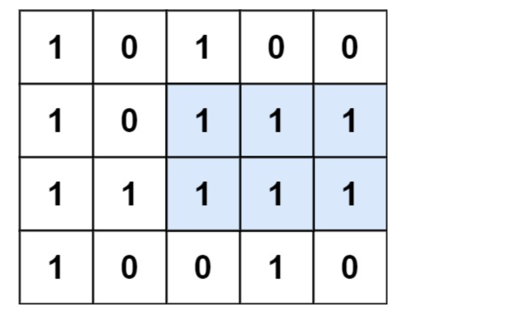

> 原文链接: https://leetcode-cn.com/problems/PLYXKQ


## 中文题目
<div><p>给定一个由&nbsp;<code>0</code> 和 <code>1</code>&nbsp;组成的矩阵 <code>matrix</code>&nbsp;，找出只包含 <code>1</code> 的最大矩形，并返回其面积。</p>

<p><strong>注意：</strong>此题 <code>matrix</code>&nbsp;输入格式为一维 <code>01</code> 字符串数组。</p>

<p>&nbsp;</p>

<p><strong>示例 1：</strong></p>

<p></p>

<pre>
<strong>输入：</strong>matrix = ["10100","10111","11111","10010"]
<strong>输出：</strong>6
<strong>解释：</strong>最大矩形如上图所示。
</pre>

<p><strong>示例 2：</strong></p>

<pre>
<strong>输入：</strong>matrix = []
<strong>输出：</strong>0
</pre>

<p><strong>示例 3：</strong></p>

<pre>
<strong>输入：</strong>matrix = ["0"]
<strong>输出：</strong>0
</pre>

<p><strong>示例 4：</strong></p>

<pre>
<strong>输入：</strong>matrix = ["1"]
<strong>输出：</strong>1
</pre>

<p><strong>示例 5：</strong></p>

<pre>
<strong>输入：</strong>matrix = ["00"]
<strong>输出：</strong>0
</pre>

<p>&nbsp;</p>

<p><strong>提示：</strong></p>

<ul>
	<li><code>rows == matrix.length</code></li>
	<li><code>cols == matrix[0].length</code></li>
	<li><code>0 &lt;= row, cols &lt;= 200</code></li>
	<li><code>matrix[i][j]</code> 为 <code>'0'</code> 或 <code>'1'</code></li>
</ul>

<p>&nbsp;</p>

<p>注意：本题与主站 85 题相同（输入参数格式不同）：&nbsp;<a href="https://leetcode-cn.com/problems/maximal-rectangle/">https://leetcode-cn.com/problems/maximal-rectangle/</a></p>
</div>

## 通过代码
<RecoDemo>
</RecoDemo>


## 高赞题解
**单调栈**
这道题实则是面试题 39 的应用[
《剑指offer 2 面试题39》 书中算法C++实现](https://leetcode-cn.com/problems/0ynMMM/solution/jian-zhi-offer-2-mian-shi-ti-39-shu-zhon-qzaw/)。以题中的例子为例，分析一下使其变为上一题。

因为最大矩阵一定是以矩阵的某一行为底边的，所以可以遍历各行寻找答案。以矩阵第一行为底的最大矩阵面积，等效于前一题中的直方图数组为 [1, 0, 1, 0, 0]；以第二行等效为 [2, 0, 2, 1, 1]；以第三行等效为 [3, 1, 3, 2, 2]；以第四行等效为 [4, 0, 0, 3, 0]；遍历完所有行，就能得到最大矩形的面积。**注意一点，原矩阵内存的是字符。**

代码如下，若矩阵的维度为 m * n，那么时间复杂为 O(mn)，空间复杂度为 O(n)。
```
class Solution {
public:
    int maximalRectangle(vector<string>& matrix) {
        if (matrix.size() == 0) {
            return 0;
        }
        vector<int> heights(matrix[0].size(), 0);
        int maxArea = 0;
        for (int i = 0; i < matrix.size(); ++i) {
            for (int j = 0; j < matrix[0].size(); ++j) {
                if (matrix[i][j] == '0') {
                    heights[j] = 0;
                }
                else {
                    heights[j] += matrix[i][j] - '0';
                }
            }
            maxArea = max(maxArea, largestRectangleArea(heights));
        }
        return maxArea;
    }

    int largestRectangleArea(vector<int>& heights) {
        stack<int> sta;
        sta.push(-1);
        int maxArea = 0;
        for (int i = 0; i < heights.size(); ++i) {
            while (sta.top() != -1 && heights[sta.top()] >= heights[i]) {
                int height = heights[sta.top()];
                sta.pop();
                int width = i - sta.top() - 1;
                maxArea = max(maxArea, height * width);
            }
            sta.push(i);
        }

        while (sta.top() != -1) {
            int height = heights[sta.top()];
            sta.pop();
            int width = heights.size() - sta.top() - 1;
            maxArea = max(maxArea, height * width);
        }
        return maxArea;
    }
};
```


## 统计信息
| 通过次数 | 提交次数 | AC比率 |
| :------: | :------: | :------: |
|    2539    |    4350    |   58.4%   |

## 提交历史
| 提交时间 | 提交结果 | 执行时间 |  内存消耗  | 语言 |
| :------: | :------: | :------: | :--------: | :--------: |
