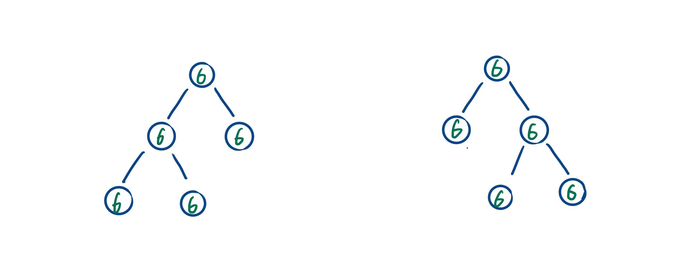

> 原文链接: https://leetcode-cn.com/problems/h54YBf


## 中文题目
<div><p>序列化是将一个数据结构或者对象转换为连续的比特位的操作，进而可以将转换后的数据存储在一个文件或者内存中，同时也可以通过网络传输到另一个计算机环境，采取相反方式重构得到原数据。</p>

<p>请设计一个算法来实现二叉树的序列化与反序列化。这里不限定你的序列 / 反序列化算法执行逻辑，只需要保证一个二叉树可以被序列化为一个字符串并且将这个字符串反序列化为原始的树结构。</p>

<p>&nbsp;</p>

<p><strong>示例 1：</strong></p>

<p></p>

<pre>
<strong>输入：</strong>root = [1,2,3,null,null,4,5]
<strong>输出：</strong>[1,2,3,null,null,4,5]
</pre>

<p><strong>示例 2：</strong></p>

<pre>
<strong>输入：</strong>root = []
<strong>输出：</strong>[]
</pre>

<p><strong>示例 3：</strong></p>

<pre>
<strong>输入：</strong>root = [1]
<strong>输出：</strong>[1]
</pre>

<p><strong>示例 4：</strong></p>

<pre>
<strong>输入：</strong>root = [1,2]
<strong>输出：</strong>[1,2]
</pre>

<p>&nbsp;</p>

<p><strong>提示：</strong></p>

<ul>
	<li>输入输出格式与 LeetCode 目前使用的方式一致，详情请参阅&nbsp;<a href="/faq/#binary-tree">LeetCode 序列化二叉树的格式</a>。你并非必须采取这种方式，也可以采用其他的方法解决这个问题。</li>
	<li>树中结点数在范围 <code>[0, 10<sup>4</sup>]</code> 内</li>
	<li><code>-1000 &lt;= Node.val &lt;= 1000</code></li>
</ul>

<p>&nbsp;</p>

<p><meta charset="UTF-8" />注意：本题与主站 297&nbsp;题相同：<a href="https://leetcode-cn.com/problems/serialize-and-deserialize-binary-tree/">https://leetcode-cn.com/problems/serialize-and-deserialize-binary-tree/</a>&nbsp;</p>
</div>

## 通过代码
<RecoDemo>
</RecoDemo>


## 高赞题解
# **二叉树序列化**
使用先序遍历的方式序列化二叉树最方便。因为若采用先序遍历，那么根节点最先被序列化到字符串中，然后是左子树，然后是右子树，这样具有递归形式。另外在反序列化的时候，从字符串中第一个读出来的字符肯定是根节点。

但是光是使用先序遍历是无法确定一棵二叉树的。这时候回忆起学习的《数据结构》：可知先序遍历序列和中序遍历序列，可以唯一确定一棵二叉树。在这里并不适用，因为现在遍历时保存的只是节点的值，但是节点的值不唯一。其实书中的知识点也没错，如果遍历结果保存的是指向节点的指针，那就可以唯一确定一棵树，因为节点的地址是唯一的。

言归正传，如下图。光是有先序遍历得话，首先要用逗号把不同节点的值隔开。左右两棵树的遍历结果都是 "6, 6, 6, 6, 6"，但是如果考虑把两棵树的叶子节点指向的空指针也序列化为 “#”，则左边的树序列化为 "6, 6, 6, #, #, 6, #, #, 6, #, #"，右边的树序列化为 "6, 6, #, #, 6, 6, #, #, 6, #, #"。序列化空指针后，先序遍历序列化就可以唯一确定一棵二叉树。


```
// Encodes a tree to a single string.
string serialize(TreeNode* root) {
    if (root == nullptr) {
        return "#";
    }
    string leftStr = serialize(root->left);
    string rightStr = serialize(root->right);
    return to_string(root->val) + "," + leftStr + "," + rightStr;
}
```
# **二叉树反序列化**
由于序列化时以逗号为分界符，所以可以根据逗号把序列后的字符串分割成若干个字符串，每个字符串对应一个节点。因为采用先序遍历序列化二叉树，所以分割的第一个字符串对应根节点，根据该字符串构造根节点。之后使用同样的方式构造左右子树，可以使用递归函数完成。二叉树序列化的代码如下。

```
// Decodes your encoded data to tree.
TreeNode* deserialize(string data) {
    // 分割字符串
    vector<string> dataArray{""};
    for (auto& ch : data) {
        if (ch == ',') {
            dataArray.push_back("");
        } 
        else {
            dataArray.back().push_back(ch);
        }
    }
    int i = 0;
    return dfs(dataArray, i);
}

// 辅助函数
TreeNode* dfs(vector<string>& strs, int & i) {
    string str = strs[i];
    i++;
    if (str == "#") {
        return nullptr;
    }

    TreNode* node = new TreeNode(stoi(str));
    node->left = dfs(strs, i);
    node->right = dfs(strs, i);
    return node;
}
```

# **完整代码**
```
class Codec {
public:
    // Encodes a tree to a single string.
    string serialize(TreeNode* root) {
        if (root == nullptr) {
            return "#";
        }
        string leftStr = serialize(root->left);
        string rightStr = serialize(root->right);
        return to_string(root->val) + "," + leftStr + "," + rightStr;
    }

    // Decodes your encoded data to tree.
    TreeNode* deserialize(string data) {
        // 分割字符串
        vector<string> dataArray{""};
        for (auto& ch : data) {
            if (ch == ',') {
                dataArray.push_back("");
            } 
            else {
                dataArray.back().push_back(ch);
            }
        }
        int i = 0;
        return dfs(dataArray, i);
    }

private:
    TreeNode* dfs(vector<string>& strs, int & i) {
        string str = strs[i];
        i++;
        if (str == "#") {
            return nullptr;
        }

        TreeNode* node = new TreeNode(stoi(str));
        node->left = dfs(strs, i);
        node->right = dfs(strs, i);
        return node;
    }
};
```


## 统计信息
| 通过次数 | 提交次数 | AC比率 |
| :------: | :------: | :------: |
|    2936    |    4243    |   69.2%   |

## 提交历史
| 提交时间 | 提交结果 | 执行时间 |  内存消耗  | 语言 |
| :------: | :------: | :------: | :--------: | :--------: |
