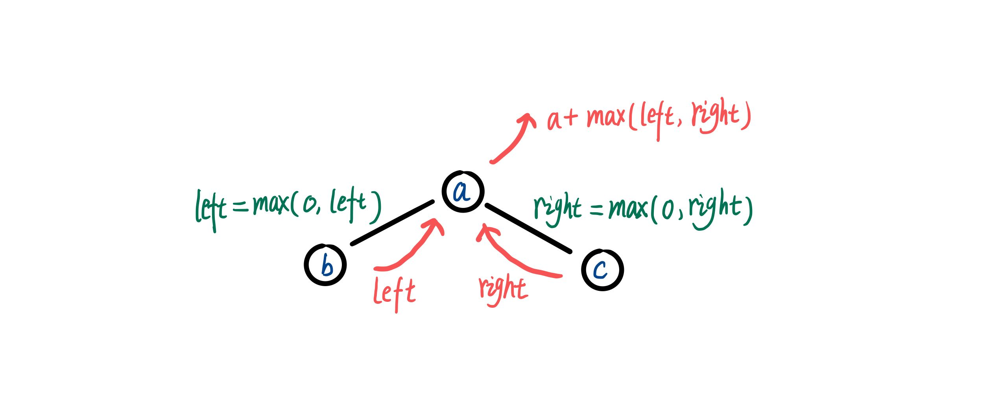

> 原文链接: https://leetcode-cn.com/problems/jC7MId


## 中文题目
<div><p><strong>路径</strong> 被定义为一条从树中任意节点出发，沿父节点-子节点连接，达到任意节点的序列。同一个节点在一条路径序列中 <strong>至多出现一次</strong> 。该路径<strong> 至少包含一个 </strong>节点，且不一定经过根节点。</p>

<p><strong>路径和</strong> 是路径中各节点值的总和。</p>

<p>给定一个二叉树的根节点 <code>root</code> ，返回其 <strong>最大路径和</strong>，即所有路径上节点值之和的最大值。</p>

<p>&nbsp;</p>

<p><strong>示例 1：</strong></p>

<p></p>

<pre>
<strong>输入：</strong>root = [1,2,3]
<strong>输出：</strong>6
<strong>解释：</strong>最优路径是 2 -&gt; 1 -&gt; 3 ，路径和为 2 + 1 + 3 = 6</pre>

<p><strong>示例 2：</strong></p>

<p></p>

<pre>
<strong>输入：</strong>root = [-10,9,20,null,null,15,7]
<strong>输出：</strong>42
<strong>解释：</strong>最优路径是 15 -&gt; 20 -&gt; 7 ，路径和为 15 + 20 + 7 = 42
</pre>

<p>&nbsp;</p>

<p><strong>提示：</strong></p>

<ul>
	<li>树中节点数目范围是 <code>[1, 3 * 10<sup>4</sup>]</code></li>
	<li><code>-1000 &lt;= Node.val &lt;= 1000</code></li>
</ul>

<p>&nbsp;</p>

<p><meta charset="UTF-8" />注意：本题与主站 124&nbsp;题相同：&nbsp;<a href="https://leetcode-cn.com/problems/binary-tree-maximum-path-sum/">https://leetcode-cn.com/problems/binary-tree-maximum-path-sum/</a></p>
</div>

## 通过代码
<RecoDemo>
</RecoDemo>


## 高赞题解
# **后序遍历**
这道题与 [剑指 Offer 42. 连续子数组的最大和](https://leetcode-cn.com/problems/lian-xu-zi-shu-zu-de-zui-da-he-lcof/) 有很大的相似之处。以下图为模型分析，规定只由子节点往父节点延生的路径为 “直径”，由一条 “直径” 和另一条 “直径” 以及它们的交点组成的路径为 “曲径”，如下图中 b → a 和 c → a 就是 “直径”， b → a ← c 就是  “曲径”。

用递归的思想考虑该问题，对于一个节点 a，若左孩子节点  b 返回以节点 b 为终点的 “直径” 的最大路径和 left，右孩子节点 c 返回以节点 c 为终点的 “直径” 的最大路径和 right。因为若 left 和 right 为负数那么就应该舍弃，为了方便取 right = max(0, right) ，left = max(0, left)。则节点 a 返回的最大 “直径”  和的值就是 a + max(left, right)。因为题目中要求所有符合条件（所有的 “直径” 和 “曲径”）的路径的最大路径和，所有记录所有 “曲径” 的最大值就是结果值，ret = max(ret, left + right + root->val)。



可以发现采用递归的方式解决该问题的时候，先处理左右孩子节点再处理当前节点，这是一种后序遍历思想，完整的代码如下。
```
class Solution {
public:
    int maxPathSum(TreeNode* root) {
        ret = INT_MIN;
        dfs(root);
        return ret;
    }

private:
    int ret;
    int dfs(TreeNode* root) {
        if (root == nullptr) {
            return 0;
        }
        int left = max(0, dfs(root->left));
        int right = max(0, dfs(root->right));
        ret = max(ret, left + right + root->val);
        return root->val + max(left, right);
    }
};
```


## 统计信息
| 通过次数 | 提交次数 | AC比率 |
| :------: | :------: | :------: |
|    2769    |    6695    |   41.4%   |

## 提交历史
| 提交时间 | 提交结果 | 执行时间 |  内存消耗  | 语言 |
| :------: | :------: | :------: | :--------: | :--------: |
