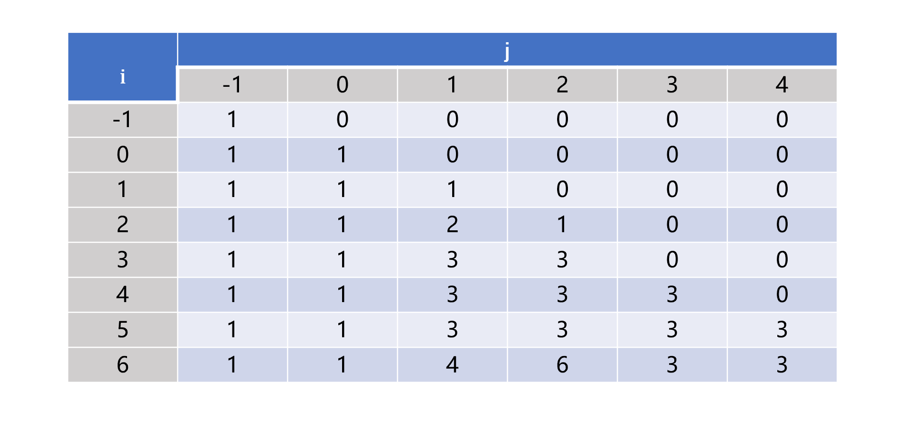
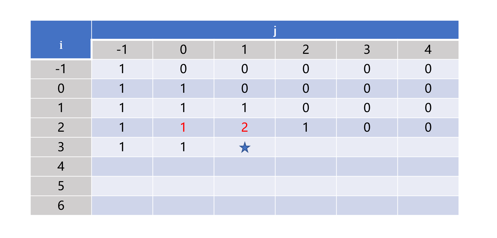
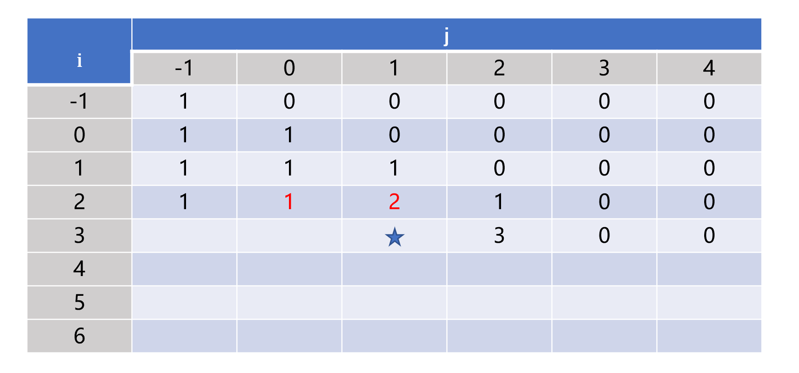

> 原文链接: https://leetcode-cn.com/problems/21dk04


## 中文题目
<div><p>给定一个字符串 <code>s</code><strong> </strong>和一个字符串 <code>t</code> ，计算在 <code>s</code> 的子序列中 <code>t</code> 出现的个数。</p>

<p>字符串的一个 <strong>子序列</strong> 是指，通过删除一些（也可以不删除）字符且不干扰剩余字符相对位置所组成的新字符串。（例如，<code>&quot;ACE&quot;</code>&nbsp;是&nbsp;<code>&quot;ABCDE&quot;</code>&nbsp;的一个子序列，而&nbsp;<code>&quot;AEC&quot;</code>&nbsp;不是）</p>

<p>题目数据保证答案符合 32 位带符号整数范围。</p>

<p>&nbsp;</p>

<p><strong>示例&nbsp;1：</strong></p>

<pre>
<strong>输入：</strong>s = &quot;rabbbit&quot;, t = &quot;rabbit&quot;<code>
<strong>输出</strong></code><strong>：</strong><code>3
</code><strong>解释：</strong>
如下图所示, 有 3 种可以从 s 中得到 <code>&quot;rabbit&quot; 的方案</code>。
<code><strong><u>rabb</u></strong>b<strong><u>it</u></strong></code>
<code><strong><u>ra</u></strong>b<strong><u>bbit</u></strong></code>
<code><strong><u>rab</u></strong>b<strong><u>bit</u></strong></code></pre>

<p><strong>示例&nbsp;2：</strong></p>

<pre>
<strong>输入：</strong>s = &quot;babgbag&quot;, t = &quot;bag&quot;
<code><strong>输出</strong></code><strong>：</strong><code>5
</code><strong>解释：</strong>
如下图所示, 有 5 种可以从 s 中得到 <code>&quot;bag&quot; 的方案</code>。 
<code><strong><u>ba</u></strong>b<u><strong>g</strong></u>bag</code>
<code><strong><u>ba</u></strong>bgba<strong><u>g</u></strong></code>
<code><u><strong>b</strong></u>abgb<strong><u>ag</u></strong></code>
<code>ba<u><strong>b</strong></u>gb<u><strong>ag</strong></u></code>
<code>babg<strong><u>bag</u></strong></code>
</pre>

<p>&nbsp;</p>

<p><strong>提示：</strong></p>

<ul>
	<li><code>0 &lt;= s.length, t.length &lt;= 1000</code></li>
	<li><code>s</code> 和 <code>t</code> 由英文字母组成</li>
</ul>

<p>&nbsp;</p>

<p><meta charset="UTF-8" />注意：本题与主站 115&nbsp;题相同：&nbsp;<a href="https://leetcode-cn.com/problems/distinct-subsequences/">https://leetcode-cn.com/problems/distinct-subsequences/</a></p>
</div>

## 通过代码
<RecoDemo>
</RecoDemo>


## 高赞题解
# **动态规划**
依次从字符串 s 中取出一个字符判断它是否能和字符串 t 中的某个字符匹配。字符串 s 中的字符可能可以与字符串 t 中的多个字符匹配，比如 s = "rabbbit", t = "rabbit" 中字符串 s 中的 'b' 可以与字符串 t 中的两个 'b' 匹配。总结来看，解决该问题需要若干步，每一步又面临多种选择，最终需要求解解的个数，所以可以使用动态规划解决。


# **二维数组**
因为该问题输入为两个字符串，所以状态方程需要两个变量。设 f(i, j) 表示字符串 s 下标从 0 到 i 的子字符串 s[0] ~ s[i] 中等于字符串 t 下标从 0 到 j 的子字符串 t[0] ~ t[j] 的子序列个数。因为若字符串 s 的长度小于字符串 t，那么字符串 s 中肯定不可能存在子字符串使其等于字符串 t，所以当 i < j 时 f(i, j) = 0。当 i >= j 时，若 s[i] != t[j] ，那么无法用 s[i] 去匹配 t[i] 则需要舍去 s[i]，可以得到 f(i, j) = f(i - 1, j)， 表示 s[0] ~ s[i] 中与 t[0] ~ t[j] 相等的子序列个数与s[0] ~ s[i - 1] 中与 t[0] ~ t[j] 相等的子序列个数相同。若 s[i] == t[j]，则既可以舍去 s[i] 不进行匹配也可以使用 s[i] 与 t[j] 进行匹配，可以得到 f(i, j) = f(i - 1, j) + f(i - 1, j - 1)，f(i - 1, j) 表示不进行匹配时的个数，f(i - 1, j - 1) 表示进行匹配的个数，其值代表字符串 s[0] ~ s[i - 1] 中与字符串 t[0] ~ t[j - 1] 相等的子序列个数。故转移方程可以总结为




上式成立的条件都是 i >= j，另外 f(i, -1) 表示字符串 s[0] ~ s[i] 中与空字符串相等的子序列个数，所以 f(i, -1) = 1，f(i, -1) 表示空字符串中与字符串 t[0] ~ t[j] 相等的子序列个数，所以 j > 0 时 f(-1 ,j) = 0。以 s = "appplep", t = "apple" 为例子二维 DP 矩阵如下图



二维矩阵按照从左往右逐行向下遍历填充，推荐使用逐行而不是逐列，虽然不影响算法，但是考虑到二维数组本身是按照一维数组存储以及计算机缓存的运行机制，按照逐行遍历的方式效率更高点。完整的代码如下，若 s 和 t 的长度分别为 m 和 n，那么时间复杂度为 O(mn)，空间复杂度为 O(mn)。

```
class Solution {
public:
    int numDistinct(string s, string t) {
        if (s.size() < t.size()) {
            return 0;
        }

        vector<vector<unsigned int>> dp(s.size() + 1, vector<unsigned int>(t.size() + 1, 0));
        dp[0][0] = 1;

        for (int i = 0; i < s.size(); ++i) {
            dp[i + 1][0] = 1;
            for (int j = 0; j <= i && j < t.size(); ++j) {
                dp[i + 1][j + 1] = (s[i] == t[j]) ? dp[i][j] + dp[i][j + 1] : dp[i][j + 1];
            }
        }
        return dp[s.size()][t.size()];
    }
};
```


# **一维数组**
考虑遍历到如图的标星处

可以发现当前的值只与标红处的值有关，所以可以通过辅助变量把二维数组优化为只需一行的一维数组。完整的代码如下，时间复杂度为 O(mn)，空间复杂度为 O(n)。
```
class Solution {
public:
    int numDistinct(string s, string t) {
        if (s.size() < t.size()) {
            return 0;
        }

        int n = t.size();
        vector<unsigned int>dp(n + 1, 0);
        dp[0] = 1;

        for (int i = 0; i < s.size(); ++i) {
            int temp1 = 1;
            int temp2 = 1;
            for (int j = 0; j <= i && j < n; ++j) {
                temp2 = dp[j + 1];
                dp[j + 1] += (s[i] == t[j]) ? temp1 : 0;
                temp1 = temp2;
            }
        }
        return dp[n];
    }
};
```
其实如果改变从左往右的遍历顺序为从右往左的顺序，如下图，那么可以无需使用辅助变量。

完整的代码如下，时间复杂度为 O(mn)，空间复杂度为 O(n)。
```
class Solution {
public:
    int numDistinct(string s, string t) {
        if (s.size() < t.size()) {
            return 0;
        }

        int n = t.size();
        vector<unsigned int>dp(n + 1, 0);
        dp[0] = 1;

        for (int i = 0; i < s.size(); ++i) {
            for (int j = min(i, n - 1); j >= 0; --j) {
                if (s[i] == t[j]) {
                    dp[j + 1] += dp[j];
                }
            }
        }
        return dp[n];
    }
};
```


## 统计信息
| 通过次数 | 提交次数 | AC比率 |
| :------: | :------: | :------: |
|    1648    |    3092    |   53.3%   |

## 提交历史
| 提交时间 | 提交结果 | 执行时间 |  内存消耗  | 语言 |
| :------: | :------: | :------: | :--------: | :--------: |
