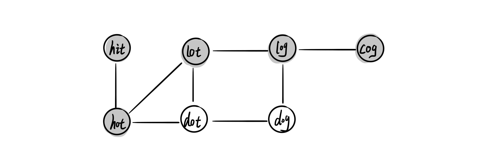

> 原文链接: https://leetcode-cn.com/problems/om3reC


## 中文题目
<div><p>在字典（单词列表）&nbsp;<code>wordList</code> 中，从单词 <code>beginWord</code><em>&nbsp;</em>和 <code>endWord</code> 的 <strong>转换序列 </strong>是一个按下述规格形成的序列：</p>

<ul>
	<li>序列中第一个单词是 <code>beginWord</code> 。</li>
	<li>序列中最后一个单词是 <code>endWord</code> 。</li>
	<li>每次转换只能改变一个字母。</li>
	<li>转换过程中的中间单词必须是字典&nbsp;<code>wordList</code> 中的单词。</li>
</ul>

<p>给定两个长度相同但内容不同的单词<em> </em><code>beginWord</code><em>&nbsp;</em>和 <code>endWord</code> 和一个字典 <code>wordList</code> ，找到从&nbsp;<code>beginWord</code> 到&nbsp;<code>endWord</code> 的 <strong>最短转换序列</strong> 中的 <strong>单词数目</strong> 。如果不存在这样的转换序列，返回 0。</p>

<p>&nbsp;</p>

<p><strong>示例 1：</strong></p>

<pre>
<strong>输入：</strong>beginWord = &quot;hit&quot;, endWord = &quot;cog&quot;, wordList = [&quot;hot&quot;,&quot;dot&quot;,&quot;dog&quot;,&quot;lot&quot;,&quot;log&quot;,&quot;cog&quot;]
<strong>输出：</strong>5
<strong>解释：</strong>一个最短转换序列是 &quot;hit&quot; -&gt; &quot;hot&quot; -&gt; &quot;dot&quot; -&gt; &quot;dog&quot; -&gt; &quot;cog&quot;, 返回它的长度 5。
</pre>

<p><strong>示例 2：</strong></p>

<pre>
<strong>输入：</strong>beginWord = &quot;hit&quot;, endWord = &quot;cog&quot;, wordList = [&quot;hot&quot;,&quot;dot&quot;,&quot;dog&quot;,&quot;lot&quot;,&quot;log&quot;]
<strong>输出：</strong>0
<strong>解释：</strong>endWord &quot;cog&quot; 不在字典中，所以无法进行转换。</pre>

<p>&nbsp;</p>

<p><strong>提示：</strong></p>

<ul>
	<li><code>1 &lt;= beginWord.length &lt;= 10</code></li>
	<li><code>endWord.length == beginWord.length</code></li>
	<li><code>1 &lt;= wordList.length &lt;= 5000</code></li>
	<li><code>wordList[i].length == beginWord.length</code></li>
	<li><code>beginWord</code>、<code>endWord</code> 和 <code>wordList[i]</code> 由小写英文字母组成</li>
	<li><code>beginWord != endWord</code></li>
	<li><code>wordList</code> 中的所有字符串 <strong>互不相同</strong></li>
</ul>

<p>&nbsp;</p>

<p><meta charset="UTF-8" />注意：本题与主站 127&nbsp;题相同：&nbsp;<a href="https://leetcode-cn.com/problems/word-ladder/">https://leetcode-cn.com/problems/word-ladder/</a></p>
</div>

## 通过代码
<RecoDemo>
</RecoDemo>


## 高赞题解
# **单向 BFS**
把每个单词都看作节点，若两个单词之间可以相互演变，则这两个单词之间存在一个边。那么就可以把题目中这些关系建图，如示例所建的图如下

图中所示路径就是一条最短路径，所以该题可以转变为计算两个节点之间的最短路径长度，可以使用广度优先搜索算法。
```
class Solution {
void getNeighbor(unordered_set<string>& visted, string& word, queue<string>& que) {
    for (int i = 0; i < word.size(); ++i) {
        char temp = word[i];
        for (char ch = 'a'; ch <= 'z'; ++ch) {
            word[i] = ch;
            if (ch != temp && visted.count(word)) {
                que.push(word);
            }
        }
        word[i] = temp;
    }
}

public:
    int ladderLength(string beginWord, string endWord, vector<string>& wordList) {
        unordered_set<string> visted;
        for (auto& word : wordList) {
            visted.insert(word);
        }
        if (!visted.count(endWord)) {
            return 0;
        }

        // 单向 BFS
        queue<string> que;
        que.push(beginWord);
        int len = 0;
        while (!que.empty()) {
            int size = que.size();
            len++;
            while (size--) {
                string word = que.front();
                que.pop();
                visted.erase(word);
                if (word == endWord) {
                    return len;
                }
                getNeighbor(visted, word, que);
            }
        }
        return 0;
    }
};
```
# **双向 BFS**
该题是单一起点、单一目标节点的最短距离问题，针对该类问题的优化手段是，即在从起始节点出发不断搜索目标节点的同时，也从目标节点出发朝着起始点方向不断搜索。

完整代码如下，除了记录节点访问情况的 visted 外一共使用了 3 个 set，其中 st1 和 st2 分别存放两个方向上需要访问的节点，每次都选择 st1 和 st2 中数量较小的集合进行搜索，这样可以缩小搜索空间。 st3 保存与当前访问节点相邻的下一步需要访问的节点，在搜索相邻节点的过程中，不断查询访问的节点是否已经在另一个方向搜索的集合里，若已经存在，则代表当前两个搜索方向已经有重合的节点，即已经找到最短路径。

```
class Solution {
private:
    bool getNeighbor(unordered_set<string>& visted, unordered_set<string>& st1, unordered_set<string>& st2, unordered_set<string>& st3, string& word) {
        for (int i = 0; i < word.size(); ++i) {
            char temp = word[i];
            for (char ch = 'a'; ch <= 'z'; ++ch) {
                word[i] = ch;
                if (ch != temp && visted.count(word)) {
                    if (st2.count(word)) {
                        return true;
                    }
                    st3.insert(word);
                }
            }
            word[i] = temp;
        }
        return false;
    }

public:
    int ladderLength(string beginWord, string endWord, vector<string>& wordList) {
        unordered_set<string> visted;
        for (auto& word : wordList) {
            visted.insert(word);
        }
        if (!visted.count(endWord)) {
            return 0;
        }

        unordered_set<string> st1;
        unordered_set<string> st2;
        st1.insert(beginWord);
        st2.insert(endWord);
        int len = 2;

        while (!st1.empty() && !st2.empty()) {
            if (st1.size() > st2.size()) {
                swap(st1, st2);
            }
            
            unordered_set<string> st3;
            for (auto it = st1.begin(); it != st1.end(); ++it) {
                string word = *it;
                visted.erase(word);

                if (getNeighbor(visted, st1, st2, st3, word)) {
                    return len;
                }
            }
            st1 = st3;
            len++;
        }

        return 0;
    }
};
```


## 统计信息
| 通过次数 | 提交次数 | AC比率 |
| :------: | :------: | :------: |
|    1250    |    2095    |   59.7%   |

## 提交历史
| 提交时间 | 提交结果 | 执行时间 |  内存消耗  | 语言 |
| :------: | :------: | :------: | :--------: | :--------: |
