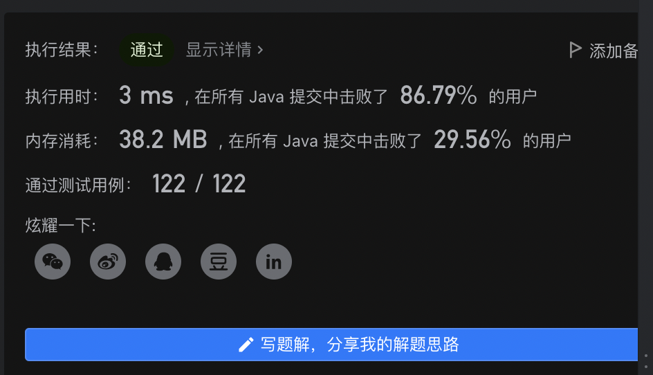

> 原文链接: https://leetcode-cn.com/problems/Jf1JuT


## 中文题目
<div><p>现有一种使用英语字母的外星文语言，这门语言的字母顺序与英语顺序不同。</p>

<p>给定一个字符串列表 <code>words</code> ，作为这门语言的词典，<code>words</code> 中的字符串已经 <strong>按这门新语言的字母顺序进行了排序</strong> 。</p>

<p>请你根据该词典还原出此语言中已知的字母顺序，并 <strong>按字母递增顺序</strong> 排列。若不存在合法字母顺序，返回 <code>&quot;&quot;</code> 。若存在多种可能的合法字母顺序，返回其中 <strong>任意一种</strong> 顺序即可。</p>

<p>字符串 <code>s</code> <strong>字典顺序小于</strong> 字符串 <code>t</code> 有两种情况：</p>

<ul>
	<li>在第一个不同字母处，如果 <code>s</code> 中的字母在这门外星语言的字母顺序中位于 <code>t</code> 中字母之前，那么&nbsp;<code>s</code> 的字典顺序小于 <code>t</code> 。</li>
	<li>如果前面 <code>min(s.length, t.length)</code> 字母都相同，那么 <code>s.length &lt; t.length</code> 时，<code>s</code> 的字典顺序也小于 <code>t</code> 。</li>
</ul>

<p>&nbsp;</p>

<p><strong>示例 1：</strong></p>

<pre>
<strong>输入：</strong>words = [&quot;wrt&quot;,&quot;wrf&quot;,&quot;er&quot;,&quot;ett&quot;,&quot;rftt&quot;]
<strong>输出：</strong>&quot;wertf&quot;
</pre>

<p><strong>示例 2：</strong></p>

<pre>
<strong>输入：</strong>words = [&quot;z&quot;,&quot;x&quot;]
<strong>输出：</strong>&quot;zx&quot;
</pre>

<p><strong>示例 3：</strong></p>

<pre>
<strong>输入：</strong>words = [&quot;z&quot;,&quot;x&quot;,&quot;z&quot;]
<strong>输出：</strong>&quot;&quot;
<strong>解释：</strong>不存在合法字母顺序，因此返回 <code>&quot;&quot; 。</code>
</pre>

<p>&nbsp;</p>

<p><strong>提示：</strong></p>

<ul>
	<li><code>1 &lt;= words.length &lt;= 100</code></li>
	<li><code>1 &lt;= words[i].length &lt;= 100</code></li>
	<li><code>words[i]</code> 仅由小写英文字母组成</li>
</ul>

<p>&nbsp;</p>

<p><meta charset="UTF-8" />注意：本题与主站 269&nbsp;题相同：&nbsp;<a href="https://leetcode-cn.com/problems/alien-dictionary/">https://leetcode-cn.com/problems/alien-dictionary/</a></p>
</div>

## 通过代码
<RecoDemo>
</RecoDemo>


## 高赞题解
根据题意，需要从给出的字符串数组中找出出现字母之间的顺序。
各字符串中在字符串数组words中已经是按递增顺序排列，我们可以通过比较数组中两两相邻的字符串中的对应字符得出字符比较大小的结果。
例如，给定字符串数组words = ["wrt","wrf","er","ett","rftt"].
因为words[0] < words[1],可知't' < 'f';
   words[1] < words[2],可知‘w' < 'e';
   words[2] < words[3],可知'r' < 't';后续比较规律相同。
对于此类题应该通过具体的例子抽象出相应规律。
另外通过提交我发现有一个特殊输入words = ["abc","ab"]，后一个字符串是前一个字符串的前缀，即前一个字符串长度大于后一个，这就违背了题目说明的字符串数组是递增排列，这就是一个不合法的无效输入，应返回空字符串"".

通过以上分析，我们可以把这个问题抽象成一个图遍历问题，字符表示图节点，排在靠前顺序的字符有一条指向靠后顺序字符的有向边，而最靠前的字符表示入度为0的节点，通过广度优先遍历每次把所有入度为0的节点放进队列，在遍历过程中队列中的节点顺序就是字符之间的相对顺序(之一，因为由给定的条件无法判断唯一顺序，同时拓扑排序如果成功那么也不一定有唯一解)。

明白此问题的算法思想以后，就转换成了建图再BFS遍历的过程。用一个HashMap来表示图节点之间的关系，key表示该字符，value表示顺序排在该字符之后的所有字符，即该字符key有一条指向value中各个字符的有向边，又因为字符不用重复保存，只需一条边表示两个字符之间的关系，我们就用HashSet做value表示该字符集合。这样建立好字符之间的顺序关系以后，由于需要使用拓扑排序，我们还需要用一个数组或者哈希表保存每个字符的入度数量，因为此题输入只有小写字母，只用一个空间为26的数组保存即可。代码如下：
```
class Solution {
    public String alienOrder(String[] words) {
        Map<Character, Set<Character>> graph = new HashMap<>();
        int[] inDegree = new int[26];
        Queue<Character> q = new LinkedList<>();
        StringBuilder sb = new StringBuilder();
        //把出现的字符保存在图HashMap里，每个不重复字符对应一个表示有序的有向边
        for(String word : words){
            for(char ch : word.toCharArray()){
                graph.putIfAbsent(ch, new HashSet<>());
            }
        }
        //两两比较相邻字符串之间的关系
        for(int i = 1; i < words.length; ++i){
            String w1 = words[i-1];
            String w2 = words[i];
            if(checkPre(w1,w2) && !w1.equals(w2)) return ""; //检查为不合法输入
            for(int j = 0; j < Math.min(w1.length(), w2.length()); ++j){
                char c1 = w1.charAt(j);
                char c2 = w2.charAt(j);
                //找到不同的字符才说明有顺序关系，把前一个字符指向后一字符，同时后一字符的入度+1
                if(c1 != c2){
                    if(!graph.get(c1).contains(c2)){
                        graph.get(c1).add(c2);
                        inDegree[c2 - 'a']++;
                    }
                    break;
                }
            }
        }
        //把所有入度为0的字符先加入队列，准备拓扑排序
        for(char ch : graph.keySet()){
            if(inDegree[ch - 'a'] == 0) q.offer(ch);
        }
        while(!q.isEmpty()){
            char node = q.poll();
            //从队列出来的这个字符肯定是入度为0，可以确定它的顺序，就把它加进字符顺序的结果里
            sb.append(node);
            //取出当前出来的节点以后，该节点所有的出度(有向边指向所有节点的节点入度)都要减1，若有入度为0的节点字符出现，把它加进队列准备之后的拓扑排序遍历
            for(char next : graph.get(node)){
                inDegree[next - 'a']--;
                if(inDegree[next - 'a'] == 0) q.offer(next);
            }
        }
        如果结果集里的字符数量和图中所有节点数量相同，说明拓扑排序成功，返回结果集，否则不成功，不存在合法字母顺序
        return sb.length() == graph.size() ? sb.toString() : "";
    }

    public boolean checkPre(String s1, String s2){
        int m = s1.length(), n = s2.length();
        if(m < n) return false;
        int i = 0, j = 0;
        while(i < m && j < n){
            if(s2.charAt(j) != s1.charAt(i)) return false;
            i++;
            j++;
        }
        return true;
    }
}
```

速度时间复杂度还可以。


## 统计信息
| 通过次数 | 提交次数 | AC比率 |
| :------: | :------: | :------: |
|    961    |    2268    |   42.4%   |

## 提交历史
| 提交时间 | 提交结果 | 执行时间 |  内存消耗  | 语言 |
| :------: | :------: | :------: | :--------: | :--------: |
