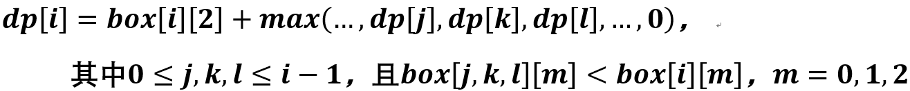

> 原文链接: https://leetcode-cn.com/problems/pile-box-lcci


## 英文原文
<div><p>You have a stack of n boxes, with widths wi, depths di, and heights hi. The boxes cannot be rotated and can only be stacked on top of one another if each box in the stack is strictly larger than the box above it in width, height, and depth. Implement a method to compute the height of the tallest possible stack. The height of a stack is the sum of the heights of each box.</p>

<p>The input use <code>[wi, di, hi]</code>&nbsp;to represents each box.</p>

<p><strong>Example1:</strong></p>

<pre>
<strong> Input</strong>: box = [[1, 1, 1], [2, 2, 2], [3, 3, 3]]
<strong> Output</strong>: 6
</pre>

<p><strong>Example2:</strong></p>

<pre>
<strong> Input</strong>: box = [[1, 1, 1], [2, 3, 4], [2, 6, 7], [3, 4, 5]]
<strong> Output</strong>: 10
</pre>

<p><strong>Note:</strong></p>

<ol>
	<li><code>box.length &lt;= 3000</code></li>
</ol>
</div>

## 中文题目
<div><p>堆箱子。给你一堆n个箱子，箱子宽 wi、深 di、高 hi。箱子不能翻转，将箱子堆起来时，下面箱子的宽度、高度和深度必须大于上面的箱子。实现一种方法，搭出最高的一堆箱子。箱堆的高度为每个箱子高度的总和。</p>

<p>输入使用数组<code>[wi, di, hi]</code>表示每个箱子。</p>

<p><strong>示例1:</strong></p>

<pre><strong> 输入</strong>：box = [[1, 1, 1], [2, 2, 2], [3, 3, 3]]
<strong> 输出</strong>：6
</pre>

<p><strong>示例2:</strong></p>

<pre><strong> 输入</strong>：box = [[1, 1, 1], [2, 3, 4], [2, 6, 7], [3, 4, 5]]
<strong> 输出</strong>：10
</pre>

<p><strong>提示:</strong></p>

<ol>
	<li>箱子的数目不大于3000个。</li>
</ol>
</div>

## 通过代码
<RecoDemo>
</RecoDemo>


## 高赞题解
### 前言
看到有些题解说参考[面试题 17.08. 马戏团人塔](https://leetcode-cn.com/problems/circus-tower-lcci/solution/xian-gen-ju-shen-gao-pai-xu-ruo-shen-gao-yi-yang-z/)第一维增序排序，相同的根据第二维降序排序，其实想多了，实际上并不需要考虑其他两个维度的顺序。不过这些题解都说对了一半，这道题目确实就是一个“上升子序列问题”，关于上升子序列问题，可以看一下这个[leetcode300](https://leetcode-cn.com/problems/longest-increasing-subsequence/solution/zui-chang-shang-sheng-zi-xu-lie-by-leetcode/)的题解，这个题解给出了两种动态规划的解法，时间复杂度分别是O(N^2)和O(NlogN)。我们自然会首先考虑更快的O(NlogN)的解法，这个解法为了使用二分查找，要求dp数组始终保持为一个递增的序列，如果dp[i]表示为长度为i+1的上升子序列的最后一个元素，这确实可以做到，但很可惜，本题[堆箱子](https://leetcode-cn.com/problems/pile-box-lcci/)不满足这个，本题的目标是上升子序列的最大数据总和，而并非序列长度。所以我们只能考虑O(N^2)的方法。
### 思路
1. 第一点需要明白的是，我们先对box数组按照一个维度进行排序，得到sorted_box序列，那么最终答案的序列就一定是sorted_box序列的某个子序列（这点很重要）。那么之后我们只需要找到这个总高度最大的子序列。
2. 设dp[i]表示以第i个箱子为结尾的上升子序列的最大总高度。则可以知道：



剩下的就是写代码了。
### 代码
```c++
class Solution {
public:
    int pileBox(vector<vector<int>>& box) {
        sort(box.begin(), box.end(), [](const vector<int>& a, const vector<int>& b) { return a[0] < b[0]; });
        vector<int> dp(box.size(), 0);
        dp[0] = box[0][2];
        int ans = dp[0];
        for (int i = 1; i < box.size(); i++) {
            int maxh = 0; //必须初始化为0
            for (int j = 0; j < i; j++)
                if (box[j][0] < box[i][0] && box[j][1] < box[i][1] && box[j][2] < box[i][2])
                    maxh = max(maxh, dp[j]);
            dp[i] = maxh + box[i][2];
            ans = max(ans, dp[i]);
        }
        return ans;
    }
};
```

## 统计信息
| 通过次数 | 提交次数 | AC比率 |
| :------: | :------: | :------: |
|    7287    |    14522    |   50.2%   |

## 提交历史
| 提交时间 | 提交结果 | 执行时间 |  内存消耗  | 语言 |
| :------: | :------: | :------: | :--------: | :--------: |
