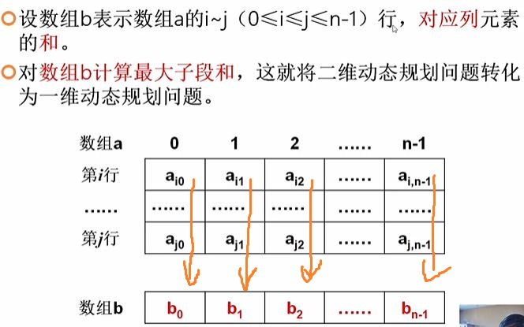
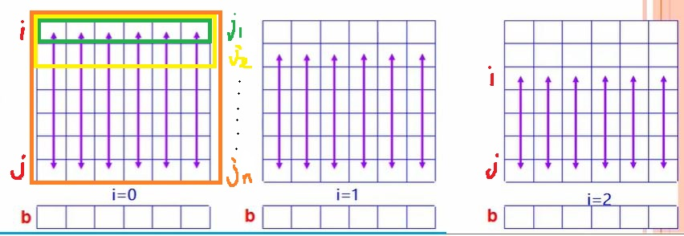

> 原文链接: https://leetcode-cn.com/problems/max-submatrix-lcci


## 英文原文
<div><p>Given an NxM matrix of positive and negative integers, write code to find the submatrix with the largest possible sum.</p>

<p>Return an array&nbsp;<code>[r1, c1, r2, c2]</code>, where&nbsp;<code>r1</code>, <code>c1</code> are the row number and the column number of the submatrix&#39;s upper left corner respectively, and&nbsp;<code>r2</code>, <code>c2</code> are the row number of and the column number of lower right corner. If there are more than one answers, return any one of them.</p>

<p><b>Note:&nbsp;</b>This problem is slightly different from the original one in the book.</p>

<p><strong>Example:</strong></p>

<pre>
<strong>Input:
</strong><code>[
&nbsp;  [-1,<strong>0</strong>],
&nbsp;  [0,-1]
]</code>
<strong>Output: </strong>[0,1,0,1]</pre>

<p><strong>Note: </strong></p>

<ul>
	<li><code>1 &lt;= matrix.length, matrix[0].length &lt;= 200</code></li>
</ul>
</div>

## 中文题目
<div><p>给定一个正整数、负整数和 0 组成的 N &times; M&nbsp;矩阵，编写代码找出元素总和最大的子矩阵。</p>

<p>返回一个数组 <code>[r1, c1, r2, c2]</code>，其中 <code>r1</code>, <code>c1</code> 分别代表子矩阵左上角的行号和列号，<code>r2</code>, <code>c2</code> 分别代表右下角的行号和列号。若有多个满足条件的子矩阵，返回任意一个均可。</p>

<p><strong>注意：</strong>本题相对书上原题稍作改动</p>

<p><strong>示例：</strong></p>

<pre><strong>输入：
</strong><code>[
&nbsp;  [-1,<strong>0</strong>],
&nbsp;  [0,-1]
]</code>
<strong>输出：</strong>[0,1,0,1]
<strong>解释：</strong>输入中标粗的元素即为输出所表示的矩阵</pre>

<p>&nbsp;</p>

<p><strong>说明：</strong></p>

<ul>
	<li><code>1 &lt;= matrix.length, matrix[0].length &lt;= 200</code></li>
</ul>
</div>

## 通过代码
<RecoDemo>
</RecoDemo>


## 高赞题解
上来那么一个三重循环的代码看得懂就奇怪了，所以我们从头说起

**53. 最大子序和**
给定一个整数数组 nums ，找到一个具有最大和的连续子数组（子数组最少包含一个元素），返回其最大和。

这是一个简单的dp问题
1、状态定义：dp[i]为以nums[i]结尾的最大子序和
2、状态转移方程：对于nums[i]有两种情况:一种是和前一个位置的子序列连着dp[i]=dp[i-1]+nums[i]
                                    第二种是以自己独立门户，从自己开始dp[i]=nums[i]
    取其中最大值,可得状态转移方程为dp[i]=max( dp[i-1] + nums[i] , nums[i] )
3、basecase:dp[0]=nums[0]很好理解
```
class Solution {
public:
    int maxSubArray(vector<int>& nums) {
        vector<int> dp(nums.size());
        dp[0]=nums[0];
        int ans = dp[0];
        for(int i=1 ; i < nums.size() ; i++ ){
            dp[i]=max(dp[i-1]+nums[i],nums[i]);
            ans = max(dp[i],ans);
        }
        return ans;
    }
    
};
```
我们观察这段代码会发现，dp[i]只与dp[i-1]和nums[i]有关，所有我们可以将空间复杂度降到O(1)
同时对于dp[i]=max(dp[i-1]+nums[i],nums[i]),两种情况都加了nums[i]，只是前面多加了dp[i-1]，所有很容易推出，当dp[i-1]<0时，后者大，反之前者大

这次我们变换原题的问题，如果要你返回最大子序和的起始和终止坐标呢？
很容易实现，我们在状态转换的时候记录一下就可以了

所有我们可以得到改进后的代码
```
class Solution {
public:
    vector<int> maxSubArray(vector<int>& nums) {
        int maxsum=INT_MIN;
        int dp_i = nums[0];
        vector<int> ans(2);//用来记录答案
        int begin = 0;

        for(int i=1 ; i < nums.size() ; i++ ){
            if( dp_i > 0 ){    //dp[i-1] > 0 时
                dp_i+=nums[i];
            }
            else{              //dp[i-1]<0时
                dp_i=nums[i];
                begin = i;     //当nums[i]自立门户时候，我们记录下子序列的起始位置
            }
            if(dp_i > maxsum){//更新答案
                maxsum = dp_i;
                ans[0] = begin;//记录下起始和终止位置
                ans[1] = i;
            }  
        }
        return ans;
    }
    
};
```

有了上面的铺垫，我们回过头再回到我们原来的问题

**面试题 17.24. 最大子矩阵**

给定一个正整数和负整数组成的 N × M 矩阵，编写代码找出元素总和最大的子矩阵。
返回一个数组 [r1, c1, r2, c2]，其中 r1, c1 分别代表子矩阵左上角的行号和列号，r2, c2 分别代表右下角的行号和列号。若有多个满足条件的子矩阵，返回任意一个均可。

问题从一维变成了二维，但实质是一样的，同样是再求最大子序和，我们需要将二维转化为一维，对于矩阵的每一列，我们将其加在一起，成为了一维上的一个数，二维矩阵的和转化为了一维数组的和

这里借用b站up zjutsunny老师的ppt


这样我们就将二维问题转化为了一维问题，现在另一个问题就是怎么把所有情况都遍历到呢？

我们以第i行为第一行，向下延申，设最后一行为第j行，我们就i在这么一个范围内，将二维问题转化为一维问题，再求解最大子序列和



我们将当前i~j行组成的矩阵的每一列的和存放在数组b中，其余的工作就是在求最大子序列和，并且保存其左上角和右下角
```
class Solution {
public:
    vector<int> getMaxMatrix(vector<vector<int>>& matrix) {
        vector<int> ans(4);//保存最大子矩阵的左上角和右下角的行列坐标
        int N = matrix.size();
        int M = matrix[0].size();
        vector<int> b(M,0);//记录当前i~j行组成大矩阵的每一列的和，将二维转化为一维
        int sum;//相当于dp[i],dp_i
        int maxsum=INT_MIN;//记录最大值
        int bestr1,bestc1;//暂时记录左上角，相当于begin

        for(int i=0;i<N;i++){     //以i为上边，从上而下扫描
            for(int t=0;t<M;t++ ) b[t]=0;    //每次更换子矩形上边，就要清空b，重新计算每列的和
            for(int j=i;j<N;j++){    //子矩阵的下边，从i到N-1，不断增加子矩阵的高
                //一下就相当于求一次最大子序列和
                sum = 0;//从头开始求dp
                for(int k=0;k<M;k++){
                    b[k]+=matrix[j][k];   
//我们只是不断增加其高，也就是下移矩阵下边，所有这个矩阵每列的和只需要加上新加的哪一行的元素
//因为我们求dp[i]的时候只需要dp[i-1]和nums[i],所有在我们不断更新b数组时就可以求出当前位置的dp_i
                    if(sum>0){
                        sum+=b[k];
                    }
                    else{
                        sum=b[k];
                        bestr1=i;//自立门户，暂时保存其左上角
                        bestc1=k;
                    }
                    if( sum > maxsum){
                        maxsum = sum;
                        ans[0]=bestr1;//更新答案
                        ans[1]=bestc1;
                        ans[2]=j;
                        ans[3]=k;
                    }
                }
            }
        }
        return ans;
    }
};
```
第一次写这么长的题解，水平有限，希望一起进步成长，有什么问题也欢迎指出。







## 统计信息
| 通过次数 | 提交次数 | AC比率 |
| :------: | :------: | :------: |
|    11943    |    22890    |   52.2%   |

## 提交历史
| 提交时间 | 提交结果 | 执行时间 |  内存消耗  | 语言 |
| :------: | :------: | :------: | :--------: | :--------: |
