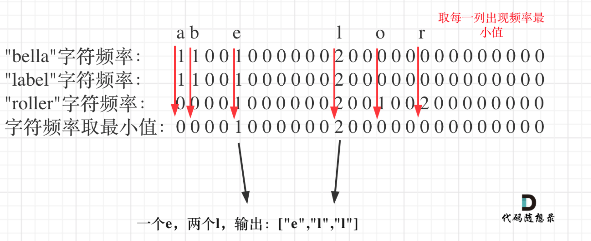

> 原文链接: https://leetcode-cn.com/problems/find-common-characters


## 英文原文
<div><p>Given a string array <code>words</code>, return <em>an array of all characters that show up in all strings within the </em><code>words</code><em> (including duplicates)</em>. You may return the answer in <strong>any order</strong>.</p>

<p>&nbsp;</p>
<p><strong>Example 1:</strong></p>
<pre><strong>Input:</strong> words = ["bella","label","roller"]
<strong>Output:</strong> ["e","l","l"]
</pre><p><strong>Example 2:</strong></p>
<pre><strong>Input:</strong> words = ["cool","lock","cook"]
<strong>Output:</strong> ["c","o"]
</pre>
<p>&nbsp;</p>
<p><strong>Constraints:</strong></p>

<ul>
	<li><code>1 &lt;= words.length &lt;= 100</code></li>
	<li><code>1 &lt;= words[i].length &lt;= 100</code></li>
	<li><code>words[i]</code> consists of lowercase English letters.</li>
</ul>
</div>

## 中文题目
<div>给你一个字符串数组 <code>words</code> ，请你找出所有在 <code>words</code> 的每个字符串中都出现的共用字符（ <strong>包括重复字符</strong>），并以数组形式返回。你可以按 <strong>任意顺序</strong> 返回答案。
<p>&nbsp;</p>

<p><strong>示例 1：</strong></p>

<pre>
<strong>输入：</strong>words = ["bella","label","roller"]
<strong>输出：</strong>["e","l","l"]
</pre>

<p><strong>示例 2：</strong></p>

<pre>
<strong>输入：</strong>words = ["cool","lock","cook"]
<strong>输出：</strong>["c","o"]
</pre>

<p>&nbsp;</p>

<p><strong>提示：</strong></p>

<ul>
	<li><code>1 &lt;= words.length &lt;= 100</code></li>
	<li><code>1 &lt;= words[i].length &lt;= 100</code></li>
	<li><code>words[i]</code> 由小写英文字母组成</li>
</ul>
</div>

## 通过代码
<RecoDemo>
</RecoDemo>


## 高赞题解

> **认准「代码随想录」，学习算法不迷路！**

# 思路

这道题意一起就有点绕，不是那么容易懂，其实就是26个小写字符中有字符 在所有字符串里都出现的话，就输出，重复的也算。

例如：

输入：["ll","ll","ll"]
输出：["l","l"]

这道题目一眼看上去，就是用哈希法，**“小写字符”，“出现频率”， 这些关键字都是为哈希法量身定做的啊**

首先可以想到的是暴力解法，一个字符串一个字符串去搜，时间复杂度是O(n^m)，n是字符串长度，m是有几个字符串。

可以看出这是指数级别的时间复杂度，非常高，而且代码实现也不容易，因为要统计 重复的字符，还要适当的替换或者去重。

那我们还是哈希法吧。如果对哈希法不了解，可以看这篇：[关于哈希表，你该了解这些！](https://programmercarl.com/哈希表理论基础.html)。

如果对用数组来做哈希法不了解的话，可以看这篇：[把数组当做哈希表来用，很巧妙！](https://programmercarl.com/0242.有效的字母异位词.html)。

了解了哈希法，理解了数组在哈希法中的应用之后，可以来看解题思路了。

整体思路就是统计出搜索字符串里26个字符的出现的频率，然后取每个字符频率最小值，最后转成输出格式就可以了。

如图：





先统计第一个字符串所有字符出现的次数，代码如下：

```
int hash[26] = {0}; // 用来统计所有字符串里字符出现的最小频率
for (int i = 0; i < A[0].size(); i++) { // 用第一个字符串给hash初始化
    hash[A[0][i] - 'a']++;
}
```

接下来，把其他字符串里字符的出现次数也统计出来一次放在hashOtherStr中。

然后hash 和 hashOtherStr 取最小值，这是本题关键所在，此时取最小值，就是 一个字符在所有字符串里出现的最小次数了。

代码如下：

```
int hashOtherStr[26] = {0}; // 统计除第一个字符串外字符的出现频率
for (int i = 1; i < A.size(); i++) {
    memset(hashOtherStr, 0, 26 * sizeof(int));
    for (int j = 0; j < A[i].size(); j++) {
        hashOtherStr[A[i][j] - 'a']++;
    }
    // 这是关键所在
    for (int k = 0; k < 26; k++) { // 更新hash，保证hash里统计26个字符在所有字符串里出现的最小次数
        hash[k] = min(hash[k], hashOtherStr[k]);
    }
}
```
此时hash里统计着字符在所有字符串里出现的最小次数，那么把hash转正题目要求的输出格式就可以了。

代码如下：

```
// 将hash统计的字符次数，转成输出形式
for (int i = 0; i < 26; i++) {
    while (hash[i] != 0) { // 注意这里是while，多个重复的字符
        string s(1, i + 'a'); // char -> string
        result.push_back(s);
        hash[i]--;
    }
}
```

整体C++代码如下：

```CPP
class Solution {
public:
    vector<string> commonChars(vector<string>& A) {
        vector<string> result;
        if (A.size() == 0) return result;
        int hash[26] = {0}; // 用来统计所有字符串里字符出现的最小频率
        for (int i = 0; i < A[0].size(); i++) { // 用第一个字符串给hash初始化
            hash[A[0][i] - 'a']++;
        }

        int hashOtherStr[26] = {0}; // 统计除第一个字符串外字符的出现频率
        for (int i = 1; i < A.size(); i++) {
            memset(hashOtherStr, 0, 26 * sizeof(int));
            for (int j = 0; j < A[i].size(); j++) {
                hashOtherStr[A[i][j] - 'a']++;
            }
            // 更新hash，保证hash里统计26个字符在所有字符串里出现的最小次数
            for (int k = 0; k < 26; k++) {
                hash[k] = min(hash[k], hashOtherStr[k]);
            }
        }
        // 将hash统计的字符次数，转成输出形式
        for (int i = 0; i < 26; i++) {
            while (hash[i] != 0) { // 注意这里是while，多个重复的字符
                string s(1, i + 'a'); // char -> string
                result.push_back(s);
                hash[i]--;
            }
        }

        return result;
    }
};
```

## 其他语言版本

Java：

```Java
class Solution {
    public List<String> commonChars(String[] A) {
        List<String> result = new ArrayList<>();
        if (A.length == 0) return result;
        int[] hash= new int[26]; // 用来统计所有字符串里字符出现的最小频率
        for (int i = 0; i < A[0].length(); i++) { // 用第一个字符串给hash初始化
            hash[A[0].charAt(i)- 'a']++;
        }
        // 统计除第一个字符串外字符的出现频率
        for (int i = 1; i < A.length; i++) {
            int[] hashOtherStr= new int[26];
            for (int j = 0; j < A[i].length(); j++) {
                hashOtherStr[A[i].charAt(j)- 'a']++;
            }
            // 更新hash，保证hash里统计26个字符在所有字符串里出现的最小次数
            for (int k = 0; k < 26; k++) {
                hash[k] = Math.min(hash[k], hashOtherStr[k]);
            }
        }
        // 将hash统计的字符次数，转成输出形式
        for (int i = 0; i < 26; i++) {
            while (hash[i] != 0) { // 注意这里是while，多个重复的字符
                char c= (char) (i+'a');
                result.add(String.valueOf(c));
                hash[i]--;
            }
        }
        return result;
    }
}
```
Python
```python
class Solution:
    def commonChars(self, words: List[str]) -> List[str]:
        if not words: return []
        result = []
        hash = [0] * 26 # 用来统计所有字符串里字符出现的最小频率
        for i, c in enumerate(words[0]):  # 用第一个字符串给hash初始化
            hash[ord(c) - ord('a')] += 1
        # 统计除第一个字符串外字符的出现频率
        for i in range(1, len(words)):
            hashOtherStr = [0] * 26
            for j in range(len(words[i])):
                hashOtherStr[ord(words[i][j]) - ord('a')] += 1
            # 更新hash，保证hash里统计26个字符在所有字符串里出现的最小次数
            for k in range(26):
                hash[k] = min(hash[k], hashOtherStr[k])
        # 将hash统计的字符次数，转成输出形式
        for i in range(26):
            while hash[i] != 0: # 注意这里是while，多个重复的字符
                result.extend(chr(i + ord('a')))
                hash[i] -= 1
        return result
```

Python 3 使用collections.Counter
```python
class Solution:
    def commonChars(self, words: List[str]) -> List[str]:
        tmp = collections.Counter(words[0])
        l = []
        for i in range(1,len(words)):
            # 使用 & 取交集
            tmp = tmp & collections.Counter(words[i])

        # 剩下的就是每个单词都出现的字符（键），个数（值）
        for j in tmp:
            v = tmp[j]
            while(v):
                l.append(j)
                v -= 1
        return l
```

javaScript
```js
var commonChars = function (words) {
	let res = []
	let size = 26
	let firstHash = new Array(size)
	for (let i = 0; i < size; i++) { // 初始化 hash 数组
		firstHash[i] = 0
	}

	let a = "a".charCodeAt()
	let firstWord = words[0]
	for (let i = 0; i < firstWord.length; i++) { // 第 0 个单词的统计
		let idx = firstWord[i].charCodeAt()
		firstHash[idx - a] += 1
	}

	for (let i = 1; i < words.length; i++) { // 1-n 个单词统计
		let otherHash = new Array(size)
		for (let i = 0; i < size; i++) { // 初始化 hash 数组
			otherHash[i] = 0
		}

		for (let j = 0; j < words[i].length; j++) {
			let idx = words[i][j].charCodeAt()
			otherHash[idx - a] += 1
		}
		for (let i = 0; i < size; i++) {
			firstHash[i] = Math.min(firstHash[i], otherHash[i])
		}
	}
	for (let i = 0; i < size; i++) {
		while (firstHash[i] > 0) {
			res.push(String.fromCharCode(i + a))
			firstHash[i]--
		}
	}
	return res
};
```
GO
```golang
func commonChars(words []string) []string {
    length:=len(words)
    fre:=make([][]int,0)//统计每个字符串的词频
    res:=make([]string,0)
    //统计词频
    for i:=0;i<length;i++{
        var row [26]int//存放该字符串的词频
        for j:=0;j<len(words[i]);j++{
            row[words[i][j]-97]++
        }
        fre=append(fre,row[:])
    }
    //查找一列的最小值
    for j:=0;j<len(fre[0]);j++{
        pre:=fre[0][j]
        for i:=0;i<len(fre);i++{
            pre=min(pre,fre[i][j])
        }
        //将该字符添加到结果集（按照次数）
        tmpString:=string(j+97)
        for i:=0;i<pre;i++{
            res=append(res,tmpString)
        }
    }
    return res
}
func min(a,b int)int{
    if a>b{
        return b
    }
    return a
}
```

Swift：
```swift
func commonChars(_ words: [String]) -> [String] {
    var res = [String]()
    if words.count < 1 {
        return res
    }
    let aUnicodeScalarValue = "a".unicodeScalars.first!.value
    let lettersMaxCount = 26
    // 用于统计所有字符串每个字母出现的 最小 频率
    var hash = Array(repeating: 0, count: lettersMaxCount)
    // 统计第一个字符串每个字母出现的次数
    for unicodeScalar in words.first!.unicodeScalars {
        hash[Int(unicodeScalar.value - aUnicodeScalarValue)] += 1
    }
    // 统计除第一个字符串每个字母出现的次数
    for idx in 1 ..< words.count {
        var hashOtherStr = Array(repeating: 0, count: lettersMaxCount)
        for unicodeScalar in words[idx].unicodeScalars {
            hashOtherStr[Int(unicodeScalar.value - aUnicodeScalarValue)] += 1
        }
        // 更新hash,保证hash里统计的字母为出现的最小频率
        for k in 0 ..< lettersMaxCount {
            hash[k] = min(hash[k], hashOtherStr[k])
        }
    }
    // 将hash统计的字符次数，转成输出形式
    for i in 0 ..< lettersMaxCount {
        while hash[i] != 0 { // 注意这里是while，多个重复的字符
            let currentUnicodeScalarValue: UInt32 = UInt32(i) + aUnicodeScalarValue
            let currentUnicodeScalar: UnicodeScalar = UnicodeScalar(currentUnicodeScalarValue)!
            let outputStr = String(currentUnicodeScalar) // UnicodeScalar -> String
            res.append(outputStr)
            hash[i] -= 1
        }
    }
    return res
}
```

# 哈希表力扣题目总结

按照如下顺序刷力扣上的题目，相信会帮你快速掌握各类哈希表题目。以下每道题目在力扣题解区都有「代码随想录」的题解。


1. [关于哈希表，你该了解这些！](https://programmercarl.com/哈希表理论基础.html)
2. [242.有效的字母异位词](https://programmercarl.com/0242.有效的字母异位词.html)
3. [1002.查找常用字符](https://programmercarl.com/1002.查找常用字符.html)
4. [349.两个数组的交集](https://programmercarl.com/0349.两个数组的交集.html)
5. [202.快乐数](https://programmercarl.com/0202.快乐数.html)
6. [1.两数之和](https://programmercarl.com/0001.两数之和.html)
7. [454.四数相加II](https://programmercarl.com/0454.四数相加II.html)
8. [383.赎金信](https://programmercarl.com/0383.赎金信.html)
9. [15.三数之和](https://programmercarl.com/0015.三数之和.html)
10. [18.四数之和](https://programmercarl.com/0018.四数之和.html)
11. [哈希表：总结篇！](https://programmercarl.com/哈希表总结.html)


-----------

**大家好，我是程序员Carl，点击[我的头像](https://programmercarl.com)**，查看力扣详细刷题攻略，你会发现相见恨晚！

**如果感觉题解对你有帮助，不要吝啬给一个👍吧！**


## 统计信息
| 通过次数 | 提交次数 | AC比率 |
| :------: | :------: | :------: |
|    58935    |    80469    |   73.2%   |

## 提交历史
| 提交时间 | 提交结果 | 执行时间 |  内存消耗  | 语言 |
| :------: | :------: | :------: | :--------: | :--------: |


## 相似题目
|                             题目                             | 难度 |
| :----------------------------------------------------------: | :---------: |
| [两个数组的交集 II](https://leetcode-cn.com/problems/intersection-of-two-arrays-ii/) | 简单|
