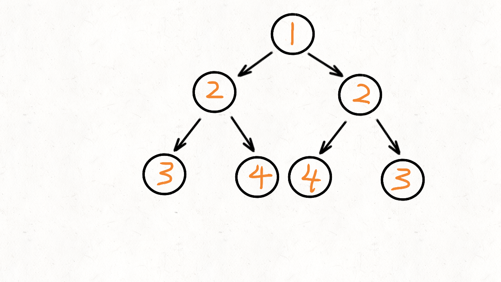

> 原文链接: https://leetcode-cn.com/problems/symmetric-tree


## 英文原文
<div><p>Given the <code>root</code> of a binary tree, <em>check whether it is a mirror of itself</em> (i.e., symmetric around its center).</p>

<p>&nbsp;</p>
<p><strong>Example 1:</strong></p>

<pre>
<strong>Input:</strong> root = [1,2,2,3,4,4,3]
<strong>Output:</strong> true
</pre>

<p><strong>Example 2:</strong></p>

<pre>
<strong>Input:</strong> root = [1,2,2,null,3,null,3]
<strong>Output:</strong> false
</pre>

<p>&nbsp;</p>
<p><strong>Constraints:</strong></p>

<ul>
	<li>The number of nodes in the tree is in the range <code>[1, 1000]</code>.</li>
	<li><code>-100 &lt;= Node.val &lt;= 100</code></li>
</ul>

<p>&nbsp;</p>
<strong>Follow up:</strong> Could you solve it both recursively and iteratively?</div>

## 中文题目
<div><p>给定一个二叉树，检查它是否是镜像对称的。</p>

<p>&nbsp;</p>

<p>例如，二叉树&nbsp;<code>[1,2,2,3,4,4,3]</code> 是对称的。</p>

<pre>    1
   / \
  2   2
 / \ / \
3  4 4  3
</pre>

<p>&nbsp;</p>

<p>但是下面这个&nbsp;<code>[1,2,2,null,3,null,3]</code> 则不是镜像对称的:</p>

<pre>    1
   / \
  2   2
   \   \
   3    3
</pre>

<p>&nbsp;</p>

<p><strong>进阶：</strong></p>

<p>你可以运用递归和迭代两种方法解决这个问题吗？</p>
</div>

## 通过代码
<RecoDemo>
</RecoDemo>


## 高赞题解
#### 递归实现
乍一看无从下手，但用递归其实很好解决。   
根据题目的描述，镜像对称，就是左右两边相等，也就是左子树和右子树是相当的。   
注意这句话，左子树和右子相等，也就是说要递归的比较左子树和右子树。   
我们将根节点的左子树记做 `left`，右子树记做 `right`。比较 `left` 是否等于 `right`，不等的话直接返回就可以了。   
如果相当，比较 `left` 的左节点和 `right` 的右节点，再比较 `left` 的右节点和 `right` 的左节点   
比如看下面这两个子树(他们分别是根节点的左子树和右子树)，能观察到这么一个规律：   
左子树 $2$ 的左孩子 == 右子树 $2$ 的右孩子   
左子树 $2$ 的右孩子 == 右子树 $2$ 的左孩子   
```
    2         2
   / \       / \
  3   4     4   3
 / \ / \   / \ / \
8  7 6  5 5  6 7  8
```
根据上面信息可以总结出递归函数的两个条件：   
终止条件：   
1. `left` 和 `right` 不等，或者 `left` 和 `right` 都为空
2. 递归的比较 `left`，`left` 和 `right.right`，递归比较 `left`，`right` 和 `right.left`   
   
动态图如下：   

   
算法的时间复杂度是 $O(n)$，因为要遍历 $n$ 个节点   
空间复杂度是 $O(n)$，空间复杂度是递归的深度，也就是跟树高度有关，最坏情况下树变成一个链表结构，高度是$n$。   
代码实现：
```Java []
class Solution {
	public boolean isSymmetric(TreeNode root) {
		if(root==null) {
			return true;
		}
		//调用递归函数，比较左节点，右节点
		return dfs(root.left,root.right);
	}
	
	boolean dfs(TreeNode left, TreeNode right) {
		//递归的终止条件是两个节点都为空
		//或者两个节点中有一个为空
		//或者两个节点的值不相等
		if(left==null && right==null) {
			return true;
		}
		if(left==null || right==null) {
			return false;
		}
		if(left.val!=right.val) {
			return false;
		}
		//再递归的比较 左节点的左孩子 和 右节点的右孩子
		//以及比较  左节点的右孩子 和 右节点的左孩子
		return dfs(left.left,right.right) && dfs(left.right,right.left);
	}
}
```
```Python []
class Solution(object):
	def isSymmetric(self, root):
		"""
		:type root: TreeNode
		:rtype: bool
		"""
		if not root:
			return True
		def dfs(left,right):
			# 递归的终止条件是两个节点都为空
			# 或者两个节点中有一个为空
			# 或者两个节点的值不相等
			if not (left or right):
				return True
			if not (left and right):
				return False
			if left.val!=right.val:
				return False
			return dfs(left.left,right.right) and dfs(left.right,right.left)
		# 用递归函数，比较左节点，右节点
		return dfs(root.left,root.right)
```
   
   
   
#### 队列实现
回想下递归的实现：   
当两个子树的根节点相等时，就比较:   
左子树的 `left` 和 右子树的 `right`，这个比较是用递归实现的。   
现在我们改用队列来实现，思路如下：   
首先从队列中拿出两个节点(`left` 和 `right`)比较
将 `left` 的 `left` 节点和 `right` 的 `right` 节点放入队列   
将 `left` 的 `right` 节点和 `right` 的 `left` 节点放入队列   
时间复杂度是 $O(n)$，空间复杂度是 $O(n)$ 
动画演示如下：   



代码实现：
```Java []
class Solution {
	public boolean isSymmetric(TreeNode root) {
		if(root==null || (root.left==null && root.right==null)) {
			return true;
		}
		//用队列保存节点
		LinkedList<TreeNode> queue = new LinkedList<TreeNode>();
		//将根节点的左右孩子放到队列中
		queue.add(root.left);
		queue.add(root.right);
		while(queue.size()>0) {
			//从队列中取出两个节点，再比较这两个节点
			TreeNode left = queue.removeFirst();
			TreeNode right = queue.removeFirst();
			//如果两个节点都为空就继续循环，两者有一个为空就返回false
			if(left==null && right==null) {
				continue;
			}
			if(left==null || right==null) {
				return false;
			}
			if(left.val!=right.val) {
				return false;
			}
			//将左节点的左孩子， 右节点的右孩子放入队列
			queue.add(left.left);
			queue.add(right.right);
			//将左节点的右孩子，右节点的左孩子放入队列
			queue.add(left.right);
			queue.add(right.left);
		}
		
		return true;
	}
}
```
```Python []
class Solution(object):
	def isSymmetric(self, root):
		"""
		:type root: TreeNode
		:rtype: bool
		"""
		if not root or not (root.left or root.right):
			return True
		# 用队列保存节点	
		queue = [root.left,root.right]
		while queue:
			# 从队列中取出两个节点，再比较这两个节点
			left = queue.pop(0)
			right = queue.pop(0)
			# 如果两个节点都为空就继续循环，两者有一个为空就返回false
			if not (left or right):
				continue
			if not (left and right):
				return False
			if left.val!=right.val:
				return False
			# 将左节点的左孩子， 右节点的右孩子放入队列
			queue.append(left.left)
			queue.append(right.right)
			# 将左节点的右孩子，右节点的左孩子放入队列
			queue.append(left.right)
			queue.append(right.left)
		return True
```


## 统计信息
| 通过次数 | 提交次数 | AC比率 |
| :------: | :------: | :------: |
|    450323    |    795599    |   56.6%   |

## 提交历史
| 提交时间 | 提交结果 | 执行时间 |  内存消耗  | 语言 |
| :------: | :------: | :------: | :--------: | :--------: |
