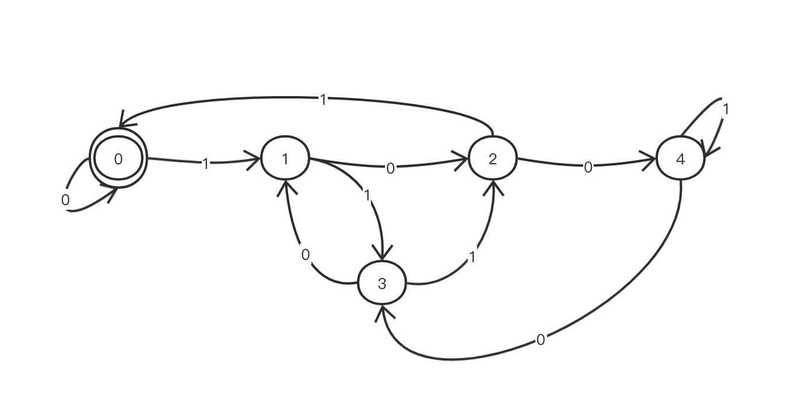

> 原文链接: https://leetcode-cn.com/problems/binary-prefix-divisible-by-5


## 英文原文
<div><p>You are given a binary array <code>nums</code> (<strong>0-indexed</strong>).</p>

<p>We define <code>x<sub>i</sub></code> as the number whose binary representation is the subarray <code>nums[0..i]</code> (from most-significant-bit to least-significant-bit).</p>

<ul>
	<li>For example, if <code>nums = [1,0,1]</code>, then <code>x<sub>0</sub> = 1</code>, <code>x<sub>1</sub> = 2</code>, and <code>x<sub>2</sub> = 5</code>.</li>
</ul>

<p>Return <em>an array of booleans </em><code>answer</code><em> where </em><code>answer[i]</code><em> is </em><code>true</code><em> if </em><code>x<sub>i</sub></code><em> is divisible by </em><code>5</code>.</p>

<p>&nbsp;</p>
<p><strong>Example 1:</strong></p>

<pre>
<strong>Input:</strong> nums = [0,1,1]
<strong>Output:</strong> [true,false,false]
<strong>Explanation:</strong> The input numbers in binary are 0, 01, 011; which are 0, 1, and 3 in base-10.
Only the first number is divisible by 5, so answer[0] is true.
</pre>

<p><strong>Example 2:</strong></p>

<pre>
<strong>Input:</strong> nums = [1,1,1]
<strong>Output:</strong> [false,false,false]
</pre>

<p><strong>Example 3:</strong></p>

<pre>
<strong>Input:</strong> nums = [0,1,1,1,1,1]
<strong>Output:</strong> [true,false,false,false,true,false]
</pre>

<p><strong>Example 4:</strong></p>

<pre>
<strong>Input:</strong> nums = [1,1,1,0,1]
<strong>Output:</strong> [false,false,false,false,false]
</pre>

<p>&nbsp;</p>
<p><strong>Constraints:</strong></p>

<ul>
	<li><code>1 &lt;= nums.length &lt;= 10<sup>5</sup></code></li>
	<li><code>nums[i]</code>&nbsp;is&nbsp;<code>0</code>&nbsp;or&nbsp;<code>1</code>.</li>
</ul>
</div>

## 中文题目
<div><p>给定由若干&nbsp;<code>0</code>&nbsp;和&nbsp;<code>1</code>&nbsp;组成的数组 <code>A</code>。我们定义&nbsp;<code>N_i</code>：从&nbsp;<code>A[0]</code> 到&nbsp;<code>A[i]</code>&nbsp;的第 <code>i</code>&nbsp;个子数组被解释为一个二进制数（从最高有效位到最低有效位）。</p>

<p>返回布尔值列表&nbsp;<code>answer</code>，只有当&nbsp;<code>N_i</code>&nbsp;可以被 <code>5</code>&nbsp;整除时，答案&nbsp;<code>answer[i]</code> 为&nbsp;<code>true</code>，否则为 <code>false</code>。</p>

<p>&nbsp;</p>

<p><strong>示例 1：</strong></p>

<pre><strong>输入：</strong>[0,1,1]
<strong>输出：</strong>[true,false,false]
<strong>解释：</strong>
输入数字为 0, 01, 011；也就是十进制中的 0, 1, 3 。只有第一个数可以被 5 整除，因此 answer[0] 为真。
</pre>

<p><strong>示例 2：</strong></p>

<pre><strong>输入：</strong>[1,1,1]
<strong>输出：</strong>[false,false,false]
</pre>

<p><strong>示例 3：</strong></p>

<pre><strong>输入：</strong>[0,1,1,1,1,1]
<strong>输出：</strong>[true,false,false,false,true,false]
</pre>

<p><strong>示例&nbsp;4：</strong></p>

<pre><strong>输入：</strong>[1,1,1,0,1]
<strong>输出：</strong>[false,false,false,false,false]
</pre>

<p>&nbsp;</p>

<p><strong>提示：</strong></p>

<ol>
	<li><code>1 &lt;= A.length &lt;= 30000</code></li>
	<li><code>A[i]</code> 为&nbsp;<code>0</code>&nbsp;或&nbsp;<code>1</code></li>
</ol>
</div>

## 通过代码
<RecoDemo>
</RecoDemo>


## 高赞题解
### 有限状态机
状态对应(mod 5)，箭头表示状态转移，转移函数是`(当前状态*2+二进制数末位)%5`。


### 代码

```rust
impl Solution {
    pub fn prefixes_div_by5(a: Vec<i32>) -> Vec<bool> {
        let mut state: i32 = 0;
        let mut result = vec![];
        let stateSet = [[0, 1], [2, 3], [4, 0], [1, 2], [3, 4]];
        for i in a {
            state = stateSet[state as usize][i as usize];
            result.push(state == 0);
        }
        result
    }
}
```

## 统计信息
| 通过次数 | 提交次数 | AC比率 |
| :------: | :------: | :------: |
|    44583    |    86434    |   51.6%   |

## 提交历史
| 提交时间 | 提交结果 | 执行时间 |  内存消耗  | 语言 |
| :------: | :------: | :------: | :--------: | :--------: |
