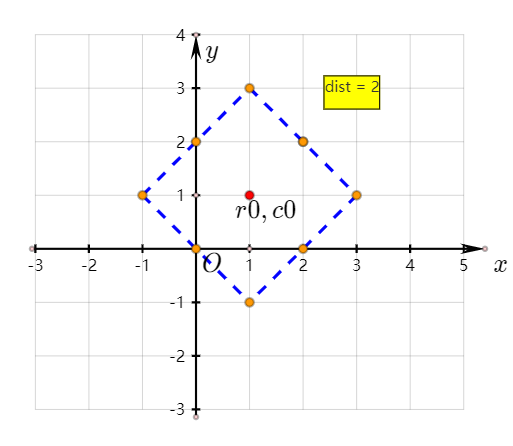

> 原文链接: https://leetcode-cn.com/problems/matrix-cells-in-distance-order


## 英文原文
<div><p>You are given four integers <code>row</code>, <code>cols</code>, <code>rCenter</code>, and <code>cCenter</code>. There is a <code>rows x cols</code> matrix and you are on the cell with the coordinates <code>(rCenter, cCenter)</code>.</p>

<p>Return <em>the coordinates of all cells in the matrix, sorted by their <strong>distance</strong> from </em><code>(rCenter, cCenter)</code><em> from the smallest distance to the largest distance</em>. You may return the answer in <strong>any order</strong> that satisfies this condition.</p>

<p>The <strong>distance</strong> between two cells <code>(r<sub>1</sub>, c<sub>1</sub>)</code> and <code>(r<sub>2</sub>, c<sub>2</sub>)</code> is <code>|r<sub>1</sub> - r<sub>2</sub>| + |c<sub>1</sub> - c<sub>2</sub>|</code>.</p>

<p>&nbsp;</p>
<p><strong>Example 1:</strong></p>

<pre>
<strong>Input:</strong> rows = 1, cols = 2, rCenter = 0, cCenter = 0
<strong>Output:</strong> [[0,0],[0,1]]
<strong>Explanation:</strong> The distances from (0, 0) to other cells are: [0,1]
</pre>

<p><strong>Example 2:</strong></p>

<pre>
<strong>Input:</strong> rows = 2, cols = 2, rCenter = 0, cCenter = 1
<strong>Output:</strong> [[0,1],[0,0],[1,1],[1,0]]
<strong>Explanation:</strong> The distances from (0, 1) to other cells are: [0,1,1,2]
The answer [[0,1],[1,1],[0,0],[1,0]] would also be accepted as correct.
</pre>

<p><strong>Example 3:</strong></p>

<pre>
<strong>Input:</strong> rows = 2, cols = 3, rCenter = 1, cCenter = 2
<strong>Output:</strong> [[1,2],[0,2],[1,1],[0,1],[1,0],[0,0]]
<strong>Explanation:</strong> The distances from (1, 2) to other cells are: [0,1,1,2,2,3]
There are other answers that would also be accepted as correct, such as [[1,2],[1,1],[0,2],[1,0],[0,1],[0,0]].
</pre>

<p>&nbsp;</p>
<p><strong>Constraints:</strong></p>

<ul>
	<li><code>1 &lt;= rows, cols &lt;= 100</code></li>
	<li><code>0 &lt;= rCenter &lt; rows</code></li>
	<li><code>0 &lt;= cCenter &lt; cols</code></li>
</ul>
</div>

## 中文题目
<div><p>给出 <code>R</code> 行 <code>C</code> 列的矩阵，其中的单元格的整数坐标为 <code>(r, c)</code>，满足 <code>0 &lt;= r &lt; R</code> 且 <code>0 &lt;= c &lt; C</code>。</p>

<p>另外，我们在该矩阵中给出了一个坐标为&nbsp;<code>(r0, c0)</code> 的单元格。</p>

<p>返回矩阵中的所有单元格的坐标，并按到 <code>(r0, c0)</code> 的距离从最小到最大的顺序排，其中，两单元格<code>(r1, c1)</code> 和 <code>(r2, c2)</code> 之间的距离是曼哈顿距离，<code>|r1 - r2| + |c1 - c2|</code>。（你可以按任何满足此条件的顺序返回答案。）</p>

<p>&nbsp;</p>

<p><strong>示例 1：</strong></p>

<pre><strong>输入：</strong>R = 1, C = 2, r0 = 0, c0 = 0
<strong>输出：</strong>[[0,0],[0,1]]
<strong>解释</strong>：从 (r0, c0) 到其他单元格的距离为：[0,1]
</pre>

<p><strong>示例 2：</strong></p>

<pre><strong>输入：</strong>R = 2, C = 2, r0 = 0, c0 = 1
<strong>输出：</strong>[[0,1],[0,0],[1,1],[1,0]]
<strong>解释</strong>：从 (r0, c0) 到其他单元格的距离为：[0,1,1,2]
[[0,1],[1,1],[0,0],[1,0]] 也会被视作正确答案。
</pre>

<p><strong>示例 3：</strong></p>

<pre><strong>输入：</strong>R = 2, C = 3, r0 = 1, c0 = 2
<strong>输出：</strong>[[1,2],[0,2],[1,1],[0,1],[1,0],[0,0]]
<strong>解释</strong>：从 (r0, c0) 到其他单元格的距离为：[0,1,1,2,2,3]
其他满足题目要求的答案也会被视为正确，例如 [[1,2],[1,1],[0,2],[1,0],[0,1],[0,0]]。
</pre>

<p>&nbsp;</p>

<p><strong>提示：</strong></p>

<ol>
	<li><code>1 &lt;= R &lt;= 100</code></li>
	<li><code>1 &lt;= C &lt;= 100</code></li>
	<li><code>0 &lt;= r0 &lt; R</code></li>
	<li><code>0 &lt;= c0 &lt; C</code></li>
</ol>
</div>

## 通过代码
<RecoDemo>
</RecoDemo>


## 高赞题解
## 解法一：直接排序数组

显然，最暴力的解法是按照距离排序，然后依次输出坐标。

**注意：**

- 本解法可以使用哈希表优化，即使用坐标作 key，使用距离作 value，然后按照距离排序，这样就不会因为多次对同一下标进行比较而重复计算距离
- 无论如何优化，核心仍然是直接排序，时间复杂度不会优于 `O(R*C*log(R*C))`

### 代码

```Java []
import java.util.Arrays;

class Solution {
    public int[][] allCellsDistOrder(int R, int C, int r0, int c0) {
        int[][] re = new int[R * C][2];
        for (int i = 0; i < R; i++) {
            for (int j = 0; j < C; j++) {
                int t = i*C+j;
                re[t][0] = i;
                re[t][1] = j;
            }
        }
        Arrays.sort(re, (arr1, arr2) -> {
            int d1 = dist(arr1[0], arr1[1], r0, c0);
            int d2 = dist(arr2[0], arr2[1], r0, c0);
            return Integer.compare(d1, d2);
        });

        return re;
    }

    private int dist(int r1,int c1,int r2,int c2) {
        return Math.abs(r1 - r2) + Math.abs(c1 - c2);
    }
}
```

## 解法二：桶排序

1. 遍历所有坐标，按照距离的大小分组，每组的距离相等（即放入一个桶中）
2. 按照距离从小到大的原则，遍历所有桶，并输出结果

本解法关键在于求得可能的最大距离，即行距离和列距离都最大时：`max(r0, R - 1 - r0) + max(c0, C - 1 - c0)`

**注意：**

- 此解法时间复杂度为 O(R*C)，理论上已达到最快可能
- 实际时间消耗会比预估要差，不同语言便利程度和优化不一，原因如下：
    - 桶的制作涉及大量容器的初始化和存取
    - 桶中要存储大量的坐标信息，不论是直接使用长度为 2 的小数组存储，还是用新的简单数据类，都会耗费很多时间

### 代码

```Java []
import java.util.ArrayList;
import java.util.LinkedList;

class Solution {
    public int[][] allCellsDistOrder(int R, int C, int r0, int c0) {
        int[][] re = new int[R * C][2];
        int maxDist = Math.max(r0, R - 1 - r0) + Math.max(c0, C - 1 - c0);
        ArrayList<LinkedList<Pos>> bucket = new ArrayList<>(maxDist + 1);
        for (int i = 0; i <= maxDist; i++) {
            bucket.add(new LinkedList<>());
        }

        for (int i = 0; i < R; i++) {
            for (int j = 0; j < C; j++) {
                int d = dist(i, j, r0, c0);
                LinkedList<Pos> list = bucket.get(d);
                list.add(new Pos(i,j));
            }
        }
        int cnt = 0;
        for (int i = 0; i <= maxDist; i++) {
            LinkedList<Pos> list = bucket.get(i);
            if (list.isEmpty()) continue;
            for (Pos p : list) {
                re[cnt][0] = p.r;
                re[cnt][1] = p.c;
                cnt++;
            }
        }

        return re;
    }

    private int dist(int r1,int c1,int r2,int c2) {
        return Math.abs(r1 - r2) + Math.abs(c1 - c2);
    }

    private static class Pos {
        int r;
        int c;

        public Pos(int r, int c) {
            this.r = r;
            this.c = c;
        }
    }
}
```

## 解法三：BFS

1. 可以把所有的坐标看作树的结点，距离相等的结点位于树的同一层
2. 而对于每一层的结点，它们的距离 dist 可以分为行距离和列距离，且 `rowDist + colDist = dist` 必然成立
3. 使 rowDist 从 0 到 dist 递增，colDist 相应有不同的值，可以得到不同的坐标：
    - 横坐标为：`r0 - rowDist` 或 `r0 + rowDist`
    - 纵坐标为：`c0 - colDist` 或 `c0 + colDist`
    - 注意特殊情况：rowDist 或 colDist 为 0 时，每组只有一个正确值
4. 对步骤 3 中，所有在矩阵范围内的坐标进行记录

**注意：**
- 此解法不关心最大距离，只要步骤 4 中记录的结果达到 R * C 的数量就可以终止搜索
- 此解法的时间复杂度是 O((R+C)^2)，因为对每一种距离 dist，rowDist 都要进行从 0 开始递增到 dist 的遍历操作，而距离可能的最大值为 R + C
- 此解法时间复杂度大于 O(R * C) 的原因是：每种距离可能产生多个不在矩阵内的坐标，但搜索算法必须依次检查予以排除
- 理论上此解法并不比桶排序优秀，但是代码中极少创建额外的容器和对象，所以实际的运行效率不会太差

### 代码

```Java []
class Solution {
    public int[][] allCellsDistOrder(int R, int C, int r0, int c0) {
        int[][] re = new int[R * C][2];
        int dist = 0;
        int cnt = 0;
        int[] factor = {-1, 1};
        while (cnt < R * C) {
            for (int rowDist = 0; rowDist <= dist; rowDist++) {
                int colDist = dist - rowDist;
                for (int i = 0; i < 2; i++) {
                    int row = r0 + factor[i] * rowDist;
                    for (int j = 0; j < 2; j++) {
                        int col = c0 + factor[j] * colDist;
                        if (row >= 0 && row < R && col >= 0 && col < C) {
                            re[cnt][0] = row;
                            re[cnt][1] = col;
                            cnt++;
                        }
                        if (colDist == 0) break;
                    }
                    if (rowDist == 0) break;
                }
            }
            dist++;
        }

        return re;
    }
}
```

## 解法四：几何法（类 BFS）

如果把矩阵当作二维直角坐标系中的图形，而且把所有不在矩阵内的点也考虑进来，那么所有到 (r0, c0) 点的“距离”相等的整数坐标有明显的规律：


可以看到，它们的坐标都在一个正方形的边上（包括顶点），而且正方形的上下顶点 row 值为 r0，左右顶点 col 值为 c0。
这样，只要保证每次找到一个正方形的顶点，然后按照规律“画出”这个正方形即可，画图步骤如下:

1. 保存 4 个向量标明画线的方向
2. 出发点为 `(r0 - 1, c0)`
3. 按照 1 中的向量指示方向画线，遇到一个正方形的顶点就更换为下一个向量（向左转 90°）

在上述的画线步骤中，不断检查线上的整数坐标，如果符合要求就进行记录。

**注意：**
- 顶点的判断方法有两组，分别对应和 r0 或 c0 是否相等
- 对每个距离 dist 都要画出正方形检查，检查的点数量是 `8 * dist`，而最大距离可能是 `R + C`，所以时间复杂度为 O((R+C)^2)
- 此解法代码中看似没有按照距离分层遍历，实际每个初始顶点的求解过程中已经包含了按照距离分层的想法，实际极其类似 BFS
- 此解法要检查的点理论上多于 BFS，尤其是 (r0, c0) 位于矩阵一角时会明显偏慢（最后要画很多很大的正方形）


### 代码

```Java []
class Solution {
    public int[][] allCellsDistOrder(int R, int C, int r0, int c0) {
        int[][] re = new int[R * C][2];
        re[0][0] = r0;
        re[0][1] = c0;
        int[] dr = {1, 1, -1, -1};
        int[] dc = {1, -1, -1, 1};
        int row = r0;
        int col = c0;
        var cnt = 1;
        while (cnt < R * C) {
            row--;
            for (int i = 0; i < 4; i++) {
                while ((i % 2 == 0 && row != r0) || (i % 2 != 0 && col != c0)) {
                    if (row >= 0 && row < R && col >= 0 && col < C) {
                        re[cnt][0] = row;
                        re[cnt][1] = col;
                        cnt++;
                    }
                    row += dr[i];
                    col += dc[i];
                }
            }
        }
        return re;
    }
}
```


## 统计信息
| 通过次数 | 提交次数 | AC比率 |
| :------: | :------: | :------: |
|    41070    |    57823    |   71.0%   |

## 提交历史
| 提交时间 | 提交结果 | 执行时间 |  内存消耗  | 语言 |
| :------: | :------: | :------: | :--------: | :--------: |
