> 原文链接: https://leetcode-cn.com/problems/last-stone-weight


## 英文原文
<div><p>You are given an array of integers <code>stones</code> where <code>stones[i]</code> is the weight of the <code>i<sup>th</sup></code> stone.</p>

<p>We are playing a game with the stones. On each turn, we choose the <strong>heaviest two stones</strong> and smash them together. Suppose the heaviest two stones have weights <code>x</code> and <code>y</code> with <code>x &lt;= y</code>. The result of this smash is:</p>

<ul>
	<li>If <code>x == y</code>, both stones are destroyed, and</li>
	<li>If <code>x != y</code>, the stone of weight <code>x</code> is destroyed, and the stone of weight <code>y</code> has new weight <code>y - x</code>.</li>
</ul>

<p>At the end of the game, there is <strong>at most one</strong> stone left.</p>

<p>Return <em>the smallest possible weight of the left stone</em>. If there are no stones left, return <code>0</code>.</p>

<p>&nbsp;</p>
<p><strong>Example 1:</strong></p>

<pre>
<strong>Input:</strong> stones = [2,7,4,1,8,1]
<strong>Output:</strong> 1
<strong>Explanation:</strong> 
We combine 7 and 8 to get 1 so the array converts to [2,4,1,1,1] then,
we combine 2 and 4 to get 2 so the array converts to [2,1,1,1] then,
we combine 2 and 1 to get 1 so the array converts to [1,1,1] then,
we combine 1 and 1 to get 0 so the array converts to [1] then that&#39;s the value of the last stone.
</pre>

<p><strong>Example 2:</strong></p>

<pre>
<strong>Input:</strong> stones = [1]
<strong>Output:</strong> 1
</pre>

<p>&nbsp;</p>
<p><strong>Constraints:</strong></p>

<ul>
	<li><code>1 &lt;= stones.length &lt;= 30</code></li>
	<li><code>1 &lt;= stones[i] &lt;= 1000</code></li>
</ul>
</div>

## 中文题目
<div><p>有一堆石头，每块石头的重量都是正整数。</p>

<p>每一回合，从中选出两块<strong> 最重的</strong> 石头，然后将它们一起粉碎。假设石头的重量分别为 <code>x</code> 和 <code>y</code>，且 <code>x <= y</code>。那么粉碎的可能结果如下：</p>

<ul>
	<li>如果 <code>x == y</code>，那么两块石头都会被完全粉碎；</li>
	<li>如果 <code>x != y</code>，那么重量为 <code>x</code> 的石头将会完全粉碎，而重量为 <code>y</code> 的石头新重量为 <code>y-x</code>。</li>
</ul>

<p>最后，最多只会剩下一块石头。返回此石头的重量。如果没有石头剩下，就返回 <code>0</code>。</p>

<p> </p>

<p><strong>示例：</strong></p>

<pre>
<strong>输入：</strong>[2,7,4,1,8,1]
<strong>输出：</strong>1
<strong>解释：</strong>
先选出 7 和 8，得到 1，所以数组转换为 [2,4,1,1,1]，
再选出 2 和 4，得到 2，所以数组转换为 [2,1,1,1]，
接着是 2 和 1，得到 1，所以数组转换为 [1,1,1]，
最后选出 1 和 1，得到 0，最终数组转换为 [1]，这就是最后剩下那块石头的重量。</pre>

<p> </p>

<p><strong>提示：</strong></p>

<ul>
	<li><code>1 <= stones.length <= 30</code></li>
	<li><code>1 <= stones[i] <= 1000</code></li>
</ul>
</div>

## 通过代码
<RecoDemo>
</RecoDemo>


## 高赞题解
因为每一回合都要选出最重的两块石头，我们自然而然地想到堆这个可以自动实现排序的数据结构，而且添加和删除一个元素的时间复杂度都是O(logn)

### 方法一：使用heapq库
因为python只支持小顶堆，所以在入堆的时候我们要添加的是数据的相反数
```
class Solution:
    def lastStoneWeight(self, stones: List[int]) -> int:
        # 初始化
        heap = [-stone for stone in stones]
        heapq.heapify(heap)

        # 模拟
        while len(heap) > 1:
            x,y = heapq.heappop(heap),heapq.heappop(heap)
            if x != y:
                heapq.heappush(heap,x-y)

        if heap: return -heap[0]
        return 0
```
### 方法二：手写实现
我们通过自己手写来详细刨析一下堆这个数据结构到底是怎么实现的。
##### 堆的特点：
1. 内部数据是有序的
2. 可以弹出堆顶的元素，大顶堆就是弹出最大值，小顶堆就是弹出最小值
3. 每次加入新元素或者弹出堆顶元素后，调整堆使之重新有序仅需要O(logn)的时间
4. 支持在线算法

##### 堆的本质：
1. 它是一个完全二叉树
2. 实现的时候我们不需要建造一个树，改用一个数组即可

- **那么我们是如何把一个完全二叉树和一个数组关联到一起的呢？**
- 给树的节点**编号**，节点的编号就是元素在数组中的下标
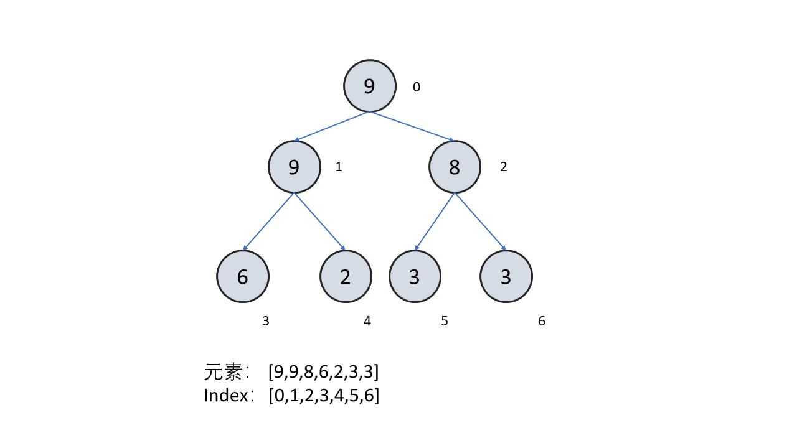


3. 于是我们发现一个很重要的结论：
已知一个节点的编号为`index`，那么它的父节点的编号为：
    $$ father\_index = \lfloor {index-1 \over 2}\rfloor $$
    左孩子节点的编号为
    $$ left\_index = index * 2 + 1 $$
    右孩子节点的编号为
    $$ right\_index = index * 2 + 2 $$
##### 如何调整堆
1. 添加元素
- 把新数据添加到树的最后一个元素，也就是数组的末尾
- 把末尾节点向上调整

<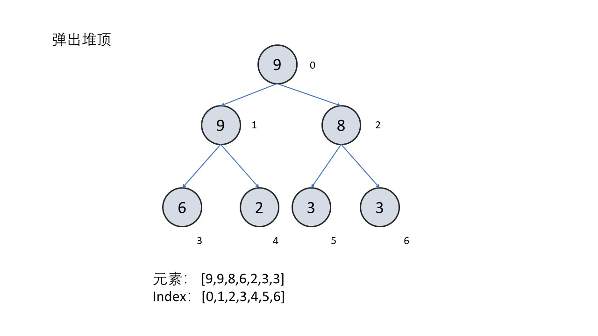,,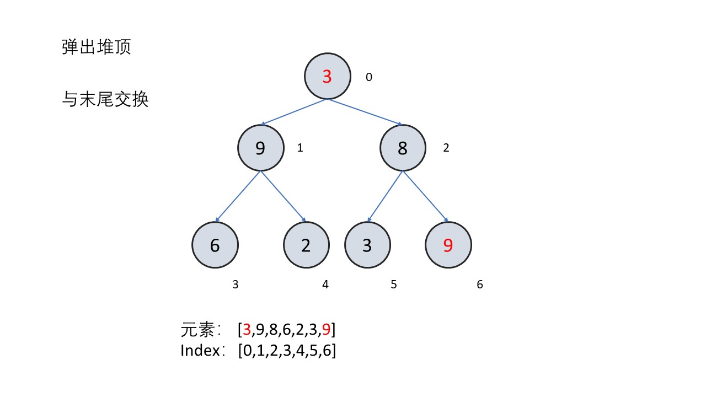,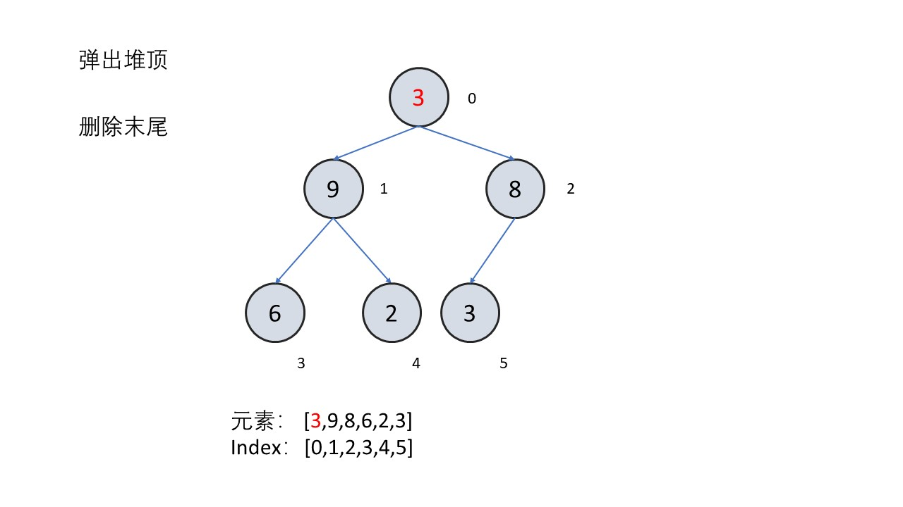,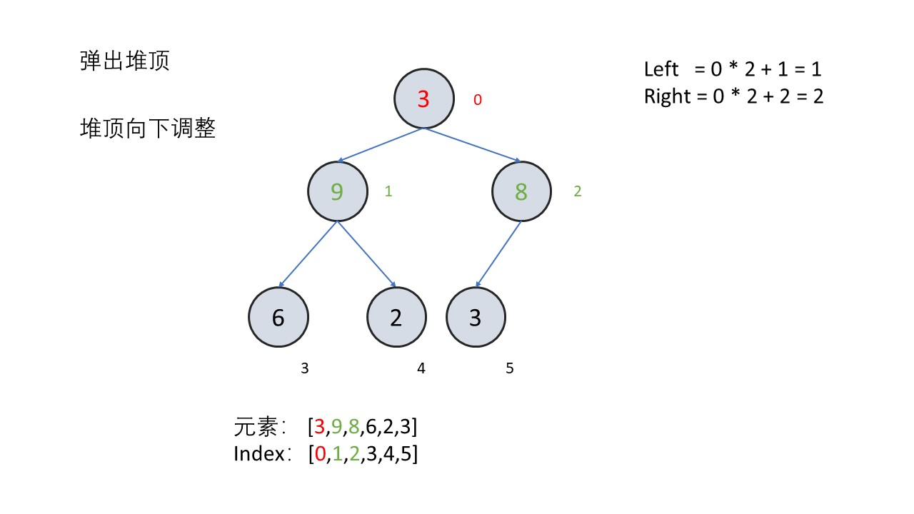,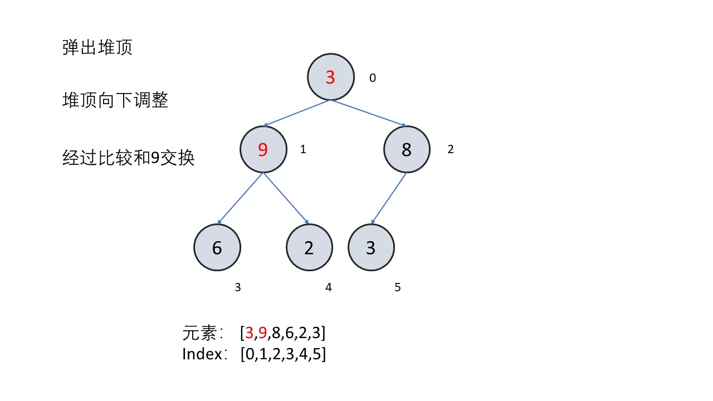,,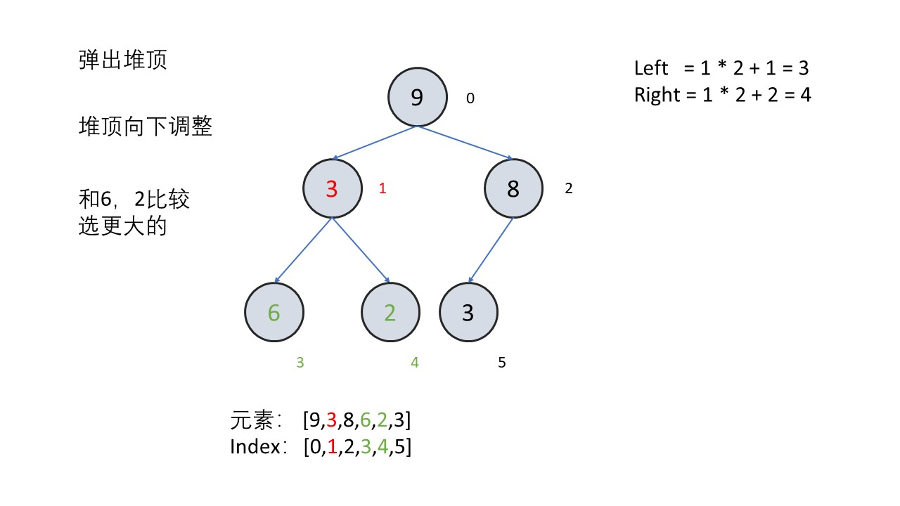,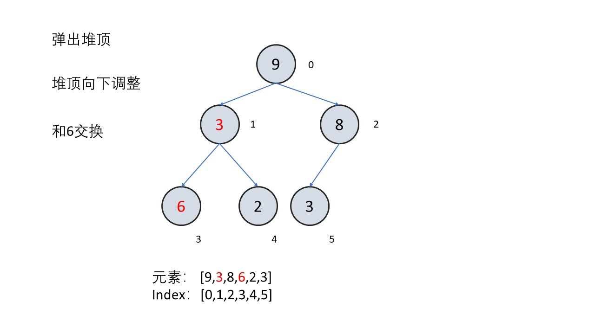,,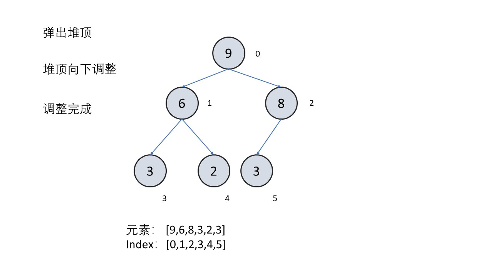>


2. 弹出堆顶
- 交换根节点与最后一个节点的值
- 删除最后一个节点
- 把根节点向下调整

<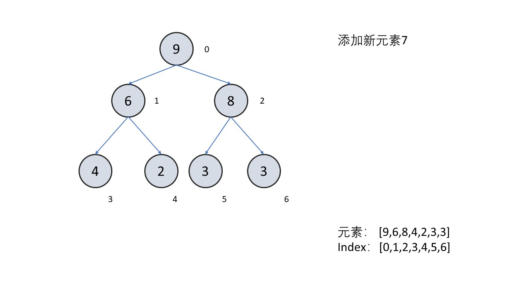,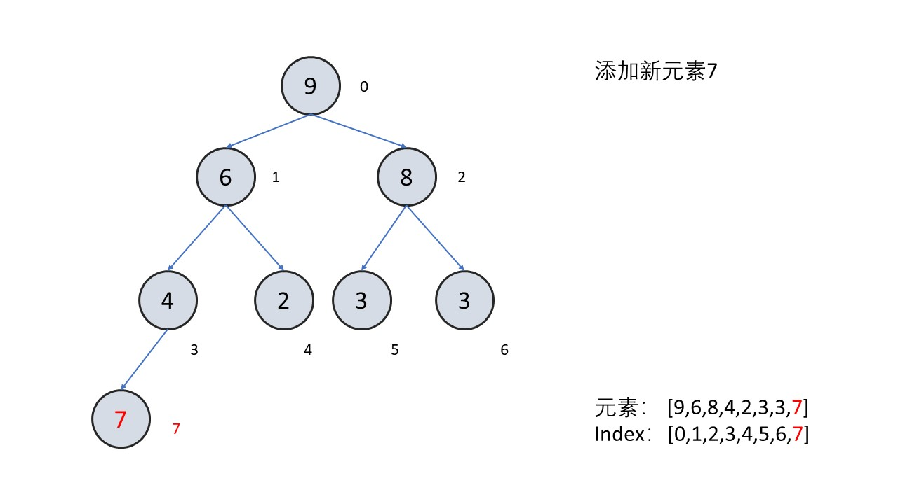,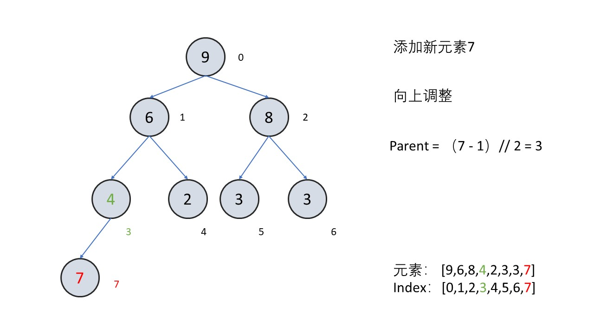,,,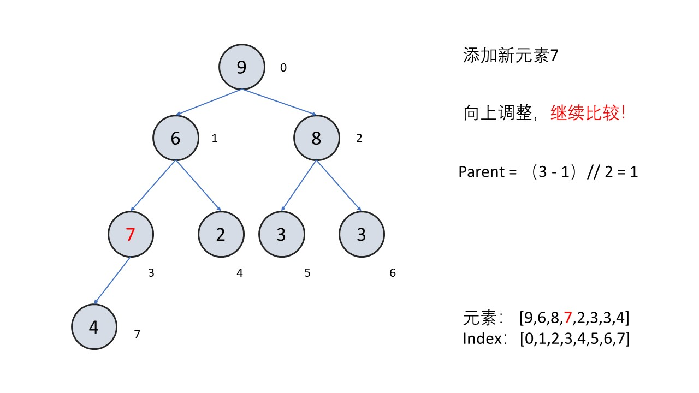,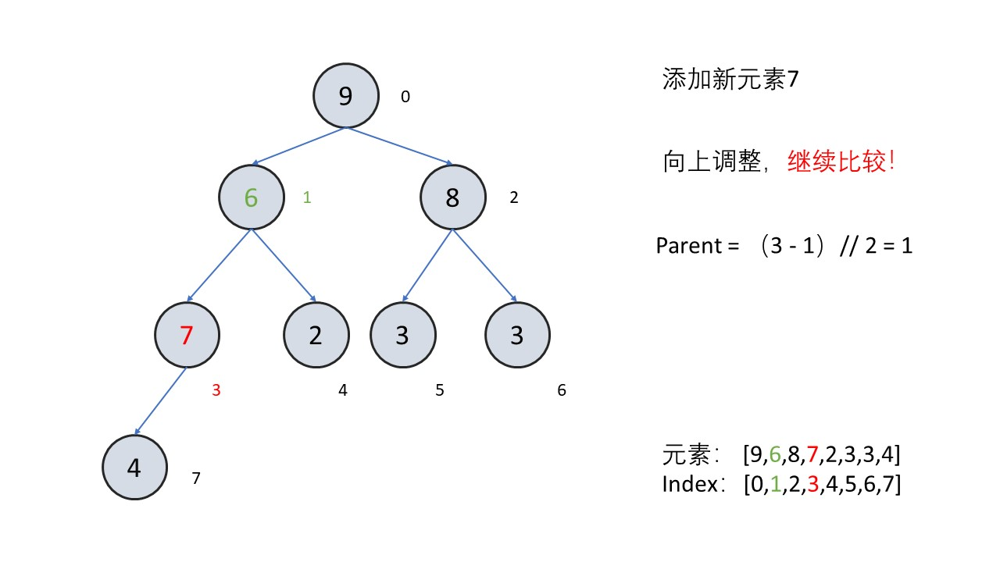,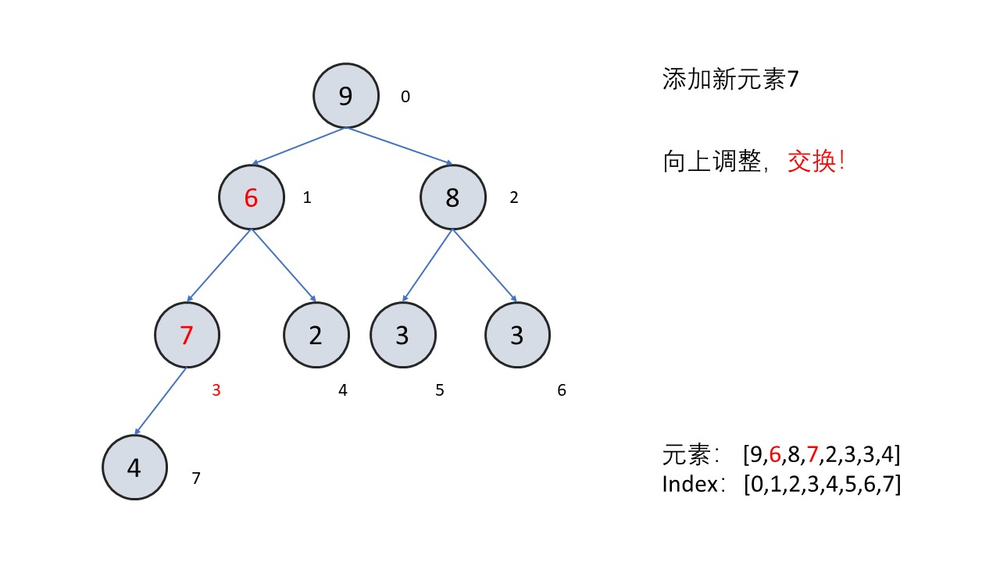,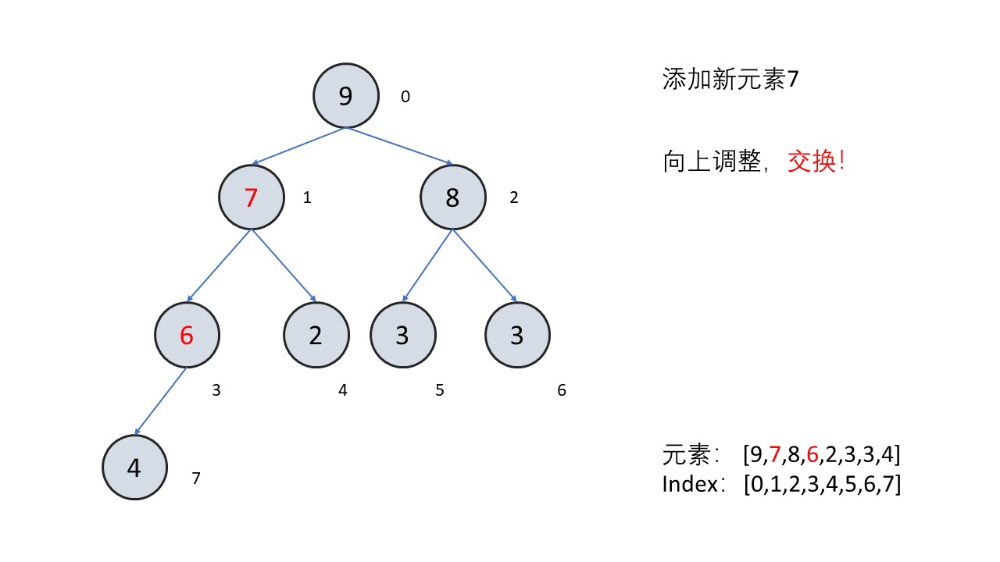,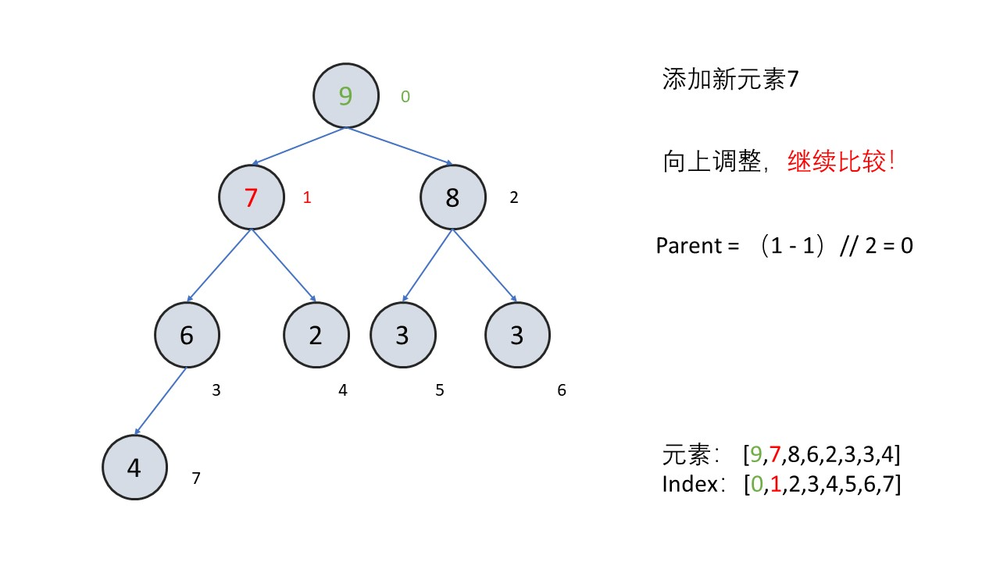,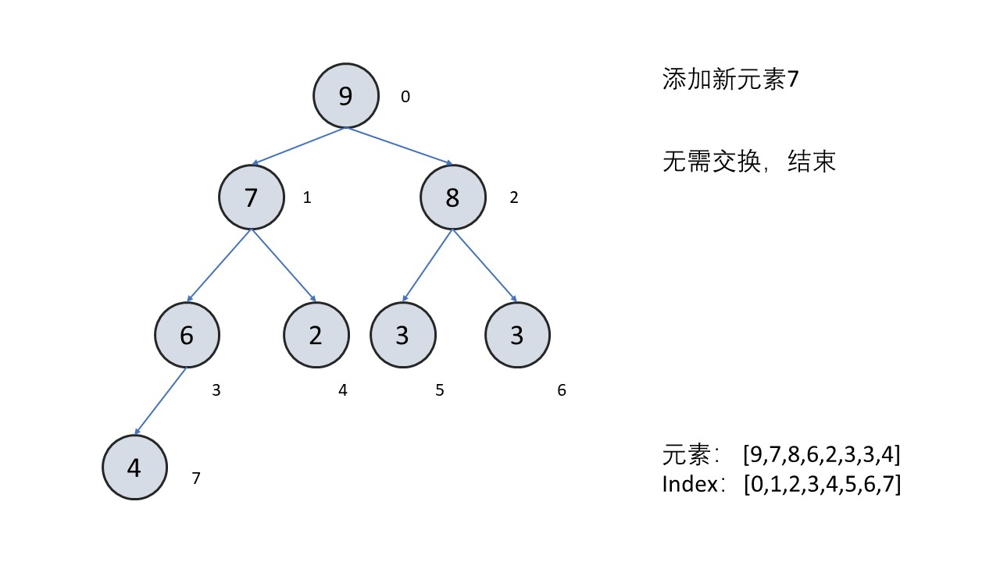>


##### 所以需要写的函数有
1. 初始化
```
    def __init__(self,desc=False):
        """
        初始化，默认创建一个小顶堆
        """
        self.heap = []
        self.desc = desc
```

2. 堆的大小
```
    @property
    def size(self):
        return len(self.heap)
```

3. 返回堆顶元素
```
    def top(self):
        if self.size:
            return self.heap[0]
        return None
```

4. 添加元素
```
    def push(self,item):
        """
        添加元素
        第一步，把元素加入到数组末尾
        第二步，把末尾元素向上调整
        """
        self.heap.append(item)
        self._sift_up(self.size-1)
```

5. 弹出堆顶元素
```
    def pop(self):
        """
        弹出堆顶
        第一步，记录堆顶元素的值
        第二步，交换堆顶元素与末尾元素
        第三步，删除数组末尾元素
        第四步，新的堆顶元素向下调整
        第五步，返回答案
        """
        item = self.heap[0]
        self._swap(0,self.size-1)
        self.heap.pop()
        self._sift_down(0)
        return item
```

6. 判断两个元素的大小关系，这里有个小trick
```
    def _smaller(self,lhs,rhs):
        return lhs > rhs if self.desc else lhs < rhs
```

7. 向上调整
```
    def _sift_up(self,index):
        """
        向上调整
        如果父节点和当前节点满足交换的关系
        （对于小顶堆是父节点元素更大，对于大顶堆是父节点更小），
        则持续将当前节点向上调整
        """
        while index:
            parent = (index-1) // 2
            
            if self._smaller(self.heap[parent],self.heap[index]):
                break
                
            self._swap(parent,index)
            index = parent
```

8. 向下调整
```
    def _sift_down(self,index):
        """
        向下调整
        如果子节点和当前节点满足交换的关系
        （对于小顶堆是子节点元素更小，对于大顶堆是子节点更大），
        则持续将当前节点向下调整
        """
        # 若存在子节点
        while index*2+1 < self.size:
            smallest = index
            left = index*2+1
            right = index*2+2
            
            if self._smaller(self.heap[left],self.heap[smallest]):
                smallest = left
                
            if right < self.size and self._smaller(self.heap[right],self.heap[smallest]):
                smallest = right
                
            if smallest == index:
                break

            self._swap(index,smallest)
            index = smallest
```

9. 交换两个元素
```
    def _swap(self,i,j):
        self.heap[i],self.heap[j] = self.heap[j],self.heap[i]
```


##### 完整代码
```
class Heap:
    def __init__(self,desc=False):
        """
        初始化，默认创建一个小顶堆
        """
        self.heap = []
        self.desc = desc
    
    @property
    def size(self):
        return len(self.heap)
    
    def top(self):
        if self.size:
            return self.heap[0]
        return None
    
    def push(self,item):
        """
        添加元素
        第一步，把元素加入到数组末尾
        第二步，把末尾元素向上调整
        """
        self.heap.append(item)
        self._sift_up(self.size-1)
    
    def pop(self):
        """
        弹出堆顶
        第一步，记录堆顶元素的值
        第二步，交换堆顶元素与末尾元素
        第三步，删除数组末尾元素
        第四步，新的堆顶元素向下调整
        第五步，返回答案
        """
        item = self.heap[0]
        self._swap(0,self.size-1)
        self.heap.pop()
        self._sift_down(0)
        return item
    
    def _smaller(self,lhs,rhs):
        return lhs > rhs if self.desc else lhs < rhs
    
    def _sift_up(self,index):
        """
        向上调整
        如果父节点和当前节点满足交换的关系
        （对于小顶堆是父节点元素更大，对于大顶堆是父节点更小），
        则持续将当前节点向上调整
        """
        while index:
            parent = (index-1) // 2
            
            if self._smaller(self.heap[parent],self.heap[index]):
                break
                
            self._swap(parent,index)
            index = parent
    
    def _sift_down(self,index):
        """
        向下调整
        如果子节点和当前节点满足交换的关系
        （对于小顶堆是子节点元素更小，对于大顶堆是子节点更大），
        则持续将当前节点向下调整
        """
        # 若存在子节点
        while index*2+1 < self.size:
            smallest = index
            left = index*2+1
            right = index*2+2
            
            if self._smaller(self.heap[left],self.heap[smallest]):
                smallest = left
                
            if right < self.size and self._smaller(self.heap[right],self.heap[smallest]):
                smallest = right
                
            if smallest == index:
                break
            
            self._swap(index,smallest)
            index = smallest
    
    def _swap(self,i,j):
        self.heap[i],self.heap[j] = self.heap[j],self.heap[i]

class Solution:
    def lastStoneWeight(self, stones: List[int]) -> int:
        # 初始化大顶堆
        heap = Heap(desc=True)
        for stone in stones:
            heap.push(stone)

        # 模拟
        while heap.size > 1:
            x,y = heap.pop(),heap.pop()
            if x != y:
                heap.push(x-y)
        if heap.size: return heap.heap[0]
        return 0
```

最后留一个小问题，如果想要在O（logn）的时间内删除堆的任意元素应该怎么实现？解决了这个问题就可以去尝试一道很难的Hard题目[218. 天际线问题](https://leetcode-cn.com/problems/the-skyline-problem/)


## 统计信息
| 通过次数 | 提交次数 | AC比率 |
| :------: | :------: | :------: |
|    67482    |    102439    |   65.9%   |

## 提交历史
| 提交时间 | 提交结果 | 执行时间 |  内存消耗  | 语言 |
| :------: | :------: | :------: | :--------: | :--------: |
