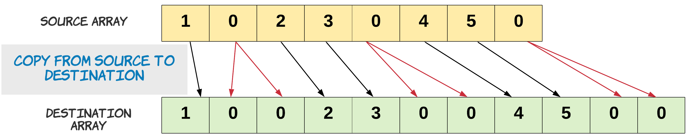
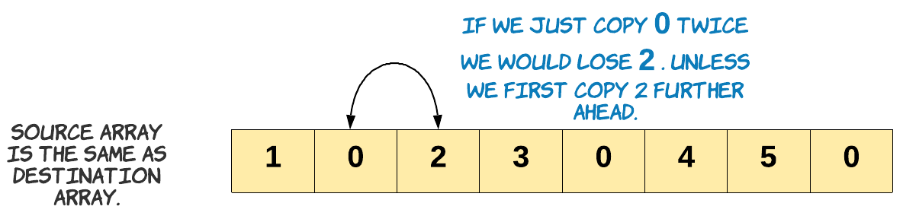
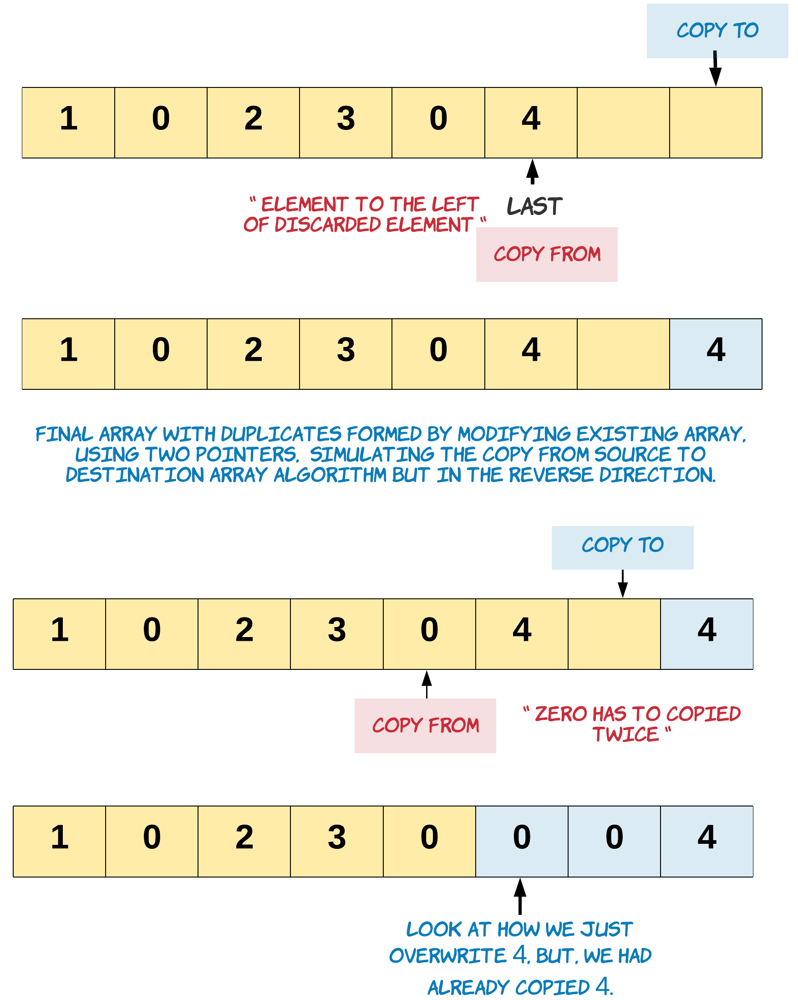

> 原文链接: https://leetcode-cn.com/problems/duplicate-zeros


## 英文原文
<div><p>Given a fixed-length integer array <code>arr</code>, duplicate each occurrence of zero, shifting the remaining elements to the right.</p>

<p><strong>Note</strong> that elements beyond the length of the original array are not written. Do the above modifications to the input array in place and do not return anything.</p>

<p>&nbsp;</p>
<p><strong>Example 1:</strong></p>

<pre>
<strong>Input:</strong> arr = [1,0,2,3,0,4,5,0]
<strong>Output:</strong> [1,0,0,2,3,0,0,4]
<strong>Explanation:</strong> After calling your function, the input array is modified to: [1,0,0,2,3,0,0,4]
</pre>

<p><strong>Example 2:</strong></p>

<pre>
<strong>Input:</strong> arr = [1,2,3]
<strong>Output:</strong> [1,2,3]
<strong>Explanation:</strong> After calling your function, the input array is modified to: [1,2,3]
</pre>

<p>&nbsp;</p>
<p><strong>Constraints:</strong></p>

<ul>
	<li><code>1 &lt;= arr.length &lt;= 10<sup>4</sup></code></li>
	<li><code>0 &lt;= arr[i] &lt;= 9</code></li>
</ul>
</div>

## 中文题目
<div><p>给你一个长度固定的整数数组&nbsp;<code>arr</code>，请你将该数组中出现的每个零都复写一遍，并将其余的元素向右平移。</p>

<p>注意：请不要在超过该数组长度的位置写入元素。</p>

<p>要求：请对输入的数组&nbsp;<strong>就地&nbsp;</strong>进行上述修改，不要从函数返回任何东西。</p>

<p>&nbsp;</p>

<p><strong>示例 1：</strong></p>

<pre><strong>输入：</strong>[1,0,2,3,0,4,5,0]
<strong>输出：</strong>null
<strong>解释：</strong>调用函数后，<strong>输入</strong>的数组将被修改为：[1,0,0,2,3,0,0,4]
</pre>

<p><strong>示例 2：</strong></p>

<pre><strong>输入：</strong>[1,2,3]
<strong>输出：</strong>null
<strong>解释：</strong>调用函数后，<strong>输入</strong>的数组将被修改为：[1,2,3]
</pre>

<p>&nbsp;</p>

<p><strong>提示：</strong></p>

<ol>
	<li><code>1 &lt;= arr.length &lt;= 10000</code></li>
	<li><code>0 &lt;= arr[i] &lt;= 9</code></li>
</ol>
</div>

## 通过代码
<RecoDemo>
</RecoDemo>


## 官方题解
该问题要求在原数组上直接修改。如果没有该限制条件，可以把元素直接从原数组复制到目标数组。

{:width=480}


注意：如何把零复制两次。

```python [snippet1-Python]
  s = 0
  d = 0

  # Copy is performed until the destination array is full.
  for s in range(N):
    if source[s] == 0:
      # Copy zero twice.
      destination[d] = 0
      d += 1
      destination[d] = 0
    else:
      destination[d] = source[s]

    d += 1
```

题目中还要求不能增加原数组的长度，这意味着在复写零之后，数组末尾一些元素的新索引超出了数组长度，会被丢弃。

{:width=480}

由于不能使用额外空间，因此原数组和目标数组是同一个，不能将原数组复制到目标数组。因此，只能直接在原数组上重写。

{:width=480}


#### 方法一：两次遍历，$O(1)$ 的空间复杂度

**思路**

如果知道数组末尾有多少个元素被丢弃，就可以复制其他元素。丢弃的元素数量等于在原数组中添加的零的数量。通过向数组中添加零，将数组末尾的元素丢弃。

只要知道原始数组找中有多少个元素留下来，就可以从留下来元素的末尾开始复制。从末尾复制可以确保不会丢弃任何元素，因为只有末尾之后的元素才会被丢弃。

**算法**

1. 计算需要复写零的数量 `possible_dups`。需要注意的是，这里不是计算所有的零，一部分零可能因为在数组末尾被丢弃而不参与复写。`possible_dups` 的值等于复写零的数量，也等于被丢弃元素的数量。因此 `length_possible_dups` 也是目标数组的一部分。

    {:width=480}

    注意：上图显示原数组和目标数组是为了便于理解，实际上只在一个数组中执行操作。

2. 处理剩余元素边界上零的情况。

    在剩余元素中复写零的时候，需要注意边界上零的情况。如果数组有剩余空间，这个零应该被当做复写；如果没有剩余项，这个零不能被复写。即如果它是 `possible_dups` 的一部分，则复写；否则不复写。

    > 一个边界零情况的例子：[8,4,5,0,0,0,0,7]。
    该数组中，第一个和第二个出现的零可以被复写。由于空间不足，第三个零不能被复写。
    在复写零时，需确保第三个零不被复写，复写结果为：[8,4,5,0,`0`,0,`0`,0]。

3. 从末尾迭代数组，遇到非零元素直接向后移动，遇到零需要复制和移动。从丢弃元素的左侧开始向左迭代，不断向右移动，为复写的零腾出空间。

{:width=480}

```java [solution1-Java]
class Solution {
    public void duplicateZeros(int[] arr) {
        int possibleDups = 0;
        int length_ = arr.length - 1;

        // Find the number of zeros to be duplicated
        // Stopping when left points beyond the last element in the original array
        // which would be part of the modified array
        for (int left = 0; left <= length_ - possibleDups; left++) {

            // Count the zeros
            if (arr[left] == 0) {

                // Edge case: This zero can't be duplicated. We have no more space,
                // as left is pointing to the last element which could be included  
                if (left == length_ - possibleDups) {
                    // For this zero we just copy it without duplication.
                    arr[length_] = 0;
                    length_ -= 1;
                    break;
                }
                possibleDups++;
            }
        }

        // Start backwards from the last element which would be part of new array.
        int last = length_ - possibleDups;

        // Copy zero twice, and non zero once.
        for (int i = last; i >= 0; i--) {
            if (arr[i] == 0) {
                arr[i + possibleDups] = 0;
                possibleDups--;
                arr[i + possibleDups] = 0;
            } else {
                arr[i + possibleDups] = arr[i];
            }
        }
    }
}
```

```python [solution1-Python]
class Solution:
    def duplicateZeros(self, arr: List[int]) -> None:
        """
        Do not return anything, modify arr in-place instead.
        """

        possible_dups = 0
        length_ = len(arr) - 1

        # Find the number of zeros to be duplicated
        for left in range(length_ + 1):

            # Stop when left points beyond the last element in the original list
            # which would be part of the modified list
            if left > length_ - possible_dups:
                break

            # Count the zeros
            if arr[left] == 0:
                # Edge case: This zero can't be duplicated. We have no more space,
                # as left is pointing to the last element which could be included  
                if left == length_ - possible_dups:
                    arr[length_] = 0 # For this zero we just copy it without duplication.
                    length_ -= 1
                    break
                possible_dups += 1

        # Start backwards from the last element which would be part of new list.
        last = length_ - possible_dups

        # Copy zero twice, and non zero once.
        for i in range(last, -1, -1):
            if arr[i] == 0:
                arr[i + possible_dups] = 0
                possible_dups -= 1
                arr[i + possible_dups] = 0
            else:
                arr[i + possible_dups] = arr[i]
```

**复杂度分析**

* 时间复杂度：$O(N)$，其中 $N$ 是元素个数。遍历两次数组，第一次计算 `possible_dups`，第二次复制元素。最坏情况下，数组中的零非常少或者没有零，需要遍历整个数组。

* 空间复杂度：$O(1)$，不使用额外空间。

## 统计信息
| 通过次数 | 提交次数 | AC比率 |
| :------: | :------: | :------: |
|    20228    |    34591    |   58.5%   |

## 提交历史
| 提交时间 | 提交结果 | 执行时间 |  内存消耗  | 语言 |
| :------: | :------: | :------: | :--------: | :--------: |
