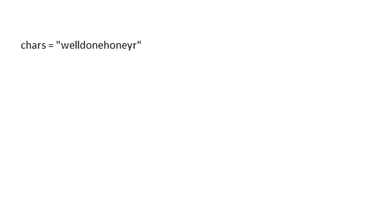

> 原文链接: https://leetcode-cn.com/problems/find-words-that-can-be-formed-by-characters


## 英文原文
<div><p>You are given an array of strings <code>words</code> and a string <code>chars</code>.</p>

<p>A string is <strong>good</strong> if it can be formed by characters from chars (each character can only be used once).</p>

<p>Return <em>the sum of lengths of all good strings in words</em>.</p>

<p>&nbsp;</p>
<p><strong>Example 1:</strong></p>

<pre>
<strong>Input:</strong> words = [&quot;cat&quot;,&quot;bt&quot;,&quot;hat&quot;,&quot;tree&quot;], chars = &quot;atach&quot;
<strong>Output:</strong> 6
<strong>Explanation:</strong> The strings that can be formed are &quot;cat&quot; and &quot;hat&quot; so the answer is 3 + 3 = 6.
</pre>

<p><strong>Example 2:</strong></p>

<pre>
<strong>Input:</strong> words = [&quot;hello&quot;,&quot;world&quot;,&quot;leetcode&quot;], chars = &quot;welldonehoneyr&quot;
<strong>Output:</strong> 10
<strong>Explanation:</strong> The strings that can be formed are &quot;hello&quot; and &quot;world&quot; so the answer is 5 + 5 = 10.
</pre>

<p>&nbsp;</p>
<p><strong>Constraints:</strong></p>

<ul>
	<li><code>1 &lt;= words.length &lt;= 1000</code></li>
	<li><code>1 &lt;= words[i].length, chars.length &lt;= 100</code></li>
	<li><code>words[i]</code> and <code>chars</code> consist of lowercase English letters.</li>
</ul>
</div>

## 中文题目
<div><p>给你一份『词汇表』（字符串数组）&nbsp;<code>words</code>&nbsp;和一张『字母表』（字符串）&nbsp;<code>chars</code>。</p>

<p>假如你可以用&nbsp;<code>chars</code>&nbsp;中的『字母』（字符）拼写出 <code>words</code>&nbsp;中的某个『单词』（字符串），那么我们就认为你掌握了这个单词。</p>

<p>注意：每次拼写（指拼写词汇表中的一个单词）时，<code>chars</code> 中的每个字母都只能用一次。</p>

<p>返回词汇表&nbsp;<code>words</code>&nbsp;中你掌握的所有单词的 <strong>长度之和</strong>。</p>

<p>&nbsp;</p>

<p><strong>示例 1：</strong></p>

<pre><strong>输入：</strong>words = [&quot;cat&quot;,&quot;bt&quot;,&quot;hat&quot;,&quot;tree&quot;], chars = &quot;atach&quot;
<strong>输出：</strong>6
<strong>解释： </strong>
可以形成字符串 &quot;cat&quot; 和 &quot;hat&quot;，所以答案是 3 + 3 = 6。
</pre>

<p><strong>示例 2：</strong></p>

<pre><strong>输入：</strong>words = [&quot;hello&quot;,&quot;world&quot;,&quot;leetcode&quot;], chars = &quot;welldonehoneyr&quot;
<strong>输出：</strong>10
<strong>解释：</strong>
可以形成字符串 &quot;hello&quot; 和 &quot;world&quot;，所以答案是 5 + 5 = 10。
</pre>

<p>&nbsp;</p>

<p><strong>提示：</strong></p>

<ol>
	<li><code>1 &lt;= words.length &lt;= 1000</code></li>
	<li><code>1 &lt;= words[i].length, chars.length&nbsp;&lt;= 100</code></li>
	<li>所有字符串中都仅包含小写英文字母</li>
</ol>
</div>

## 通过代码
<RecoDemo>
</RecoDemo>


## 高赞题解
#### 解题思路：

直接统计字母表 `chars` 中每个字母出现的次数，然后检查词汇表 `words` 中的每个单词，如果该单词中每个字母出现的次数都小于等于词汇表中对应字母出现的次数，就将该单词长度加入答案中。

#### 图解：



#### 代码：

```python [-python]
class Solution:
    def countCharacters(self, words: List[str], chars: str) -> int:
        ans = 0
        cnt = collections.Counter(chars)
        for w in words:
            c = collections.Counter(w)
            if all([c[i] <= cnt[i] for i in c]):
                ans += len(w)
        return ans
```


## 统计信息
| 通过次数 | 提交次数 | AC比率 |
| :------: | :------: | :------: |
|    60632    |    88247    |   68.7%   |

## 提交历史
| 提交时间 | 提交结果 | 执行时间 |  内存消耗  | 语言 |
| :------: | :------: | :------: | :--------: | :--------: |
