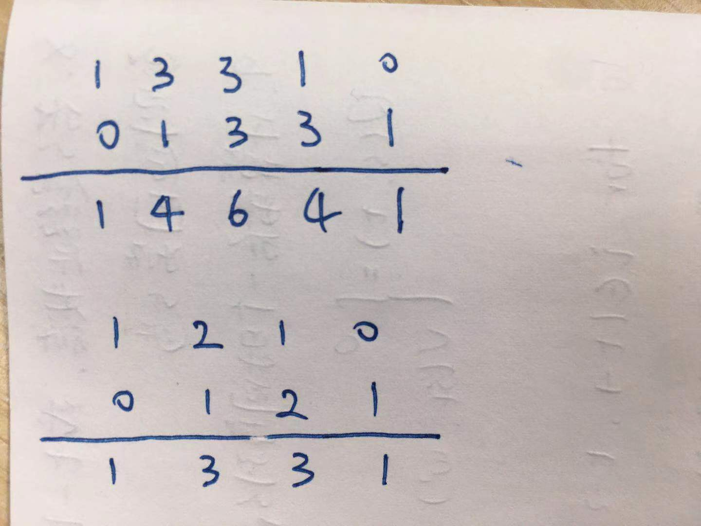

> 原文链接: https://leetcode-cn.com/problems/pascals-triangle


## 英文原文
<div><p>Given an integer <code>numRows</code>, return the first numRows of <strong>Pascal&#39;s triangle</strong>.</p>

<p>In <strong>Pascal&#39;s triangle</strong>, each number is the sum of the two numbers directly above it as shown:</p>

<p>&nbsp;</p>
<p><strong>Example 1:</strong></p>
<pre><strong>Input:</strong> numRows = 5
<strong>Output:</strong> [[1],[1,1],[1,2,1],[1,3,3,1],[1,4,6,4,1]]
</pre><p><strong>Example 2:</strong></p>
<pre><strong>Input:</strong> numRows = 1
<strong>Output:</strong> [[1]]
</pre>
<p>&nbsp;</p>
<p><strong>Constraints:</strong></p>

<ul>
	<li><code>1 &lt;= numRows &lt;= 30</code></li>
</ul>
</div>

## 中文题目
<div><p>给定一个非负整数 <em><code>numRows</code>，</em>生成「杨辉三角」的前 <em><code>numRows</code> </em>行。</p>

<p><small>在「杨辉三角」中，每个数是它左上方和右上方的数的和。</small></p>

<p></p>

<p> </p>

<p><strong>示例 1:</strong></p>

<pre>
<strong>输入:</strong> numRows = 5
<strong>输出:</strong> [[1],[1,1],[1,2,1],[1,3,3,1],[1,4,6,4,1]]
</pre>

<p><strong>示例 2:</strong></p>

<pre>
<strong>输入:</strong> numRows = 1
<strong>输出:</strong> [[1]]
</pre>

<p> </p>

<p><strong>提示:</strong></p>

<ul>
	<li><code>1 <= numRows <= 30</code></li>
</ul>
</div>

## 通过代码
<RecoDemo>
</RecoDemo>


## 高赞题解
### 解题思路
观察一下规律，发现当前一行只比上一行多了一个元素，最最关键的一点：本行元素等于上一行元素往后错一位再逐个相加：

{:width="300px"}{:align="center”} 

因此我们只要对最后一行单独处理：最后一行首、尾分别添加一个零然后对应位置求和就可以得到新的一行，思路上比较清晰，占用的时间、空间复杂度也都还挺好＜(▰˘◡˘▰)

### 代码

```Python3 []
class Solution:
    def generate(self, numRows: int) -> List[List[int]]:
        if numRows == 0: return []
        res = [[1]]
        while len(res) < numRows:
            newRow = [a+b for a, b in zip([0]+res[-1], res[-1]+[0])]
            res.append(newRow)      
        return res
```

## 统计信息
| 通过次数 | 提交次数 | AC比率 |
| :------: | :------: | :------: |
|    237744    |    323212    |   73.6%   |

## 提交历史
| 提交时间 | 提交结果 | 执行时间 |  内存消耗  | 语言 |
| :------: | :------: | :------: | :--------: | :--------: |


## 相似题目
|                             题目                             | 难度 |
| :----------------------------------------------------------: | :---------: |
| [杨辉三角 II](https://leetcode-cn.com/problems/pascals-triangle-ii/) | 简单|
