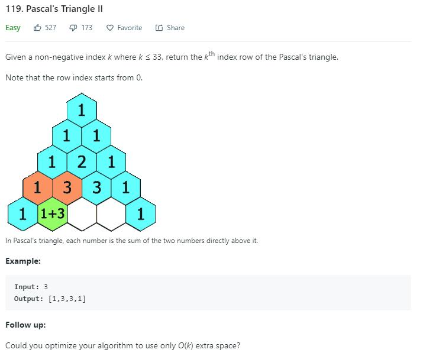

> 原文链接: https://leetcode-cn.com/problems/pascals-triangle-ii


## 英文原文
<div><p>Given an integer <code>rowIndex</code>, return the <code>rowIndex<sup>th</sup></code> (<strong>0-indexed</strong>) row of the <strong>Pascal&#39;s triangle</strong>.</p>

<p>In <strong>Pascal&#39;s triangle</strong>, each number is the sum of the two numbers directly above it as shown:</p>

<p>&nbsp;</p>
<p><strong>Example 1:</strong></p>
<pre><strong>Input:</strong> rowIndex = 3
<strong>Output:</strong> [1,3,3,1]
</pre><p><strong>Example 2:</strong></p>
<pre><strong>Input:</strong> rowIndex = 0
<strong>Output:</strong> [1]
</pre><p><strong>Example 3:</strong></p>
<pre><strong>Input:</strong> rowIndex = 1
<strong>Output:</strong> [1,1]
</pre>
<p>&nbsp;</p>
<p><strong>Constraints:</strong></p>

<ul>
	<li><code>0 &lt;= rowIndex &lt;= 33</code></li>
</ul>

<p>&nbsp;</p>
<p><strong>Follow up:</strong> Could you optimize your algorithm to use only <code>O(rowIndex)</code> extra space?</p>
</div>

## 中文题目
<div><p>给定一个非负索引 <code>rowIndex</code>，返回「杨辉三角」的第 <code>rowIndex</code><em> </em>行。</p>

<p><small>在「杨辉三角」中，每个数是它左上方和右上方的数的和。</small></p>

<p></p>

<p> </p>

<p><strong>示例 1:</strong></p>

<pre>
<strong>输入:</strong> rowIndex = 3
<strong>输出:</strong> [1,3,3,1]
</pre>

<p><strong>示例 2:</strong></p>

<pre>
<strong>输入:</strong> rowIndex = 0
<strong>输出:</strong> [1]
</pre>

<p><strong>示例 3:</strong></p>

<pre>
<strong>输入:</strong> rowIndex = 1
<strong>输出:</strong> [1,1]
</pre>

<p> </p>

<p><strong>提示:</strong></p>

<ul>
	<li><code>0 <= rowIndex <= 33</code></li>
</ul>

<p> </p>

<p><strong>进阶：</strong></p>

<p>你可以优化你的算法到 <code><em>O</em>(<i>rowIndex</i>)</code> 空间复杂度吗？</p>
</div>

## 通过代码
<RecoDemo>
</RecoDemo>


## 高赞题解
# 题目描述（简单难度）





和 [118 题](<https://leetcode.wang/leetcode-118-Pascal%27s-Triangle.html>) 一样，依旧是杨辉三角。区别在于之前是输出所有层的数，这道题只需要输出第 `k` 层的数。


# 解法一


和 [118 题](<https://leetcode.wang/leetcode-118-Pascal%27s-Triangle.html>) 一样，我们只需要一层一层的求。但是不需要把每一层的结果都保存起来，只需要保存上一层的结果，就可以求出当前层的结果了。


```java

public List<Integer> getRow(int rowIndex) {

    List<Integer> pre = new ArrayList<>();

    List<Integer> cur = new ArrayList<>();

    for (int i = 0; i <= rowIndex; i++) {

        cur = new ArrayList<>();

        for (int j = 0; j <= i; j++) {

            if (j == 0 || j == i) {

                cur.add(1);

            } else {

                cur.add(pre.get(j - 1) + pre.get(j));

            } 

        }

        pre = cur;

    }

    return cur;

}

```


参考 [这里](<https://leetcode.com/problems/pascals-triangle-ii/discuss/38420/Here-is-my-brief-O(k)-solution>)，其实我们可以优化一下，我们可以把 `pre` 的 `List` 省去。


这样的话，`cur`每次不去新建 `List`，而是把`cur`当作`pre`。


又因为更新当前`j`的时候，就把之前`j`的信息覆盖掉了。而更新 `j + 1` 的时候又需要之前`j`的信息，所以在更新前，我们需要一个变量把之前`j`的信息保存起来。


```java

public List<Integer> getRow(int rowIndex) {

    int pre = 1;

    List<Integer> cur = new ArrayList<>();

    cur.add(1);

    for (int i = 1; i <= rowIndex; i++) {

        for (int j = 1; j < i; j++) {

            int temp = cur.get(j);

            cur.set(j, pre + cur.get(j));

            pre = temp;

        }

        cur.add(1);

    }

    return cur;

}

```


区别在于我们用了 `set` 函数来修改值，由于当前层比上一层多一个元素，所以对于最后一层的元素如果用 `set` 方法的话会造成越界。此外，每层的第一个元素始终为`1`。基于这两点，我们把之前`j == 0 || j == i`的情况移到了`for`循环外进行处理。


除了上边优化的思路，还有一种想法，那就是倒着进行，这样就不会存在覆盖的情况了。


因为更新完`j`的信息后，虽然把`j`之前的信息覆盖掉了。但是下一次我们更新的是`j - 1`，需要的是`j - 1`和`j - 2` 的信息，`j`信息覆盖就不会造成影响了。


```java

public List<Integer> getRow(int rowIndex) {

    int pre = 1;

    List<Integer> cur = new ArrayList<>();

    cur.add(1);

    for (int i = 1; i <= rowIndex; i++) {

        for (int j = i - 1; j > 0; j--) {

            cur.set(j, cur.get(j - 1) + cur.get(j));

        }

        cur.add(1);//补上每层的最后一个 1 

    }

    return cur;

}

```


# 解法二 公式法


如果熟悉杨辉三角，应该记得杨辉三角其实可以看做由组合数构成。


根据组合数的公式，将`(n-k)!`约掉，化简就是下边的结果。


$$C^k_n = n!/(k!(n-k)!) = (n*(n-1)*(n-2)*...(n-k+1))/k!$$


然后我们就可以利用组合数解决这道题。


```java

public List<Integer> getRow(int rowIndex) {

    List<Integer> ans = new ArrayList<>();

    int N = rowIndex;

    for (int k = 0; k <= N; k++) {

        ans.add(Combination(N, k));

    }

    return ans;

}


private int Combination(int N, int k) {

    long res = 1;

    for (int i = 1; i <= k; i++)

        res = res * (N - k + i) / i;

    return (int) res;

}

```


参考 [这里](<https://leetcode.com/problems/pascals-triangle-ii/discuss/38513/My-clean-O(k)-java-solution>)，我们可以优化一下。


上边的算法对于每个组合数我们都重新求了一遍，但事实上前后的组合数其实是有联系的。


$$C_n^k=C_n^{k-1}\times(n-k+1)/k $$


代码的话，我们只需要用`pre`变量保存上一次的组合数结果。计算过程中，可能越界，所以用到了`long`。


```java

public List<Integer> getRow(int rowIndex) {

    List<Integer> ans = new ArrayList<>();

    int N = rowIndex;

    long pre = 1;

    ans.add(1);

    for (int k = 1; k <= N; k++) {

        long cur = pre * (N - k + 1) / k;

        ans.add((int) cur);

        pre = cur;

    }

    return ans;

}

```


# 总


这道题其实还是比较简单的，只是优化的两种方法是比较常用的，一种就是用`pre`变量将要被覆盖的变量存起来，另一种就是倒着进行。另外求组合数的时候，要防止`int`的溢出。


之前自己在博客总结的，更多题解可以在原地址 [https://leetcode.wang](https://leetcode.wang)。

## 统计信息
| 通过次数 | 提交次数 | AC比率 |
| :------: | :------: | :------: |
|    158704    |    235992    |   67.2%   |

## 提交历史
| 提交时间 | 提交结果 | 执行时间 |  内存消耗  | 语言 |
| :------: | :------: | :------: | :--------: | :--------: |


## 相似题目
|                             题目                             | 难度 |
| :----------------------------------------------------------: | :---------: |
| [杨辉三角](https://leetcode-cn.com/problems/pascals-triangle/) | 简单|
