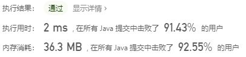
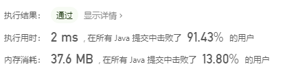

> 原文链接: https://leetcode-cn.com/problems/unique-number-of-occurrences


## 英文原文
<div><p>Given an array of integers <code>arr</code>, return <code>true</code> if the number of occurrences of each value in the array is <strong>unique</strong>, or <code>false</code> otherwise.</p>

<p>&nbsp;</p>
<p><strong>Example 1:</strong></p>

<pre>
<strong>Input:</strong> arr = [1,2,2,1,1,3]
<strong>Output:</strong> true
<strong>Explanation:</strong>&nbsp;The value 1 has 3 occurrences, 2 has 2 and 3 has 1. No two values have the same number of occurrences.</pre>

<p><strong>Example 2:</strong></p>

<pre>
<strong>Input:</strong> arr = [1,2]
<strong>Output:</strong> false
</pre>

<p><strong>Example 3:</strong></p>

<pre>
<strong>Input:</strong> arr = [-3,0,1,-3,1,1,1,-3,10,0]
<strong>Output:</strong> true
</pre>

<p>&nbsp;</p>
<p><strong>Constraints:</strong></p>

<ul>
	<li><code>1 &lt;= arr.length&nbsp;&lt;= 1000</code></li>
	<li><code>-1000 &lt;= arr[i] &lt;= 1000</code></li>
</ul>
</div>

## 中文题目
<div><p>给你一个整数数组&nbsp;<code>arr</code>，请你帮忙统计数组中每个数的出现次数。</p>

<p>如果每个数的出现次数都是独一无二的，就返回&nbsp;<code>true</code>；否则返回 <code>false</code>。</p>

<p>&nbsp;</p>

<p><strong>示例 1：</strong></p>

<pre><strong>输入：</strong>arr = [1,2,2,1,1,3]
<strong>输出：</strong>true
<strong>解释：</strong>在该数组中，1 出现了 3 次，2 出现了 2 次，3 只出现了 1 次。没有两个数的出现次数相同。</pre>

<p><strong>示例 2：</strong></p>

<pre><strong>输入：</strong>arr = [1,2]
<strong>输出：</strong>false
</pre>

<p><strong>示例 3：</strong></p>

<pre><strong>输入：</strong>arr = [-3,0,1,-3,1,1,1,-3,10,0]
<strong>输出：</strong>true
</pre>

<p>&nbsp;</p>

<p><strong>提示：</strong></p>

<ul>
	<li><code>1 &lt;= arr.length&nbsp;&lt;= 1000</code></li>
	<li><code>-1000 &lt;= arr[i] &lt;= 1000</code></li>
</ul>
</div>

## 通过代码
<RecoDemo>
</RecoDemo>


## 高赞题解

### 1，先计算每个数出现的次数，再存放到集合set中，判断长度
第一步都是要先计算每个数出现的次数。后面的只需要判断这个出现次数的数组中元素是否有重复的即可。

我们知道集合set是不能有重复元素的，如果有就会替换掉，我们可以把出现次数的数组放到集合set中，如果有重复的就会被替换掉，那么set的大小肯定和出现次数的数组长度不一样。否则如果没有重复的，他们的长度肯定是一样的，看下代码

```
    public boolean uniqueOccurrences(int[] arr) {
        Map<Integer, Integer> map = new HashMap<>();
        for (int i = 0; i < arr.length; i++) {
            map.put(arr[i], map.getOrDefault(arr[i], 0) + 1);
        }
        return map.size() == new HashSet<>(map.values()).size();
    }
```
再来看下运行结果



<br>

### 2，先计算每个数出现的次数，再逐步存放到集合中，判断是否存放成功
在set集合中如果有相同的元素，就会存储失败，返回false，每次存储的时候我们只要判断是否存储成功即可，代码如下
```
    public boolean uniqueOccurrences(int[] arr) {
        Map<Integer, Integer> map = new HashMap<>();
        for (int i = 0; i < arr.length; i++) {
            map.put(arr[i], map.getOrDefault(arr[i], 0) + 1);
        }
        Set<Integer> set = new HashSet<>();
        for (int value : map.values()) {
            if (!set.add(value))//如果存储失败，说明有重复的
                return false;
        }
        return true;
    }
```
<br>

### 3，使用数组
题中提示中数组的大小和长度都有了限制，所以我们还可以使用数组。

```
    public boolean uniqueOccurrences(int[] arr) {
        int[] count = new int[2001];
        for (int i = 0; i < arr.length; i++) {
            count[1000 + arr[i]]++;
        }
        Set<Integer> set = new HashSet<>();
        for (int value : count) {
            if (value == 0)
                continue;
            if (!set.add(value))//如果存储失败，说明有重复的
                return false;
        }
        return true;
    }
```
看下运行结果


<br>
上面3种方式其实没啥区别，乍一看这题这么简单，我以为会有特殊的解题技巧，想了半天也没想出来，可能就是这么简单吧

<br>
**如果觉得有用就给个赞吧，你的赞是给我最大的鼓励，也是我写作的最大动力**


## 统计信息
| 通过次数 | 提交次数 | AC比率 |
| :------: | :------: | :------: |
|    60890    |    83401    |   73.0%   |

## 提交历史
| 提交时间 | 提交结果 | 执行时间 |  内存消耗  | 语言 |
| :------: | :------: | :------: | :--------: | :--------: |
