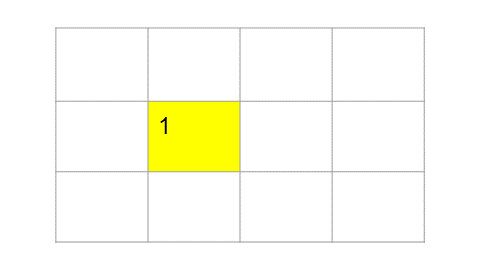
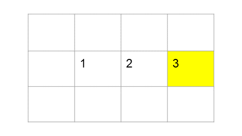
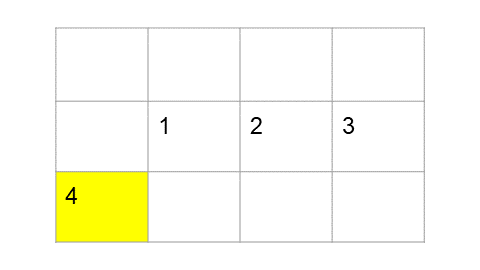
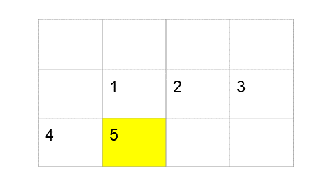
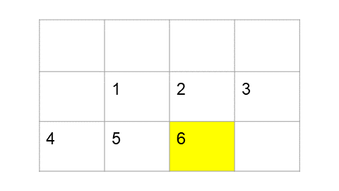
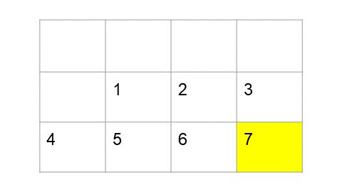
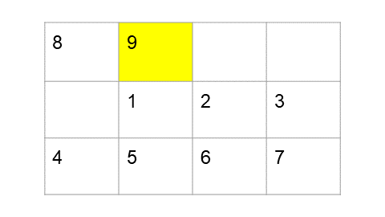
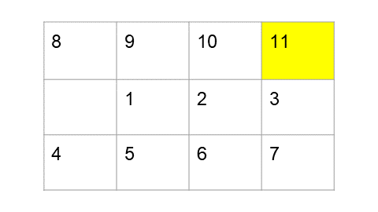
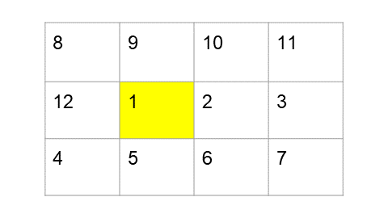
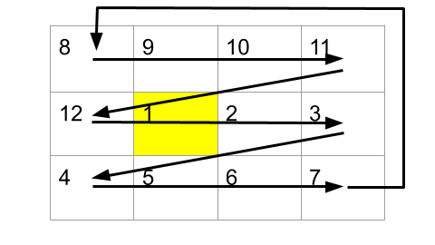

> 原文链接: https://leetcode-cn.com/problems/shift-2d-grid


## 英文原文
<div><p>Given a 2D <code>grid</code> of size <code>m x n</code>&nbsp;and an integer <code>k</code>. You need to shift the <code>grid</code>&nbsp;<code>k</code> times.</p>

<p>In one shift operation:</p>

<ul>
	<li>Element at <code>grid[i][j]</code> moves to <code>grid[i][j + 1]</code>.</li>
	<li>Element at <code>grid[i][n - 1]</code> moves to <code>grid[i + 1][0]</code>.</li>
	<li>Element at <code>grid[m&nbsp;- 1][n - 1]</code> moves to <code>grid[0][0]</code>.</li>
</ul>

<p>Return the <em>2D grid</em> after applying shift operation <code>k</code> times.</p>

<p>&nbsp;</p>
<p><strong>Example 1:</strong></p>

<pre>
<strong>Input:</strong> <code>grid</code> = [[1,2,3],[4,5,6],[7,8,9]], k = 1
<strong>Output:</strong> [[9,1,2],[3,4,5],[6,7,8]]
</pre>

<p><strong>Example 2:</strong></p>

<pre>
<strong>Input:</strong> <code>grid</code> = [[3,8,1,9],[19,7,2,5],[4,6,11,10],[12,0,21,13]], k = 4
<strong>Output:</strong> [[12,0,21,13],[3,8,1,9],[19,7,2,5],[4,6,11,10]]
</pre>

<p><strong>Example 3:</strong></p>

<pre>
<strong>Input:</strong> <code>grid</code> = [[1,2,3],[4,5,6],[7,8,9]], k = 9
<strong>Output:</strong> [[1,2,3],[4,5,6],[7,8,9]]
</pre>

<p>&nbsp;</p>
<p><strong>Constraints:</strong></p>

<ul>
	<li><code>m ==&nbsp;grid.length</code></li>
	<li><code>n ==&nbsp;grid[i].length</code></li>
	<li><code>1 &lt;= m &lt;= 50</code></li>
	<li><code>1 &lt;= n &lt;= 50</code></li>
	<li><code>-1000 &lt;= grid[i][j] &lt;= 1000</code></li>
	<li><code>0 &lt;= k &lt;= 100</code></li>
</ul>
</div>

## 中文题目
<div><p>给你一个 <code>m</code> 行 <code>n</code> 列的二维网格 <code>grid</code> 和一个整数 <code>k</code>。你需要将 <code>grid</code> 迁移 <code>k</code> 次。</p>

<p>每次「迁移」操作将会引发下述活动：</p>

<ul>
	<li>位于 <code>grid[i][j]</code> 的元素将会移动到 <code>grid[i][j + 1]</code>。</li>
	<li>位于 <code>grid[i][n - 1]</code> 的元素将会移动到 <code>grid[i + 1][0]</code>。</li>
	<li>位于 <code>grid[m - 1][n - 1]</code> 的元素将会移动到 <code>grid[0][0]</code>。</li>
</ul>

<p>请你返回 <code>k</code> 次迁移操作后最终得到的 <strong>二维网格</strong>。</p>

<p> </p>

<p><strong>示例 1：</strong></p>

<p></p>

<pre>
<code><strong>输入：</strong>grid</code> = [[1,2,3],[4,5,6],[7,8,9]], k = 1
<strong>输出：</strong>[[9,1,2],[3,4,5],[6,7,8]]
</pre>

<p><strong>示例 2：</strong></p>

<p></p>

<pre>
<code><strong>输入：</strong>grid</code> = [[3,8,1,9],[19,7,2,5],[4,6,11,10],[12,0,21,13]], k = 4
<strong>输出：</strong>[[12,0,21,13],[3,8,1,9],[19,7,2,5],[4,6,11,10]]
</pre>

<p><strong>示例 3：</strong></p>

<pre>
<code><strong>输入：</strong>grid</code> = [[1,2,3],[4,5,6],[7,8,9]], k = 9
<strong>输出：</strong>[[1,2,3],[4,5,6],[7,8,9]]
</pre>

<p> </p>

<p><strong>提示：</strong></p>

<ul>
	<li><code>m == grid.length</code></li>
	<li><code>n == grid[i].length</code></li>
	<li><code>1 <= m <= 50</code></li>
	<li><code>1 <= n <= 50</code></li>
	<li><code>-1000 <= grid[i][j] <= 1000</code></li>
	<li><code>0 <= k <= 100</code></li>
</ul>
</div>

## 通过代码
<RecoDemo>
</RecoDemo>


## 官方题解
#### 方法一：模拟

**思路**

重复 $k$ 次迁移操作。

**算法**

迁移过程一共有 3 种情况。为了确保理解正确，下面使用  3 张图说明每种情况。

*元素 grid[i][j] 迁移到 grid[i][j + 1]。*


*元素 grid[i][n - 1] 迁移到 grid[i + 1][0]。*


*元素 grid[m - 1][n - 1] 迁移到 grid[0][0]。*


按照以上规则迁移 $k$ 次。创建一个二维数组用于完成迁移。在 Java 中，迁移完成后需要将二维数组转换为二维列表。

```java [solution1-Java]
class Solution {
    public List<List<Integer>> shiftGrid(int[][] grid, int k) {

        // Repeat the transform k times.
        for (;k > 0; k--) {
            // We'll write the transform into a new 2D array.
            int[][] newGrid = new int[grid.length][grid[0].length];

            // Case #1: Move everything not in the last column.
            for (int row = 0; row < grid.length; row++) {
                for (int col = 0; col < grid[0].length - 1; col++) {
                    newGrid[row][col + 1] = grid[row][col];
                }
            }

            // Case #2: Move everything in last column, but not last row.
            for (int row = 0; row < grid.length - 1; row++) {
                newGrid[row + 1][0] = grid[row][grid[0].length - 1];
            }

            // Case #3: Move the bottom right.
            newGrid[0][0] = grid[grid.length - 1][grid[0].length - 1];

            // Update grid to be the transformed grid.
            grid = newGrid;
        }

        // Copy the grid into a list for returning.
        List<List<Integer>> result = new ArrayList<>();
        for (int[] row : grid) {
            List<Integer> listRow = new ArrayList<>();
            result.add(listRow);
            for (int v : row) listRow.add(v);
        }

        return result;
    }
}
```

```python [solution1-Python]
def shiftGrid(self, grid: List[List[int]], k: int) -> List[List[int]]:

    num_rows, num_cols = len(grid), len(grid[0])

    for _ in range(k):
        # Create a new grid to copy into.
        new_grid = [[0] * num_cols for _ in range(num_rows)]

        # Case 1: Move everything not in the last column.
        for row in range(num_rows):
            for col in range(num_cols - 1):
                new_grid[row][col + 1] = grid[row][col]

        # Case 2: Move everything in last column, but not last row.
        for row in range(num_rows - 1):
             new_grid[row + 1][0] = grid[row][num_cols - 1]

        # Case 3: Move the bottom right.
        new_grid[0][0] = grid[num_rows - 1][num_cols - 1]

        grid = new_grid

    return grid
```

**复杂度分析**

* 时间复杂度：$O(n \cdot m \cdot k)$，其中 $n \cdot m$ 是元素数量，共迁移 $k$ 次。

* 空间复杂度：$O(n \cdot m)$。每次迁移时需要创建一个新数组。


#### 方法二：模拟+原地迁移

**思路**

方法一创建了 `k` 个新数组，本方法简化了该过程，在原地迁移。首先了解单个元素在数组中的移动，这是解决二维数组移动的基本策略。下面动画中黄色表示当前位置，数字表示移动的距离。

<,,,,,,,,,,,,>

这是一个简单的移动模式。按照箭头顺序移动，到达右下角后，再绕回左上角。



通过将每个值重复向前移动模拟迁移过程。

**算法**

每一步都需要跟踪当前迁移值。在 Java 中，最后需要将输出复制到二维列表中操作。如果想在自己的代码中实现原地操作，可以设置相同的输入和输出类型。

```java [solution2-Java]
class Solution {
    public List<List<Integer>> shiftGrid(int[][] grid, int k) {

        // Repeat the transform k times.
        for (;k > 0; k--) {

            int previous = grid[grid.length - 1][grid[0].length - 1];
            for (int row = 0; row < grid.length; row++) {
                for (int col = 0; col < grid[0].length; col++) {
                    int temp = grid[row][col];
                    grid[row][col] = previous;
                    previous = temp;
                }
            }
        }

        // Copy the grid into a list for returning.
        List<List<Integer>> result = new ArrayList<>();
        for (int[] row : grid) {
            List<Integer> listRow = new ArrayList<>();
            result.add(listRow);
            for (int v : row) listRow.add(v);
        }

        return result;
    }
}
```

```python [solution2-Python]
class Solution:
    def shiftGrid(self, grid: List[List[int]], k: int) -> List[List[int]]:

        num_rows, num_cols = len(grid), len(grid[0])

        for _ in range(k):

            previous = grid[-1][-1]
            for row in range(num_rows):
                for col in range(num_cols):
                    temp = grid[row][col]
                    grid[row][col] = previous
                    previous = temp
        return grid
```

**复杂度分析**

* 时间复杂度：$O(n \cdot m \cdot k)$，其中 $n \cdot m$ 是元素数量，共迁移 $k$ 次。

* 空间复杂度：取决于输入输出类型。在 LeetCode 中，取决于使用的语言。

    * *如果输入输出类型相同* （Python 和 C++）：$O(1)$，不使用额外空间。

    * *如果输入输出类型不同* （Java）：$O(n \cdot m)$。创建大小为 `n x m` 的二维数组。

如果在自己的算法中使用该算法，可以根据需要设置输入输出类型。


#### 方法三：取模运算

**思路**

*注意：该方法使用模运算，这可能是一个“中等”级别的解法。*

如果不熟悉模运算，可以从除法中学习，这与除法的商和余数有关。例如：$127 / 19$ 的商为 $6$，余数为 $13$，因为 $6 * 19 + 13 = 127$。模运算返回的是余数。

该问题要求 $k$ 不大于 $100$。当问题规模如此小时，使用模拟算法没有任何问题。但是如果 $k$ 非常大，或者面试官要求运行时间不能是 $O(k * n * m)$，必须要 $O(n * m)$ 时，就需要进一步优化解法。

二维数组移动的问题上，除了模拟方法，直接计算元素迁移后的新位置更加高效。计算新位置分为两步：

1. 什么是新列？
2. 什么是新行？

通过一个例子说明如何完成两个步骤。在一个三行五列的网格中，位于 $i = 1$ 和 $j = 3$ 处的值，迁移次数 $k = 88$。


*第一步：计算新列数*

$k$ 步迁移后，列值共改变 $k$ 次。每一步，都往前移动一列。

向前移动 $88$ 次时，元素在哪一列？如果网格的列是无限的，最终在第 $3 + 88 = 91$ 列。但是网格不是无限的，则需要考虑“环绕”问题。

**重要的一点是：**每迁移 $5$ 次，元素就会回到原来的列。因此要从 $91$ 中重复减去 $5$，直到最终的结果小于 $5$，这就是模运算工作。它返回重复相减后剩余的值 $91 \% 5 = 1$，且计算方式非常高效。因此，该列的新值为 $0$。

*第二步：计算新行数*

现在需要要确定该元素的新行。行的改变不会像列那么频繁。


下图是行和列都改变的例子。


从最后一列移动到第一列时，行才会移动一次。因此要确定行的新值，需要确定元素从最后一列移动的第一列的次数。

在上面例子中，计算新列使用到了 **余数**，即 $91 % 5 = 1$。计算新行使用的是 **商**，$91$ 除以 $5$ 的商决定了行移动多少次。

计算得 $91 / 5 = 18$（这里是截断除法，和计算机编程语言中一样）。

如果行数是无限的，只需要将行新增数添加到初始行，最终的新行为 $1 + 18 = 19$。

但是，行数肯定不是无限的，因此需要对行执行相同的操作。这个例子中共有 $3$ 行，所以 $19 % 3 = 1$，最终的新行为第 $1$ 行。

上面的例子，共迁移了 $88$ 次，$(1, 3)$ 位置的元素到达 $(1, 0)$。也可以对网格中其他 $14$ 个元素执行相同的操作。

*一般性公式*

归纳出一般性通用公式，可以适用于任何位置，任何迁移次数的情况。

对于列，先计算网格无限的情况下最终的列数，然后取模得到实际列数。公式如下：

```python [snippet1-Python]
new_col = (j + k) % num_cols
```

其中 $j$ 是起始列数，$num\_cols$ 是网格总列数。

行计算比较复杂，需要分为几个步骤。首先计算移动的总行数。然后取模得到实际行数。公式如下：

```python [snippet2-Python]
number_of_increments = (j + k) / num_cols
new_row = (i + number_of_increments) % num_rows
```

```java [solution3-Java]
class Solution {
    public List<List<Integer>> shiftGrid(int[][] grid, int k) {

        int numCols = grid[0].length;
        int numRows = grid.length;

        // Setup the 2d list.
        List<List<Integer>> newGrid = new ArrayList<>();
        for (int row = 0; row < numRows; row++) {
            List<Integer> newRow = new ArrayList<>();
            newGrid.add(newRow);
            for (int col = 0; col < numCols; col++) {
                newRow.add(0);
            }
        }

        for (int row = 0; row < numRows; row++) {
            for (int col = 0; col < numCols; col++) {
                int newCol = (col + k) % numCols;
                int wrapAroundCount = (col + k) / numCols;
                int newRow = (row + wrapAroundCount) % numRows;
                newGrid.get(newRow).set(newCol, grid[row][col]);
            }
        }

        return newGrid;
    }
}
```

```python [solution3-Python]
def shiftGrid(self, grid: List[List[int]], k: int) -> List[List[int]]:
    new_grid = [[0] * len(grid[0]) for _ in range(len(grid))]
    num_rows = len(grid)
    num_cols = len(grid[0])
    for row in range(num_rows):
        for col in range(num_cols):
            new_col = (col + k) % num_cols
            wrap_around_count = (col + k) // num_cols
            new_row = (row + wrap_around_count) % num_rows
            new_grid[new_row][new_col] = grid[row][col]
    return new_grid
```

**复杂度分析**

* 时间复杂度：$O(n \cdot m)$，其中网格数量为 $n \cdot m$。计算每个元素的新位置花费 $O(1)$ 的时间。一般情况下，无法再提高其效率，因为每个元素都要移动。

* 空间复杂度：$O(n \cdot m)$，存储输出二维列表。

## 统计信息
| 通过次数 | 提交次数 | AC比率 |
| :------: | :------: | :------: |
|    13079    |    21672    |   60.3%   |

## 提交历史
| 提交时间 | 提交结果 | 执行时间 |  内存消耗  | 语言 |
| :------: | :------: | :------: | :--------: | :--------: |
