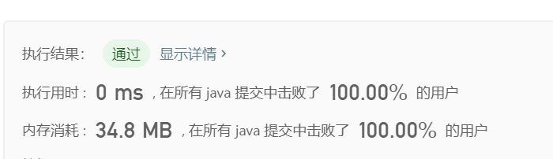

> 原文链接: https://leetcode-cn.com/problems/find-winner-on-a-tic-tac-toe-game


## 英文原文
<div><p><strong>Tic-tac-toe</strong> is played by two players <code>A</code> and <code>B</code> on a <code>3 x 3</code> grid. The rules of Tic-Tac-Toe are:</p>

<ul>
	<li>Players take turns placing characters into empty squares <code>&#39; &#39;</code>.</li>
	<li>The first player <code>A</code> always places <code>&#39;X&#39;</code> characters, while the second player <code>B</code> always places <code>&#39;O&#39;</code> characters.</li>
	<li><code>&#39;X&#39;</code> and <code>&#39;O&#39;</code> characters are always placed into empty squares, never on filled ones.</li>
	<li>The game ends when there are <strong>three</strong> of the same (non-empty) character filling any row, column, or diagonal.</li>
	<li>The game also ends if all squares are non-empty.</li>
	<li>No more moves can be played if the game is over.</li>
</ul>

<p>Given a 2D integer array <code>moves</code> where <code>moves[i] = [row<sub>i</sub>, col<sub>i</sub>]</code> indicates that the <code>i<sup>th</sup></code> move will be played on <code>grid[row<sub>i</sub>][col<sub>i</sub>]</code>. return <em>the winner of the game if it exists</em> (<code>A</code> or <code>B</code>). In case the game ends in a draw return <code>&quot;Draw&quot;</code>. If there are still movements to play return <code>&quot;Pending&quot;</code>.</p>

<p>You can assume that <code>moves</code> is valid (i.e., it follows the rules of <strong>Tic-Tac-Toe</strong>), the grid is initially empty, and <code>A</code> will play first.</p>

<p>&nbsp;</p>
<p><strong>Example 1:</strong></p>

<pre>
<strong>Input:</strong> moves = [[0,0],[2,0],[1,1],[2,1],[2,2]]
<strong>Output:</strong> &quot;A&quot;
<strong>Explanation:</strong> A wins, they always play first.
</pre>

<p><strong>Example 2:</strong></p>

<pre>
<strong>Input:</strong> moves = [[0,0],[1,1],[0,1],[0,2],[1,0],[2,0]]
<strong>Output:</strong> &quot;B&quot;
<strong>Explanation:</strong> B wins.
</pre>

<p><strong>Example 3:</strong></p>

<pre>
<strong>Input:</strong> moves = [[0,0],[1,1],[2,0],[1,0],[1,2],[2,1],[0,1],[0,2],[2,2]]
<strong>Output:</strong> &quot;Draw&quot;
<strong>Explanation:</strong> The game ends in a draw since there are no moves to make.
</pre>

<p><strong>Example 4:</strong></p>

<pre>
<strong>Input:</strong> moves = [[0,0],[1,1]]
<strong>Output:</strong> &quot;Pending&quot;
<strong>Explanation:</strong> The game has not finished yet.
</pre>

<p>&nbsp;</p>
<p><strong>Constraints:</strong></p>

<ul>
	<li><code>1 &lt;= moves.length &lt;= 9</code></li>
	<li><code>moves[i].length == 2</code></li>
	<li><code>0 &lt;= row<sub>i</sub>, col<sub>i</sub> &lt;= 2</code></li>
	<li>There are no repeated elements on <code>moves</code>.</li>
	<li><code>moves</code> follow the rules of tic tac toe.</li>
</ul>
</div>

## 中文题目
<div><p><em>A</em> 和&nbsp;<em>B</em>&nbsp;在一个&nbsp;<em>3</em>&nbsp;x&nbsp;<em>3</em>&nbsp;的网格上玩井字棋。</p>

<p>井字棋游戏的规则如下：</p>

<ul>
	<li>玩家轮流将棋子放在空方格 (&quot; &quot;) 上。</li>
	<li>第一个玩家 A 总是用&nbsp;&quot;X&quot; 作为棋子，而第二个玩家 B 总是用 &quot;O&quot; 作为棋子。</li>
	<li>&quot;X&quot; 和 &quot;O&quot; 只能放在空方格中，而不能放在已经被占用的方格上。</li>
	<li>只要有 3 个相同的（非空）棋子排成一条直线（行、列、对角线）时，游戏结束。</li>
	<li>如果所有方块都放满棋子（不为空），游戏也会结束。</li>
	<li>游戏结束后，棋子无法再进行任何移动。</li>
</ul>

<p>给你一个数组 <code>moves</code>，其中每个元素是大小为 <code>2</code> 的另一个数组（元素分别对应网格的行和列），它按照 <em>A</em> 和 <em>B</em> 的行动顺序（先 <em>A</em> 后 <em>B</em>）记录了两人各自的棋子位置。</p>

<p>如果游戏存在获胜者（<em>A</em> 或 <em>B</em>），就返回该游戏的获胜者；如果游戏以平局结束，则返回 &quot;Draw&quot;；如果仍会有行动（游戏未结束），则返回 &quot;Pending&quot;。</p>

<p>你可以假设&nbsp;<code>moves</code>&nbsp;都 <strong>有效</strong>（遵循井字棋规则），网格最初是空的，<em>A</em> 将先行动。</p>

<p>&nbsp;</p>

<p><strong>示例 1：</strong></p>

<pre><strong>输入：</strong>moves = [[0,0],[2,0],[1,1],[2,1],[2,2]]
<strong>输出：</strong>&quot;A&quot;
<strong>解释：</strong>&quot;A&quot; 获胜，他总是先走。
&quot;X  &quot;    &quot;X  &quot;    &quot;X  &quot;    &quot;X  &quot;    &quot;<strong>X</strong>  &quot;
&quot;   &quot; -&gt; &quot;   &quot; -&gt; &quot; X &quot; -&gt; &quot; X &quot; -&gt; &quot; <strong>X</strong> &quot;
&quot;   &quot;    &quot;O  &quot;    &quot;O  &quot;    &quot;OO &quot;    &quot;OO<strong>X</strong>&quot;
</pre>

<p><strong>示例 2：</strong></p>

<pre><strong>输入：</strong>moves = [[0,0],[1,1],[0,1],[0,2],[1,0],[2,0]]
<strong>输出：</strong>&quot;B&quot;
<strong>解释：</strong>&quot;B&quot; 获胜。
&quot;X  &quot;    &quot;X  &quot;    &quot;XX &quot;    &quot;XXO&quot;    &quot;XXO&quot;    &quot;XX<strong>O</strong>&quot;
&quot;   &quot; -&gt; &quot; O &quot; -&gt; &quot; O &quot; -&gt; &quot; O &quot; -&gt; &quot;XO &quot; -&gt; &quot;X<strong>O</strong> &quot; 
&quot;   &quot;    &quot;   &quot;    &quot;   &quot;    &quot;   &quot;    &quot;   &quot;    &quot;<strong>O</strong>  &quot;
</pre>

<p><strong>示例 3：</strong></p>

<pre><strong>输入：</strong>moves = [[0,0],[1,1],[2,0],[1,0],[1,2],[2,1],[0,1],[0,2],[2,2]]
<strong>输出：</strong>&quot;Draw&quot;
<strong>输出：</strong>由于没有办法再行动，游戏以平局结束。
&quot;XXO&quot;
&quot;OOX&quot;
&quot;XOX&quot;
</pre>

<p><strong>示例 4：</strong></p>

<pre><strong>输入：</strong>moves = [[0,0],[1,1]]
<strong>输出：</strong>&quot;Pending&quot;
<strong>解释：</strong>游戏还没有结束。
&quot;X  &quot;
&quot; O &quot;
&quot;   &quot;
</pre>

<p>&nbsp;</p>

<p><strong>提示：</strong></p>

<ul>
	<li><code>1 &lt;= moves.length &lt;= 9</code></li>
	<li><code>moves[i].length == 2</code></li>
	<li><code>0 &lt;= moves[i][j] &lt;= 2</code></li>
	<li><code>moves</code>&nbsp;里没有重复的元素。</li>
	<li><code>moves</code> 遵循井字棋的规则。</li>
</ul>
</div>

## 通过代码
<RecoDemo>
</RecoDemo>


## 高赞题解
#### 1. 题目分析
- 井字棋**总共只有$9$个格子，且赢面是固定的**
- 可以使用一个$9$**位二进制数**代表行走的结果，规定：
    - 井字棋坐标$[i,j]$对应于数字的第$3i+j$位
    - **每走一步棋等价于与对应的位进行(异)或运算**
- 判断游戏结果的方法：
    - **将一方的数字$num$与赢面对应的数字$k$进行与运算，若结果为$k$，此方获胜**
    - 若双方都未获胜：
        - 若总步数为$9$步，则平局($Draw$)
        - 否则，未完成($Pending$)
- (**附1**)赢面数字：
    - 井字棋的赢面**只有$8$种($3$种横+$3$种竖+$2$种对角)**
    - 计算举例：$\{[0,0],[0,1],[0,2]\}$为横的一种赢面，对应的$9$**位二进制数**为$000000111$，即十进制下的$7$
    - 事实上，由对应规则可以得知：
        - $3$种横的赢面数字是**公比为$8$的等比数列**
        - $3$种竖的赢面数字是**公比为$2$的等比数列**
        - 总共**只需要计算出$4$个数字($1$种横+$1$种竖+$2$种对角)**，其余按倍数推导即可
    - 所有赢面数字分别为$7, 56(即7\times 8), 448(即7\times 8^2), 73, 146(即73\times 2), 292(即73\times 2^2), 273, 84$
- (**附2**)我在评论区对使用位运算的思路进行了更细致的阐述，如果有不清楚的地方欢迎移步评论区~

#### 2. Coding
```java
public String tictactoe(int[][] moves) {
    // a, b record the moving results of A, B
    int a = 0, b = 0, len = moves.length;
    // ac records all cases of winning
    int[] ac = {7, 56, 448, 73, 146, 292, 273, 84};
    for(int i = 0; i < len; i ++){
        // if i is add
        if((i & 1) == 1){
            // record the step result
            b ^= 1 << (3 * moves[i][0] + moves[i][1]);
        }
        else {
            a ^= 1 << (3 * moves[i][0] + moves[i][1]);
        }
    }
    for(int i : ac){
        // if the moving result contains the winning case in record, then win
        if((a & i) == i){
            return "A";
        }
        if((b & i) == i){
            return "B";
        }
    }
    // or judge the result by the amount of steps
    return len == 9 ? "Draw" : "Pending";
}
```
时间复杂度$O(m+n)$，空间复杂度$O(m)$**(事实上，此处$m=8,n=9$)**

#### 3. 执行结果



## 统计信息
| 通过次数 | 提交次数 | AC比率 |
| :------: | :------: | :------: |
|    8450    |    15504    |   54.5%   |

## 提交历史
| 提交时间 | 提交结果 | 执行时间 |  内存消耗  | 语言 |
| :------: | :------: | :------: | :--------: | :--------: |
