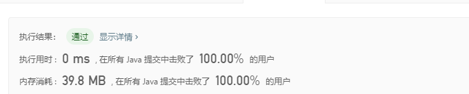

> 原文链接: https://leetcode-cn.com/problems/element-appearing-more-than-25-in-sorted-array


## 英文原文
<div><p>Given an integer array <strong>sorted</strong> in non-decreasing order, there is exactly one integer in the array that occurs more than 25% of the time, return that integer.</p>

<p>&nbsp;</p>
<p><strong>Example 1:</strong></p>

<pre>
<strong>Input:</strong> arr = [1,2,2,6,6,6,6,7,10]
<strong>Output:</strong> 6
</pre>

<p><strong>Example 2:</strong></p>

<pre>
<strong>Input:</strong> arr = [1,1]
<strong>Output:</strong> 1
</pre>

<p>&nbsp;</p>
<p><strong>Constraints:</strong></p>

<ul>
	<li><code>1 &lt;= arr.length &lt;= 10<sup>4</sup></code></li>
	<li><code>0 &lt;= arr[i] &lt;= 10<sup>5</sup></code></li>
</ul>
</div>

## 中文题目
<div><p>给你一个非递减的&nbsp;<strong>有序&nbsp;</strong>整数数组，已知这个数组中恰好有一个整数，它的出现次数超过数组元素总数的 25%。</p>

<p>请你找到并返回这个整数</p>

<p>&nbsp;</p>

<p><strong>示例：</strong></p>

<pre>
<strong>输入：</strong>arr = [1,2,2,6,6,6,6,7,10]
<strong>输出：</strong>6
</pre>

<p>&nbsp;</p>

<p><strong>提示：</strong></p>

<ul>
	<li><code>1 &lt;= arr.length &lt;= 10^4</code></li>
	<li><code>0 &lt;= arr[i] &lt;= 10^5</code></li>
</ul>
</div>

## 通过代码
<RecoDemo>
</RecoDemo>


## 高赞题解
### 解题思路
1. 求出 25% 对应的出现次数threshold
2. 遍历数组
3. 由于是有序数组，只需比较 当前位置 i 值和 i + threshold的值是否相等即可


### 代码

```java
class Solution {
    public int findSpecialInteger(int[] arr) {
        int threshold = arr.length / 4;
        for (int i = 0; i < arr.length; i++) {
            if (arr[i + threshold] == arr[i]) {
                return arr[i];
            }
        }
        return 0;
    }
}
```

## 统计信息
| 通过次数 | 提交次数 | AC比率 |
| :------: | :------: | :------: |
|    16138    |    26825    |   60.2%   |

## 提交历史
| 提交时间 | 提交结果 | 执行时间 |  内存消耗  | 语言 |
| :------: | :------: | :------: | :--------: | :--------: |
