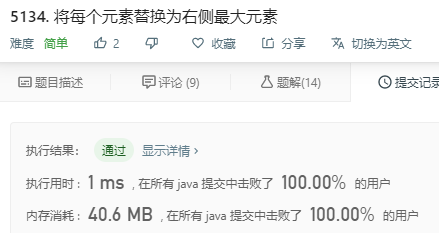

> 原文链接: https://leetcode-cn.com/problems/replace-elements-with-greatest-element-on-right-side


## 英文原文
<div><p>Given an array <code>arr</code>,&nbsp;replace every element in that array with the greatest element among the elements to its&nbsp;right, and replace the last element with <code>-1</code>.</p>

<p>After doing so, return the array.</p>

<p>&nbsp;</p>
<p><strong>Example 1:</strong></p>

<pre>
<strong>Input:</strong> arr = [17,18,5,4,6,1]
<strong>Output:</strong> [18,6,6,6,1,-1]
<strong>Explanation:</strong> 
- index 0 --&gt; the greatest element to the right of index 0 is index 1 (18).
- index 1 --&gt; the greatest element to the right of index 1 is index 4 (6).
- index 2 --&gt; the greatest element to the right of index 2 is index 4 (6).
- index 3 --&gt; the greatest element to the right of index 3 is index 4 (6).
- index 4 --&gt; the greatest element to the right of index 4 is index 5 (1).
- index 5 --&gt; there are no elements to the right of index 5, so we put -1.
</pre>

<p><strong>Example 2:</strong></p>

<pre>
<strong>Input:</strong> arr = [400]
<strong>Output:</strong> [-1]
<strong>Explanation:</strong> There are no elements to the right of index 0.
</pre>

<p>&nbsp;</p>
<p><strong>Constraints:</strong></p>

<ul>
	<li><code>1 &lt;= arr.length &lt;= 10<sup>4</sup></code></li>
	<li><code>1 &lt;= arr[i] &lt;= 10<sup>5</sup></code></li>
</ul>
</div>

## 中文题目
<div><p>给你一个数组 <code>arr</code> ，请你将每个元素用它右边最大的元素替换，如果是最后一个元素，用 <code>-1</code> 替换。</p>

<p>完成所有替换操作后，请你返回这个数组。</p>

<p> </p>

<p><strong>示例 1：</strong></p>

<pre>
<strong>输入：</strong>arr = [17,18,5,4,6,1]
<strong>输出：</strong>[18,6,6,6,1,-1]
<strong>解释：</strong>
- 下标 0 的元素 --> 右侧最大元素是下标 1 的元素 (18)
- 下标 1 的元素 --> 右侧最大元素是下标 4 的元素 (6)
- 下标 2 的元素 --> 右侧最大元素是下标 4 的元素 (6)
- 下标 3 的元素 --> 右侧最大元素是下标 4 的元素 (6)
- 下标 4 的元素 --> 右侧最大元素是下标 5 的元素 (1)
- 下标 5 的元素 --> 右侧没有其他元素，替换为 -1
</pre>

<p><strong>示例 2：</strong></p>

<pre>
<strong>输入：</strong>arr = [400]
<strong>输出：</strong>[-1]
<strong>解释：</strong>下标<strong> </strong>0 的元素右侧没有其他元素。
</pre>

<p> </p>

<p><strong>提示：</strong></p>

<ul>
	<li><code>1 <= arr.length <= 10<sup>4</sup></code></li>
	<li><code>1 <= arr[i] <= 10<sup>5</sup></code></li>
</ul>
</div>

## 通过代码
<RecoDemo>
</RecoDemo>


## 高赞题解


从右往左遍历，先记录右边最大值 rightMax 为最后一个值，向左每次更新 rightMax，使用变量 t 先记住当前 arr[i] 就可以了。
```
class Solution {
    public int[] replaceElements(int[] arr) {
        int rightMax = arr[arr.length - 1];
        arr[arr.length - 1] = -1;
        for (int i = arr.length - 2; i >= 0; i--) {
            int t = arr[i];
            arr[i] = rightMax;
            if (t > rightMax)
                rightMax = t;
        }
        return arr;
    }
}
```


## 统计信息
| 通过次数 | 提交次数 | AC比率 |
| :------: | :------: | :------: |
|    31182    |    39592    |   78.8%   |

## 提交历史
| 提交时间 | 提交结果 | 执行时间 |  内存消耗  | 语言 |
| :------: | :------: | :------: | :--------: | :--------: |
