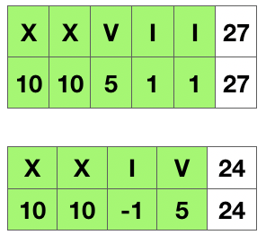

> 原文链接: https://leetcode-cn.com/problems/roman-to-integer


## 英文原文
<div><p>Roman numerals are represented by seven different symbols:&nbsp;<code>I</code>, <code>V</code>, <code>X</code>, <code>L</code>, <code>C</code>, <code>D</code> and <code>M</code>.</p>

<pre>
<strong>Symbol</strong>       <strong>Value</strong>
I             1
V             5
X             10
L             50
C             100
D             500
M             1000</pre>

<p>For example,&nbsp;<code>2</code> is written as <code>II</code>&nbsp;in Roman numeral, just two one&#39;s added together. <code>12</code> is written as&nbsp;<code>XII</code>, which is simply <code>X + II</code>. The number <code>27</code> is written as <code>XXVII</code>, which is <code>XX + V + II</code>.</p>

<p>Roman numerals are usually written largest to smallest from left to right. However, the numeral for four is not <code>IIII</code>. Instead, the number four is written as <code>IV</code>. Because the one is before the five we subtract it making four. The same principle applies to the number nine, which is written as <code>IX</code>. There are six instances where subtraction is used:</p>

<ul>
	<li><code>I</code> can be placed before <code>V</code> (5) and <code>X</code> (10) to make 4 and 9.&nbsp;</li>
	<li><code>X</code> can be placed before <code>L</code> (50) and <code>C</code> (100) to make 40 and 90.&nbsp;</li>
	<li><code>C</code> can be placed before <code>D</code> (500) and <code>M</code> (1000) to make 400 and 900.</li>
</ul>

<p>Given a roman numeral, convert it to an integer.</p>

<p>&nbsp;</p>
<p><strong>Example 1:</strong></p>

<pre>
<strong>Input:</strong> s = &quot;III&quot;
<strong>Output:</strong> 3
</pre>

<p><strong>Example 2:</strong></p>

<pre>
<strong>Input:</strong> s = &quot;IV&quot;
<strong>Output:</strong> 4
</pre>

<p><strong>Example 3:</strong></p>

<pre>
<strong>Input:</strong> s = &quot;IX&quot;
<strong>Output:</strong> 9
</pre>

<p><strong>Example 4:</strong></p>

<pre>
<strong>Input:</strong> s = &quot;LVIII&quot;
<strong>Output:</strong> 58
<strong>Explanation:</strong> L = 50, V= 5, III = 3.
</pre>

<p><strong>Example 5:</strong></p>

<pre>
<strong>Input:</strong> s = &quot;MCMXCIV&quot;
<strong>Output:</strong> 1994
<strong>Explanation:</strong> M = 1000, CM = 900, XC = 90 and IV = 4.
</pre>

<p>&nbsp;</p>
<p><strong>Constraints:</strong></p>

<ul>
	<li><code>1 &lt;= s.length &lt;= 15</code></li>
	<li><code>s</code> contains only&nbsp;the characters <code>(&#39;I&#39;, &#39;V&#39;, &#39;X&#39;, &#39;L&#39;, &#39;C&#39;, &#39;D&#39;, &#39;M&#39;)</code>.</li>
	<li>It is <strong>guaranteed</strong>&nbsp;that <code>s</code> is a valid roman numeral in the range <code>[1, 3999]</code>.</li>
</ul>
</div>

## 中文题目
<div><p>罗马数字包含以下七种字符:&nbsp;<code>I</code>，&nbsp;<code>V</code>，&nbsp;<code>X</code>，&nbsp;<code>L</code>，<code>C</code>，<code>D</code>&nbsp;和&nbsp;<code>M</code>。</p>

<pre>
<strong>字符</strong>          <strong>数值</strong>
I             1
V             5
X             10
L             50
C             100
D             500
M             1000</pre>

<p>例如， 罗马数字 <code>2</code> 写做&nbsp;<code>II</code>&nbsp;，即为两个并列的 1 。<code>12</code> 写做&nbsp;<code>XII</code>&nbsp;，即为&nbsp;<code>X</code>&nbsp;+&nbsp;<code>II</code>&nbsp;。 <code>27</code> 写做&nbsp;&nbsp;<code>XXVII</code>, 即为&nbsp;<code>XX</code>&nbsp;+&nbsp;<code>V</code>&nbsp;+&nbsp;<code>II</code>&nbsp;。</p>

<p>通常情况下，罗马数字中小的数字在大的数字的右边。但也存在特例，例如 4 不写做&nbsp;<code>IIII</code>，而是&nbsp;<code>IV</code>。数字 1 在数字 5 的左边，所表示的数等于大数 5 减小数 1 得到的数值 4 。同样地，数字 9 表示为&nbsp;<code>IX</code>。这个特殊的规则只适用于以下六种情况：</p>

<ul>
	<li><code>I</code>&nbsp;可以放在&nbsp;<code>V</code>&nbsp;(5) 和&nbsp;<code>X</code>&nbsp;(10) 的左边，来表示 4 和 9。</li>
	<li><code>X</code>&nbsp;可以放在&nbsp;<code>L</code>&nbsp;(50) 和&nbsp;<code>C</code>&nbsp;(100) 的左边，来表示 40 和&nbsp;90。&nbsp;</li>
	<li><code>C</code>&nbsp;可以放在&nbsp;<code>D</code>&nbsp;(500) 和&nbsp;<code>M</code>&nbsp;(1000) 的左边，来表示&nbsp;400 和&nbsp;900。</li>
</ul>

<p>给定一个罗马数字，将其转换成整数。</p>

<p>&nbsp;</p>

<p><strong>示例&nbsp;1:</strong></p>

<pre>
<strong>输入:</strong>&nbsp;s = "III"
<strong>输出:</strong> 3</pre>

<p><strong>示例&nbsp;2:</strong></p>

<pre>
<strong>输入:</strong>&nbsp;s = "IV"
<strong>输出:</strong> 4</pre>

<p><strong>示例&nbsp;3:</strong></p>

<pre>
<strong>输入:</strong>&nbsp;s = "IX"
<strong>输出:</strong> 9</pre>

<p><strong>示例&nbsp;4:</strong></p>

<pre>
<strong>输入:</strong>&nbsp;s = "LVIII"
<strong>输出:</strong> 58
<strong>解释:</strong> L = 50, V= 5, III = 3.
</pre>

<p><strong>示例&nbsp;5:</strong></p>

<pre>
<strong>输入:</strong>&nbsp;s = "MCMXCIV"
<strong>输出:</strong> 1994
<strong>解释:</strong> M = 1000, CM = 900, XC = 90, IV = 4.</pre>

<p>&nbsp;</p>

<p><strong>提示：</strong></p>

<ul>
	<li><code>1 &lt;= s.length &lt;= 15</code></li>
	<li><code>s</code> 仅含字符 <code>('I', 'V', 'X', 'L', 'C', 'D', 'M')</code></li>
	<li>题目数据保证 <code>s</code> 是一个有效的罗马数字，且表示整数在范围 <code>[1, 3999]</code> 内</li>
	<li>题目所给测试用例皆符合罗马数字书写规则，不会出现跨位等情况。</li>
	<li>IL 和 IM 这样的例子并不符合题目要求，49 应该写作 XLIX，999 应该写作 CMXCIX 。</li>
	<li>关于罗马数字的详尽书写规则，可以参考 <a href="https://b2b.partcommunity.com/community/knowledge/zh_CN/detail/10753/%E7%BD%97%E9%A9%AC%E6%95%B0%E5%AD%97#knowledge_article">罗马数字 - Mathematics </a>。</li>
</ul>
</div>

## 通过代码
<RecoDemo>
</RecoDemo>


## 高赞题解

> 执行用时 :4 ms, 在所有 java 提交中击败了99.93% 的用户  
> 内存消耗 :36.1 MB, 在所有 java 提交中击败了98.73%的用户  

按照题目的描述，可以总结如下规则：

1. 罗马数字由 `I,V,X,L,C,D,M` 构成；
2. 当小值在大值的左边，则减小值，如 `IV=5-1=4`；
3. 当小值在大值的右边，则加小值，如 `VI=5+1=6`；
4. 由上可知，右值永远为正，因此最后一位必然为正。

一言蔽之，**把一个小值放在大值的左边，就是做减法，否则为加法**。




在代码实现上，可以往后看多一位，对比当前位与后一位的大小关系，从而确定当前位是加还是减法。当没有下一位时，做加法即可。

也可保留当前位的值，当遍历到下一位的时，对比保留值与遍历位的大小关系，再确定保留值为加还是减。最后一位做加法即可。

```Java []
import java.util.*;

class Solution {
    public int romanToInt(String s) {
        int sum = 0;
        int preNum = getValue(s.charAt(0));
        for(int i = 1;i < s.length(); i ++) {
            int num = getValue(s.charAt(i));
            if(preNum < num) {
                sum -= preNum;
            } else {
                sum += preNum;
            }
            preNum = num;
        }
        sum += preNum;
        return sum;
    }
    
    private int getValue(char ch) {
        switch(ch) {
            case 'I': return 1;
            case 'V': return 5;
            case 'X': return 10;
            case 'L': return 50;
            case 'C': return 100;
            case 'D': return 500;
            case 'M': return 1000;
            default: return 0;
        }
    }
}
```

## 统计信息
| 通过次数 | 提交次数 | AC比率 |
| :------: | :------: | :------: |
|    503424    |    798657    |   63.0%   |

## 提交历史
| 提交时间 | 提交结果 | 执行时间 |  内存消耗  | 语言 |
| :------: | :------: | :------: | :--------: | :--------: |


## 相似题目
|                             题目                             | 难度 |
| :----------------------------------------------------------: | :---------: |
| [整数转罗马数字](https://leetcode-cn.com/problems/integer-to-roman/) | 中等|
