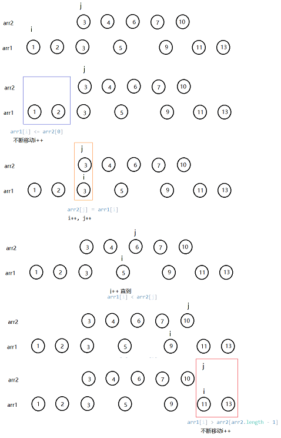

> 原文链接: https://leetcode-cn.com/problems/find-the-distance-value-between-two-arrays


## 英文原文
<div><p>Given two integer arrays <code>arr1</code> and <code>arr2</code>, and the integer <code>d</code>, <em>return the distance value between the two arrays</em>.</p>

<p>The distance value is defined as the number of elements <code>arr1[i]</code> such that there is not any element <code>arr2[j]</code> where <code>|arr1[i]-arr2[j]| &lt;= d</code>.</p>

<p>&nbsp;</p>
<p><strong>Example 1:</strong></p>

<pre>
<strong>Input:</strong> arr1 = [4,5,8], arr2 = [10,9,1,8], d = 2
<strong>Output:</strong> 2
<strong>Explanation:</strong> 
For arr1[0]=4 we have: 
|4-10|=6 &gt; d=2 
|4-9|=5 &gt; d=2 
|4-1|=3 &gt; d=2 
|4-8|=4 &gt; d=2 
For arr1[1]=5 we have: 
|5-10|=5 &gt; d=2 
|5-9|=4 &gt; d=2 
|5-1|=4 &gt; d=2 
|5-8|=3 &gt; d=2
For arr1[2]=8 we have:
<strong>|8-10|=2 &lt;= d=2</strong>
<strong>|8-9|=1 &lt;= d=2</strong>
|8-1|=7 &gt; d=2
<strong>|8-8|=0 &lt;= d=2</strong>
</pre>

<p><strong>Example 2:</strong></p>

<pre>
<strong>Input:</strong> arr1 = [1,4,2,3], arr2 = [-4,-3,6,10,20,30], d = 3
<strong>Output:</strong> 2
</pre>

<p><strong>Example 3:</strong></p>

<pre>
<strong>Input:</strong> arr1 = [2,1,100,3], arr2 = [-5,-2,10,-3,7], d = 6
<strong>Output:</strong> 1
</pre>

<p>&nbsp;</p>
<p><strong>Constraints:</strong></p>

<ul>
	<li><code>1 &lt;= arr1.length, arr2.length &lt;= 500</code></li>
	<li><code>-1000 &lt;= arr1[i], arr2[j] &lt;= 1000</code></li>
	<li><code>0 &lt;= d &lt;= 100</code></li>
</ul>
</div>

## 中文题目
<div><p>给你两个整数数组&nbsp;<code>arr1</code>&nbsp;，&nbsp;<code>arr2</code>&nbsp;和一个整数&nbsp;<code>d</code>&nbsp;，请你返回两个数组之间的&nbsp;<strong>距离值</strong>&nbsp;。</p>

<p>「<strong>距离值</strong>」<strong>&nbsp;</strong>定义为符合此距离要求的元素数目：对于元素&nbsp;<code>arr1[i]</code>&nbsp;，不存在任何元素&nbsp;<code>arr2[j]</code>&nbsp;满足 <code>|arr1[i]-arr2[j]| &lt;= d</code> 。</p>

<p>&nbsp;</p>

<p><strong>示例 1：</strong></p>

<pre><strong>输入：</strong>arr1 = [4,5,8], arr2 = [10,9,1,8], d = 2
<strong>输出：</strong>2
<strong>解释：</strong>
对于 arr1[0]=4 我们有：
|4-10|=6 &gt; d=2 
|4-9|=5 &gt; d=2 
|4-1|=3 &gt; d=2 
|4-8|=4 &gt; d=2 
所以 arr1[0]=4 符合距离要求

对于 arr1[1]=5 我们有：
|5-10|=5 &gt; d=2 
|5-9|=4 &gt; d=2 
|5-1|=4 &gt; d=2 
|5-8|=3 &gt; d=2
所以 arr1[1]=5 也符合距离要求

对于 arr1[2]=8 我们有：
<strong>|8-10|=2 &lt;= d=2</strong>
<strong>|8-9|=1 &lt;= d=2</strong>
|8-1|=7 &gt; d=2
<strong>|8-8|=0 &lt;= d=2</strong>
存在距离小于等于 2 的情况，不符合距离要求 

故而只有 arr1[0]=4 和 arr1[1]=5 两个符合距离要求，距离值为 2</pre>

<p><strong>示例 2：</strong></p>

<pre><strong>输入：</strong>arr1 = [1,4,2,3], arr2 = [-4,-3,6,10,20,30], d = 3
<strong>输出：</strong>2
</pre>

<p><strong>示例 3：</strong></p>

<pre><strong>输入：</strong>arr1 = [2,1,100,3], arr2 = [-5,-2,10,-3,7], d = 6
<strong>输出：</strong>1
</pre>

<p>&nbsp;</p>

<p><strong>提示：</strong></p>

<ul>
	<li><code>1 &lt;= arr1.length, arr2.length &lt;= 500</code></li>
	<li><code>-10^3 &lt;= arr1[i], arr2[j] &lt;= 10^3</code></li>
	<li><code>0 &lt;= d &lt;= 100</code></li>
</ul>
</div>

## 通过代码
<RecoDemo>
</RecoDemo>


## 高赞题解
**更多LeetCode题解请看[题解仓库](https://github.com/ustcyyw/yyw_algorithm),如果觉得还不错请别吝啬你的star~**

### 两种解法


##### 1.运用二分查找


```java

public int findTheDistanceValue(int[] arr1, int[] arr2, int d) {

        Arrays.sort(arr2);

        int hi = arr2.length - 1;

        int count = 0;

        for(int i : arr1){

            int index = binarySearch(arr2, 0, hi, i);

            if(index == 0){

                if(Math.abs(arr2[index] - i) > d)

                    count++;

            } else if(index == hi + 1) {

                if(Math.abs(arr2[hi] - i) > d)

                    count++;

            } else {

                if(Math.abs(arr2[index] - i) > d && Math.abs(arr2[index - 1] - i) > d)

                    count++;

            }

        }

        return count;

    }


    private int binarySearch(int[] arr, int lo, int hi, int target){

        while(lo <= hi){

            int mid = (hi - lo) / 2 + lo;

            if(arr[mid] < target) lo = mid + 1;

            else if(arr[mid] > target) hi = mid - 1;

            else return mid;

        }

        return lo;

    }

```


思路分析：


* 题目要求：对于元素 `arr1[i]` ，不存在任何元素` arr2[j]` 满足 `|arr1[i]-arr2[j]| <= d `。对于`arr1[i]`要满足这个要求不需要将所有的`arr2`中的元素遍历然后都计算`|arr1[i]-arr2[j]|`，只需要保证与`arr1[i]`最接近的一个元素使得`|arr1[i]-arr2[j]| > d `即可。这样可以减少很多无价值的计算。

* 所以问题就变为怎么在`arr2`中找和`arr1[i]`最接近的元素。看着这个描述，就很像二分查找某个元素。但是这里`arr2`不是有序的，我们先将其排序。

    * 如果`arr2`中存在`arr1[i]`，那么二分查找到的元素就是他本身。

    * 如果`arr2`中不存在`arr1[i]`，那么二分查找到的索引就是其该插入的地方，那么该索引对应的元素及该索引前一个元素，刚好就是最接近`arr1[i]`的两个元素。

    * 以上两种情况都一致，因为查找到它本身时，检查索引对应的元素保证绝对值差大于`d`即是满足题意的。再检查该索引前一个元素，这个是多余的，但是为了代码逻辑简单，加上不会影响结果。

* 还有要注意的一个问题，得到`arr1[i]`在`arr2`中索引或者该插入位置的索引`index`后，判断`index`对应的元素及`index - 1`对应的元素。涉及到索引就要防止数组越界。如何处理取决于你的二分查找怎么写的。以我写的这个为例子

    * 二分查找的返回值可能是0，那么最接近的数就只有一个，只需要判断`Math.abs(arr2[index] - i) > d`（这里`i`就是`arr1`中的某个元素）。

    * 二分查找的返回值可能是`arr2.length`，最接近的数就只有一个，只需要判断`Math.abs(arr2[hi] - i) > d`（其中`hi = arr2.length - 1`）

    * 以上两种情况的处理就保证了索引不会越界。其余情况就直接判断`Math.abs(arr2[index] - i) > d && Math.abs(arr2[index - 1] - i) > d`

* 要统计满足条件的元素数目，所以对于`arr1`中的每一个元素都要进行一次在`arr2`中的二分查找，再按照上述逻辑进行判断即可。

* 时间复杂度为$O(nlog(m)+mlog(m))$，空间复杂度为$O(1)$。


运行结果：


* 执行用时 :5 ms, 在所有 Java 提交中击败了40.92%的用户

* 内存消耗 :40.9 MB, 在所有 Java 提交中击败了100.00%的用户


##### 2.排序后双指针


```java

public int findTheDistanceValue2(int[] arr1, int[] arr2, int d) {

        Arrays.sort(arr1);

        Arrays.sort(arr2);

        int count = 0;

        int i = 0, j = 0;

        for(; i < arr1.length && arr1[i] <= arr2[0]; i++){

            if(Math.abs(arr1[i] - arr2[0]) > d)

                count++;

        }

        while(i < arr1.length && j < arr2.length){

            if(arr1[i] < arr2[j]){

                if(Math.abs(arr1[i] - arr2[j]) > d && Math.abs(arr1[i] - arr2[j - 1]) > d)

                    count++;

                i++;

            } else if(arr2[j] < arr1[i]){

                j++;

            } else { // 相等时 差为0，存在元素 |arr1[i]-arr2[j]| <= d

                i++;

                j++;

            }

        }

        for(; i < arr1.length; i++){

            if(Math.abs(arr1[i] - arr2[arr2.length - 1]) > d)

                count++;

        }

        return count;

    }

```


思路分析：


* 方法二的根本想法与方法一一致，都是保证与`arr1[i]`最接近的一个元素使得`|arr1[i]-arr2[j]| > d `即可。这样可以减少很多无价值的计算。换了一个思路找最接近的元素。

* 类似于归并排序中归并的想法，通过双指针的移动，总是获取当前最小值。语言描述很不方便，先看下面图示arr1 = [1,5,2,3,11,9,13], arr2 = [6,7,10,3,4]，先排序：


* 这里对两个数组排序后，使用双指针，`i`指向当前要判断的`arr1`中的元素，`j`指向`arr2`中与`arr1[i]`最接近的两个元素之中靠后的一个。这样，就可以用类似方法一的方式，判断`Math.abs(arr1[i] - arr2[j]) > d && Math.abs(arr1[i] - arr2[j - 1] > d`

* 根据指针的定义：

    * 当`arr1[i] < arr2[j]`时满足定义，此时进行判断`Math.abs(arr1[i] - arr2[j]) > d && Math.abs(arr1[i] - arr2[j - 1]) > d`。然后`i++`去准备判断下一个元素。

    * 当`arr2[j] < arr1[i]`，`j`的定义不满足，所以通过不断`j++`直到满足`arr1[i] < arr2[j]`。

    * 当`arr2[j] == arr1[i]`时，显然二者差的绝对值为0，不符合要求。当前`arr1[i]`判断过了，所以`i++`去准备判断下一个元素，且当前`arr2[j]`小于下一个`arr1`中的元素，`j++`。

* 对于`arr1`每个元素进行判断，同时指针不能越界，所以循环条件为`while(i < arr1.length && j < arr2.length)`。

* 这里同样涉及要防止索引越界的问题。

    * 当`j = 0`时，不存在`arr2[j - 1]`。根据两个指针的定义，表明此时`arr1[i] < arr2[0]`， 那么最接近`arr1[i]`的数就只有一个，那就是`arr2[0]`。判断`Math.abs(arr1[i] - arr2[0]) > d`即可。这个过程中指针需要进行移动，`i++`以移动到下一个需要判断的`arr1`中的元素。这种情况直到`arr1[i] > arr2[0]`。对应源代码6-8行。

    * 当循环结束后，可能`j = arr2.length`，还有一部分`arr1`中的元素没有判断，此时`arr2[arr2.length - 1] < arr[i]`，那么最接近`arr1[i]`的数就只有一个，那就是`arr2[arr2.length - 1]`。判断`Math.abs(arr1[i] - arr2[arr2.length - 1]) > d`即可。这个过程中指针需要进行移动，`i++`以移动到下一个需要判断的`arr1`中的元素。这种情况直到`arr1[i] > arr2[0]`。对应源代码22-25行。

* 双指针的移动是线性的，算法耗时主要是一开始对两个数组排序。时间复杂度为$O(nlog(n)+mlog(m))$，空间复杂度为$O(1)$。


运行结果：


* 执行用时 :5 ms, 在所有 Java 提交中击败了40.92%的用户

* 内存消耗 :40.9 MB, 在所有 Java 提交中击败了100.00%的用户


更多LeetCode题解请看我的[github](https://github.com/ustcyyw/yyw_algorithm)，地址https://github.com/ustcyyw/yyw_algorithm。还有别的小项目也很好玩~卑微求个小星星💖

## 统计信息
| 通过次数 | 提交次数 | AC比率 |
| :------: | :------: | :------: |
|    14355    |    20547    |   69.9%   |

## 提交历史
| 提交时间 | 提交结果 | 执行时间 |  内存消耗  | 语言 |
| :------: | :------: | :------: | :--------: | :--------: |
