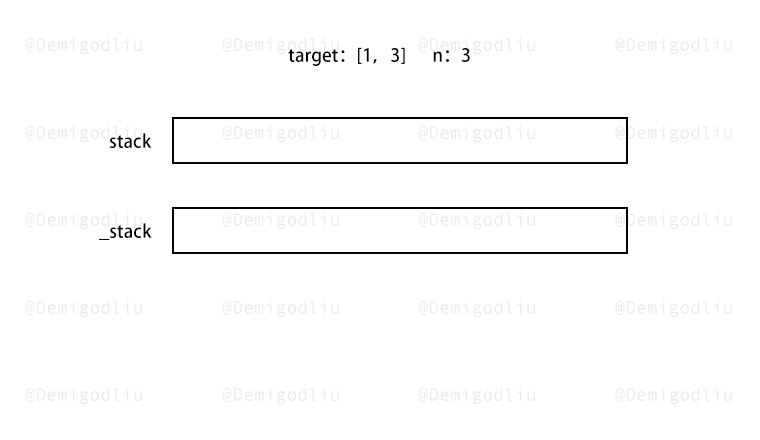
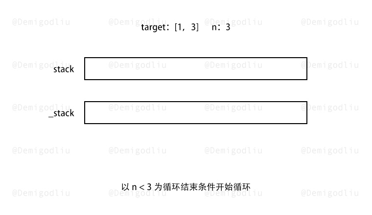
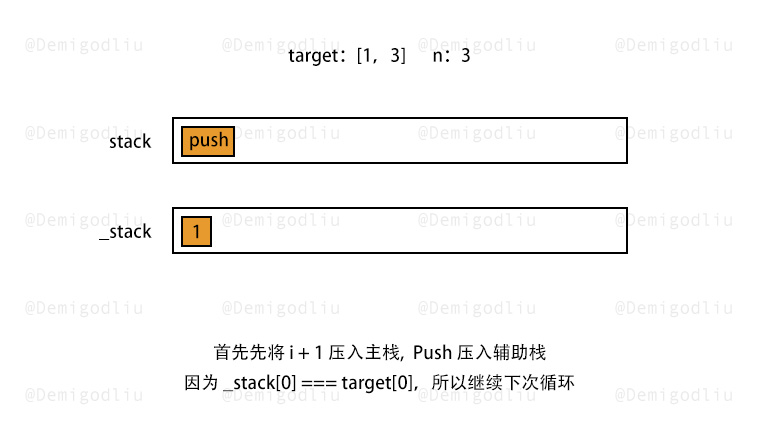
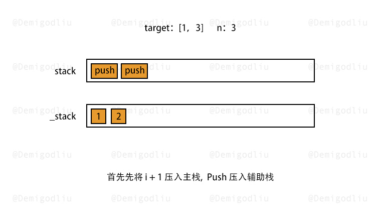
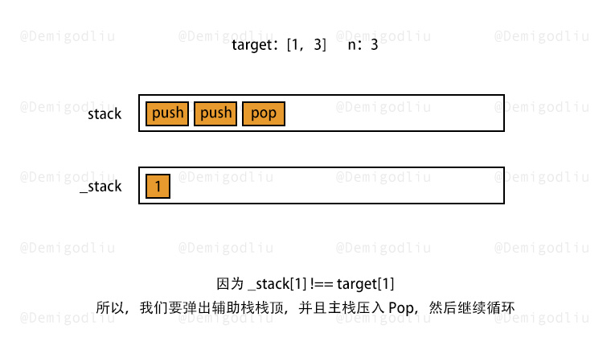
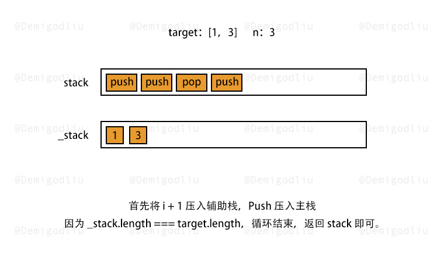

> 原文链接: https://leetcode-cn.com/problems/build-an-array-with-stack-operations


## 英文原文
<div><p>Given an array <code>target</code> and&nbsp;an integer <code>n</code>. In each iteration, you will read a number from &nbsp;<code>list = {1,2,3..., n}</code>.</p>

<p>Build the <code>target</code>&nbsp;array&nbsp;using the following operations:</p>

<ul>
	<li><strong>Push</strong>: Read a new element from the beginning&nbsp;<code>list</code>, and push it in the array.</li>
	<li><strong>Pop</strong>: delete the last element of&nbsp;the array.</li>
	<li>If the target array is already&nbsp;built, stop reading more elements.</li>
</ul>

<p>Return the operations to build the target array. You are guaranteed that the answer is unique.</p>

<p>&nbsp;</p>
<p><strong>Example 1:</strong></p>

<pre>
<strong>Input:</strong> target = [1,3], n = 3
<strong>Output:</strong> [&quot;Push&quot;,&quot;Push&quot;,&quot;Pop&quot;,&quot;Push&quot;]
<strong>Explanation: 
</strong>Read number 1 and automatically push in the array -&gt; [1]
Read number 2 and automatically push in the array then Pop it -&gt; [1]
Read number 3 and automatically push in the array -&gt; [1,3]
</pre>

<p><strong>Example 2:</strong></p>

<pre>
<strong>Input:</strong> target = [1,2,3], n = 3
<strong>Output:</strong> [&quot;Push&quot;,&quot;Push&quot;,&quot;Push&quot;]
</pre>

<p><strong>Example 3:</strong></p>

<pre>
<strong>Input:</strong> target = [1,2], n = 4
<strong>Output:</strong> [&quot;Push&quot;,&quot;Push&quot;]
<strong>Explanation: </strong>You only need to read the first 2 numbers and stop.
</pre>

<p><strong>Example 4:</strong></p>

<pre>
<strong>Input:</strong> target = [2,3,4], n = 4
<strong>Output:</strong> [&quot;Push&quot;,&quot;Pop&quot;,&quot;Push&quot;,&quot;Push&quot;,&quot;Push&quot;]
</pre>

<p>&nbsp;</p>
<p><strong>Constraints:</strong></p>

<ul>
	<li><code>1 &lt;= target.length &lt;= 100</code></li>
	<li><code>1 &lt;= target[i]&nbsp;&lt;= n</code></li>
	<li><code>1 &lt;= n &lt;= 100</code></li>
	<li><code>target</code> is strictly&nbsp;increasing.</li>
</ul>
</div>

## 中文题目
<div><p>给你一个目标数组 <code>target</code> 和一个整数 <code>n</code>。每次迭代，需要从  <code>list = {1,2,3..., n}</code> 中依序读取一个数字。</p>

<p>请使用下述操作来构建目标数组 <code>target</code> ：</p>

<ul>
	<li><strong>Push</strong>：从 <code>list</code> 中读取一个新元素， 并将其推入数组中。</li>
	<li><strong>Pop</strong>：删除数组中的最后一个元素。</li>
	<li>如果目标数组构建完成，就停止读取更多元素。</li>
</ul>

<p>题目数据保证目标数组严格递增，并且只包含 <code>1</code> 到 <code>n</code> 之间的数字。</p>

<p>请返回构建目标数组所用的操作序列。</p>

<p>题目数据保证答案是唯一的。</p>

<p> </p>

<p><strong>示例 1：</strong></p>

<pre>
<strong>输入：</strong>target = [1,3], n = 3
<strong>输出：</strong>["Push","Push","Pop","Push"]
<strong>解释： 
</strong>读取 1 并自动推入数组 -> [1]
读取 2 并自动推入数组，然后删除它 -> [1]
读取 3 并自动推入数组 -> [1,3]
</pre>

<p><strong>示例 2：</strong></p>

<pre>
<strong>输入：</strong>target = [1,2,3], n = 3
<strong>输出：</strong>["Push","Push","Push"]
</pre>

<p><strong>示例 3：</strong></p>

<pre>
<strong>输入：</strong>target = [1,2], n = 4
<strong>输出：</strong>["Push","Push"]
<strong>解释：</strong>只需要读取前 2 个数字就可以停止。
</pre>

<p><strong>示例 4：</strong></p>

<pre>
<strong>输入：</strong>target = [2,3,4], n = 4
<strong>输出：</strong>["Push","Pop","Push","Push","Push"]
</pre>

<p> </p>

<p><strong>提示：</strong></p>

<ul>
	<li><code>1 <= target.length <= 100</code></li>
	<li><code>1 <= target[i] <= 100</code></li>
	<li><code>1 <= n <= 100</code></li>
	<li><code>target</code> 是严格递增的</li>
</ul>
</div>

## 通过代码
<RecoDemo>
</RecoDemo>


## 高赞题解


---

### 🧠 解题思路

因为题目让我们使用栈来构建数组，所以我们可以理出如下思路：

1. 仅能使用入栈 $push$ 和出栈 $pop$ 方法。
2. 创建一个主栈，存放 '$Push$' 和 '$Pop$' 操作记录，再创建一个辅助栈，用于存放数字 $1,2 ... n$ 。
3. 以 $n$ 作为最大循环次数来进行循环，每个数字默认先压入栈，若该数字和 $target$ 同位数字不一致，则再将其弹出栈即可。
4. 在每次操作辅助栈的同时，在主栈中压入记录名称即可。

注意：$n$ 为最大循环次数，若过程中辅助栈的末位数字和 $target$ 末位一致，可以提前返回结果即可。

---

### 🎨 图解演示

<,,,,,>

---

### 🍭 示例代码

```Javascript
var buildArray = function(target, n) {
    let stack = [], _stack = [];
    for(let i = 0; i < n; i++){
        _stack.push(i + 1);
        stack.push("Push");
        if(_stack[_stack.length - 1] !== target[_stack.length - 1]){
            stack.push("Pop");
            _stack.pop();
        }
        if(target.length === _stack.length) return stack;
    }
    return stack;
};
```

---

### 转身挥手

嘿，少年，做图不易，留下个赞或评论再走吧！谢啦~ 💐

差点忘了，祝你牛年大吉 🐮 ，AC 和 Offer 📑 多多益善~

⛲⛲⛲ 期待下次再见~ 

## 统计信息
| 通过次数 | 提交次数 | AC比率 |
| :------: | :------: | :------: |
|    18688    |    28812    |   64.9%   |

## 提交历史
| 提交时间 | 提交结果 | 执行时间 |  内存消耗  | 语言 |
| :------: | :------: | :------: | :--------: | :--------: |
