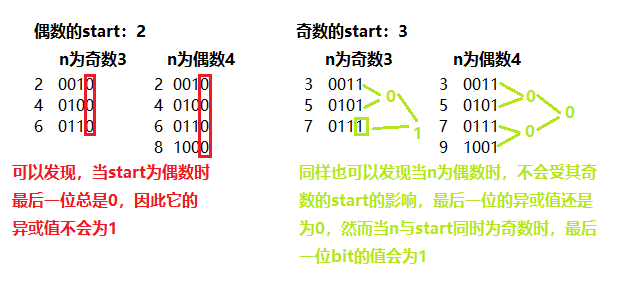
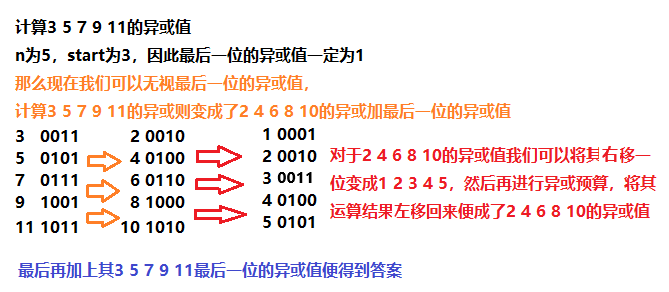
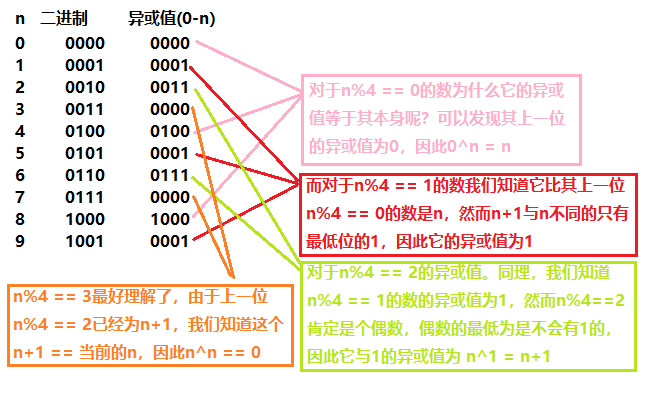

> 原文链接: https://leetcode-cn.com/problems/xor-operation-in-an-array


## 英文原文
<div><p>Given an integer <code>n</code> and an integer <code>start</code>.</p>

<p>Define an array <code>nums</code> where <code>nums[i] = start + 2*i</code> (0-indexed) and <code>n == nums.length</code>.</p>

<p>Return the bitwise&nbsp;XOR&nbsp;of all elements of <code>nums</code>.</p>

<p>&nbsp;</p>
<p><strong>Example 1:</strong></p>

<pre>
<strong>Input:</strong> n = 5, start = 0
<strong>Output:</strong> 8
<strong>Explanation: </strong>Array nums is equal to [0, 2, 4, 6, 8] where (0 ^ 2 ^ 4 ^ 6 ^ 8) = 8.
Where &quot;^&quot; corresponds to bitwise XOR operator.
</pre>

<p><strong>Example 2:</strong></p>

<pre>
<strong>Input:</strong> n = 4, start = 3
<strong>Output:</strong> 8
<strong>Explanation: </strong>Array nums is equal to [3, 5, 7, 9] where (3 ^ 5 ^ 7 ^ 9) = 8.</pre>

<p><strong>Example 3:</strong></p>

<pre>
<strong>Input:</strong> n = 1, start = 7
<strong>Output:</strong> 7
</pre>

<p><strong>Example 4:</strong></p>

<pre>
<strong>Input:</strong> n = 10, start = 5
<strong>Output:</strong> 2
</pre>

<p>&nbsp;</p>
<p><strong>Constraints:</strong></p>

<ul>
	<li><code>1 &lt;= n &lt;= 1000</code></li>
	<li><code>0 &lt;= start &lt;= 1000</code></li>
	<li><code>n == nums.length</code></li>
</ul></div>

## 中文题目
<div><p>给你两个整数，<code>n</code> 和 <code>start</code> 。</p>

<p>数组 <code>nums</code> 定义为：<code>nums[i] = start + 2*i</code>（下标从 0 开始）且 <code>n == nums.length</code> 。</p>

<p>请返回 <code>nums</code> 中所有元素按位异或（<strong>XOR</strong>）后得到的结果。</p>

<p>&nbsp;</p>

<p><strong>示例 1：</strong></p>

<pre><strong>输入：</strong>n = 5, start = 0
<strong>输出：</strong>8
<strong>解释：</strong>数组 nums 为 [0, 2, 4, 6, 8]，其中 (0 ^ 2 ^ 4 ^ 6 ^ 8) = 8 。
     &quot;^&quot; 为按位异或 XOR 运算符。
</pre>

<p><strong>示例 2：</strong></p>

<pre><strong>输入：</strong>n = 4, start = 3
<strong>输出：</strong>8
<strong>解释：</strong>数组 nums 为 [3, 5, 7, 9]，其中 (3 ^ 5 ^ 7 ^ 9) = 8.</pre>

<p><strong>示例 3：</strong></p>

<pre><strong>输入：</strong>n = 1, start = 7
<strong>输出：</strong>7
</pre>

<p><strong>示例 4：</strong></p>

<pre><strong>输入：</strong>n = 10, start = 5
<strong>输出：</strong>2
</pre>

<p>&nbsp;</p>

<p><strong>提示：</strong></p>

<ul>
	<li><code>1 &lt;= n &lt;= 1000</code></li>
	<li><code>0 &lt;= start &lt;= 1000</code></li>
	<li><code>n == nums.length</code></li>
</ul>
</div>

## 通过代码
<RecoDemo>
</RecoDemo>


## 高赞题解
### 小明发现奇偶性
小明拿了到数学题，苦思无解，于是他只好从找规律开始，他不停的代数然后手算，开始发现了其奇偶性的规律！
`对于偶数的start, 无论n为何值，结果的最后一位(Least significant digit)都为0`
`对于奇数的start, 只有当n为“奇数”时，结果的最后一位才为1`
因此他总结：`只有当n 与 start 都为奇数时，结果的最后一位才为 1`
下面是他发现奇偶性的草稿

**************************
### 小明发现运算规律
小明并没有因为发现奇偶性而得意洋洋，他继续解题，他觉得此题的`2`是个麻烦，因此他要想个法子把这个烦人的`2`给去掉。现在它的手上有这样的一串公式:`(start)^(start+2)^(start+4)^(start+6)^...^(start+2(n-1))`
他望着这串东西头皮发麻，他发现这串东西除以`2`后其实可以转化为更简单的式子：
`(s)^(s+1)^(s+2)^(s+3)^...^(s+(n-1))*2 + b0`，`s`当然为"$start\div2$"；
其中的`b0`刚好不就是奇偶性中的最后一位比特值吗？他已经知道如何算`b0`了！
于是问题简化成为了计算其`(s)^(s+1)^(s+2)^(s+3)^...^(s+(n-1))`的值。
那我们继续偷看一下小明的公式吧！
```cpp
(s)^(s+1)^(s+2)^(s+3)^...^(s+(n-1)) = (1^2^3^...^(s-1)) ^ (1^2^3^...^(s+n-1))
举例：3^4^5^6^7^8^9 = (1^2)^(1^2^3^4^5^6^7^8^9)
```
**由于我们把最后一位提出来单独讨论(运算)，那么这个步骤其实是将所有的数都右移一位计算其
异或值，然后再将其异或值左移回来加上其单独讨论的最后一位的比特值！重复读几遍这句话！**

**那么小明如何计算的“1^2^3^4^5”呢？**
***********************
### 小明计算XOR值
小明终于走到了最后一步，只要能把上面的连续sequence的异或值计算出来，那问题就迎刃而解了！
对于这一步，总不能还用暴力的方法从 1 一直算到 n 吧，那他不白推导了这么多步骤吗😔
于是他又开始了枚举。我偷到了他的小本本again😊

***********************
点个👍下次我还去偷他的本本
***********************
### 代码
```cpp
class Solution {
public:
    int computeXOR(int n)
    {
        switch(n%4)
        {
            case 0: return n;
            case 1: return 1;
            case 2: return n + 1;
        }
        //case3
        return 0;
    }
    int xorOperation(int n, int start) {
        //最低为表示为b0
        int b0 = n & start & 1;
        int s = start/2;
        int res = computeXOR(s-1)^computeXOR(s+n-1);
        return (res<<1) + b0;
    }
};
```

## 统计信息
| 通过次数 | 提交次数 | AC比率 |
| :------: | :------: | :------: |
|    71761    |    83596    |   85.8%   |

## 提交历史
| 提交时间 | 提交结果 | 执行时间 |  内存消耗  | 语言 |
| :------: | :------: | :------: | :--------: | :--------: |
