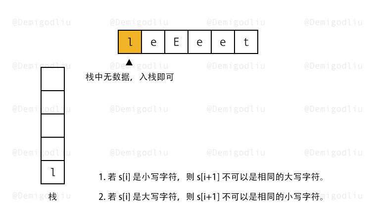
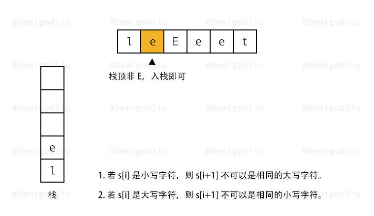
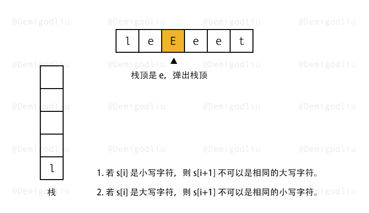
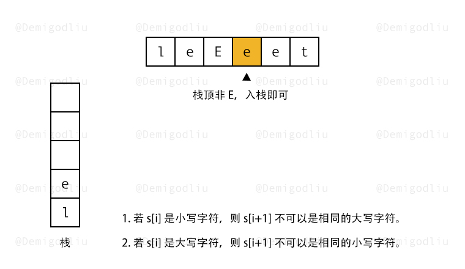
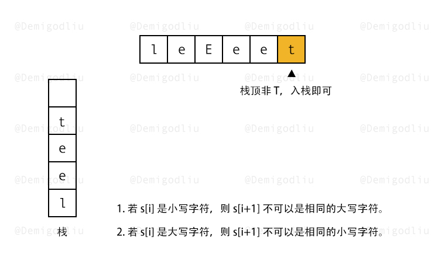

> 原文链接: https://leetcode-cn.com/problems/make-the-string-great


## 英文原文
<div><p>Given a string <code>s</code> of lower and upper case English letters.</p>

<p>A good string is a string which doesn&#39;t have <strong>two adjacent characters</strong> <code>s[i]</code> and <code>s[i + 1]</code> where:</p>

<ul>
	<li><code>0 &lt;= i &lt;= s.length - 2</code></li>
	<li><code>s[i]</code> is a lower-case letter and <code>s[i + 1]</code> is the same letter but in upper-case or <strong>vice-versa</strong>.</li>
</ul>

<p>To make the string good, you can choose <strong>two adjacent</strong> characters that make the string bad and remove them. You can keep doing this until the string becomes good.</p>

<p>Return <em>the string</em> after making it good. The answer is guaranteed to be unique under the given constraints.</p>

<p><strong>Notice</strong> that an empty string is also good.</p>

<p>&nbsp;</p>
<p><strong>Example 1:</strong></p>

<pre>
<strong>Input:</strong> s = &quot;leEeetcode&quot;
<strong>Output:</strong> &quot;leetcode&quot;
<strong>Explanation:</strong> In the first step, either you choose i = 1 or i = 2, both will result &quot;leEeetcode&quot; to be reduced to &quot;leetcode&quot;.
</pre>

<p><strong>Example 2:</strong></p>

<pre>
<strong>Input:</strong> s = &quot;abBAcC&quot;
<strong>Output:</strong> &quot;&quot;
<strong>Explanation:</strong> We have many possible scenarios, and all lead to the same answer. For example:
&quot;abBAcC&quot; --&gt; &quot;aAcC&quot; --&gt; &quot;cC&quot; --&gt; &quot;&quot;
&quot;abBAcC&quot; --&gt; &quot;abBA&quot; --&gt; &quot;aA&quot; --&gt; &quot;&quot;
</pre>

<p><strong>Example 3:</strong></p>

<pre>
<strong>Input:</strong> s = &quot;s&quot;
<strong>Output:</strong> &quot;s&quot;
</pre>

<p>&nbsp;</p>
<p><strong>Constraints:</strong></p>

<ul>
	<li><code>1 &lt;= s.length &lt;= 100</code></li>
	<li><code>s</code> contains only lower and upper case English letters.</li>
</ul>
</div>

## 中文题目
<div><p>给你一个由大小写英文字母组成的字符串 <code>s</code> 。</p>

<p>一个整理好的字符串中，两个相邻字符 <code>s[i]</code> 和 <code>s[i+1]</code>，其中 <code>0<= i <= s.length-2</code> ，要满足如下条件:</p>

<ul>
	<li>若 <code>s[i]</code> 是小写字符，则 <code>s[i+1]</code> 不可以是相同的大写字符。</li>
	<li>若 <code>s[i]</code> 是大写字符，则 <code>s[i+1]</code> 不可以是相同的小写字符。</li>
</ul>

<p>请你将字符串整理好，每次你都可以从字符串中选出满足上述条件的 <strong>两个相邻</strong> 字符并删除，直到字符串整理好为止。</p>

<p>请返回整理好的 <strong>字符串</strong> 。题目保证在给出的约束条件下，测试样例对应的答案是唯一的。</p>

<p><strong>注意：</strong>空字符串也属于整理好的字符串，尽管其中没有任何字符。</p>

<p> </p>

<p><strong>示例 1：</strong></p>

<pre>
<strong>输入：</strong>s = "leEeetcode"
<strong>输出：</strong>"leetcode"
<strong>解释：</strong>无论你第一次选的是 i = 1 还是 i = 2，都会使 "leEeetcode" 缩减为 "leetcode" 。
</pre>

<p><strong>示例 2：</strong></p>

<pre>
<strong>输入：</strong>s = "abBAcC"
<strong>输出：</strong>""
<strong>解释：</strong>存在多种不同情况，但所有的情况都会导致相同的结果。例如：
"abBAcC" --> "aAcC" --> "cC" --> ""
"abBAcC" --> "abBA" --> "aA" --> ""
</pre>

<p><strong>示例 3：</strong></p>

<pre>
<strong>输入：</strong>s = "s"
<strong>输出：</strong>"s"
</pre>

<p> </p>

<p><strong>提示：</strong></p>

<ul>
	<li><code>1 <= s.length <= 100</code></li>
	<li><code>s</code> 只包含小写和大写英文字母</li>
</ul>
</div>

## 通过代码
<RecoDemo>
</RecoDemo>


## 高赞题解


---

### 🧠 解题思路

分析题意之后，可以得出以下结论：

1. 字符要做比较，所以之前的字符应该被存储下来，这里我们会用到栈。
2. 遍历字符，若栈顶和当前字符正好大小写都具备，则弹出栈顶抵消，否则当前字符入栈。

---

### 🎨 图解演示

<,,,,,>

---

### 🍭 示例代码

```Javascript []
var makeGood = function(s) {
    let res = [];
    for(let i of s){
        if(
            res.length &&
            res[res.length - 1] !== i &&
            res[res.length - 1].toUpperCase() === i.toUpperCase()
        ){
            res.pop();
        }else{
            res.push(i);
        }
    }
    return res.join("");
};
```

---

### 转身挥手

嘿，少年，做图不易，留下个赞或评论再走吧！谢啦~ 💐

差点忘了，祝你牛年大吉 🐮 ，AC 和 Offer 📑 多多益善~

⛲⛲⛲ 期待下次再见~ 

## 统计信息
| 通过次数 | 提交次数 | AC比率 |
| :------: | :------: | :------: |
|    20712    |    37734    |   54.9%   |

## 提交历史
| 提交时间 | 提交结果 | 执行时间 |  内存消耗  | 语言 |
| :------: | :------: | :------: | :--------: | :--------: |
