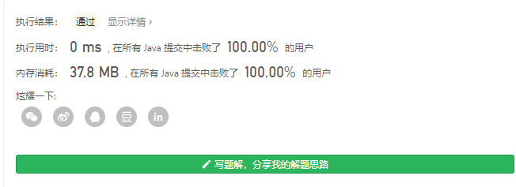

> 原文链接: https://leetcode-cn.com/problems/replace-all-s-to-avoid-consecutive-repeating-characters


## 英文原文
<div><p>Given a string <code>s</code> containing only lowercase English letters and the <code>&#39;?&#39;</code> character, convert <strong>all </strong>the <code>&#39;?&#39;</code> characters into lowercase letters such that the final string does not contain any <strong>consecutive repeating </strong>characters. You <strong>cannot </strong>modify the non <code>&#39;?&#39;</code> characters.</p>

<p>It is <strong>guaranteed </strong>that there are no consecutive repeating characters in the given string <strong>except </strong>for <code>&#39;?&#39;</code>.</p>

<p>Return <em>the final string after all the conversions (possibly zero) have been made</em>. If there is more than one solution, return <strong>any of them</strong>. It can be shown that an answer is always possible with the given constraints.</p>

<p>&nbsp;</p>
<p><strong>Example 1:</strong></p>

<pre>
<strong>Input:</strong> s = &quot;?zs&quot;
<strong>Output:</strong> &quot;azs&quot;
<strong>Explanation</strong>: There are 25 solutions for this problem. From &quot;azs&quot; to &quot;yzs&quot;, all are valid. Only &quot;z&quot; is an invalid modification as the string will consist of consecutive repeating characters in &quot;zzs&quot;.</pre>

<p><strong>Example 2:</strong></p>

<pre>
<strong>Input:</strong> s = &quot;ubv?w&quot;
<strong>Output:</strong> &quot;ubvaw&quot;
<strong>Explanation</strong>: There are 24 solutions for this problem. Only &quot;v&quot; and &quot;w&quot; are invalid modifications as the strings will consist of consecutive repeating characters in &quot;ubvvw&quot; and &quot;ubvww&quot;.
</pre>

<p><strong>Example 3:</strong></p>

<pre>
<strong>Input:</strong> s = &quot;j?qg??b&quot;
<strong>Output:</strong> &quot;jaqgacb&quot;
</pre>

<p><strong>Example 4:</strong></p>

<pre>
<strong>Input:</strong> s = &quot;??yw?ipkj?&quot;
<strong>Output:</strong> &quot;acywaipkja&quot;
</pre>

<p>&nbsp;</p>
<p><strong>Constraints:</strong></p>

<ul>
	<li><code>1 &lt;= s.length &lt;= 100</code></li>
	<li><code>s</code> consist of lowercase English letters and <code>&#39;?&#39;</code>.</li>
</ul>
</div>

## 中文题目
<div><p>给你一个仅包含小写英文字母和 <code>&#39;?&#39;</code> 字符的字符串 <code>s</code>，请你将所有的 <code>&#39;?&#39;</code> 转换为若干小写字母，使最终的字符串不包含任何 <strong>连续重复</strong> 的字符。</p>

<p>注意：你 <strong>不能</strong> 修改非 <code>&#39;?&#39;</code> 字符。</p>

<p>题目测试用例保证 <strong>除</strong> <code>&#39;?&#39;</code> 字符 <strong>之外</strong>，不存在连续重复的字符。</p>

<p>在完成所有转换（可能无需转换）后返回最终的字符串。如果有多个解决方案，请返回其中任何一个。可以证明，在给定的约束条件下，答案总是存在的。</p>

<p>&nbsp;</p>

<p><strong>示例 1：</strong></p>

<pre><strong>输入：</strong>s = &quot;?zs&quot;
<strong>输出：</strong>&quot;azs&quot;
<strong>解释：</strong>该示例共有 25 种解决方案，从 &quot;azs&quot; 到 &quot;yzs&quot; 都是符合题目要求的。只有 &quot;z&quot; 是无效的修改，因为字符串 &quot;zzs&quot; 中有连续重复的两个 &#39;z&#39; 。</pre>

<p><strong>示例 2：</strong></p>

<pre><strong>输入：</strong>s = &quot;ubv?w&quot;
<strong>输出：</strong>&quot;ubvaw&quot;
<strong>解释：</strong>该示例共有 24 种解决方案，只有替换成 &quot;v&quot; 和 &quot;w&quot; 不符合题目要求。因为 &quot;ubvvw&quot; 和 &quot;ubvww&quot; 都包含连续重复的字符。
</pre>

<p><strong>示例 3：</strong></p>

<pre><strong>输入：</strong>s = &quot;j?qg??b&quot;
<strong>输出：</strong>&quot;jaqgacb&quot;
</pre>

<p><strong>示例 4：</strong></p>

<pre><strong>输入：</strong>s = &quot;??yw?ipkj?&quot;
<strong>输出：</strong>&quot;acywaipkja&quot;
</pre>

<p>&nbsp;</p>

<p><strong>提示：</strong></p>

<ul>
	<li>
	<p><code>1 &lt;= s.length&nbsp;&lt;= 100</code></p>
	</li>
	<li>
	<p><code>s</code> 仅包含小写英文字母和 <code>&#39;?&#39;</code> 字符</p>
	</li>
</ul>
</div>

## 通过代码
<RecoDemo>
</RecoDemo>


## 高赞题解


### 解题思路
从前面开始遍历，遇到问号就对比前面和后面的 用一个不与前面和后面一致的字符代替就好了

### 代码

```java
class Solution {
    public String modifyString(String s) {
        char[] chars = s.toCharArray();

        for (int i = 0; i < chars.length; i++) {
            if (chars[i] == '?') {
                //前面一个字符  如果当前是第0个的话 字符就为‘ ’
                char ahead = i == 0 ? ' ' : chars[i - 1];
                //后面一个字符  如果当前是最后一个的话 字符就为‘ ’
                char behind  = i == chars.length - 1 ? ' ' : chars[i + 1];
                //从a开始比较  如果等于前面或者后面的话 就+1
                char temp = 'a';
                while (temp == ahead || temp == behind ) {
                    temp++;
                }
                //找到目标字符后 做替换
                chars[i] = temp;
            }
        }
        return new String(chars);
    }
}
```

## 统计信息
| 通过次数 | 提交次数 | AC比率 |
| :------: | :------: | :------: |
|    18484    |    38736    |   47.7%   |

## 提交历史
| 提交时间 | 提交结果 | 执行时间 |  内存消耗  | 语言 |
| :------: | :------: | :------: | :--------: | :--------: |
