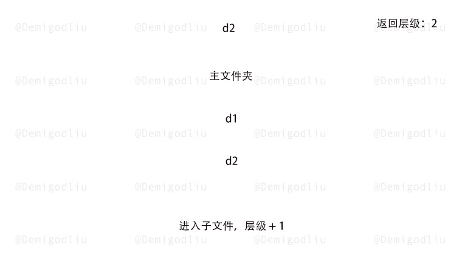
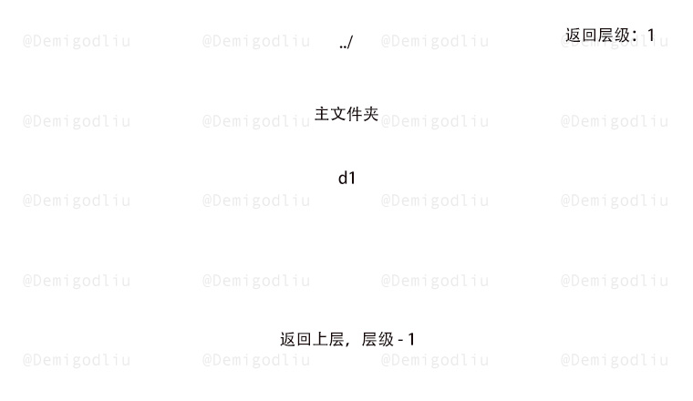
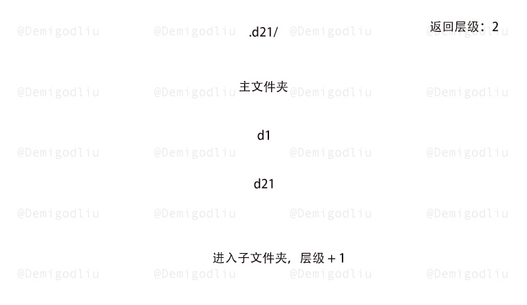
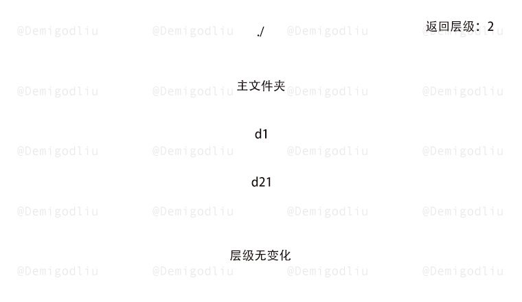
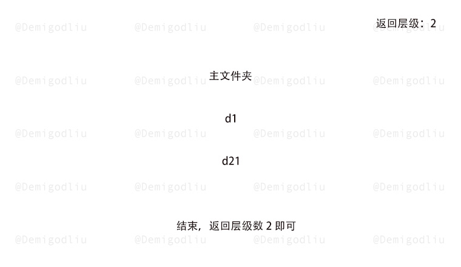

> 原文链接: https://leetcode-cn.com/problems/crawler-log-folder


## 英文原文
<div><p>The Leetcode file system keeps a log each time some user performs a <em>change folder</em> operation.</p>

<p>The operations are described below:</p>

<ul>
	<li><code>&quot;../&quot;</code> : Move to the parent folder of the current folder. (If you are already in the main folder, <strong>remain in the same folder</strong>).</li>
	<li><code>&quot;./&quot;</code> : Remain in the same folder.</li>
	<li><code>&quot;x/&quot;</code> : Move to the child folder named <code>x</code> (This folder is <strong>guaranteed to always exist</strong>).</li>
</ul>

<p>You are given a list of strings <code>logs</code> where <code>logs[i]</code> is the operation performed by the user at the <code>i<sup>th</sup></code> step.</p>

<p>The file system starts in the main folder, then the operations in <code>logs</code> are performed.</p>

<p>Return <em>the minimum number of operations needed to go back to the main folder after the change folder operations.</em></p>

<p>&nbsp;</p>
<p><strong>Example 1:</strong></p>

<p></p>

<pre>
<strong>Input:</strong> logs = [&quot;d1/&quot;,&quot;d2/&quot;,&quot;../&quot;,&quot;d21/&quot;,&quot;./&quot;]
<strong>Output:</strong> 2
<strong>Explanation: </strong>Use this change folder operation &quot;../&quot; 2 times and go back to the main folder.
</pre>

<p><strong>Example 2:</strong></p>

<p></p>

<pre>
<strong>Input:</strong> logs = [&quot;d1/&quot;,&quot;d2/&quot;,&quot;./&quot;,&quot;d3/&quot;,&quot;../&quot;,&quot;d31/&quot;]
<strong>Output:</strong> 3
</pre>

<p><strong>Example 3:</strong></p>

<pre>
<strong>Input:</strong> logs = [&quot;d1/&quot;,&quot;../&quot;,&quot;../&quot;,&quot;../&quot;]
<strong>Output:</strong> 0
</pre>

<p>&nbsp;</p>
<p><strong>Constraints:</strong></p>

<ul>
	<li><code>1 &lt;= logs.length &lt;= 10<sup>3</sup></code></li>
	<li><code>2 &lt;= logs[i].length &lt;= 10</code></li>
	<li><code>logs[i]</code> contains lowercase English letters, digits, <code>&#39;.&#39;</code>, and <code>&#39;/&#39;</code>.</li>
	<li><code>logs[i]</code> follows the format described in the statement.</li>
	<li>Folder names consist of lowercase English letters and digits.</li>
</ul>
</div>

## 中文题目
<div><p>每当用户执行变更文件夹操作时，LeetCode 文件系统都会保存一条日志记录。</p>

<p>下面给出对变更操作的说明：</p>

<ul>
	<li><code>&quot;../&quot;</code> ：移动到当前文件夹的父文件夹。如果已经在主文件夹下，则 <strong>继续停留在当前文件夹</strong> 。</li>
	<li><code>&quot;./&quot;</code> ：继续停留在当前文件夹<strong>。</strong></li>
	<li><code>&quot;x/&quot;</code> ：移动到名为 <code>x</code> 的子文件夹中。题目数据 <strong>保证总是存在文件夹 <code>x</code></strong> 。</li>
</ul>

<p>给你一个字符串列表 <code>logs</code> ，其中 <code>logs[i]</code> 是用户在 <code>i<sup>th</sup></code> 步执行的操作。</p>

<p>文件系统启动时位于主文件夹，然后执行 <code>logs</code> 中的操作。</p>

<p>执行完所有变更文件夹操作后，请你找出 <strong>返回主文件夹所需的最小步数</strong> 。</p>

<p>&nbsp;</p>

<p><strong>示例 1：</strong></p>

<p></p>

<pre><strong>输入：</strong>logs = [&quot;d1/&quot;,&quot;d2/&quot;,&quot;../&quot;,&quot;d21/&quot;,&quot;./&quot;]
<strong>输出：</strong>2
<strong>解释：</strong>执行 &quot;../&quot; 操作变更文件夹 2 次，即可回到主文件夹
</pre>

<p><strong>示例 2：</strong></p>

<p></p>

<pre><strong>输入：</strong>logs = [&quot;d1/&quot;,&quot;d2/&quot;,&quot;./&quot;,&quot;d3/&quot;,&quot;../&quot;,&quot;d31/&quot;]
<strong>输出：</strong>3
</pre>

<p><strong>示例 3：</strong></p>

<pre><strong>输入：</strong>logs = [&quot;d1/&quot;,&quot;../&quot;,&quot;../&quot;,&quot;../&quot;]
<strong>输出：</strong>0
</pre>

<p>&nbsp;</p>

<p><strong>提示：</strong></p>

<ul>
	<li><code>1 &lt;= logs.length &lt;= 10<sup>3</sup></code></li>
	<li><code>2 &lt;= logs[i].length &lt;= 10</code></li>
	<li><code>logs[i]</code> 包含小写英文字母，数字，<code>&#39;.&#39;</code> 和 <code>&#39;/&#39;</code></li>
	<li><code>logs[i]</code> 符合语句中描述的格式</li>
	<li>文件夹名称由小写英文字母和数字组成</li>
</ul>
</div>

## 通过代码
<RecoDemo>
</RecoDemo>


## 高赞题解


---

### 🧠 解题思路

熟读题意，我们可以得知规则如下：

1. 遇到 `../`，返回主文件的层级 -1。
2. 遇到 `./`，返回主文件的层级无变化。
3. 遇到 `x/`，返回主文件的层级 +1。

注意：若当前层级 $>=$ 主文件层级时，我们的计数只需要保持为 $0$ 即可。

既然规则如此简单，那我们直接使用计数法就可以搞定了。

---

### 🎨 图解演示

<,,,,,,>

---

### 🍭 示例代码

```Javascript []
var minOperations = function(logs) {
    let ans = 0;
    logs.forEach(item => {
        if(item === '../') ans = Math.max(0, ans - 1);
        else if(item !== './') ans++;
    });
    return ans;
};
```
```C++ []
class Solution {
public:
    int minOperations(vector<string>& logs) {
        int ans = 0;
        for(const string& log: logs){
            if(log == "../") ans = max(0, ans - 1);
            else if(log != "./") ans++; 
        }
        return ans;
    }
};
```
```Java []
class Solution {
    public int minOperations(String[] logs) {
        int ans = 0;
        for (int i = 0; i < logs.length; i++) {
            if (logs[i].equals("../")) ans = Math.max(0, ans - 1);
            else if(!logs[i].equals("./")) ans++;
        }
        return ans;
    }
}
```
```Golang []
func minOperations(logs []string) int {
	result := 0
	for _, v := range logs {
		op := v[:2]
		switch op {
            case "..":
                if result > 0 {
                    result--
                }
            case "./":
            default:
                result++
		}
	}
	return result
}
```
```Python3 []
class Solution:
    def minOperations(self, logs: List[str]) -> int:
        ans = 0 
        for log in logs:
            if log.startswith("../"):
                ans -= 1
            elif log.startswith("./"):
                ans += 0
            else:
                ans += 1
            ans = ans if ans > 0 else 0
        return ans
```

---

### 转身挥手

嘿，少年，做图不易，留下个赞或评论再走吧！谢啦~ 💐

差点忘了，祝你牛年大吉 🐮 ，AC 和 Offer 📑 多多益善~

⛲⛲⛲ 期待下次再见~ 

## 统计信息
| 通过次数 | 提交次数 | AC比率 |
| :------: | :------: | :------: |
|    11590    |    17241    |   67.2%   |

## 提交历史
| 提交时间 | 提交结果 | 执行时间 |  内存消耗  | 语言 |
| :------: | :------: | :------: | :--------: | :--------: |
