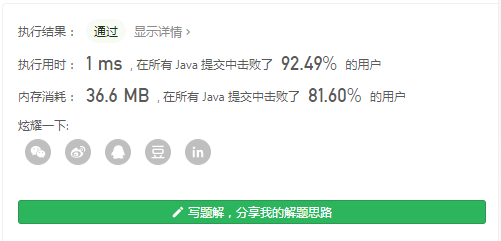

> 原文链接: https://leetcode-cn.com/problems/maximum-repeating-substring


## 英文原文
<div><p>For a string <code>sequence</code>, a string <code>word</code> is <strong><code>k</code>-repeating</strong> if <code>word</code> concatenated <code>k</code> times is a substring of <code>sequence</code>. The <code>word</code>&#39;s <strong>maximum <code>k</code>-repeating value</strong> is the highest value <code>k</code> where <code>word</code> is <code>k</code>-repeating in <code>sequence</code>. If <code>word</code> is not a substring of <code>sequence</code>, <code>word</code>&#39;s maximum <code>k</code>-repeating value is <code>0</code>.</p>

<p>Given strings <code>sequence</code> and <code>word</code>, return <em>the <strong>maximum <code>k</code>-repeating value</strong> of <code>word</code> in <code>sequence</code></em>.</p>

<p>&nbsp;</p>
<p><strong>Example 1:</strong></p>

<pre>
<strong>Input:</strong> sequence = &quot;ababc&quot;, word = &quot;ab&quot;
<strong>Output:</strong> 2
<strong>Explanation: </strong>&quot;abab&quot; is a substring in &quot;<u>abab</u>c&quot;.
</pre>

<p><strong>Example 2:</strong></p>

<pre>
<strong>Input:</strong> sequence = &quot;ababc&quot;, word = &quot;ba&quot;
<strong>Output:</strong> 1
<strong>Explanation: </strong>&quot;ba&quot; is a substring in &quot;a<u>ba</u>bc&quot;. &quot;baba&quot; is not a substring in &quot;ababc&quot;.
</pre>

<p><strong>Example 3:</strong></p>

<pre>
<strong>Input:</strong> sequence = &quot;ababc&quot;, word = &quot;ac&quot;
<strong>Output:</strong> 0
<strong>Explanation: </strong>&quot;ac&quot; is not a substring in &quot;ababc&quot;. 
</pre>

<p>&nbsp;</p>
<p><strong>Constraints:</strong></p>

<ul>
	<li><code>1 &lt;= sequence.length &lt;= 100</code></li>
	<li><code>1 &lt;= word.length &lt;= 100</code></li>
	<li><code>sequence</code> and <code>word</code>&nbsp;contains only lowercase English letters.</li>
</ul>
</div>

## 中文题目
<div><p>给你一个字符串 <code>sequence</code> ，如果字符串 <code>word</code> 连续重复 <code>k</code> 次形成的字符串是 <code>sequence</code> 的一个子字符串，那么单词 <code>word</code> 的 <strong>重复值为 <code>k</code></strong><strong> </strong>。单词 <code>word</code> 的 <strong>最</strong><strong>大重复值</strong> 是单词 <code>word</code> 在 <code>sequence</code> 中最大的重复值。如果 <code>word</code> 不是 <code>sequence</code> 的子串，那么重复值 <code>k</code> 为 <code>0</code> 。</p>

<p>给你一个字符串 <code>sequence</code> 和 <code>word</code> ，请你返回 <strong>最大重复值 <code>k</code> </strong>。</p>

<p> </p>

<p><strong>示例 1：</strong></p>

<pre>
<b>输入：</b>sequence = "ababc", word = "ab"
<b>输出：</b>2
<strong>解释：</strong>"abab" 是 "<strong>abab</strong>c" 的子字符串。
</pre>

<p><strong>示例 2：</strong></p>

<pre>
<b>输入：</b>sequence = "ababc", word = "ba"
<b>输出：</b>1
<strong>解释：</strong>"ba" 是 "a<strong>ba</strong>bc" 的子字符串，但 "baba" 不是 "ababc" 的子字符串。
</pre>

<p><strong>示例 3：</strong></p>

<pre>
<b>输入：</b>sequence = "ababc", word = "ac"
<b>输出：</b>0
<strong>解释：</strong>"ac" 不是 "ababc" 的子字符串。
</pre>

<p> </p>

<p><strong>提示：</strong></p>

<ul>
	<li><code>1 <= sequence.length <= 100</code></li>
	<li><code>1 <= word.length <= 100</code></li>
	<li><code>sequence</code> 和 <code>word</code> 都只包含小写英文字母。</li>
</ul>
</div>

## 通过代码
<RecoDemo>
</RecoDemo>


## 高赞题解
### 解题思路
注意题目描述的是连续重复。
所以我们用StringBuilder拼接word
首先判断sequence是否包含word
如果包含则count++，然后sb再拼接一个word。
直至不包含为止退出循环。
count既是结果




### 代码

```java
class Solution {
    public int maxRepeating(String sequence, String word) {
        int count = 0;
        StringBuilder sb = new StringBuilder(word);
        while(sequence.contains(sb)) {
            count++;
            sb.append(word);
        }
        return count;
    }
}
```

## 统计信息
| 通过次数 | 提交次数 | AC比率 |
| :------: | :------: | :------: |
|    7363    |    16597    |   44.4%   |

## 提交历史
| 提交时间 | 提交结果 | 执行时间 |  内存消耗  | 语言 |
| :------: | :------: | :------: | :--------: | :--------: |
