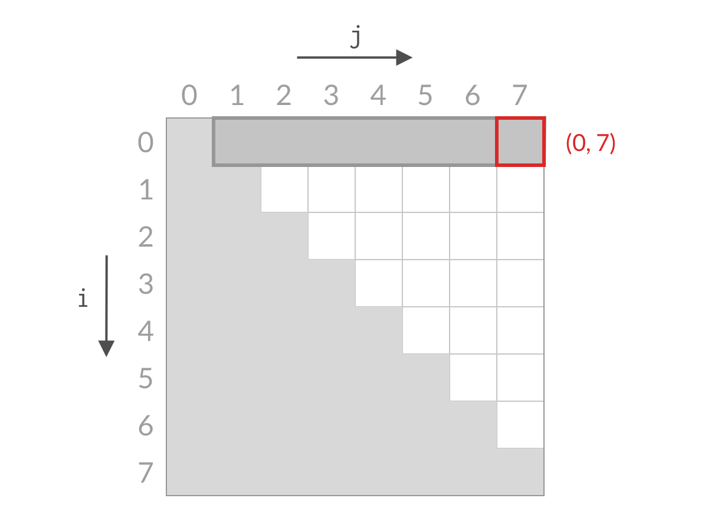

> 原文链接: https://leetcode-cn.com/problems/two-sum-ii-input-array-is-sorted


## 英文原文
<div><p>Given a <strong>1-indexed</strong> array of integers <code>numbers</code> that is already <strong><em>sorted in non-decreasing order</em></strong>, find two numbers such that they add up to a specific <code>target</code> number. Let these two numbers be <code>numbers[index<sub>1</sub>]</code> and <code>numbers[index<sub>2</sub>]</code> where <code>1 &lt;= index<sub>1</sub> &lt; index<sub>2</sub> &lt;= numbers.length</code>.</p>

<p>Return<em> the indices of the two numbers, </em><code>index<sub>1</sub></code><em> and </em><code>index<sub>2</sub></code><em>, <strong>added by one</strong> as an integer array </em><code>[index<sub>1</sub>, index<sub>2</sub>]</code><em> of length 2.</em></p>

<p>The tests are generated such that there is <strong>exactly one solution</strong>. You <strong>may not</strong> use the same element twice.</p>

<p>&nbsp;</p>
<p><strong>Example 1:</strong></p>

<pre>
<strong>Input:</strong> numbers = [<u>2</u>,<u>7</u>,11,15], target = 9
<strong>Output:</strong> [1,2]
<strong>Explanation:</strong> The sum of 2 and 7 is 9. Therefore, index<sub>1</sub> = 1, index<sub>2</sub> = 2. We return [1, 2].
</pre>

<p><strong>Example 2:</strong></p>

<pre>
<strong>Input:</strong> numbers = [<u>2</u>,3,<u>4</u>], target = 6
<strong>Output:</strong> [1,3]
<strong>Explanation:</strong> The sum of 2 and 4 is 6. Therefore index<sub>1</sub> = 1, index<sub>2</sub> = 3. We return [1, 3].
</pre>

<p><strong>Example 3:</strong></p>

<pre>
<strong>Input:</strong> numbers = [<u>-1</u>,<u>0</u>], target = -1
<strong>Output:</strong> [1,2]
<strong>Explanation:</strong> The sum of -1 and 0 is -1. Therefore index<sub>1</sub> = 1, index<sub>2</sub> = 2. We return [1, 2].
</pre>

<p>&nbsp;</p>
<p><strong>Constraints:</strong></p>

<ul>
	<li><code>2 &lt;= numbers.length &lt;= 3 * 10<sup>4</sup></code></li>
	<li><code>-1000 &lt;= numbers[i] &lt;= 1000</code></li>
	<li><code>numbers</code> is sorted in <strong>non-decreasing order</strong>.</li>
	<li><code>-1000 &lt;= target &lt;= 1000</code></li>
	<li>The tests are generated such that there is <strong>exactly one solution</strong>.</li>
</ul>
</div>

## 中文题目
<div><p>给定一个已按照<strong><em> </em>非递减顺序排列&nbsp; </strong>的整数数组&nbsp;<code>numbers</code> ，请你从数组中找出两个数满足相加之和等于目标数&nbsp;<code>target</code> 。</p>

<p>函数应该以长度为 <code>2</code> 的整数数组的形式返回这两个数的下标值<em>。</em><code>numbers</code> 的下标 <strong>从 1 开始计数</strong> ，所以答案数组应当满足 <code>1 &lt;= answer[0] &lt; answer[1] &lt;= numbers.length</code> 。</p>

<p>你可以假设每个输入 <strong>只对应唯一的答案</strong> ，而且你 <strong>不可以</strong> 重复使用相同的元素。</p>
&nbsp;

<p><strong>示例 1：</strong></p>

<pre>
<strong>输入：</strong>numbers = [2,7,11,15], target = 9
<strong>输出：</strong>[1,2]
<strong>解释：</strong>2 与 7 之和等于目标数 9 。因此 index1 = 1, index2 = 2 。
</pre>

<p><strong>示例 2：</strong></p>

<pre>
<strong>输入：</strong>numbers = [2,3,4], target = 6
<strong>输出：</strong>[1,3]
</pre>

<p><strong>示例 3：</strong></p>

<pre>
<strong>输入：</strong>numbers = [-1,0], target = -1
<strong>输出：</strong>[1,2]
</pre>

<p>&nbsp;</p>

<p><strong>提示：</strong></p>

<ul>
	<li><code>2 &lt;= numbers.length &lt;= 3 * 10<sup>4</sup></code></li>
	<li><code>-1000 &lt;= numbers[i] &lt;= 1000</code></li>
	<li><code>numbers</code> 按 <strong>非递减顺序</strong> 排列</li>
	<li><code>-1000 &lt;= target &lt;= 1000</code></li>
	<li><strong>仅存在一个有效答案</strong></li>
</ul>
</div>

## 通过代码
<RecoDemo>
</RecoDemo>


## 高赞题解
#### 解题思路：
很多人做这个题目想不到正确的 $O(n)$ 解法，即使看了答案理解了，下次再做的时候还是会忘记。要想真正理解这道题，就要明白解法背后的道理。这样不仅可以记住这道题，还能举一反三解决类似的题目。

很多题解只给出了双指针解法的代码，但没有说明解法的正确性。为什么双指针往中间移动时，不会漏掉某些情况呢？要解答这个问题，我们要从**缩减搜索空间**的角度思考这个解法。下面我将以文字和图片两种方式进行讲解。

首先放上参考答案：

```C++ []
vector<int> twoSum(vector<int>& numbers, int target) {
    int i = 0;
    int j = numbers.size()-1;
    while (i < j) {
        int sum = numbers[i] + numbers[j];
        if (sum < target) {
            i++;
        } else if (sum > target) {
            j--;
        } else {
            return vector<int>{i+1, j+1};
        }
    }
    return vector<int>{-1, -1};
}
```

```Java []
public int[] twoSum(int[] numbers, int target) {
    int i = 0;
    int j = numbers.length - 1;
    while (i < j) {
        int sum = numbers[i] + numbers[j];
        if (sum < target) {
            i++;
        } else if (sum > target) {
            j--;
        } else {
            return new int[]{i+1, j+1};
        }
    }
    return new int[]{-1, -1};
}
```

需要注意的是，虽然本题叫做 Two Sum II，但解法和 Two Sum 完全不同。

#### 图解双指针解法的原理

在这道题中，我们要寻找的是符合条件的一对下标 $(i, j)$，它们需要满足的约束条件是：

+ $i$、$j$ 都是合法的下标，即 $0 \le i < n, 0 \le j < n$
+ $i < j$（题目要求）

而我们希望从中找到满足 `A[i] + A[j] == target` 的下标 $(i, j)$。以 $n = 8$ 为例，这时候全部的搜索空间是：

{:width=400}
{:align=center}

由于 $i$、$j$ 的约束条件的限制，搜索空间是白色的倒三角部分。可以看到，搜索空间的大小是 $O(n^2)$ 数量级的。如果用暴力解法求解，一次只检查一个单元格，那么时间复杂度一定是 $O(n^2)$。要想得到 $O(n)$ 的解法，我们就需要能够一次排除多个单元格。那么我们来看看，本题的双指针解法是如何削减搜索空间的：

一开始，我们检查右上方单元格 $(0, 7)$，即计算 `A[0] + A[7]` ，与 `target` 进行比较。如果不相等的话，则要么大于 `target`，要么小于 `target`。

{:width=400}
{:align=center}

假设此时 `A[0] + A[7]` 小于 `target`。这时候，我们应该去找**和更大的两个数**。由于 `A[7]` 已经是最大的数了，其他的数跟 `A[0]` 相加，和只会更小。也就是说 `A[0] + A[6]` 、`A[0] + A[5]`、……、`A[0] + A[1]` 也都小于 `target`，这些都是不合要求的解，可以一次排除。这相当于 $i=0$ 的情况全部被排除。对应用双指针解法的代码，就是 `i++`，对应于搜索空间，就是削减了一行的搜索空间，如下图所示。

{:width=400}
{:align=center}

排除掉了搜索空间中的一行之后，我们再看剩余的搜索空间，仍然是倒三角形状。我们检查右上方的单元格 $(1, 7)$，计算 `A[1] + A[7]` 与 `target` 进行比较。

{:width=400}
{:align=center}

假设此时 `A[0] + A[7]` 大于 `target`。这时候，我们应该去找**和更小的两个数**。由于 `A[1]` 已经是当前搜索空间最小的数了，其他的数跟 `A[7]` 相加的话，和只会更大。也就是说 `A[1] + A[7]` 、`A[2] + A[7]`、……、`A[6] + A[7]` 也都大于 `target`，这些都是不合要求的解，可以一次排除。这相当于 $j=0$ 的情况全部被排除。对应用双指针解法的代码，就是 `j++`，对应于搜索空间，就是削减了一列的搜索空间，如下图所示。

{:width=400}
{:align=center}

可以看到，无论 `A[i] + A[j]` 的结果是大了还是小了，我们都可以排除掉一行或者一列的搜索空间。经过 $n$ 步以后，就能排除所有的搜索空间，检查完所有的可能性。搜索空间的减小过程如下面动图所示：

{:width=400}
{:align=center}

实际上还有几道题也是用到了这样的**缩减搜索空间**的思想：

+ [11. Container With Most Water](https://leetcode-cn.com/problems/container-with-most-water/)
+ [240. Search a 2D Matrix II](https://leetcode-cn.com/problems/search-a-2d-matrix-ii/)


## 统计信息
| 通过次数 | 提交次数 | AC比率 |
| :------: | :------: | :------: |
|    325547    |    554701    |   58.7%   |

## 提交历史
| 提交时间 | 提交结果 | 执行时间 |  内存消耗  | 语言 |
| :------: | :------: | :------: | :--------: | :--------: |


## 相似题目
|                             题目                             | 难度 |
| :----------------------------------------------------------: | :---------: |
| [两数之和](https://leetcode-cn.com/problems/two-sum/) | 简单|
| [两数之和 IV - 输入 BST](https://leetcode-cn.com/problems/two-sum-iv-input-is-a-bst/) | 简单|
| [小于 K 的两数之和](https://leetcode-cn.com/problems/two-sum-less-than-k/) | 简单|
