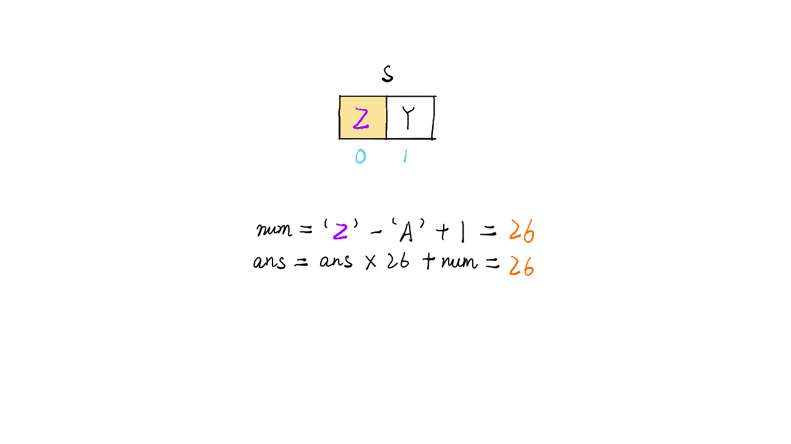
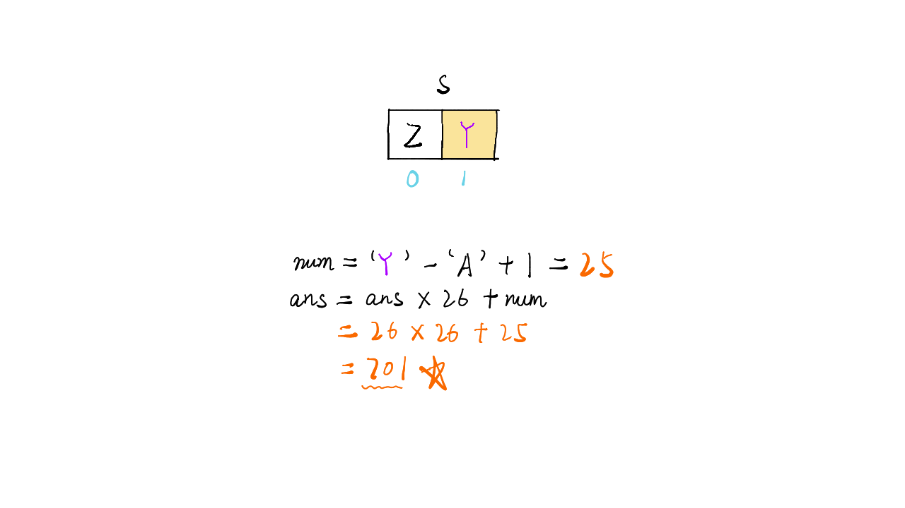

> 原文链接: https://leetcode-cn.com/problems/excel-sheet-column-number


## 英文原文
<div><p>Given a string <code>columnTitle</code> that represents the column title as appear in an Excel sheet, return <em>its corresponding column number</em>.</p>

<p>For example:</p>

<pre>
A -&gt; 1
B -&gt; 2
C -&gt; 3
...
Z -&gt; 26
AA -&gt; 27
AB -&gt; 28 
...
</pre>

<p>&nbsp;</p>
<p><strong>Example 1:</strong></p>

<pre>
<strong>Input:</strong> columnTitle = &quot;A&quot;
<strong>Output:</strong> 1
</pre>

<p><strong>Example 2:</strong></p>

<pre>
<strong>Input:</strong> columnTitle = &quot;AB&quot;
<strong>Output:</strong> 28
</pre>

<p><strong>Example 3:</strong></p>

<pre>
<strong>Input:</strong> columnTitle = &quot;ZY&quot;
<strong>Output:</strong> 701
</pre>

<p><strong>Example 4:</strong></p>

<pre>
<strong>Input:</strong> columnTitle = &quot;FXSHRXW&quot;
<strong>Output:</strong> 2147483647
</pre>

<p>&nbsp;</p>
<p><strong>Constraints:</strong></p>

<ul>
	<li><code>1 &lt;= columnTitle.length &lt;= 7</code></li>
	<li><code>columnTitle</code> consists only of uppercase English letters.</li>
	<li><code>columnTitle</code> is in the range <code>[&quot;A&quot;, &quot;FXSHRXW&quot;]</code>.</li>
</ul>
</div>

## 中文题目
<div><p>给你一个字符串&nbsp;<code>columnTitle</code> ，表示 Excel 表格中的列名称。返回该列名称对应的列序号。</p>

<p>&nbsp;</p>

<p>例如，</p>

<pre>
    A -&gt; 1
    B -&gt; 2
    C -&gt; 3
    ...
    Z -&gt; 26
    AA -&gt; 27
    AB -&gt; 28 
    ...
</pre>

<p>&nbsp;</p>

<p><strong>示例 1:</strong></p>

<pre>
<strong>输入:</strong> columnTitle = "A"
<strong>输出:</strong> 1
</pre>

<p><strong>示例&nbsp;2:</strong></p>

<pre>
<strong>输入: </strong>columnTitle = "AB"
<strong>输出:</strong> 28
</pre>

<p><strong>示例&nbsp;3:</strong></p>

<pre>
<strong>输入: </strong>columnTitle = "ZY"
<strong>输出:</strong> 701</pre>

<p><strong>示例 4:</strong></p>

<pre>
<strong>输入: </strong>columnTitle = "FXSHRXW"
<strong>输出: </strong>2147483647
</pre>

<p>&nbsp;</p>

<p><strong>提示：</strong></p>

<ul>
	<li><code>1 &lt;= columnTitle.length &lt;= 7</code></li>
	<li><code>columnTitle</code> 仅由大写英文组成</li>
	<li><code>columnTitle</code> 在范围 <code>["A", "FXSHRXW"]</code> 内</li>
</ul>
</div>

## 通过代码
<RecoDemo>
</RecoDemo>


## 高赞题解
### 解题思路

- 标签：字符串遍历，进制转换
- 初始化结果 `ans = 0`，遍历时将每个字母与 A 做减法，因为 A 表示 1，所以减法后需要每个数加 1，计算其代表的数值 `num = 字母 - ‘A’ + 1`
- 因为有 26 个字母，所以相当于 26 进制，每 26 个数则向前进一位
- 所以每遍历一位则`ans = ans * 26 + num`
- 以 ZY 为例，Z 的值为 26，Y 的值为 25，则结果为 `26 * 26 + 25=701`
- 时间复杂度：$O(n)$


### 代码

```Java []
class Solution {
    public int titleToNumber(String s) {
        int ans = 0;
        for(int i=0;i<s.length();i++) {
            int num = s.charAt(i) - 'A' + 1;
            ans = ans * 26 + num;
        }
        return ans;
    }
}
```

### 画解

<,,,>


想看大鹏画解更多高频面试题，欢迎阅读大鹏的 LeetBook：[《画解剑指 Offer 》](https://leetcode-cn.com/leetbook/detail/illustrate-lcof/)，O(∩_∩)O

## 统计信息
| 通过次数 | 提交次数 | AC比率 |
| :------: | :------: | :------: |
|    112377    |    156638    |   71.7%   |

## 提交历史
| 提交时间 | 提交结果 | 执行时间 |  内存消耗  | 语言 |
| :------: | :------: | :------: | :--------: | :--------: |


## 相似题目
|                             题目                             | 难度 |
| :----------------------------------------------------------: | :---------: |
| [Excel表列名称](https://leetcode-cn.com/problems/excel-sheet-column-title/) | 简单|
