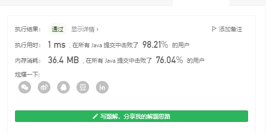

> 原文链接: https://leetcode-cn.com/problems/longer-contiguous-segments-of-ones-than-zeros


## 英文原文
<div><p>Given a binary string <code>s</code>, return <code>true</code><em> if the <strong>longest</strong> contiguous segment of </em><code>1</code>&#39;<em>s is <strong>strictly longer</strong> than the <strong>longest</strong> contiguous segment of </em><code>0</code>&#39;<em>s in </em><code>s</code>, or return <code>false</code><em> otherwise</em>.</p>

<ul>
	<li>For example, in <code>s = &quot;<u>11</u>01<u>000</u>10&quot;</code> the longest continuous segment of <code>1</code>s has length <code>2</code>, and the longest continuous segment of <code>0</code>s has length <code>3</code>.</li>
</ul>

<p>Note that if there are no <code>0</code>&#39;s, then the longest continuous segment of <code>0</code>&#39;s is considered to have a length <code>0</code>. The same applies if there is no <code>1</code>&#39;s.</p>

<p>&nbsp;</p>
<p><strong>Example 1:</strong></p>

<pre>
<strong>Input:</strong> s = &quot;1101&quot;
<strong>Output:</strong> true
<strong>Explanation:</strong>
The longest contiguous segment of 1s has length 2: &quot;<u>11</u>01&quot;
The longest contiguous segment of 0s has length 1: &quot;11<u>0</u>1&quot;
The segment of 1s is longer, so return true.
</pre>

<p><strong>Example 2:</strong></p>

<pre>
<strong>Input:</strong> s = &quot;111000&quot;
<strong>Output:</strong> false
<strong>Explanation:</strong>
The longest contiguous segment of 1s has length 3: &quot;<u>111</u>000&quot;
The longest contiguous segment of 0s has length 3: &quot;111<u>000</u>&quot;
The segment of 1s is not longer, so return false.
</pre>

<p><strong>Example 3:</strong></p>

<pre>
<strong>Input:</strong> s = &quot;110100010&quot;
<strong>Output:</strong> false
<strong>Explanation:</strong>
The longest contiguous segment of 1s has length 2: &quot;<u>11</u>0100010&quot;
The longest contiguous segment of 0s has length 3: &quot;1101<u>000</u>10&quot;
The segment of 1s is not longer, so return false.
</pre>

<p>&nbsp;</p>
<p><strong>Constraints:</strong></p>

<ul>
	<li><code>1 &lt;= s.length &lt;= 100</code></li>
	<li><code>s[i]</code> is either <code>&#39;0&#39;</code> or <code>&#39;1&#39;</code>.</li>
</ul>
</div>

## 中文题目
<div><p>给你一个二进制字符串 <code>s</code> 。如果字符串中由 <code>1</code> 组成的 <strong>最长</strong> 连续子字符串 <strong>严格长于</strong> 由 <code>0</code> 组成的 <strong>最长</strong> 连续子字符串，返回 <code>true</code> ；否则，返回 <code>false</code><em> </em>。</p>

<ul>
	<li>例如，<code>s = "<strong>11</strong>01<strong>000</strong>10"</code> 中，由 <code>1</code> 组成的最长连续子字符串的长度是 <code>2</code> ，由 <code>0</code> 组成的最长连续子字符串的长度是 <code>3</code> 。</li>
</ul>

<p>注意，如果字符串中不存在 <code>0</code> ，此时认为由 <code>0</code> 组成的最长连续子字符串的长度是 <code>0</code> 。字符串中不存在 <code>1</code> 的情况也适用此规则。</p>

<p> </p>

<p><strong>示例 1：</strong></p>

<pre>
<strong>输入：</strong>s = "1101"
<strong>输出：</strong>true
<strong>解释：</strong>
由 <code>1</code> 组成的最长连续子字符串的长度是 2："<strong>11</strong>01"
由 <code>0</code> 组成的最长连续子字符串的长度是 1："11<strong>0</strong>1"
由 1 组成的子字符串更长，故返回 true 。
</pre>

<p><strong>示例 2：</strong></p>

<pre>
<strong>输入：</strong>s = "111000"
<strong>输出：</strong>false
<strong>解释：</strong>
由 <code>1</code> 组成的最长连续子字符串的长度是 3："<strong>111</strong>000"
由<code> 0</code> 组成的最长连续子字符串的长度是 3："111<strong>000</strong>"
由 1 组成的子字符串不比由 0 组成的子字符串长，故返回 false 。
</pre>

<p><strong>示例 3：</strong></p>

<pre>
<strong>输入：</strong>s = "110100010"
<strong>输出：</strong>false
<strong>解释：</strong>
由 <code>1</code> 组成的最长连续子字符串的长度是 2："<strong>11</strong>0100010"
由 <code>0</code> 组成的最长连续子字符串的长度是 3："1101<strong>000</strong>10"
由 1 组成的子字符串不比由 0 组成的子字符串长，故返回 false 。
</pre>

<p> </p>

<p><strong>提示：</strong></p>

<ul>
	<li><code>1 <= s.length <= 100</code></li>
	<li><code>s[i]</code> 不是 <code>'0'</code> 就是 <code>'1'</code></li>
</ul>
</div>

## 通过代码
<RecoDemo>
</RecoDemo>


## 高赞题解
### 解题思路
此处撰写解题思路



### 代码

```java
class Solution {
    public boolean checkZeroOnes(String s) {
       int l=s.length();
        int m=0,resm=0;
        int n=0,resn=0;
        for(int i=0;i<l;i++){
            if(s.charAt(i) == '1'){
                m++;
                resm=Math.max(m,resm);
                n=0;
            }else{
                n++;
                m=0;
                resn=Math.max(n,resn);
            }
        }
        return resm>resn? true:false;
    }
}
```

## 统计信息
| 通过次数 | 提交次数 | AC比率 |
| :------: | :------: | :------: |
|    13215    |    17018    |   77.7%   |

## 提交历史
| 提交时间 | 提交结果 | 执行时间 |  内存消耗  | 语言 |
| :------: | :------: | :------: | :--------: | :--------: |
