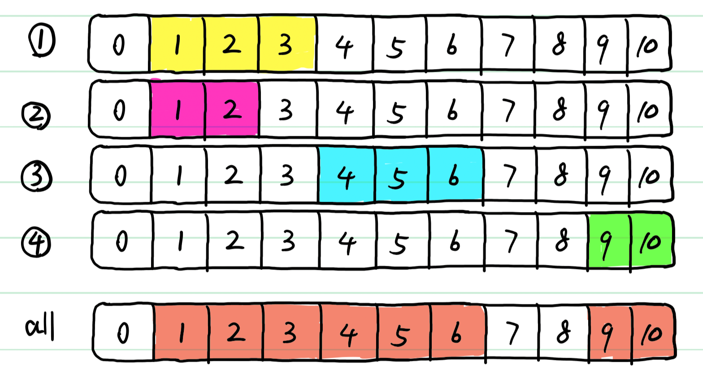
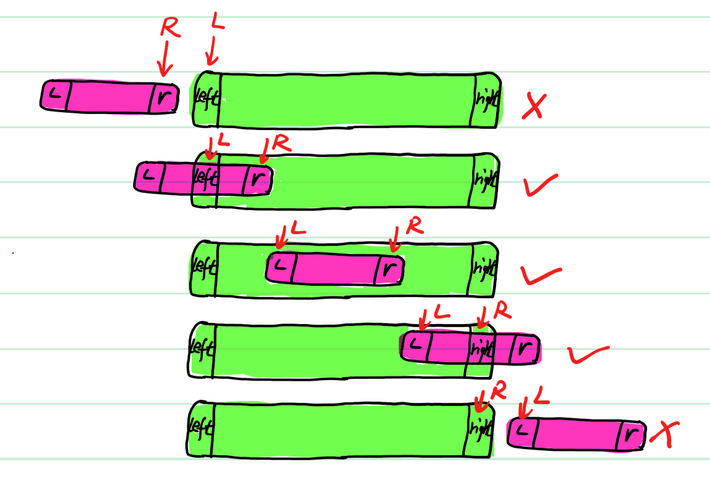
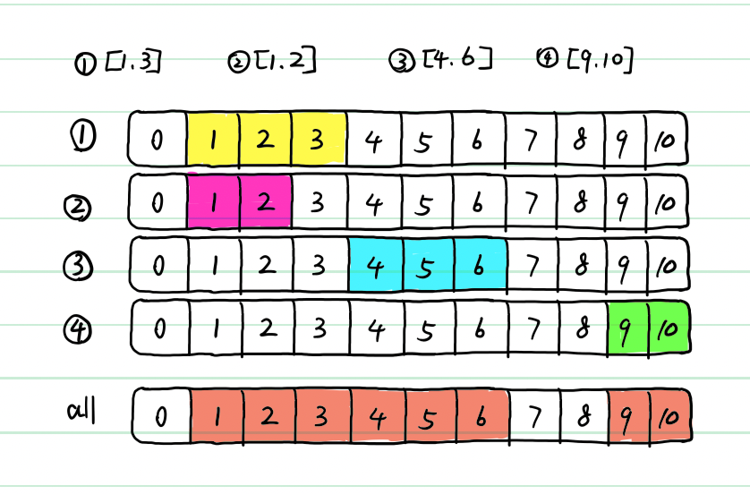
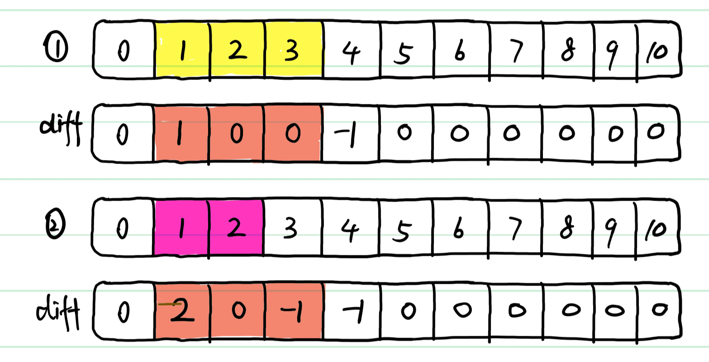
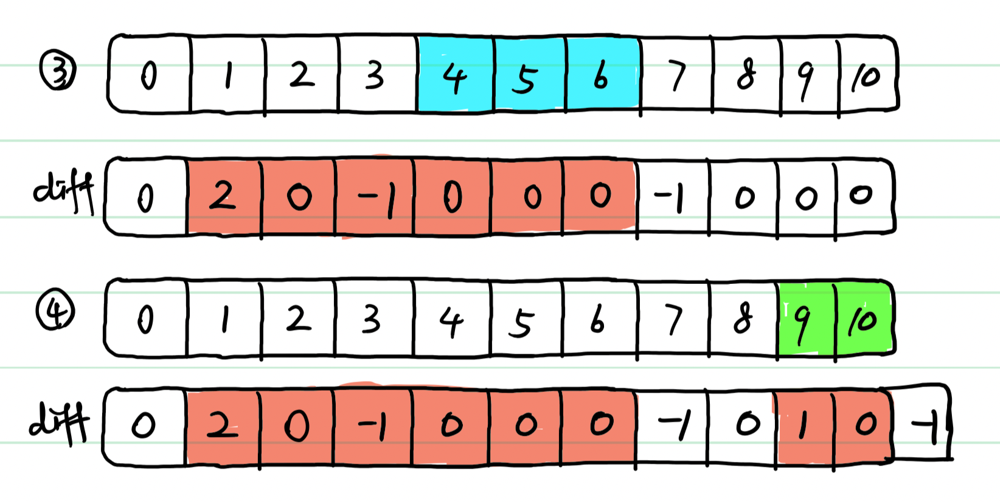
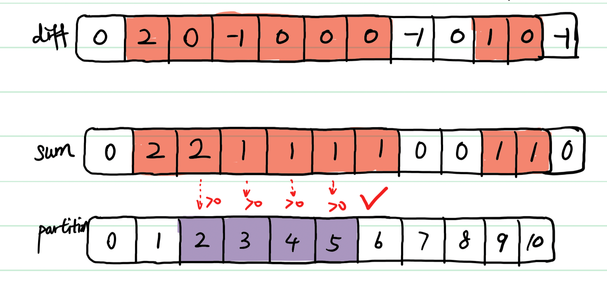

> 原文链接: https://leetcode-cn.com/problems/check-if-all-the-integers-in-a-range-are-covered


## 英文原文
<div><p>You are given a 2D integer array <code>ranges</code> and two integers <code>left</code> and <code>right</code>. Each <code>ranges[i] = [start<sub>i</sub>, end<sub>i</sub>]</code> represents an <strong>inclusive</strong> interval between <code>start<sub>i</sub></code> and <code>end<sub>i</sub></code>.</p>

<p>Return <code>true</code> <em>if each integer in the inclusive range</em> <code>[left, right]</code> <em>is covered by <strong>at least one</strong> interval in</em> <code>ranges</code>. Return <code>false</code> <em>otherwise</em>.</p>

<p>An integer <code>x</code> is covered by an interval <code>ranges[i] = [start<sub>i</sub>, end<sub>i</sub>]</code> if <code>start<sub>i</sub> &lt;= x &lt;= end<sub>i</sub></code>.</p>

<p>&nbsp;</p>
<p><strong>Example 1:</strong></p>

<pre>
<strong>Input:</strong> ranges = [[1,2],[3,4],[5,6]], left = 2, right = 5
<strong>Output:</strong> true
<strong>Explanation:</strong> Every integer between 2 and 5 is covered:
- 2 is covered by the first range.
- 3 and 4 are covered by the second range.
- 5 is covered by the third range.
</pre>

<p><strong>Example 2:</strong></p>

<pre>
<strong>Input:</strong> ranges = [[1,10],[10,20]], left = 21, right = 21
<strong>Output:</strong> false
<strong>Explanation:</strong> 21 is not covered by any range.
</pre>

<p>&nbsp;</p>
<p><strong>Constraints:</strong></p>

<ul>
	<li><code>1 &lt;= ranges.length &lt;= 50</code></li>
	<li><code>1 &lt;= start<sub>i</sub> &lt;= end<sub>i</sub> &lt;= 50</code></li>
	<li><code>1 &lt;= left &lt;= right &lt;= 50</code></li>
</ul>
</div>

## 中文题目
<div><p>给你一个二维整数数组 <code>ranges</code> 和两个整数 <code>left</code> 和 <code>right</code> 。每个 <code>ranges[i] = [start<sub>i</sub>, end<sub>i</sub>]</code> 表示一个从 <code>start<sub>i</sub></code> 到 <code>end<sub>i</sub></code> 的 <strong>闭区间</strong> 。</p>

<p>如果闭区间 <code>[left, right]</code> 内每个整数都被 <code>ranges</code> 中 <strong>至少一个</strong> 区间覆盖，那么请你返回 <code>true</code> ，否则返回 <code>false</code> 。</p>

<p>已知区间 <code>ranges[i] = [start<sub>i</sub>, end<sub>i</sub>]</code> ，如果整数 <code>x</code> 满足 <code>start<sub>i</sub> <= x <= end<sub>i</sub></code> ，那么我们称整数<code>x</code> 被覆盖了。</p>

<p> </p>

<p><strong>示例 1：</strong></p>

<pre>
<b>输入：</b>ranges = [[1,2],[3,4],[5,6]], left = 2, right = 5
<b>输出：</b>true
<b>解释：</b>2 到 5 的每个整数都被覆盖了：
- 2 被第一个区间覆盖。
- 3 和 4 被第二个区间覆盖。
- 5 被第三个区间覆盖。
</pre>

<p><strong>示例 2：</strong></p>

<pre>
<b>输入：</b>ranges = [[1,10],[10,20]], left = 21, right = 21
<b>输出：</b>false
<b>解释：</b>21 没有被任何一个区间覆盖。
</pre>

<p> </p>

<p><strong>提示：</strong></p>

<ul>
	<li><code>1 <= ranges.length <= 50</code></li>
	<li><code>1 <= start<sub>i</sub> <= end<sub>i</sub> <= 50</code></li>
	<li><code>1 <= left <= right <= 50</code></li>
</ul>
</div>

## 通过代码
<RecoDemo>
</RecoDemo>


## 高赞题解
### 解题思路



当然这个还可以利用堆，排序，hash，线段树，位运算等等很多。
接下来介绍四种参考
但是差分数组思想是最强的，功能不止于此。
暴力和优化版本标记数组只需要布尔型即可。

因为以下解法申请空间在52长度内，空间复杂度O(1)，而且第二层for循环都是对52空间内修改，故时间复杂度为O(n)，.
# 解法1：暴力
在每个节点起始位置和终点位置之间的flag标记为true，代表该点已经被包含。
当我们查询时，如果查询left与right之间只要有一点为false，返回flase

```java
class Solution {
    public boolean isCovered(int[][] ranges, int left, int right) {
        boolean[] flag = new boolean[51];
        for(int[] range : ranges){
            for(int i = range[0]; i <= range[1];i++){
                flag[i] = true;
            }
        }
        for(int i = left; i <= right; i++){
            if(flag[i] == false) return false;
        }
        return true;
    }
}
```

暴力的时间复杂度是O(51n) = O(n)，同理空间复杂度O(1)。

# 方法2：基于排序
如将区间的起始点从小到达排序，然后每次比较，如果拿到的区间[l,r]，left在区间内，即 l <= left <= r，那么可知，[left,r]便已经被覆盖，接下来只需接续检查剩余空白部分，让left = r + 1, 如果最后left可以超过right，则区间全部被覆盖。为true。

```java
class Solution {
    public boolean isCovered(int[][] ranges, int left, int right) {
        Arrays.sort(ranges, (a1, a2) -> a1[0] - a2[0]);
        for(int[] range: ranges) {
            int l = range[0];
            int r = range[1];
            if(l <= left && left <= r) {
                left = r + 1;
            }
        }
        return left > right;
    }
}
```
时间复杂度为排序算法的复杂度度 O(nlog(n))。空间复杂度，由于java7之后数组排序采用DualPrivotQuicksort代替原来快排，规模小时为插入排序，规模大时为快速排序，快速排序中，性能较为优越稳定的是随机化快排，比其他挖坑填数，取中值，或者基础快排正常情况下是2倍到4倍，属于越大越明显。所以空间复杂度O(logn)。

但是我们还可以继续优化

# 解法3：优化 只标记[left,right]
因为我们是查询left与right之间的点是否完全包含在原数组表示区间中，那么我们只需要关心
[left,right]上这一段即可。我们只标记[left,right]区间即可，
以[left,right]为基准思考，每当从二维数组中拿到一个区间[l,r]，
我们只需要标记[left,right]与[l,r]的交集部分。如果没有交集不标记。
如果l比left还小，我们没必要从l开始标记，从left标记。
如果r比right还大，我们没必要标记到r，只要标记到right即可。
故只需要定义两个变量：
 L = Math.max(l,left);
 R = Math.min(r,right);
看下图理解：
拿到的区间如果长度小，变为以下五种情况， 那么L，R满足 L <= R，才能标记，否则
不能标记，如果拿到区间长，同理，这里只是画一下示意。
# L 为left,l的较大值，   R 为right，r的较小值  打钩为可标记
# 这便是取交集思想

让拿到的区间，从左到右相对于[left,right] 进行滑动即可。
```java
class Solution {
    public boolean isCovered(int[][] ranges, int left, int right) {
        boolean[] flag = new boolean[51];
        for(int[] range : ranges){
            int L = Math.max(range[0],left);
            int R = Math.min(range[1],right);
            for(int i = L; i <= R; i++){
                flag[i] = true;
            }
        }
        for(int i = left; i <= right; i++){
            if(flag[i] == false) return false;
        }
        return true;
    }
}
```
因为遍历过程中，我们需要对L，R之间进行修改，但是[L,R]区间是小于或等于[left,right]区间的，
每次在区间内做修改，故时间复杂度为O(n(left - right + 1))也等同O(n)，因为宽度最大为常数51
故时间复杂度 O(n)。
空间复杂度O(1)。

# 解法4：差分数组
差分数组diff表示相邻格之间，是否被覆盖的变化量。
 diff[i]++,代表在i位置上有新的覆盖
若覆盖到j结束了呢？此时j依然是覆盖，但是j+1不在覆盖状态，所以在j+1处 -1；
即diff[j+1]--;
当我们把差分数组求前缀和，就很直观把这种变化量转化为不变的，可以理解的。
前缀和sum[i]的大小，就代表被覆盖次数，接下来用图展示；

如有四个需要加入的区间 1，2，3，4；加入之后 all为加入之后区间图覆盖图，但是看不出了每个点被覆盖几次，但是差分前缀和可以做到，接下来继续了解。




我们定义diff差分数组，由上定义可知，在起始下标+1，在终止下标之后-1；当加入（1）和（2）之后，差分数组黄色区域为被覆盖部分，但是从差分数组看不出来，只是示意标出来，



接下来继续同理加入(3) 和 (4)；由于(4)的是最后结束，-1没有位置，所以差分数组定义时候必须多定义一个，int[52]



接下来就是最关键，最熟悉对差分数组求前缀和。sum，发现在覆盖的地方，都是正数，而没有覆盖的地方为0，如果要查询 [2,5]，直接将[2,5]区间与sum逐个对比，看sun是否大于0，如果发现不大于0，一定出现了空白，没有覆盖，



而我们从前缀和数组可以看出，每一个位大小代表被覆盖几次，比如[1,2]区域都是2，因为我们在加入时候 (1)和(2)正是在这个地方重复覆盖，
# 所以差分数组前缀和不仅能查询是否被覆盖，还能查询某一区间被覆盖几次。

```java
class Solution {
    public boolean isCovered(int[][] ranges, int left, int right) {
        int[] diff = new int[52];
        //对差分数组进行处理
        for(int i = 0; i < ranges.length; i++){
            diff[ranges[i][0]]++;
            diff[ranges[i][1]+1]--;
        }
        //根据差分数组处理前缀和，为理解方便单独定义sum，可以原地做
        int[] sum = new int[52];
        for(int i = 1; i <= 51; i++){
            sum[i] = sum[i-1] + diff[i];
        }
        //从left到right判断是否满足sum > 0
        for(int i = left; i <= right; i++){
            if(sum[i] <= 0) return false;
        }
        return true;
    }
}
```

差分算法的时间复杂度为O(n)，空间复杂度为O(1)，
上述代码是为了方便理解。
简化版可以把前缀和与diff和在一起，就原地做，判断也加一起。

理解小伙伴点个赞，向各位大佬学习！

## 统计信息
| 通过次数 | 提交次数 | AC比率 |
| :------: | :------: | :------: |
|    32128    |    54395    |   59.1%   |

## 提交历史
| 提交时间 | 提交结果 | 执行时间 |  内存消耗  | 语言 |
| :------: | :------: | :------: | :--------: | :--------: |
