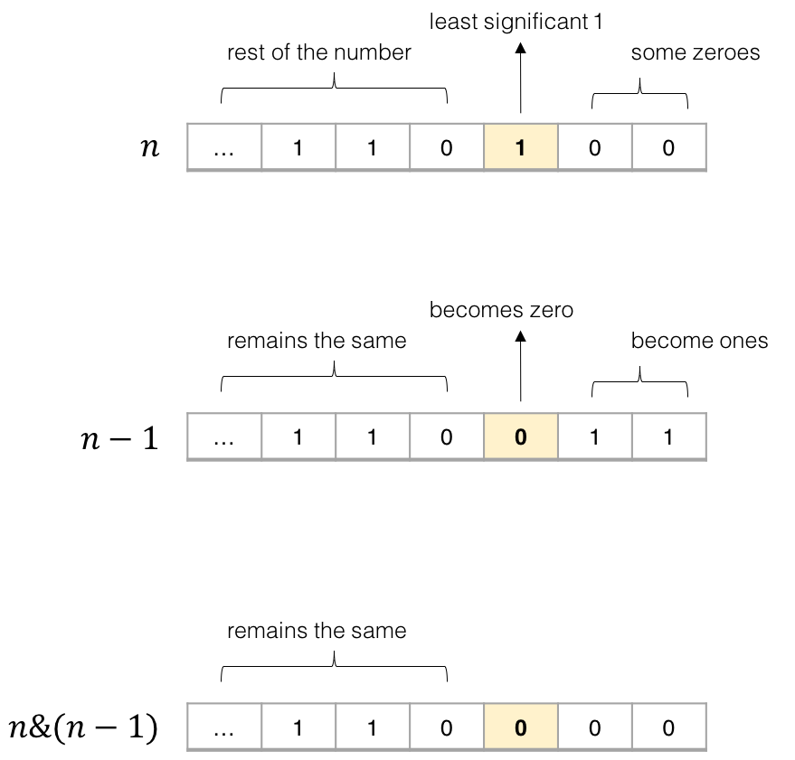

> 原文链接: https://leetcode-cn.com/problems/number-of-1-bits


## 英文原文
<div><p>Write a function that takes an unsigned integer and returns the number of &#39;1&#39; bits it has (also known as the <a href="http://en.wikipedia.org/wiki/Hamming_weight" target="_blank">Hamming weight</a>).</p>

<p><strong>Note:</strong></p>

<ul>
	<li>Note that in some languages, such as Java, there is no unsigned integer type. In this case, the input will be given as a signed integer type. It should not affect your implementation, as the integer&#39;s internal binary representation is the same, whether it is signed or unsigned.</li>
	<li>In Java, the compiler represents the signed integers using <a href="https://en.wikipedia.org/wiki/Two%27s_complement" target="_blank">2&#39;s complement notation</a>. Therefore, in <strong>Example 3</strong>, the input represents the signed integer. <code>-3</code>.</li>
</ul>

<p>&nbsp;</p>
<p><strong>Example 1:</strong></p>

<pre>
<strong>Input:</strong> n = 00000000000000000000000000001011
<strong>Output:</strong> 3
<strong>Explanation:</strong> The input binary string <strong>00000000000000000000000000001011</strong> has a total of three &#39;1&#39; bits.
</pre>

<p><strong>Example 2:</strong></p>

<pre>
<strong>Input:</strong> n = 00000000000000000000000010000000
<strong>Output:</strong> 1
<strong>Explanation:</strong> The input binary string <strong>00000000000000000000000010000000</strong> has a total of one &#39;1&#39; bit.
</pre>

<p><strong>Example 3:</strong></p>

<pre>
<strong>Input:</strong> n = 11111111111111111111111111111101
<strong>Output:</strong> 31
<strong>Explanation:</strong> The input binary string <strong>11111111111111111111111111111101</strong> has a total of thirty one &#39;1&#39; bits.
</pre>

<p>&nbsp;</p>
<p><strong>Constraints:</strong></p>

<ul>
	<li>The input must be a <strong>binary string</strong> of length <code>32</code>.</li>
</ul>

<p>&nbsp;</p>
<strong>Follow up:</strong> If this function is called many times, how would you optimize it?</div>

## 中文题目
<div><p>编写一个函数，输入是一个无符号整数（以二进制串的形式），返回其二进制表达式中数字位数为 '1' 的个数（也被称为<a href="https://baike.baidu.com/item/%E6%B1%89%E6%98%8E%E9%87%8D%E9%87%8F" target="_blank">汉明重量</a>）。</p>

<p> </p>

<p><strong>提示：</strong></p>

<ul>
	<li>请注意，在某些语言（如 Java）中，没有无符号整数类型。在这种情况下，输入和输出都将被指定为有符号整数类型，并且不应影响您的实现，因为无论整数是有符号的还是无符号的，其内部的二进制表示形式都是相同的。</li>
	<li>在 Java 中，编译器使用<a href="https://baike.baidu.com/item/二进制补码/5295284" target="_blank">二进制补码</a>记法来表示有符号整数。因此，在上面的 <strong>示例 3</strong> 中，输入表示有符号整数 <code>-3</code>。</li>
</ul>

<p> </p>

<p><strong>示例 1：</strong></p>

<pre>
<strong>输入：</strong>00000000000000000000000000001011
<strong>输出：</strong>3
<strong>解释：</strong>输入的二进制串 <code><strong>00000000000000000000000000001011</strong> 中，共有三位为 '1'。</code>
</pre>

<p><strong>示例 2：</strong></p>

<pre>
<strong>输入：</strong>00000000000000000000000010000000
<strong>输出：</strong>1
<strong>解释：</strong>输入的二进制串 <strong>00000000000000000000000010000000</strong> 中，共有一位为 '1'。
</pre>

<p><strong>示例 3：</strong></p>

<pre>
<strong>输入：</strong>11111111111111111111111111111101
<strong>输出：</strong>31
<strong>解释：</strong>输入的二进制串 <strong>11111111111111111111111111111101</strong> 中，共有 31 位为 '1'。</pre>

<p> </p>

<p><strong>提示：</strong></p>

<ul>
	<li>输入必须是长度为 <code>32</code> 的 <strong>二进制串</strong> 。</li>
</ul>

<ul>
</ul>

<p> </p>

<p><strong>进阶</strong>：</p>

<ul>
	<li>如果多次调用这个函数，你将如何优化你的算法？</li>
</ul>
</div>

## 通过代码
<RecoDemo>
</RecoDemo>


## 高赞题解
各位题友大家好！ 今天是 **[@负雪明烛](/u/fuxuemingzhu/)** 坚持日更的第 **57** 天。今天力扣上的每日一题是「[191. 位1的个数](https://leetcode-cn.com/problems/number-of-1-bits/)」。

# 解题思路


今天的题目又可以重拳出击。

# 一、库函数


在 Python 语言中，使用 `bin()` 函数可以得到一个整数的二进制字符串。比如 `bin(666)` 会得到：


```
>>> bin(666)
'0b1010011010'
```


得到二进制字符串，统计字符串中 `"1"` 的次数即可。


需要注意的是，二进制字符串是以 `"0b"` 开头，所以如果题目要问的是二进制中 0 的个数，需要注意答案是 `bin(n).count("0") - 1`。


```Python []
class Solution(object):
    def hammingWeight(self, n):
        return bin(n).count("1")
```


- 时间复杂度：$O(k)$，k 为 n 的二进制长度。
- 空间复杂度：$O(k)$，k 为 n 的二进制长度。


# 二、右移 32 次


如果除去库函数之外，我们最容易想到的办法，肯定还是直观地统计二进制中每一位是否包含 `1` 。


做法是：

- 使用 `n & 1` 得到二进制末尾是否为 1；
- 把 `n` 右移 1 位，直至结束。


于是我们可以写出以下的代码：


```Python []
class Solution(object):
    def hammingWeight(self, n):
        res = 0
        while n:
            res += n & 1
            n >>= 1
        return res
```

```Java []
public class Solution {
    // you need to treat n as an unsigned value
    public int hammingWeight(int n) {
        int count = 0;
        for (int i = 0; i < 32; ++i) {
            count += n & 1;
            n >>= 1;
        }
        return count;
    }
}
```

## 小心坑

值得一提的时候，在 Java 中，以下代码会 `超时`。这就不得不讲一讲 Java 中的 `算术右移` 和 `逻辑右移` 。


- **算术右移 `>>`** ：舍弃最低位，高位用符号位填补；
- **逻辑右移 `>>>`** ：舍弃最低位，高位用 0 填补。


那么对于负数而言，其二进制最高位是 1，如果使用算术右移，那么高位填补的仍然是 1。也就是 n 永远不会为 0。所以下面的代码会**超时 TLE**。


```Java []
public class Solution {
    // you need to treat n as an unsigned value
    public int hammingWeight(int n) {
        int count = 0;
        while (n != 0) {
            count += n & 1;
            n >>= 1;
        }
        return count;
    }
}
```


在 Java 中需要使用逻辑右移，即 `>>>` ，while 的判断条件才能是 `n != 0` 。正确的代码如下：


```Java []
public class Solution {
    // you need to treat n as an unsigned value
    public int hammingWeight(int n) {
        int count = 0;
        while (n != 0) {
            count += n & 1;
            n >>>= 1;
        }
        return count;
    }
}
```


- 时间复杂度：$O(k)$，k 为 n 的二进制长度。
- 空间复杂度：$O(1)$。


# 三、消除二进制末尾的 1


有个更为神奇的做法，那就是 `n & (n - 1)` ，这个代码可以把 n 的二进制中，最后一个出现的 1 改写成 0。


下面的这个图，说明了 `n & (n - 1) `这个操作的原理。我们发现只要每次执行这个操作，就会消除掉 `n` 的二进制中 最后一个出现的 1。


因此执行 `n & (n - 1)` 使得 n 变成 0 的操作次数，就是 n 的二进制中 1 的个数。





代码如下：

```python []
class Solution(object):
    def hammingWeight(self, n):
        res = 0
        while n:
            res += 1
            n &= n - 1
        return res
```
```Java []
public class Solution {
    // you need to treat n as an unsigned value
    public int hammingWeight(int n) {
        int res = 0;
        while (n != 0) {
            res += 1;
            n &= n - 1;
        }
        return res;
    }
}
```


- 时间复杂度：$O(k)$，k 为 n 的二进制长度。
- 空间复杂度：$O(1)$。

# 刷题心得


- 今天这个题非常经典，特别是 `n & (n - 1)` 的技巧可以消除二进制中最后一个 1，虽然该技巧在刷题中用到的不多，但是还是推荐掌握。
- 位运算就是这么神奇。

参考资料：[图源](https://leetcode.com/problems/number-of-1-bits/solution/)，leetcode 的官方题解。

-----


OK，以上就是 [@负雪明烛](https://leetcode-cn.com/u/fuxuemingzhu/) 写的今天题解的全部内容了，如果你觉得有帮助的话，**求赞、求关注、求收藏**。如果有疑问的话，请在下面评论，我会及时解答。


**关注我**，你将不会错过我的精彩动画题解、面试题分享、组队刷题活动，进入主页 [@负雪明烛](https://leetcode-cn.com/u/fuxuemingzhu/) 右侧有刷题组织，从此刷题不再孤单。


祝大家牛年大吉！AC 多多，Offer 多多！我们明天再见！

## 统计信息
| 通过次数 | 提交次数 | AC比率 |
| :------: | :------: | :------: |
|    202870    |    270342    |   75.0%   |

## 提交历史
| 提交时间 | 提交结果 | 执行时间 |  内存消耗  | 语言 |
| :------: | :------: | :------: | :--------: | :--------: |


## 相似题目
|                             题目                             | 难度 |
| :----------------------------------------------------------: | :---------: |
| [颠倒二进制位](https://leetcode-cn.com/problems/reverse-bits/) | 简单|
| [2 的幂](https://leetcode-cn.com/problems/power-of-two/) | 简单|
| [比特位计数](https://leetcode-cn.com/problems/counting-bits/) | 简单|
| [二进制手表](https://leetcode-cn.com/problems/binary-watch/) | 简单|
| [汉明距离](https://leetcode-cn.com/problems/hamming-distance/) | 简单|
| [交替位二进制数](https://leetcode-cn.com/problems/binary-number-with-alternating-bits/) | 简单|
| [二进制表示中质数个计算置位](https://leetcode-cn.com/problems/prime-number-of-set-bits-in-binary-representation/) | 简单|
