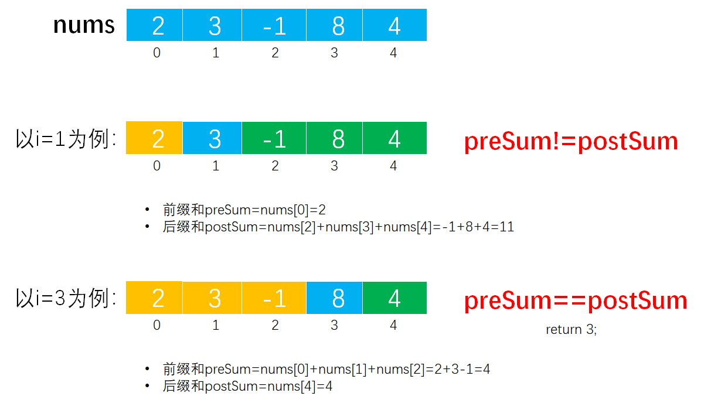

> 原文链接: https://leetcode-cn.com/problems/find-the-middle-index-in-array


## 英文原文
<div><p>Given a <strong>0-indexed</strong> integer array <code>nums</code>, find the <strong>leftmost</strong> <code>middleIndex</code> (i.e., the smallest amongst all the possible ones).</p>

<p>A <code>middleIndex</code> is an index where <code>nums[0] + nums[1] + ... + nums[middleIndex-1] == nums[middleIndex+1] + nums[middleIndex+2] + ... + nums[nums.length-1]</code>.</p>

<p>If <code>middleIndex == 0</code>, the left side sum is considered to be <code>0</code>. Similarly, if <code>middleIndex == nums.length - 1</code>, the right side sum is considered to be <code>0</code>.</p>

<p>Return <em>the <strong>leftmost</strong> </em><code>middleIndex</code><em> that satisfies the condition, or </em><code>-1</code><em> if there is no such index</em>.</p>

<p>&nbsp;</p>
<p><strong>Example 1:</strong></p>

<pre>
<strong>Input:</strong> nums = [2,3,-1,<u>8</u>,4]
<strong>Output:</strong> 3
<strong>Explanation:</strong>
The sum of the numbers before index 3 is: 2 + 3 + -1 = 4
The sum of the numbers after index 3 is: 4 = 4
</pre>

<p><strong>Example 2:</strong></p>

<pre>
<strong>Input:</strong> nums = [1,-1,<u>4</u>]
<strong>Output:</strong> 2
<strong>Explanation:</strong>
The sum of the numbers before index 2 is: 1 + -1 = 0
The sum of the numbers after index 2 is: 0
</pre>

<p><strong>Example 3:</strong></p>

<pre>
<strong>Input:</strong> nums = [2,5]
<strong>Output:</strong> -1
<strong>Explanation:</strong>
There is no valid middleIndex.
</pre>

<p><strong>Example 4:</strong></p>

<pre>
<strong>Input:</strong> nums = [<u>1</u>]
<strong>Output:</strong> 0
<strong>Explantion:</strong>
The sum of the numbers before index 0 is: 0
The sum of the numbers after index 0 is: 0
</pre>

<p>&nbsp;</p>
<p><strong>Constraints:</strong></p>

<ul>
	<li><code>1 &lt;= nums.length &lt;= 100</code></li>
	<li><code>-1000 &lt;= nums[i] &lt;= 1000</code></li>
</ul>

<p>&nbsp;</p>
<p><strong>Note:</strong> This question is the same as&nbsp;724:&nbsp;<a href="https://leetcode.com/problems/find-pivot-index/" target="_blank">https://leetcode.com/problems/find-pivot-index/</a></p>
</div>

## 中文题目
<div><p>给你一个下标从 <strong>0</strong>&nbsp;开始的整数数组&nbsp;<code>nums</code>&nbsp;，请你找到 <strong>最左边</strong>&nbsp;的中间位置&nbsp;<code>middleIndex</code>&nbsp;（也就是所有可能中间位置下标最小的一个）。</p>

<p>中间位置&nbsp;<code>middleIndex</code>&nbsp;是满足&nbsp;<code>nums[0] + nums[1] + ... + nums[middleIndex-1] == nums[middleIndex+1] + nums[middleIndex+2] + ... + nums[nums.length-1]</code>&nbsp;的数组下标。</p>

<p>如果&nbsp;<code>middleIndex == 0</code>&nbsp;，左边部分的和定义为 <code>0</code>&nbsp;。类似的，如果&nbsp;<code>middleIndex == nums.length - 1</code>&nbsp;，右边部分的和定义为&nbsp;<code>0</code>&nbsp;。</p>

<p>请你返回满足上述条件 <strong>最左边</strong>&nbsp;的<em>&nbsp;</em><code>middleIndex</code>&nbsp;，如果不存在这样的中间位置，请你返回&nbsp;<code>-1</code>&nbsp;。</p>

<p>&nbsp;</p>

<p><strong>示例 1：</strong></p>

<pre>
<b>输入：</b>nums = [2,3,-1,<em><strong>8</strong></em>,4]
<b>输出：</b>3
<strong>解释：</strong>
下标 3 之前的数字和为：2 + 3 + -1 = 4
下标 3 之后的数字和为：4 = 4
</pre>

<p><strong>示例 2：</strong></p>

<pre>
<b>输入：</b>nums = [1,-1,<em><strong>4</strong></em>]
<b>输出：</b>2
<strong>解释：</strong>
下标 2 之前的数字和为：1 + -1 = 0
下标 2 之后的数字和为：0
</pre>

<p><strong>示例 3：</strong></p>

<pre>
<b>输入：</b>nums = [2,5]
<b>输出：</b>-1
<b>解释：</b>
不存在符合要求的 middleIndex 。
</pre>

<p><strong>示例 4：</strong></p>

<pre>
<b>输入：</b>nums = [<em><strong>1</strong></em>]
<b>输出：</b>0
<strong>解释：</strong>
下标 0 之前的数字和为：0
下标 0 之后的数字和为：0
</pre>

<p>&nbsp;</p>

<p><strong>提示：</strong></p>

<ul>
	<li><code>1 &lt;= nums.length &lt;= 100</code></li>
	<li><code>-1000 &lt;= nums[i] &lt;= 1000</code></li>
</ul>

<p>&nbsp;</p>

<p><strong>注意：</strong>本题与主站 724 题相同：<a href="https://leetcode-cn.com/problems/find-pivot-index/" target="_blank">https://leetcode-cn.com/problems/find-pivot-index/</a></p>
</div>

## 通过代码
<RecoDemo>
</RecoDemo>


## 高赞题解
其实本题考查的是前缀和，而下面的三种解法都是使用前缀和来解答问题。
## 解法1

```java
class Solution {
    /**
     * <p>思路：求下标i之前所有元素（不包括i）的和，以及下标i之后所有元素（不包括i）的和，比较二者是否相等，如果相等则表示i是中间位置，则返回i。如果所有都不能匹配则返回-1。</p>
     * <p>结果：</p>
     * <ul>
     *     <li>执行用时：1 ms, 在所有 Java 提交中击败了76.91% 的用户</li>
     *     <li>内存消耗：37.8 MB, 在所有 Java 提交中击败了41.47% 的用户</li>
     *     <li>通过测试用例：294 / 294</li>
     * </ul>
     *
     * @param nums 整数数组
     * @return 数组的中间位置
     */
    public int findMiddleIndex(int[] nums) {
        // 循环遍历数组中所有元素
        for (int i = 0; i < nums.length; i++) {
            // 计算下标i之前和之后所有元素的总和
            int before = beforeSum(nums, i);
            int after = afterSum(nums, i);
            // 如果相等则返回i
            if (before == after) {
                return i;
            }
        }
        return -1;
    }

    /**
     * <p>计算nums数组种index下标之前（不包括index）所有元素的总和。</p>
     *
     * @param nums  整数数组
     * @param index 指定下标
     * @return index下标之前所有元素的总和
     */
    public int beforeSum(int[] nums, int index) {
        int sum = 0;
        for (int i = 0; i < index; i++) {
            sum += nums[i];
        }
        return sum;
    }

    /**
     * <p>计算nums数组种index下标之后（不包括index）所有元素的总和。</p>
     *
     * @param nums  整数数组
     * @param index 指定下标
     * @return index下标之后所有元素的总和
     */
    public int afterSum(int[] nums, int index) {
        int sum = 0;
        for (int i = index + 1; i < nums.length; i++) {
            sum += nums[i];
        }
        return sum;
    }
}
```

## 解法2
```java
class Solution {
    /**
     * <p>思路：前缀和。如果某下标i的前缀和与其后缀和相等则表示找到了数组的中间位置。前缀和就是i之前所有元素的总和，后缀和就是i之后所有元素的总和，都不包括i。</p>
     * <p>结果：成功</p>
     * <ul>
     *     <li>执行用时：0 ms, 在所有 Java 提交中击败了100.00% 的用户</li>
     *     <li>内存消耗：37.8 MB, 在所有 Java 提交中击败了49.67% 的用户</li>
     *     <li>通过测试用例：294 / 294</li>
     * </ul>
     *
     * @param nums 整数数组
     * @return 数组的中间位置
     */
    public int findMiddleIndex(int[] nums) {
        // 计算nums数组的中所有元素总和
        int sum = 0;
        for (int num : nums) {
            sum += num;
        }

        int preSum = 0;// 前缀和
        for (int i = 0; i < nums.length; i++) {
            // 后缀和，即数组元素总和减去前缀和，减去当前元素得到的结果
            int postSum = sum - preSum - nums[i];
            // 如果前缀和等于后缀和则返回i
            if (preSum == postSum) {
                return i;
            }
            // 更新前缀和
            preSum += nums[i];
        }

        return -1;
    }
}
```

## 解法3
```java
class Solution {
    /**
     * <p>思路：前缀和的变种。</p>
     * <p>结果：成功</p>
     * <ul>
     *     <li>执行用时：0 ms, 在所有 Java 提交中击败了100.00% 的用户</li>
     *     <li>内存消耗：37.5 MB, 在所有 Java 提交中击败了98.25% 的用户</li>
     *     <li>通过测试用例：294 / 294</li>
     * </ul>
     *
     * @param nums 整数数组
     * @return 数组的中间位置
     */
    public int findMiddleIndex(int[] nums) {
        // 计算nums数组的中所有元素总和
        int sum = 0;
        for (int num : nums) {
            sum += num;
        }

        int preSum = 0;// 前缀和
        for (int i = 0; i < nums.length; i++) {
            // 前缀和 + nums[i] + 后缀和 = 总和
            // if(前缀和==后缀和) return i;
            // 所以：if(2*前缀和=总和-nums[i]) return i;
            // 如果前缀和的2倍等于总和减去当前值则表示找到数组的中间位置
            if (preSum * 2 == sum - nums[i]) {
                return i;
            }
            // 更新前缀和
            preSum += nums[i];
        }

        return -1;
    }
}
```

## 统计信息
| 通过次数 | 提交次数 | AC比率 |
| :------: | :------: | :------: |
|    5500    |    8372    |   65.7%   |

## 提交历史
| 提交时间 | 提交结果 | 执行时间 |  内存消耗  | 语言 |
| :------: | :------: | :------: | :--------: | :--------: |
