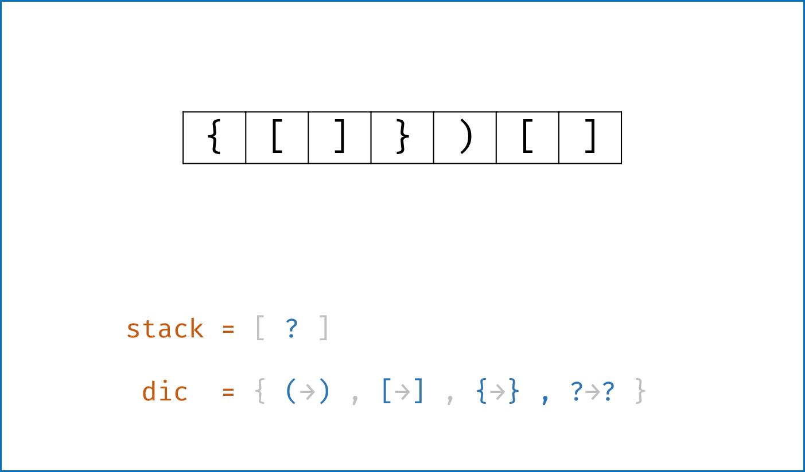
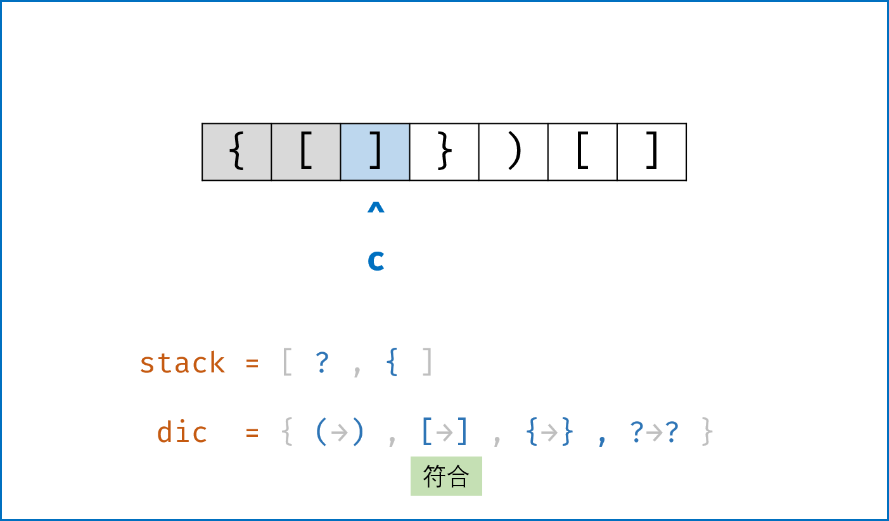
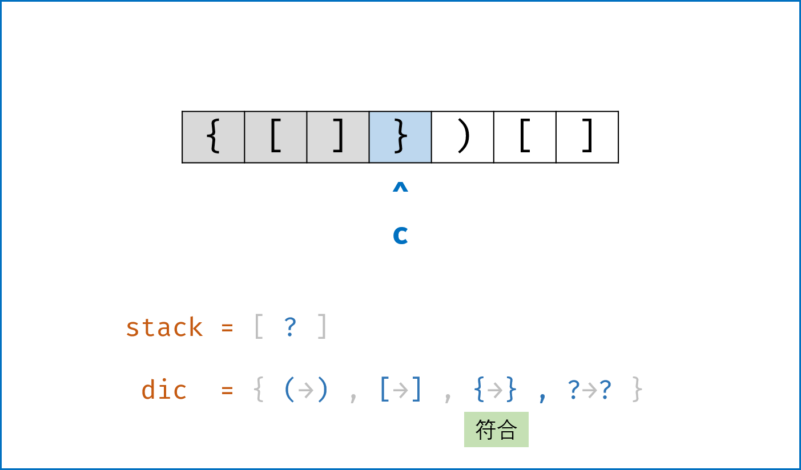
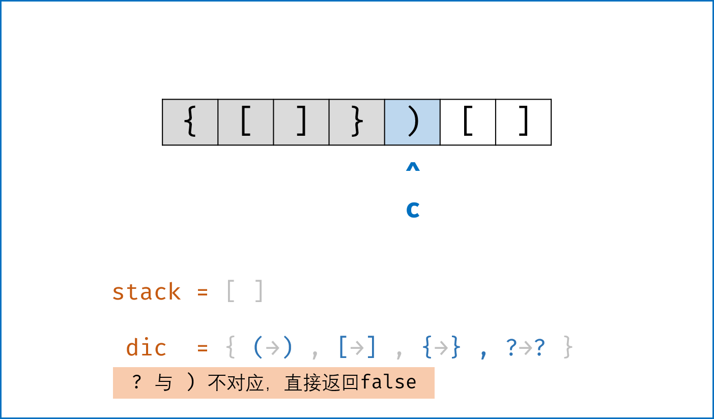

> 原文链接: https://leetcode-cn.com/problems/valid-parentheses


## 英文原文
<div><p>Given a string <code>s</code> containing just the characters <code>&#39;(&#39;</code>, <code>&#39;)&#39;</code>, <code>&#39;{&#39;</code>, <code>&#39;}&#39;</code>, <code>&#39;[&#39;</code> and <code>&#39;]&#39;</code>, determine if the input string is valid.</p>

<p>An input string is valid if:</p>

<ol>
	<li>Open brackets must be closed by the same type of brackets.</li>
	<li>Open brackets must be closed in the correct order.</li>
</ol>

<p>&nbsp;</p>
<p><strong>Example 1:</strong></p>

<pre>
<strong>Input:</strong> s = &quot;()&quot;
<strong>Output:</strong> true
</pre>

<p><strong>Example 2:</strong></p>

<pre>
<strong>Input:</strong> s = &quot;()[]{}&quot;
<strong>Output:</strong> true
</pre>

<p><strong>Example 3:</strong></p>

<pre>
<strong>Input:</strong> s = &quot;(]&quot;
<strong>Output:</strong> false
</pre>

<p><strong>Example 4:</strong></p>

<pre>
<strong>Input:</strong> s = &quot;([)]&quot;
<strong>Output:</strong> false
</pre>

<p><strong>Example 5:</strong></p>

<pre>
<strong>Input:</strong> s = &quot;{[]}&quot;
<strong>Output:</strong> true
</pre>

<p>&nbsp;</p>
<p><strong>Constraints:</strong></p>

<ul>
	<li><code>1 &lt;= s.length &lt;= 10<sup>4</sup></code></li>
	<li><code>s</code> consists of parentheses only <code>&#39;()[]{}&#39;</code>.</li>
</ul>
</div>

## 中文题目
<div><p>给定一个只包括 <code>'('</code>，<code>')'</code>，<code>'{'</code>，<code>'}'</code>，<code>'['</code>，<code>']'</code> 的字符串 <code>s</code> ，判断字符串是否有效。</p>

<p>有效字符串需满足：</p>

<ol>
	<li>左括号必须用相同类型的右括号闭合。</li>
	<li>左括号必须以正确的顺序闭合。</li>
</ol>

<p> </p>

<p><strong>示例 1：</strong></p>

<pre>
<strong>输入：</strong>s = "()"
<strong>输出：</strong>true
</pre>

<p><strong>示例 2：</strong></p>

<pre>
<strong>输入：</strong>s = "()[]{}"
<strong>输出：</strong>true
</pre>

<p><strong>示例 3：</strong></p>

<pre>
<strong>输入：</strong>s = "(]"
<strong>输出：</strong>false
</pre>

<p><strong>示例 4：</strong></p>

<pre>
<strong>输入：</strong>s = "([)]"
<strong>输出：</strong>false
</pre>

<p><strong>示例 5：</strong></p>

<pre>
<strong>输入：</strong>s = "{[]}"
<strong>输出：</strong>true</pre>

<p> </p>

<p><strong>提示：</strong></p>

<ul>
	<li><code>1 <= s.length <= 10<sup>4</sup></code></li>
	<li><code>s</code> 仅由括号 <code>'()[]{}'</code> 组成</li>
</ul>
</div>

## 通过代码
<RecoDemo>
</RecoDemo>


## 高赞题解
#### 解题思路：
 
- **算法原理** 

    - 栈先入后出特点恰好与本题括号排序特点一致，即若遇到左括号入栈，遇到右括号时将对应栈顶左括号出栈，则遍历完所有括号后 `stack` 仍然为空；
    - 建立哈希表 `dic` 构建左右括号对应关系：$key$ 左括号，$value$ 右括号；这样查询 $2$ 个括号是否对应只需 $O(1)$ 时间复杂度；建立栈 `stack`，遍历字符串 `s` 并按照算法流程一一判断。
- **算法流程**
    1. 如果 `c` 是左括号，则入栈 $push$；
    2. 否则通过哈希表判断括号对应关系，若 `stack` 栈顶出栈括号 `stack.pop()` 与当前遍历括号 `c` 不对应，则提前返回 $false$。
- **提前返回** $false$
    - **提前返回优点：** 在迭代过程中，提前发现不符合的括号并且返回，提升算法效率。
    - **解决边界问题：**
        - **栈** `stack` **为空：** 此时 `stack.pop()` 操作会报错；因此，我们采用一个取巧方法，给 `stack` 赋初值 $?$ ，并在哈希表 `dic` 中建立 $key: '?'，value:'?'$ 的对应关系予以配合。此时当 `stack` 为空且 `c` 为右括号时，可以正常提前返回 $false$；
        - **字符串** `s` **以左括号结尾：** 此情况下可以正常遍历完整个 `s`，但 `stack` 中遗留未出栈的左括号；因此，最后需返回 `len(stack) == 1`，以判断是否是有效的括号组合。
- **复杂度分析**
    - 时间复杂度 $O(N)$：正确的括号组合需要遍历 $1$ 遍 `s`；
    - 空间复杂度 $O(N)$：哈希表和栈使用线性的空间大小。

<,,,,,>

#### 代码：

```Python []
class Solution:
    def isValid(self, s: str) -> bool:
        dic = {'{': '}',  '[': ']', '(': ')', '?': '?'}
        stack = ['?']
        for c in s:
            if c in dic: stack.append(c)
            elif dic[stack.pop()] != c: return False 
        return len(stack) == 1
```

```Java []
class Solution {
    private static final Map<Character,Character> map = new HashMap<Character,Character>(){{
        put('{','}'); put('[',']'); put('(',')'); put('?','?');
    }};
    public boolean isValid(String s) {
        if(s.length() > 0 && !map.containsKey(s.charAt(0))) return false;
        LinkedList<Character> stack = new LinkedList<Character>() {{ add('?'); }};
        for(Character c : s.toCharArray()){
            if(map.containsKey(c)) stack.addLast(c);
            else if(map.get(stack.removeLast()) != c) return false;
        }
        return stack.size() == 1;
    }
}
```

## 统计信息
| 通过次数 | 提交次数 | AC比率 |
| :------: | :------: | :------: |
|    851813    |    1912783    |   44.5%   |

## 提交历史
| 提交时间 | 提交结果 | 执行时间 |  内存消耗  | 语言 |
| :------: | :------: | :------: | :--------: | :--------: |


## 相似题目
|                             题目                             | 难度 |
| :----------------------------------------------------------: | :---------: |
| [括号生成](https://leetcode-cn.com/problems/generate-parentheses/) | 中等|
| [最长有效括号](https://leetcode-cn.com/problems/longest-valid-parentheses/) | 困难|
| [删除无效的括号](https://leetcode-cn.com/problems/remove-invalid-parentheses/) | 困难|
| [检查替换后的词是否有效](https://leetcode-cn.com/problems/check-if-word-is-valid-after-substitutions/) | 中等|
