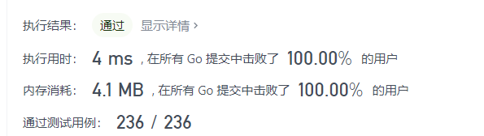

> 原文链接: https://leetcode-cn.com/problems/count-number-of-pairs-with-absolute-difference-k


## 英文原文
<div><p>Given an integer array <code>nums</code> and an integer <code>k</code>, return <em>the number of pairs</em> <code>(i, j)</code> <em>where</em> <code>i &lt; j</code> <em>such that</em> <code>|nums[i] - nums[j]| == k</code>.</p>

<p>The value of <code>|x|</code> is defined as:</p>

<ul>
	<li><code>x</code> if <code>x &gt;= 0</code>.</li>
	<li><code>-x</code> if <code>x &lt; 0</code>.</li>
</ul>

<p>&nbsp;</p>
<p><strong>Example 1:</strong></p>

<pre>
<strong>Input:</strong> nums = [1,2,2,1], k = 1
<strong>Output:</strong> 4
<strong>Explanation:</strong> The pairs with an absolute difference of 1 are:
- [<strong><u>1</u></strong>,<strong><u>2</u></strong>,2,1]
- [<strong><u>1</u></strong>,2,<strong><u>2</u></strong>,1]
- [1,<strong><u>2</u></strong>,2,<strong><u>1</u></strong>]
- [1,2,<strong><u>2</u></strong>,<strong><u>1</u></strong>]
</pre>

<p><strong>Example 2:</strong></p>

<pre>
<strong>Input:</strong> nums = [1,3], k = 3
<strong>Output:</strong> 0
<strong>Explanation:</strong> There are no pairs with an absolute difference of 3.
</pre>

<p><strong>Example 3:</strong></p>

<pre>
<strong>Input:</strong> nums = [3,2,1,5,4], k = 2
<strong>Output:</strong> 3
<b>Explanation:</b> The pairs with an absolute difference of 2 are:
- [<strong><u>3</u></strong>,2,<strong><u>1</u></strong>,5,4]
- [<strong><u>3</u></strong>,2,1,<strong><u>5</u></strong>,4]
- [3,<strong><u>2</u></strong>,1,5,<strong><u>4</u></strong>]
</pre>

<p>&nbsp;</p>
<p><strong>Constraints:</strong></p>

<ul>
	<li><code>1 &lt;= nums.length &lt;= 200</code></li>
	<li><code>1 &lt;= nums[i] &lt;= 100</code></li>
	<li><code>1 &lt;= k &lt;= 99</code></li>
</ul>
</div>

## 中文题目
<div><p>给你一个整数数组&nbsp;<code>nums</code>&nbsp;和一个整数&nbsp;<code>k</code>&nbsp;，请你返回数对&nbsp;<code>(i, j)</code>&nbsp;的数目，满足&nbsp;<code>i &lt; j</code>&nbsp;且&nbsp;<code>|nums[i] - nums[j]| == k</code>&nbsp;。</p>

<p><code>|x|</code>&nbsp;的值定义为：</p>

<ul>
	<li>如果&nbsp;<code>x &gt;= 0</code>&nbsp;，那么值为&nbsp;<code>x</code>&nbsp;。</li>
	<li>如果&nbsp;<code>x &lt; 0</code>&nbsp;，那么值为&nbsp;<code>-x</code>&nbsp;。</li>
</ul>

<p>&nbsp;</p>

<p><strong>示例 1：</strong></p>

<pre><b>输入：</b>nums = [1,2,2,1], k = 1
<b>输出：</b>4
<b>解释：</b>差的绝对值为 1 的数对为：
- [<em><strong>1</strong></em>,<em><strong>2</strong></em>,2,1]
- [<em><strong>1</strong></em>,2,<em><strong>2</strong></em>,1]
- [1,<em><strong>2</strong></em>,2,<em><strong>1</strong></em>]
- [1,2,<em><strong>2</strong></em>,<em><strong>1</strong></em>]
</pre>

<p><strong>示例 2：</strong></p>

<pre><b>输入：</b>nums = [1,3], k = 3
<b>输出：</b>0
<b>解释：</b>没有任何数对差的绝对值为 3 。
</pre>

<p><strong>示例 3：</strong></p>

<pre><b>输入：</b>nums = [3,2,1,5,4], k = 2
<b>输出：</b>3
<b>解释：</b>差的绝对值为 2 的数对为：
- [<em><strong>3</strong></em>,2,<em><strong>1</strong></em>,5,4]
- [<em><strong>3</strong></em>,2,1,<em><strong>5</strong></em>,4]
- [3,<em><strong>2</strong></em>,1,5,<em><strong>4</strong></em>]
</pre>

<p>&nbsp;</p>

<p><strong>提示：</strong></p>

<ul>
	<li><code>1 &lt;= nums.length &lt;= 200</code></li>
	<li><code>1 &lt;= nums[i] &lt;= 100</code></li>
	<li><code>1 &lt;= k &lt;= 99</code></li>
</ul>
</div>

## 通过代码
<RecoDemo>
</RecoDemo>


## 高赞题解
### 解题思路
类似两数之和，一个哈希表记录之前的数据个数，然后统计当前满足条件的答案




### 代码

```golang
func countKDifference(nums []int, k int) (ans int) {
    v := map[int]int{}
    n := len(nums)
    for i := 0; i < n; i++ {
        if c, ok := v[nums[i]+k]; ok {
            ans+=c
        }
        if c, ok := v[nums[i]-k]; ok {
            ans+=c
        }
        v[nums[i]]++
    }
    return 
}
```

时间复杂度：$O(n)$
空间复杂度：$O(n)$

## 统计信息
| 通过次数 | 提交次数 | AC比率 |
| :------: | :------: | :------: |
|    5401    |    6311    |   85.6%   |

## 提交历史
| 提交时间 | 提交结果 | 执行时间 |  内存消耗  | 语言 |
| :------: | :------: | :------: | :--------: | :--------: |
