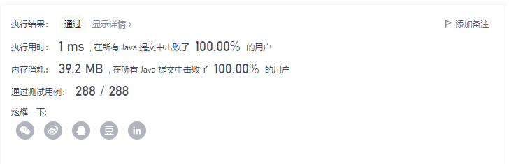

> 原文链接: https://leetcode-cn.com/problems/two-out-of-three


## 英文原文
<div>Given three integer arrays <code>nums1</code>, <code>nums2</code>, and <code>nums3</code>, return <em>a <strong>distinct</strong> array containing all the values that are present in <strong>at least two</strong> out of the three arrays. You may return the values in <strong>any</strong> order</em>.
<p>&nbsp;</p>
<p><strong>Example 1:</strong></p>

<pre>
<strong>Input:</strong> nums1 = [1,1,3,2], nums2 = [2,3], nums3 = [3]
<strong>Output:</strong> [3,2]
<strong>Explanation:</strong> The values that are present in at least two arrays are:
- 3, in all three arrays.
- 2, in nums1 and nums2.
</pre>

<p><strong>Example 2:</strong></p>

<pre>
<strong>Input:</strong> nums1 = [3,1], nums2 = [2,3], nums3 = [1,2]
<strong>Output:</strong> [2,3,1]
<strong>Explanation:</strong> The values that are present in at least two arrays are:
- 2, in nums2 and nums3.
- 3, in nums1 and nums2.
- 1, in nums1 and nums3.
</pre>

<p><strong>Example 3:</strong></p>

<pre>
<strong>Input:</strong> nums1 = [1,2,2], nums2 = [4,3,3], nums3 = [5]
<strong>Output:</strong> []
<strong>Explanation:</strong> No value is present in at least two arrays.
</pre>

<p>&nbsp;</p>
<p><strong>Constraints:</strong></p>

<ul>
	<li><code>1 &lt;= nums1.length, nums2.length, nums3.length &lt;= 100</code></li>
	<li><code>1 &lt;= nums1[i], nums2[j], nums3[k] &lt;= 100</code></li>
</ul>
</div>

## 中文题目
<div>给你三个整数数组 <code>nums1</code>、<code>nums2</code> 和 <code>nums3</code> ，请你构造并返回一个 <strong>与这三个数组都不同的</strong> 数组，且由 <strong>至少</strong> 在 <strong>两个</strong> 数组中出现的所有值组成<em>。</em>数组中的元素可以按 <strong>任意</strong> 顺序排列。
<p>&nbsp;</p>

<p><strong>示例 1：</strong></p>

<pre>
<strong>输入：</strong>nums1 = [1,1,3,2], nums2 = [2,3], nums3 = [3]
<strong>输出：</strong>[3,2]
<strong>解释：</strong>至少在两个数组中出现的所有值为：
- 3 ，在全部三个数组中都出现过。
- 2 ，在数组 nums1 和 nums2 中出现过。
</pre>

<p><strong>示例 2：</strong></p>

<pre>
<strong>输入：</strong>nums1 = [3,1], nums2 = [2,3], nums3 = [1,2]
<strong>输出：</strong>[2,3,1]
<strong>解释：</strong>至少在两个数组中出现的所有值为：
- 2 ，在数组 nums2 和 nums3 中出现过。
- 3 ，在数组 nums1 和 nums2 中出现过。
- 1 ，在数组 nums1 和 nums3 中出现过。
</pre>

<p><strong>示例 3：</strong></p>

<pre>
<strong>输入：</strong>nums1 = [1,2,2], nums2 = [4,3,3], nums3 = [5]
<strong>输出：</strong>[]
<strong>解释：</strong>不存在至少在两个数组中出现的值。
</pre>

<p>&nbsp;</p>

<p><strong>提示：</strong></p>

<ul>
	<li><code>1 &lt;= nums1.length, nums2.length, nums3.length &lt;= 100</code></li>
	<li><code>1 &lt;= nums1[i], nums2[j], nums3[k] &lt;= 100</code></li>
</ul>
</div>

## 通过代码
<RecoDemo>
</RecoDemo>


## 高赞题解


用100个int记录每个可能出现的数字的状态，每个数字的状态按如下编码：
- 0：不出现
- 1：在nums1中出现
- 2：在nums2中出现
- 3：在nums3中出现
- 4：在nums1、2中出现
- 5：在nums1、3中出现
- 6：在nums2、3中出现
- 大于7：在nums1、2、3中出现

# 遍历nums1
此时数组中均为状态0,对`int x:nums` ，`cache[x]`的值由0->1

# 遍历nums2
此时数组中状态为0,1。开始遍历，按照
- 0->2
- 1->4
#  
进行值的更新，**对于nums2重复出现的数字，之前已经进行过状态更新**，所以当遇到状态为2,4，说明已经更新过该数字的状态，跳过：`if (cache[x] <= 1)`。若更新后状态为4，符合题意，加入res。

# 遍历nums3
对于状态0->3，不满足题意，忽略。**状态4已经在遍历nums2中加入到结果中，忽略**。对于其他所有状态，按照下列规则更新后，均符合题意。
- 1->5
- 2->6

```java []
class Solution {
    public List<Integer> twoOutOfThree(int[] nums1, int[] nums2, int[] nums3) {
        List<Integer> res = new ArrayList<>();
        int[] cache = new int[101];
        for (int x : nums1) {
            cache[x] = 1;
        }
        for (int x : nums2) {
            if (cache[x] <= 1) {
                cache[x] += 1;
                cache[x] <<= 1;
                if(cache[x]==4) res.add(x);
            }
            
        }
        for (int x : nums3) {
            if (cache[x]==1||cache[x]==2){
                cache[x]+=4;
                res.add(x);
            }
        }
        return res;
    }
}
```


## 统计信息
| 通过次数 | 提交次数 | AC比率 |
| :------: | :------: | :------: |
|    6505    |    9808    |   66.3%   |

## 提交历史
| 提交时间 | 提交结果 | 执行时间 |  内存消耗  | 语言 |
| :------: | :------: | :------: | :--------: | :--------: |
