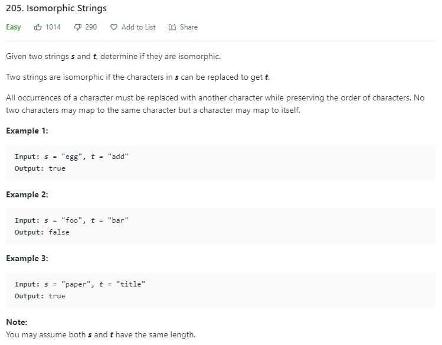

> 原文链接: https://leetcode-cn.com/problems/isomorphic-strings


## 英文原文
<div><p>Given two strings <code>s</code> and <code>t</code>, <em>determine if they are isomorphic</em>.</p>

<p>Two strings <code>s</code> and <code>t</code> are isomorphic if the characters in <code>s</code> can be replaced to get <code>t</code>.</p>

<p>All occurrences of a character must be replaced with another character while preserving the order of characters. No two characters may map to the same character, but a character may map to itself.</p>

<p>&nbsp;</p>
<p><strong>Example 1:</strong></p>
<pre><strong>Input:</strong> s = "egg", t = "add"
<strong>Output:</strong> true
</pre><p><strong>Example 2:</strong></p>
<pre><strong>Input:</strong> s = "foo", t = "bar"
<strong>Output:</strong> false
</pre><p><strong>Example 3:</strong></p>
<pre><strong>Input:</strong> s = "paper", t = "title"
<strong>Output:</strong> true
</pre>
<p>&nbsp;</p>
<p><strong>Constraints:</strong></p>

<ul>
	<li><code>1 &lt;= s.length &lt;= 5 * 10<sup>4</sup></code></li>
	<li><code>t.length == s.length</code></li>
	<li><code>s</code> and <code>t</code> consist of any valid ascii character.</li>
</ul>
</div>

## 中文题目
<div><p>给定两个字符串 <em><strong>s </strong></em>和 <strong><em>t</em></strong>，判断它们是否是同构的。</p>

<p>如果 <em><strong>s </strong></em>中的字符可以按某种映射关系替换得到 <strong><em>t </em></strong>，那么这两个字符串是同构的。</p>

<p>每个出现的字符都应当映射到另一个字符，同时不改变字符的顺序。不同字符不能映射到同一个字符上，相同字符只能映射到同一个字符上，字符可以映射到自己本身。</p>

<p> </p>

<p><strong>示例 1:</strong></p>

<pre>
<strong>输入：</strong><strong><em>s</em></strong> = <code>"egg", </code><strong><em>t = </em></strong><code>"add"</code>
<strong>输出：</strong>true
</pre>

<p><strong>示例 2：</strong></p>

<pre>
<strong>输入：</strong><strong><em>s</em></strong> = <code>"foo", </code><strong><em>t = </em></strong><code>"bar"</code>
<strong>输出：</strong>false</pre>

<p><strong>示例 3：</strong></p>

<pre>
<strong>输入：</strong><strong><em>s</em></strong> = <code>"paper", </code><strong><em>t = </em></strong><code>"title"</code>
<strong>输出：</strong>true</pre>

<p> </p>

<p><strong>提示：</strong></p>

<ul>
	<li>可以假设 <em><strong>s </strong></em>和 <strong><em>t </em></strong>长度相同。</li>
</ul>
</div>

## 通过代码
<RecoDemo>
</RecoDemo>


## 高赞题解
# 题目描述（简单难度）





判断两个字符串是否是同构的。


# 解法一


题目描述中已经很详细了，两个字符串同构的含义就是字符串 `s` 可以唯一的映射到 `t` ，同时 `t` 也可以唯一的映射到 `s` 。


举个具体的例子。


```java

egg 和 add 同构，就意味着下边的映射成立

e -> a

g -> d

也就是将 egg 的 e 换成 a, g 换成 d, 就变成了 add


同时倒过来也成立

a -> e

d -> g

也就是将 add 的 a 换成 e, d 换成 g, 就变成了 egg


foo 和 bar 不同构，原因就是映射不唯一

o -> a

o -> r

其中 o 映射到了两个字母

```


我们可以利用一个 `map` 来处理映射。对于 `s` 到 `t` 的映射，我们同时遍历 `s` 和 `t` ，假设当前遇到的字母分别是 `c1` 和 `c2` 。


如果 `map[c1]` 不存在，那么就将 `c1` 映射到 `c2` ，即 `map[c1] = c2`。


如果 `map[c1]` 存在，那么就判断 `map[c1]` 是否等于 `c2`，也就是验证之前的映射和当前的字母是否相同。


```java

private boolean isIsomorphicHelper(String s, String t) {

    int n = s.length();

    HashMap<Character, Character> map = new HashMap<>();

    for (int i = 0; i < n; i++) {

        char c1 = s.charAt(i);

        char c2 = s.charAt(i);

        if (map.containsKey(c1)) {

            if (map.get(c1) != c2) {

                return false;

            }

        } else {

            map.put(c1, c2);

        }

    }

    return true;

}

```


对于这道题，我们只需要验证 `s - > t` 和 `t -> s` 两个方向即可。如果验证一个方向，是不可以的。


举个例子，`s = ab, t = cc`，如果单看 `s -> t` ，那么 `a -> c, b -> c` 是没有问题的。


必须再验证 `t -> s`，此时，`c -> a, c -> b`，一个字母对应了多个字母，所以不是同构的。


代码的话，只需要调用两次上边的代码即可。


```java

public boolean isIsomorphic(String s, String t) {

    return isIsomorphicHelper(s, t) && isIsomorphicHelper(t, s);


}


private boolean isIsomorphicHelper(String s, String t) {

    int n = s.length();

    HashMap<Character, Character> map = new HashMap<>();

    for (int i = 0; i < n; i++) {

        char c1 = s.charAt(i);

        char c2 = t.charAt(i);

        if (map.containsKey(c1)) {

            if (map.get(c1) != c2) {

                return false;

            }

        } else {

            map.put(c1, c2);

        }

    }

    return true;

}

```


# 解法二


另一种思想，参考 [这里](https://leetcode.com/problems/isomorphic-strings/discuss/57796/My-6-lines-solution) 。


解法一中，我们判断 `s` 和  `t` 是否一一对应，通过对两个方向分别考虑来解决的。


这里的话，我们找一个第三方来解决，即，按照字母出现的顺序，把两个字符串都映射到另一个集合中。


举个现实生活中的例子，一个人说中文，一个人说法语，怎么判断他们说的是一个意思呢？把中文翻译成英语，把法语也翻译成英语，然后看最后的英语是否相同即可。


```java

将第一个出现的字母映射成 1，第二个出现的字母映射成 2


对于 egg

e -> 1

g -> 2

也就是将 egg 的 e 换成 1, g 换成 2, 就变成了 122


对于 add

a -> 1

d -> 2

也就是将 add 的 a 换成 1, d 换成 2, 就变成了 122


egg -> 122, add -> 122

都变成了 122，所以两个字符串异构。

```


代码的话，只需要将两个字符串分别翻译成第三种类型即可。我们可以定义一个变量 `count = 1`，映射给出现的字母，然后进行自增。


```java

public boolean isIsomorphic(String s, String t) {

    return isIsomorphicHelper(s).equals(isIsomorphicHelper(t));

}


private String isIsomorphicHelper(String s) {

    int[] map = new int[128];

    int n = s.length();

    StringBuilder sb = new StringBuilder();

    int count = 1;

    for (int i = 0; i < n; i++) {

        char c = s.charAt(i);

        //当前字母第一次出现,赋值

        if (map[c] == 0) {

            map[c] = count;

            count++;

        }

        sb.append(map[c]);

    }

    return sb.toString();

}

```


为了方便，我们也可以将当前字母直接映射为当前字母的下标加 `1`。因为 `0` 是我们的默认值，所以不能直接赋值为下标，而是「下标加 `1`」。


```java

public boolean isIsomorphic(String s, String t) {

    return isIsomorphicHelper(s).equals(isIsomorphicHelper(t));

}


private String isIsomorphicHelper(String s) {

    int[] map = new int[128];

    int n = s.length();

    StringBuilder sb = new StringBuilder();

    for (int i = 0; i < n; i++) {

        char c = s.charAt(i);

        //当前字母第一次出现,赋值

        if (map[c] == 0) {

            map[c] = i + 1;

        }

        sb.append(map[c]);

    }

    return sb.toString();

}

```


上边的 `isIsomorphicHelper` 中我们通过 `map` 记录了当前字母要映射到哪个数字，然后最终返回了整个转换后的字符串。


其实我们不需要将字符串完全转换，我们可以用两个 `map` 分别记录两个字符串每个字母的映射。将所有字母初始都映射到 `0`。记录过程中，如果发现了当前映射不一致，就可以立即返回 `false` 了。


举个例子。


```java

对 abaddee 和 cdbccff

    

a b a d d e e

c d b c c f f

^


当前

a -> 0

c -> 0


修改映射

a -> 1

c -> 1


a b a d d e e

c d b c c f f

  ^

    

当前

b -> 0

d -> 0   

    

修改映射

b -> 2

d -> 2


    

a b a d d e e

c d b c c f f

    ^    

当前

a -> 1 (之前被修改过)

b -> 0


出现不一致，所以两个字符串不异构 

```


代码的话，用两个 `map` 记录映射即可。


```java

public boolean isIsomorphic(String s, String t) {

    int n = s.length();

    int[] mapS = new int[128];

    int[] mapT = new int[128];

    for (int i = 0; i < n; i++) {

        char c1 = s.charAt(i);

        char c2 = t.charAt(i);

        //当前的映射值是否相同

        if (mapS[c1] != mapT[c2]) {

            return false;

        } else {

            //是否已经修改过，修改过就不需要再处理

            if (mapS[c1] == 0) {

                mapS[c1] = i + 1;

                mapT[c2] = i + 1;

            }

        }

    }

    return true;

}

```


# 总


解法一就是我们比较常规的思路，解法二通过一个第三方的集合，将代码大大简化了，太巧妙了！


题目其实有点像映射的知识，两个字符串为两个集合，然后判断当前映射是否为单射。


之前自己在博客总结的，更多题解可以在原地址 [https://leetcode.wang](https://leetcode.wang)。

## 统计信息
| 通过次数 | 提交次数 | AC比率 |
| :------: | :------: | :------: |
|    120363    |    241042    |   49.9%   |

## 提交历史
| 提交时间 | 提交结果 | 执行时间 |  内存消耗  | 语言 |
| :------: | :------: | :------: | :--------: | :--------: |


## 相似题目
|                             题目                             | 难度 |
| :----------------------------------------------------------: | :---------: |
| [单词规律](https://leetcode-cn.com/problems/word-pattern/) | 简单|
