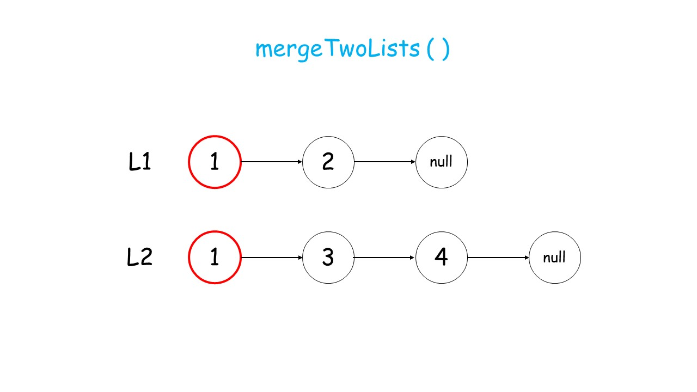
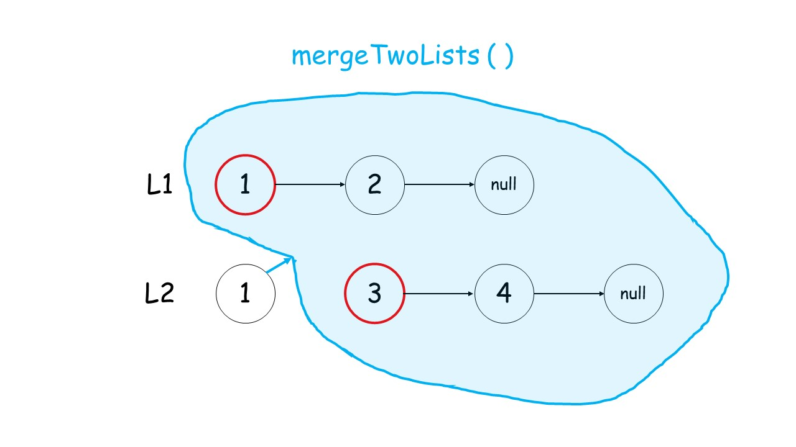
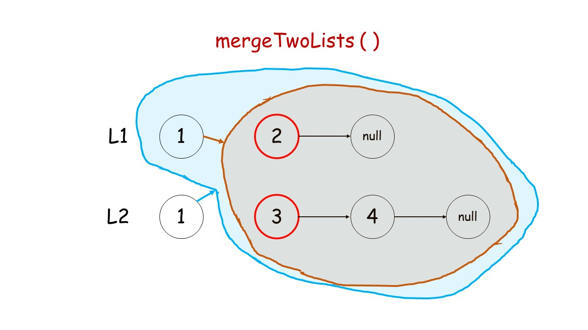
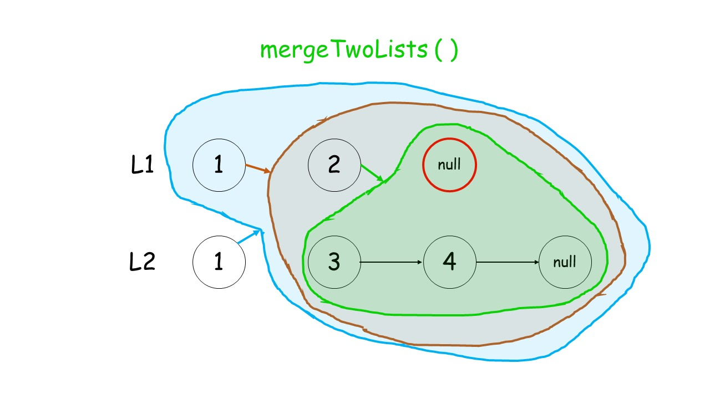
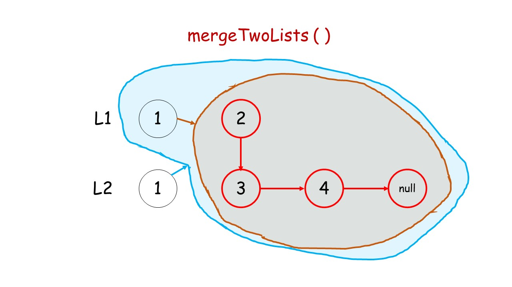
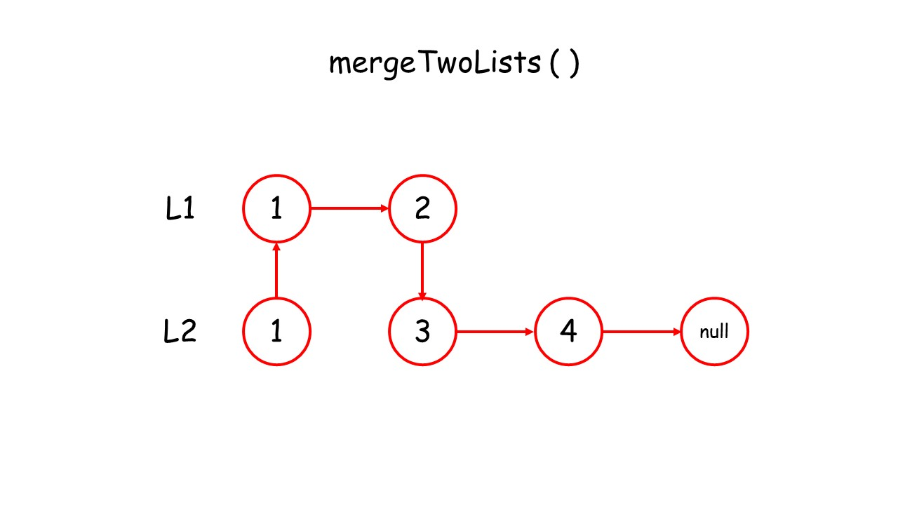

> 原文链接: https://leetcode-cn.com/problems/merge-two-sorted-lists


## 英文原文
<div><p>You are given the heads of two sorted linked lists <code>list1</code> and <code>list2</code>.</p>

<p>Merge the two lists in a one <strong>sorted</strong> list. The list should be made by splicing together the nodes of the first two lists.</p>

<p>Return <em>the head of the merged linked list</em>.</p>

<p>&nbsp;</p>
<p><strong>Example 1:</strong></p>

<pre>
<strong>Input:</strong> list1 = [1,2,4], list2 = [1,3,4]
<strong>Output:</strong> [1,1,2,3,4,4]
</pre>

<p><strong>Example 2:</strong></p>

<pre>
<strong>Input:</strong> list1 = [], list2 = []
<strong>Output:</strong> []
</pre>

<p><strong>Example 3:</strong></p>

<pre>
<strong>Input:</strong> list1 = [], list2 = [0]
<strong>Output:</strong> [0]
</pre>

<p>&nbsp;</p>
<p><strong>Constraints:</strong></p>

<ul>
	<li>The number of nodes in both lists is in the range <code>[0, 50]</code>.</li>
	<li><code>-100 &lt;= Node.val &lt;= 100</code></li>
	<li>Both <code>list1</code> and <code>list2</code> are sorted in <strong>non-decreasing</strong> order.</li>
</ul>
</div>

## 中文题目
<div><p>将两个升序链表合并为一个新的 <strong>升序</strong> 链表并返回。新链表是通过拼接给定的两个链表的所有节点组成的。 </p>

<p> </p>

<p><strong>示例 1：</strong></p>

<pre>
<strong>输入：</strong>l1 = [1,2,4], l2 = [1,3,4]
<strong>输出：</strong>[1,1,2,3,4,4]
</pre>

<p><strong>示例 2：</strong></p>

<pre>
<strong>输入：</strong>l1 = [], l2 = []
<strong>输出：</strong>[]
</pre>

<p><strong>示例 3：</strong></p>

<pre>
<strong>输入：</strong>l1 = [], l2 = [0]
<strong>输出：</strong>[0]
</pre>

<p> </p>

<p><strong>提示：</strong></p>

<ul>
	<li>两个链表的节点数目范围是 <code>[0, 50]</code></li>
	<li><code>-100 <= Node.val <= 100</code></li>
	<li><code>l1</code> 和 <code>l2</code> 均按 <strong>非递减顺序</strong> 排列</li>
</ul>
</div>

## 通过代码
<RecoDemo>
</RecoDemo>


## 高赞题解
#### 1. 前言
递归解法总是给人一种“只可意会不可言传”的感觉，代码一看就懂，自己动手一写就呆住了，很难受。究其原因，一是我们练习不够，二是理解不够。
#### 2. 什么是递归？
递归的例子在平时生活中很容易见到，比如：


开个玩笑😁

什么是递归呢？**函数在运行时调用自己**，这个函数就叫递归函数，调用的过程叫做递归。
比如定义函数 $f(x)=x+f(x-1)$：

```python []
def f(x):
    return x + f(x-1)
```
如果代入 $f(2)$：
- 返回 $2+f(1)$；
- 调用 $f(1)$；
- 返回 $1+f(0)$；
- 调用 $f(0)$；
- 返回 $0+f(-1)$
- ......

这时程序会无休止地运行下去，直到崩溃。
如果我们加一个判断语句 `x > 0`：
```python []
def f(x):
    if x > 0:
        return x + f(x-1)
    else:  # f(0) = 0
        return 0
```

这次计算 $f(2)=2+f(1)=2+1+f(0)=2+1+0=3$。我们从中总结两个规律：
- 递归函数必须要有**终止条件**，否则会出错；
- 递归函数先不断调用自身，直到遇到终止条件后进行回溯，最终返回答案。

#### 3. 递归解法
根据以上规律考虑本题目：
- 终止条件：当两个链表都为空时，表示我们对链表已合并完成。
- 如何递归：我们判断 `l1` 和 `l2` 头结点哪个更小，然后较小结点的 `next` 指针指向**其余结点的合并结果。（调用递归）**


<,,,,,,,>


#### 代码
感谢 [@huwt](/u/huwt/) 提供的 c++ 代码！
```Python []
class Solution:
    def mergeTwoLists(self, l1: ListNode, l2: ListNode) -> ListNode:
        if not l1: return l2  # 终止条件，直到两个链表都空
        if not l2: return l1
        if l1.val <= l2.val:  # 递归调用
            l1.next = self.mergeTwoLists(l1.next,l2)
            return l1
        else:
            l2.next = self.mergeTwoLists(l1,l2.next)
            return l2
```
```Java []
class Solution {
    public ListNode mergeTwoLists(ListNode l1, ListNode l2) {
        if (l1 == null) {
            return l2;
        }
        else if (l2 == null) {
            return l1;
        }
        else if (l1.val < l2.val) {
            l1.next = mergeTwoLists(l1.next, l2);
            return l1;
        }
        else {
            l2.next = mergeTwoLists(l1, l2.next);
            return l2;
        }

    }
}
```

```C++ []
class Solution {
public:
    ListNode* mergeTwoLists(ListNode* l1, ListNode* l2) {
        if (l1 == NULL) {
            return l2;
        }
        if (l2 == NULL) {
            return l1;
        }
        if (l1->val <= l2->val) {
            l1->next = mergeTwoLists(l1->next, l2);
            return l1;
        }
        l2->next = mergeTwoLists(l1, l2->next);
        return l2;
    }
};
```


**复杂度分析**

如何计算递归的时间复杂度和空间复杂度呢？ 力扣对此进行了 [详细介绍](https://leetcode-cn.com/explore/orignial/card/recursion-i/259/complexity-analysis/1223/) ，其中时间复杂度可以这样计算：

>给出一个递归算法，其时间复杂度 ${\mathcal{O}(T)}$ 通常是递归调用的数量（记作 ${R}$） 和计算的时间复杂度的乘积（表示为 ${\mathcal{O}(s)}$）的乘积：${\mathcal{O}(T) = R * \mathcal{O}(s)}$ 

 时间复杂度：${\mathcal{O}}(m + n)$。

$m$，$n$ 为 $l_{1}$ 和 $l_{2}$ 的元素个数。递归函数每次去掉一个元素，直到两个链表都为空，因此需要调用 $R=O(m + n)$ 次。而在递归函数中我们只进行了 `next` 指针的赋值操作，复杂度为 $\mathcal{O}(1)$，故递归的总时间复杂度为 ${\mathcal{O}(T) = R * \mathcal{O}(1)}={\mathcal{O}}(m + n)$ 。

 空间复杂度：${\mathcal{O}}(m + n)$。**


对于递归调用 `self.mergeTwoLists()`，当它遇到终止条件准备回溯时，已经递归调用了 $m+n$ 次，使用了 $m+n$ 个栈帧，故最后的空间复杂度为 ${\mathcal{O}}(m + n)$。

#### 相关题目
以下是一些基础但很经典的题目，值得我们好好练习：
- [344. 反转字符串](https://leetcode-cn.com/problems/reverse-string/)
- [面试题 08.06. 汉诺塔问题](https://leetcode-cn.com/problems/hanota-lcci/solution/tu-jie-yi-nuo-ta-de-gu-shi-ju-shuo-dang-64ge-pan-z/)
- [24. 两两交换链表中的节点 ](https://leetcode-cn.com/problems/swap-nodes-in-pairs/)
- [104. 二叉树的最大深度](https://leetcode-cn.com/problems/maximum-depth-of-binary-tree/)

欢迎提供 C++ 代码
如有问题，欢迎讨论~


## 统计信息
| 通过次数 | 提交次数 | AC比率 |
| :------: | :------: | :------: |
|    782798    |    1173070    |   66.7%   |

## 提交历史
| 提交时间 | 提交结果 | 执行时间 |  内存消耗  | 语言 |
| :------: | :------: | :------: | :--------: | :--------: |


## 相似题目
|                             题目                             | 难度 |
| :----------------------------------------------------------: | :---------: |
| [合并K个升序链表](https://leetcode-cn.com/problems/merge-k-sorted-lists/) | 困难|
| [合并两个有序数组](https://leetcode-cn.com/problems/merge-sorted-array/) | 简单|
| [排序链表](https://leetcode-cn.com/problems/sort-list/) | 中等|
| [最短单词距离 II](https://leetcode-cn.com/problems/shortest-word-distance-ii/) | 中等|
