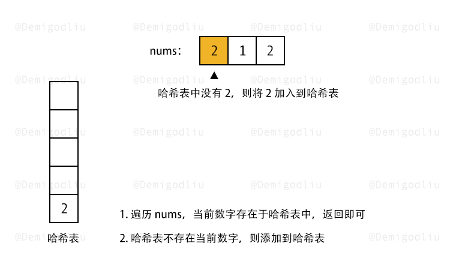
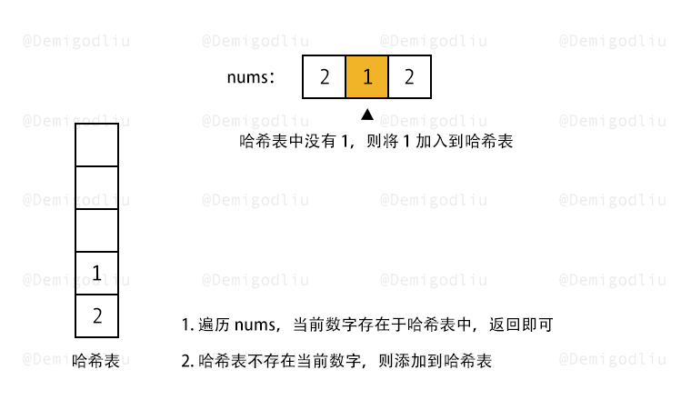
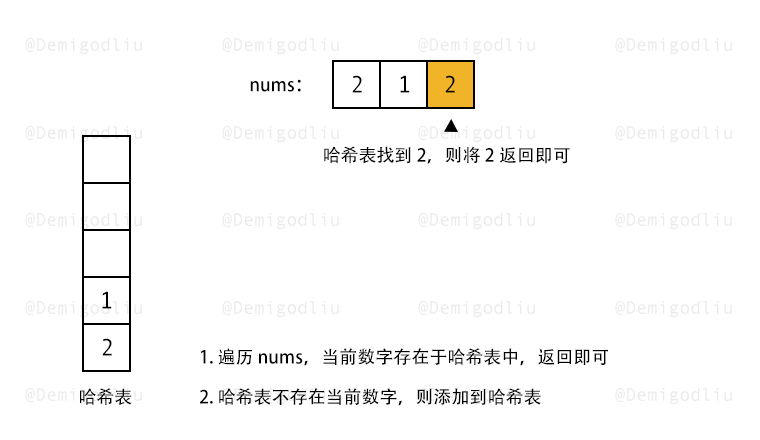

> 原文链接: https://leetcode-cn.com/problems/contains-duplicate


## 英文原文
<div><p>Given an integer array <code>nums</code>, return <code>true</code> if any value appears <strong>at least twice</strong> in the array, and return <code>false</code> if every element is distinct.</p>

<p>&nbsp;</p>
<p><strong>Example 1:</strong></p>
<pre><strong>Input:</strong> nums = [1,2,3,1]
<strong>Output:</strong> true
</pre><p><strong>Example 2:</strong></p>
<pre><strong>Input:</strong> nums = [1,2,3,4]
<strong>Output:</strong> false
</pre><p><strong>Example 3:</strong></p>
<pre><strong>Input:</strong> nums = [1,1,1,3,3,4,3,2,4,2]
<strong>Output:</strong> true
</pre>
<p>&nbsp;</p>
<p><strong>Constraints:</strong></p>

<ul>
	<li><code>1 &lt;= nums.length &lt;= 10<sup>5</sup></code></li>
	<li><code>-10<sup>9</sup> &lt;= nums[i] &lt;= 10<sup>9</sup></code></li>
</ul>
</div>

## 中文题目
<div><p>给定一个整数数组，判断是否存在重复元素。</p>

<p>如果存在一值在数组中出现至少两次，函数返回 <code>true</code> 。如果数组中每个元素都不相同，则返回 <code>false</code> 。</p>

<p> </p>

<p><strong>示例 1:</strong></p>

<pre>
<strong>输入:</strong> [1,2,3,1]
<strong>输出:</strong> true</pre>

<p><strong>示例 2:</strong></p>

<pre>
<strong>输入: </strong>[1,2,3,4]
<strong>输出:</strong> false</pre>

<p><strong>示例 3:</strong></p>

<pre>
<strong>输入: </strong>[1,1,1,3,3,4,3,2,4,2]
<strong>输出:</strong> true</pre>
</div>

## 通过代码
<RecoDemo>
</RecoDemo>


## 高赞题解


---

### 🧠 解题思路

数组存在重复元素，首先我们可以将数组排序，然后再遍历判断，但是这样的复杂度是 $NlogN$，但是，我一般会选择牺牲空间保时间，所以这里我将使用哈希表来解决这道题，让时间复杂度为 $N$。

流程如下：

1. 创建一个哈希表，然后从左往右遍历数组。
2. 检测哈希表中是否已存在当前字符，若存在，直接返回结果，若不存在，将当前字符加入哈希表，供后续判断使用即可。

---

### 🎨 图解演示

<,,,>

---

### 🍭 示例代码

```Javascript []
var containsDuplicate = function(nums) {
    let map = new Map();
    for(let i of nums){
        if(map.has(i)){
            return true;
        }else{
            map.set(i, 1);
        }
    }
    return false;
};
```
```C++ []
class Solution {
public:
    bool containsDuplicate(vector<int>& nums) {
        unordered_set<int> s;
        for (int x: nums) {
            if (s.find(x) != s.end()) {
                return true;
            }
            s.insert(x);
        }
        return false;
    }
};
```
```C []
struct hashTable {
    int key;
    UT_hash_handle hh;
};

bool containsDuplicate(int* nums, int numsSize) {
    struct hashTable* set = NULL;
    for (int i = 0; i < numsSize; i++) {
        struct hashTable* tmp;
        HASH_FIND_INT(set, nums + i, tmp);
        if (tmp == NULL) {
            tmp = malloc(sizeof(struct hashTable));
            tmp->key = nums[i];
            HASH_ADD_INT(set, key, tmp);
        } else {
            return true;
        }
    }
    return false;
}
```
```Java []
class Solution {
    public boolean containsDuplicate(int[] nums) {
        Set<Integer> set = new HashSet<Integer>();
        for (int x : nums) {
            if (!set.add(x)) {
                return true;
            }
        }
        return false;
    }
}
```
```Golang []
func containsDuplicate(nums []int) bool {
    set := map[int]struct{}{}
    for _, v := range nums {
        if _, has := set[v]; has {
            return true
        }
        set[v] = struct{}{}
    }
    return false
}
```

---

### 转身挥手

嘿，少年，做图不易，留下个赞或评论再走吧！谢啦~ 💐

差点忘了，祝你牛年大吉 🐮 ，AC 和 Offer 📑 多多益善~

⛲⛲⛲ 期待下次再见~ 

## 统计信息
| 通过次数 | 提交次数 | AC比率 |
| :------: | :------: | :------: |
|    416498    |    750212    |   55.5%   |

## 提交历史
| 提交时间 | 提交结果 | 执行时间 |  内存消耗  | 语言 |
| :------: | :------: | :------: | :--------: | :--------: |


## 相似题目
|                             题目                             | 难度 |
| :----------------------------------------------------------: | :---------: |
| [存在重复元素 II](https://leetcode-cn.com/problems/contains-duplicate-ii/) | 简单|
| [存在重复元素 III](https://leetcode-cn.com/problems/contains-duplicate-iii/) | 中等|
