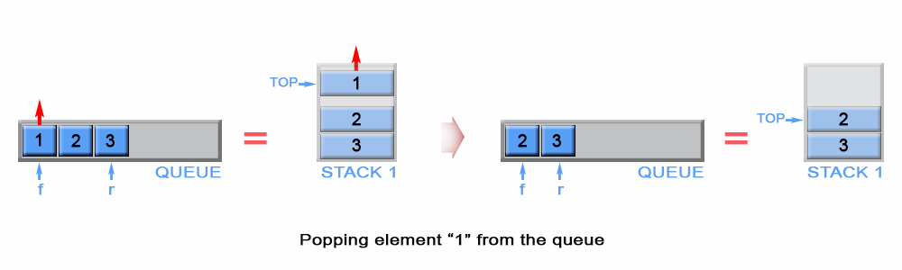

> 原文链接: https://leetcode-cn.com/problems/implement-queue-using-stacks


## 英文原文
<div><p>Implement a first in first out (FIFO) queue using only two stacks. The implemented queue should support all the functions of a normal queue (<code>push</code>, <code>peek</code>, <code>pop</code>, and <code>empty</code>).</p>

<p>Implement the <code>MyQueue</code> class:</p>

<ul>
	<li><code>void push(int x)</code> Pushes element x to the back of the queue.</li>
	<li><code>int pop()</code> Removes the element from the front of the queue and returns it.</li>
	<li><code>int peek()</code> Returns the element at the front of the queue.</li>
	<li><code>boolean empty()</code> Returns <code>true</code> if the queue is empty, <code>false</code> otherwise.</li>
</ul>

<p><strong>Notes:</strong></p>

<ul>
	<li>You must use <strong>only</strong> standard operations of a stack, which means only <code>push to top</code>, <code>peek/pop from top</code>, <code>size</code>, and <code>is empty</code> operations are valid.</li>
	<li>Depending on your language, the stack may not be supported natively. You may simulate a stack using a list or deque (double-ended queue) as long as you use only a stack&#39;s standard operations.</li>
</ul>

<p>&nbsp;</p>
<p><strong>Example 1:</strong></p>

<pre>
<strong>Input</strong>
[&quot;MyQueue&quot;, &quot;push&quot;, &quot;push&quot;, &quot;peek&quot;, &quot;pop&quot;, &quot;empty&quot;]
[[], [1], [2], [], [], []]
<strong>Output</strong>
[null, null, null, 1, 1, false]

<strong>Explanation</strong>
MyQueue myQueue = new MyQueue();
myQueue.push(1); // queue is: [1]
myQueue.push(2); // queue is: [1, 2] (leftmost is front of the queue)
myQueue.peek(); // return 1
myQueue.pop(); // return 1, queue is [2]
myQueue.empty(); // return false
</pre>

<p>&nbsp;</p>
<p><strong>Constraints:</strong></p>

<ul>
	<li><code>1 &lt;= x &lt;= 9</code></li>
	<li>At most <code>100</code>&nbsp;calls will be made to <code>push</code>, <code>pop</code>, <code>peek</code>, and <code>empty</code>.</li>
	<li>All the calls to <code>pop</code> and <code>peek</code> are valid.</li>
</ul>

<p>&nbsp;</p>
<p><strong>Follow-up:</strong> Can you implement the queue such that each operation is <strong><a href="https://en.wikipedia.org/wiki/Amortized_analysis" target="_blank">amortized</a></strong> <code>O(1)</code> time complexity? In other words, performing <code>n</code> operations will take overall <code>O(n)</code> time even if one of those operations may take longer.</p>
</div>

## 中文题目
<div><p>请你仅使用两个栈实现先入先出队列。队列应当支持一般队列支持的所有操作（<code>push</code>、<code>pop</code>、<code>peek</code>、<code>empty</code>）：</p>

<p>实现 <code>MyQueue</code> 类：</p>

<ul>
	<li><code>void push(int x)</code> 将元素 x 推到队列的末尾</li>
	<li><code>int pop()</code> 从队列的开头移除并返回元素</li>
	<li><code>int peek()</code> 返回队列开头的元素</li>
	<li><code>boolean empty()</code> 如果队列为空，返回 <code>true</code> ；否则，返回 <code>false</code></li>
</ul>

<p> </p>

<p><strong>说明：</strong></p>

<ul>
	<li>你只能使用标准的栈操作 —— 也就是只有 <code>push to top</code>, <code>peek/pop from top</code>, <code>size</code>, 和 <code>is empty</code> 操作是合法的。</li>
	<li>你所使用的语言也许不支持栈。你可以使用 list 或者 deque（双端队列）来模拟一个栈，只要是标准的栈操作即可。</li>
</ul>

<p> </p>

<p><strong>进阶：</strong></p>

<ul>
	<li>你能否实现每个操作均摊时间复杂度为 <code>O(1)</code> 的队列？换句话说，执行 <code>n</code> 个操作的总时间复杂度为 <code>O(n)</code> ，即使其中一个操作可能花费较长时间。</li>
</ul>

<p> </p>

<p><strong>示例：</strong></p>

<pre>
<strong>输入：</strong>
["MyQueue", "push", "push", "peek", "pop", "empty"]
[[], [1], [2], [], [], []]
<strong>输出：</strong>
[null, null, null, 1, 1, false]

<strong>解释：</strong>
MyQueue myQueue = new MyQueue();
myQueue.push(1); // queue is: [1]
myQueue.push(2); // queue is: [1, 2] (leftmost is front of the queue)
myQueue.peek(); // return 1
myQueue.pop(); // return 1, queue is [2]
myQueue.empty(); // return false
</pre>

<ul>
</ul>

<p> </p>

<p><strong>提示：</strong></p>

<ul>
	<li><code>1 <= x <= 9</code></li>
	<li>最多调用 <code>100</code> 次 <code>push</code>、<code>pop</code>、<code>peek</code> 和 <code>empty</code></li>
	<li>假设所有操作都是有效的 （例如，一个空的队列不会调用 <code>pop</code> 或者 <code>peek</code> 操作）</li>
</ul>
</div>

## 通过代码
<RecoDemo>
</RecoDemo>


## 官方题解
这篇文章是为初级读者准备的，文章中介绍队列和栈这两种数据结构。

## 题解
队列是一种 **先进先出**（first in - first out， FIFO）的数据结构，队列中的元素都从后端（rear）入队（push），从前端（front）出队（pop）。
实现队列最直观的方法是用链表，但在这篇文章里我会介绍另一个方法 - 使用栈。
栈是一种 **后进先出**（last in - first out， LIFO）的数据结构，栈中元素从栈顶（top）压入（push)，也从栈顶弹出（pop）。
为了满足队列的 **FIFO** 的特性，我们需要用到两个栈，用它们其中一个来反转元素的入队顺序，用另一个来存储元素的最终顺序。

#### 方法一（使用两个栈 入队 - $O(n)$， 出队 - $O(1)$）

**算法**

**入队（push）**

一个队列是 **FIFO** 的，但一个栈是 **LIFO** 的。这就意味着最新压入的元素必须得放在栈底。为了实现这个目的，我们首先需要把 `s1` 中所有的元素移到 `s2` 中，接着把新元素压入 `s2`。最后把 `s2` 中所有的元素弹出，再把弹出的元素压入 `s1`。

{:width="539px"}
{:align="center"}

*Figure 1. Push an element in queue*
{:align="center"}

```Java []
private int front;

public void push(int x) {
    if (s1.empty())
        front = x;
    while (!s1.isEmpty())
        s2.push(s1.pop());
    s2.push(x);
    while (!s2.isEmpty())
        s1.push(s2.pop());
}
```

**复杂度分析**

* 时间复杂度：$O(n)$
对于除了新元素之外的所有元素，它们都会被压入两次，弹出两次。新元素只被压入一次，弹出一次。这个过程产生了 $4n + 2$ 次操作，其中 $n$ 是队列的大小。由于 `压入` 操作和 `弹出` 操作的时间复杂度为 $O(1)$， 所以时间复杂度为 $O(n)$。

* 空间复杂度：$O(n)$
需要额外的内存来存储队列中的元素。

**出队（pop）**

直接从 `s1` 弹出就可以了，因为 `s1` 的栈顶元素就是队列的队首元素。同时我们把弹出之后 `s1` 的栈顶元素赋值给代表队首元素的 `front` 变量。

{:width="539px"}
{:align="center"}

*Figure 2. Pop an element from queue*
{:align="center"}

```Java []
// Removes the element from the front of queue.
public void pop() {
    s1.pop();
    if (!s1.empty())
        front = s1.peek();
}
```

**复杂度分析**

* 时间复杂度：$O(1)$
* 空间复杂度：$O(1)$

**判断空（empty）**

`s1` 存储了队列所有的元素，所以只需要检查 `s1` 的是否为空就可以了。

```Java []
// Return whether the queue is empty.
public boolean empty() {
    return s1.isEmpty();
}
```

时间复杂度：$O(1)$
空间复杂度：$O(1)$

**取队首元素（peek）**

在我们的算法中，用了 `front` 变量来存储队首元素，在每次 `入队` 操作或者 `出队` 操作之后这个变量都会随之更新。

```Java []
// Get the front element.
public int peek() {
  return front;
}
```

时间复杂度：$O(1)$
队首元素（`front`）已经被提前计算出来了，同时也只有 `peek` 操作可以得到它的值。

空间复杂度：$O(1)$

#### 方法二（使用两个栈 入队 - $O(1)$，出队 - 摊还复杂度 $O(1)$）

**算法**

**入队（push）**

新元素总是压入 `s1` 的栈顶，同时我们会把 `s1` 中压入的第一个元素赋值给作为队首元素的 `front` 变量。

{:width="539px"}
{:align="center"}

*Figure 3. Push an element in queue*
{:align="center"}

```Java []
private Stack<Integer> s1 = new Stack<>();
private Stack<Integer> s2 = new Stack<>();

// Push element x to the back of queue.
public void push(int x) {
    if (s1.empty())
        front = x;
    s1.push(x);
}
```

**复杂度分析**

* 时间复杂度：$O(1)$
向栈压入元素的时间复杂度为$O(1)$

* 空间复杂度：$O(n)$
需要额外的内存来存储队列元素

**出队（pop）**

根据栈 `LIFO` 的特性，`s1` 中第一个压入的元素在栈底。为了弹出 `s1` 的栈底元素，我们得把 `s1` 中所有的元素全部弹出，再把它们压入到另一个栈 `s2` 中，这个操作会让元素的入栈顺序反转过来。通过这样的方式，`s1` 中栈底元素就变成了 `s2` 的栈顶元素，这样就可以直接从 `s2` 将它弹出了。一旦 `s2` 变空了，我们只需把 `s1` 中的元素再一次转移到 `s2` 就可以了。

{:width="539px"}
{:align="center"}

*Figure 4. Pop an element from stack*
{:align="center"}

```Java []
// Removes the element from in front of queue.
public void pop() {
    if (s2.isEmpty()) {
        while (!s1.isEmpty())
            s2.push(s1.pop());
    }
    s2.pop();    
}
```

**复杂度分析**

* 时间复杂度： 摊还复杂度 $O(1)$，最坏情况下的时间复杂度 $O(n)$
在最坏情况下，`s2` 为空，算法需要从 `s1` 中弹出 $n$ 个元素，然后再把这 $n$ 个元素压入 `s2`，在这里$n$代表队列的大小。这个过程产生了 $2n$ 步操作，时间复杂度为 $O(n)$。但当 `s2` 非空时，算法就只有 $O(1)$ 的时间复杂度。所以为什么叫做摊还复杂度 $O(1)$ 呢？ 读了下一章你就知道了。

* 空间复杂度 ：$O(1)$

**摊还分析**

摊还分析给出了所有操作的平均性能。摊还分析的核心在于，最坏情况下的操作一旦发生了一次，那么在未来很长一段时间都不会再次发生，这样就会均摊每次操作的代价。

来看下面这个例子，从一个空队列开始，依次执行下面这些操作：

$$
push_1, push_2, \ldots, push_n, pop_1, pop_2 \ldots, pop_n
$$

单次 `出队` 操作最坏情况下的时间复杂度为 $O(n)$。考虑到我们要做 $n$ 次`出队`操作，如果我们用最坏情况下的时间复杂度来计算的话，那么所有操作的时间复杂度为 $O(n^2)$。

然而，在一系列的操作中，最坏情况不可能每次都发生，可能一些操作代价很小，另一些代价很高。因此，如果用传统的最坏情况分析，那么给出的时间复杂度是远远大于实际的复杂度的。例如，在一个动态数组里面只有一些插入操作需要花费线性的时间，而其余的一些插入操作只需花费常量的时间。

在上面的例子中，`出队` 操作最多可以执行的次数跟它之前执行过 `入队` 操作的次数有关。虽然一次 `出队` 操作代价可能很大，但是每 `n` 次 `入队` 才能产生这么一次代价为 `n` 的 `出队` 操作。因此所有操作的总时间复杂度为：`n`(所有的入队操作产生） + `2 * n`(第一次出队操作产生） + `n - 1`(剩下的出队操作产生）， 所以实际时间复杂度为 $O(2*n)$。于是我们可以得到每次操作的平均时间复杂度为 $O(2n/2n)$=$O(1)$。

**判断空（empty）**

`s1` 和 `s2` 都存有队列的元素，所以只需要检查 `s1` 和 `s2` 是否都为空就可以了。

```Java []
// Return whether the queue is empty.
public boolean empty() {
    return s1.isEmpty() && s2.isEmpty();
}
```

时间复杂度：$O(1)$
空间复杂度：$O(1)$


**取队首元素（peek)**

我们定义了 `front` 变量来保存队首元素，每次 `入队` 操作我们都会随之更新这个变量。当 `s2` 为空，`front` 变量就是队首元素，当 `s2` 非空，`s2` 的栈顶元素就是队首元素。

```Java []
// Get the front element.
public int peek() {
    if (!s2.isEmpty()) {
        return s2.peek();
    }
    return front;
}
```

时间复杂度：$O(1)$
队首元素要么是之前就被计算出来的，要么就是 `s2` 栈顶元素。因此时间复杂度为 $O(1)$。

空间复杂度：$O(1)$

## 统计信息
| 通过次数 | 提交次数 | AC比率 |
| :------: | :------: | :------: |
|    174868    |    253588    |   69.0%   |

## 提交历史
| 提交时间 | 提交结果 | 执行时间 |  内存消耗  | 语言 |
| :------: | :------: | :------: | :--------: | :--------: |


## 相似题目
|                             题目                             | 难度 |
| :----------------------------------------------------------: | :---------: |
| [用队列实现栈](https://leetcode-cn.com/problems/implement-stack-using-queues/) | 简单|
