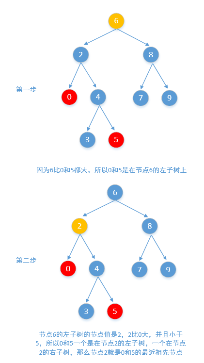

> 原文链接: https://leetcode-cn.com/problems/lowest-common-ancestor-of-a-binary-search-tree


## 英文原文
<div><p>Given a binary search tree (BST), find the lowest common ancestor (LCA) of two given nodes in the BST.</p>

<p>According to the <a href="https://en.wikipedia.org/wiki/Lowest_common_ancestor" target="_blank">definition of LCA on Wikipedia</a>: &ldquo;The lowest common ancestor is defined between two nodes <code>p</code> and <code>q</code> as the lowest node in <code>T</code> that has both <code>p</code> and <code>q</code> as descendants (where we allow <b>a node to be a descendant of itself</b>).&rdquo;</p>

<p>&nbsp;</p>
<p><strong>Example 1:</strong></p>

<pre>
<strong>Input:</strong> root = [6,2,8,0,4,7,9,null,null,3,5], p = 2, q = 8
<strong>Output:</strong> 6
<strong>Explanation:</strong> The LCA of nodes 2 and 8 is 6.
</pre>

<p><strong>Example 2:</strong></p>

<pre>
<strong>Input:</strong> root = [6,2,8,0,4,7,9,null,null,3,5], p = 2, q = 4
<strong>Output:</strong> 2
<strong>Explanation:</strong> The LCA of nodes 2 and 4 is 2, since a node can be a descendant of itself according to the LCA definition.
</pre>

<p><strong>Example 3:</strong></p>

<pre>
<strong>Input:</strong> root = [2,1], p = 2, q = 1
<strong>Output:</strong> 2
</pre>

<p>&nbsp;</p>
<p><strong>Constraints:</strong></p>

<ul>
	<li>The number of nodes in the tree is in the range <code>[2, 10<sup>5</sup>]</code>.</li>
	<li><code>-10<sup>9</sup> &lt;= Node.val &lt;= 10<sup>9</sup></code></li>
	<li>All <code>Node.val</code> are <strong>unique</strong>.</li>
	<li><code>p != q</code></li>
	<li><code>p</code> and <code>q</code> will exist in the BST.</li>
</ul>
</div>

## 中文题目
<div><p>给定一个二叉搜索树, 找到该树中两个指定节点的最近公共祖先。</p>

<p><a href="https://baike.baidu.com/item/%E6%9C%80%E8%BF%91%E5%85%AC%E5%85%B1%E7%A5%96%E5%85%88/8918834?fr=aladdin" target="_blank">百度百科</a>中最近公共祖先的定义为：&ldquo;对于有根树 T 的两个结点 p、q，最近公共祖先表示为一个结点 x，满足 x 是 p、q 的祖先且 x 的深度尽可能大（<strong>一个节点也可以是它自己的祖先</strong>）。&rdquo;</p>

<p>例如，给定如下二叉搜索树:&nbsp; root =&nbsp;[6,2,8,0,4,7,9,null,null,3,5]</p>

<p></p>

<p>&nbsp;</p>

<p><strong>示例 1:</strong></p>

<pre><strong>输入:</strong> root = [6,2,8,0,4,7,9,null,null,3,5], p = 2, q = 8
<strong>输出:</strong> 6 
<strong>解释: </strong>节点 <code>2 </code>和节点 <code>8 </code>的最近公共祖先是 <code>6。</code>
</pre>

<p><strong>示例 2:</strong></p>

<pre><strong>输入:</strong> root = [6,2,8,0,4,7,9,null,null,3,5], p = 2, q = 4
<strong>输出:</strong> 2
<strong>解释: </strong>节点 <code>2</code> 和节点 <code>4</code> 的最近公共祖先是 <code>2</code>, 因为根据定义最近公共祖先节点可以为节点本身。</pre>

<p>&nbsp;</p>

<p><strong>说明:</strong></p>

<ul>
	<li>所有节点的值都是唯一的。</li>
	<li>p、q 为不同节点且均存在于给定的二叉搜索树中。</li>
</ul>
</div>

## 通过代码
<RecoDemo>
</RecoDemo>


## 高赞题解


### 解题思路

**一、非递归解决**


这题让求二叉搜索树的最近公共祖先，而二叉搜索树的特点就是 ```左子树的所有节点都小于当前节点，右子树的所有节点都大于当前节点，并且每棵子树都具有上述特点```，所以这题就好办了，从更节点开始遍历


- **如果两个节点值都小于根节点，说明他们都在根节点的左子树上，我们往左子树上找**

- **如果两个节点值都大于根节点，说明他们都在根节点的右子树上，我们往右子树上找**

- **如果一个节点值大于根节点，一个节点值小于根节点，说明他们他们一个在根节点的左子树上一个在根节点的右子树上，那么根节点就是他们的最近公共祖先节点。**


画个图看一下，比如要找0和5的最近公共祖先节点，如下图所示





```

    public TreeNode lowestCommonAncestor(TreeNode root, TreeNode p, TreeNode q) {

        //如果根节点和p,q的差相乘是正数，说明这两个差值要么都是正数要么都是负数，也就是说

        //他们肯定都位于根节点的同一侧，就继续往下找

        while ((root.val - p.val) * (root.val - q.val) > 0)

            root = p.val < root.val ? root.left : root.right;

        //如果相乘的结果是负数，说明p和q位于根节点的两侧，如果等于0，说明至少有一个就是根节点

        return root;

    }

```


看一下运行结果


<br>


**二、递归解决**


也可把它改为递归的方式

```

    public TreeNode lowestCommonAncestor(TreeNode root, TreeNode p, TreeNode q) {

        //如果小于等于0，说明p和q位于root的两侧，直接返回即可

        if ((root.val - p.val) * (root.val - q.val) <= 0)

            return root;

        //否则，p和q位于root的同一侧，就继续往下找

        return lowestCommonAncestor(p.val < root.val ? root.left : root.right, p, q);

    }

```

如果嫌代码行数太多，那就一行解决

```

    public TreeNode lowestCommonAncestor(TreeNode root, TreeNode p, TreeNode q) {

        return (root.val - p.val) * (root.val - q.val) <= 0 ? root : lowestCommonAncestor(p.val < root.val ? root.left : root.right, p, q);

    }

```


<br>


**三、参照[236. 二叉树的最近公共祖先](https://leetcode-cn.com/problems/lowest-common-ancestor-of-a-binary-tree/)**

这题和第 236 题不一样的地方，在于 236 题不是二叉搜索树，所以第 236 题不能使用上面的方法解决，但这题可以使用第 236 题的解法，这里也可以来看下第 236 题之前写过的题解 [236. 二叉树的最近公共祖先](https://leetcode-cn.com/problems/lowest-common-ancestor-of-a-binary-tree/solution/javadai-ma-di-gui-he-fei-di-gui-tu-wen-xiang-jie-b/)


```

    public TreeNode lowestCommonAncestor(TreeNode cur, TreeNode p, TreeNode q) {

        if (cur == null || cur == p || cur == q)

            return cur;

        TreeNode left = lowestCommonAncestor(cur.left, p, q);

        TreeNode right = lowestCommonAncestor(cur.right, p, q);

        //如果left为空，说明这两个节点在cur结点的右子树上，我们只需要返回右子树查找的结果即可

        if (left == null)

            return right;

        //同上

        if (right == null)

            return left;

        //如果left和right都不为空，说明这两个节点一个在cur的左子树上一个在cur的右子树上，

        //我们只需要返回cur结点即可。

        return cur;

    }

```


## 统计信息
| 通过次数 | 提交次数 | AC比率 |
| :------: | :------: | :------: |
|    184585    |    276724    |   66.7%   |

## 提交历史
| 提交时间 | 提交结果 | 执行时间 |  内存消耗  | 语言 |
| :------: | :------: | :------: | :--------: | :--------: |


## 相似题目
|                             题目                             | 难度 |
| :----------------------------------------------------------: | :---------: |
| [二叉树的最近公共祖先](https://leetcode-cn.com/problems/lowest-common-ancestor-of-a-binary-tree/) | 中等|
| [最小公共区域](https://leetcode-cn.com/problems/smallest-common-region/) | 中等|
