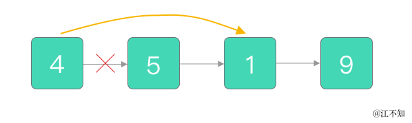
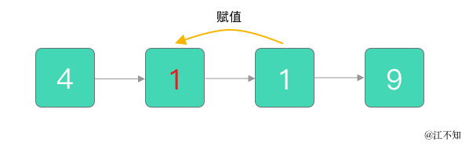
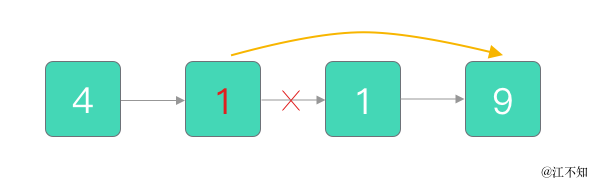

> 原文链接: https://leetcode-cn.com/problems/delete-node-in-a-linked-list


## 英文原文
<div><p>Write a function to <strong>delete a node</strong> in a singly-linked list. You will <strong>not</strong> be given access to the <code>head</code> of the list, instead you will be given access to <strong>the node to be deleted</strong> directly.</p>

<p>It is <strong>guaranteed</strong> that the node to be deleted is <strong>not a tail node</strong> in the list.</p>

<p>&nbsp;</p>
<p><strong>Example 1:</strong></p>

<pre>
<strong>Input:</strong> head = [4,5,1,9], node = 5
<strong>Output:</strong> [4,1,9]
<strong>Explanation: </strong>You are given the second node with value 5, the linked list should become 4 -&gt; 1 -&gt; 9 after calling your function.
</pre>

<p><strong>Example 2:</strong></p>

<pre>
<strong>Input:</strong> head = [4,5,1,9], node = 1
<strong>Output:</strong> [4,5,9]
<strong>Explanation: </strong>You are given the third node with value 1, the linked list should become 4 -&gt; 5 -&gt; 9 after calling your function.
</pre>

<p><strong>Example 3:</strong></p>

<pre>
<strong>Input:</strong> head = [1,2,3,4], node = 3
<strong>Output:</strong> [1,2,4]
</pre>

<p><strong>Example 4:</strong></p>

<pre>
<strong>Input:</strong> head = [0,1], node = 0
<strong>Output:</strong> [1]
</pre>

<p><strong>Example 5:</strong></p>

<pre>
<strong>Input:</strong> head = [-3,5,-99], node = -3
<strong>Output:</strong> [5,-99]
</pre>

<p>&nbsp;</p>
<p><strong>Constraints:</strong></p>

<ul>
	<li>The number of the nodes in the given list is in the range <code>[2, 1000]</code>.</li>
	<li><code>-1000 &lt;= Node.val &lt;= 1000</code></li>
	<li>The value of each node in the list is <strong>unique</strong>.</li>
	<li>The <code>node</code> to be deleted is <strong>in the list</strong> and is <strong>not a tail</strong> node</li>
</ul>
</div>

## 中文题目
<div><p>请编写一个函数，用于 <strong>删除单链表中某个特定节点</strong> 。在设计函数时需要注意，你无法访问链表的头节点&nbsp;<code>head</code> ，只能直接访问 <strong>要被删除的节点</strong> 。</p>

<p>题目数据保证需要删除的节点 <strong>不是末尾节点</strong> 。</p>

<p>&nbsp;</p>

<p><strong>示例 1：</strong></p>

<pre>
<strong>输入：</strong>head = [4,5,1,9], node = 5
<strong>输出：</strong>[4,1,9]
<strong>解释：</strong>指定链表中值为&nbsp;5&nbsp;的第二个节点，那么在调用了你的函数之后，该链表应变为 4 -&gt; 1 -&gt; 9
</pre>

<p><strong>示例 2：</strong></p>

<pre>
<strong>输入：</strong>head = [4,5,1,9], node = 1
<strong>输出：</strong>[4,5,9]
<strong>解释：</strong>指定链表中值为&nbsp;1&nbsp;的第三个节点，那么在调用了你的函数之后，该链表应变为 4 -&gt; 5 -&gt; 9</pre>

<p><strong>示例 3：</strong></p>

<pre>
<strong>输入：</strong>head = [1,2,3,4], node = 3
<strong>输出：</strong>[1,2,4]
</pre>

<p><strong>示例 4：</strong></p>

<pre>
<strong>输入：</strong>head = [0,1], node = 0
<strong>输出：</strong>[1]
</pre>

<p><strong>示例 5：</strong></p>

<pre>
<strong>输入：</strong>head = [-3,5,-99], node = -3
<strong>输出：</strong>[5,-99]
</pre>

<p>&nbsp;</p>

<p><strong>提示：</strong></p>

<ul>
	<li>链表中节点的数目范围是 <code>[2, 1000]</code></li>
	<li><code>-1000 &lt;= Node.val &lt;= 1000</code></li>
	<li>链表中每个节点的值都是唯一的</li>
	<li>需要删除的节点 <code>node</code> 是 <strong>链表中的一个有效节点</strong> ，且 <strong>不是末尾节点</strong></li>
</ul>
</div>

## 通过代码
<RecoDemo>
</RecoDemo>


## 高赞题解
#### 思路分析

如果我们要在链表中删除一个节点，一般的操作是：

1. 修改要删除节点的上一个节点的指针
2. 将该指针指向要删除节点的下一个节点

例如，在链表 `[4, 5, 1, 9]` 中，当我们要删除节点 `5` 时，我们会修改节点 `5` 上一个节点 `4` 的指针，让它指向节点 `5` 的下一个节点，即节点 `1`：



**但这道题只告诉我们要删除的节点，我们并不知道该节点的上一个节点是什么**，这时候又该如何是好呢？

既然我们要删除一个节点时需要知道它的上一个节点，如果我们无法得知上一个节点，我们就 **找一个可以知道上一个节点的节点，把它变成要删除的节点，然后删除它**。

这样听起来好像有些拗口？没事，直接看一个例子！

还是 `[4, 5, 1, 9]` 链表，还是删除节点 `5`。

首先，我们把节点 `5` 下一个节点的值赋给它，把它变成一个「不需要删除」的节点：



这样一来，第二个节点 `1` 和第三个节点 `1`，无论我们删除其中的哪一个，都可以得到最终结果 `[4, 1, 9]`。既然第二个节点不好删除，那我们就果断删除第三个啦~

改变第二个节点 `1` 的指针，将它指向第 4 个节点 `9`，这样一来，第三个节点 `1` 就被删除了：



#### 具体实现

```Python []
# Definition for singly-linked list.
# class ListNode:
#     def __init__(self, x):
#         self.val = x
#         self.next = None

class Solution:
    def deleteNode(self, node):
        """
        :type node: ListNode
        :rtype: void Do not return anything, modify node in-place instead.
        """
        node.val = node.next.val
        node.next = node.next.next
```


```Go []
/**
 * Definition for singly-linked list.
 * type ListNode struct {
 *     Val int
 *     Next *ListNode
 * }
 */
func deleteNode(node *ListNode) {
    node.Val = node.Next.Val
    node.Next = node.Next.Next
}
```

#### 复杂度

- 时间复杂度 $O(1)$
- 空间复杂度 $O(1)$ 

#### 总结一下

这道题没有给出链表的头节点，而是直接给出要删除的节点，让我们进行原地删除。我们对于该节点的前一个节点一无所知，所以无法直接执行删除操作。因此，**我们将要删除节点的 `next` 节点的值赋值给要删除的节点，转而去删除 `next` 节点，从而达成目的。**

题目中指明了「给定的节点为非末尾节点」且「链表至少包含两个节点」，所以上述方案是切实可行的。


## 统计信息
| 通过次数 | 提交次数 | AC比率 |
| :------: | :------: | :------: |
|    253300    |    295697    |   85.7%   |

## 提交历史
| 提交时间 | 提交结果 | 执行时间 |  内存消耗  | 语言 |
| :------: | :------: | :------: | :--------: | :--------: |


## 相似题目
|                             题目                             | 难度 |
| :----------------------------------------------------------: | :---------: |
| [移除链表元素](https://leetcode-cn.com/problems/remove-linked-list-elements/) | 简单|
