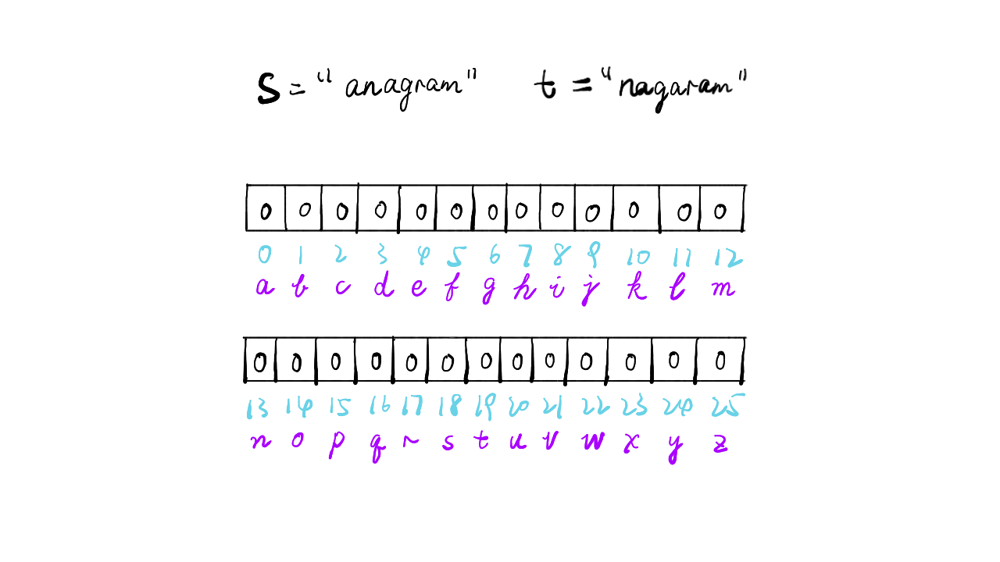
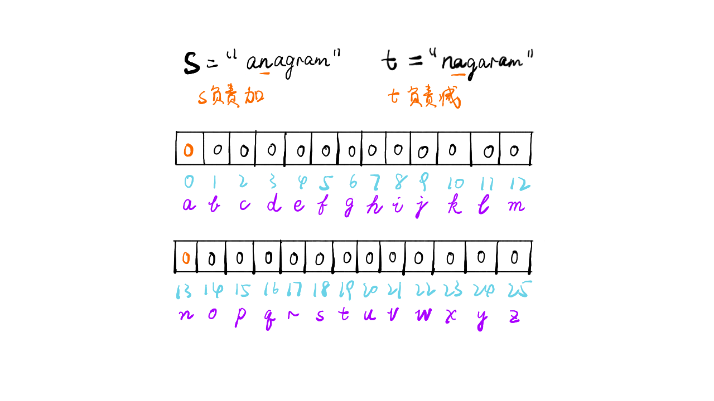
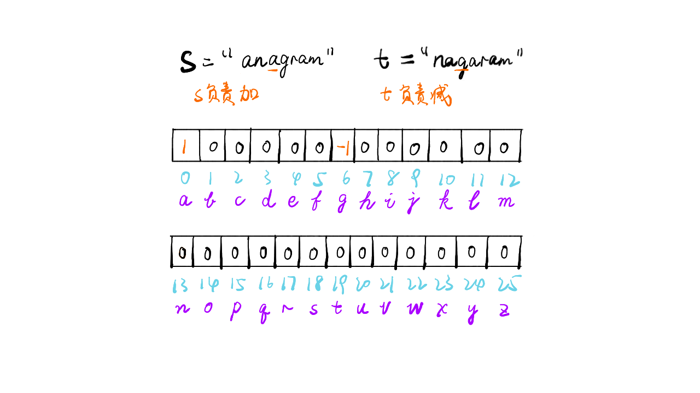
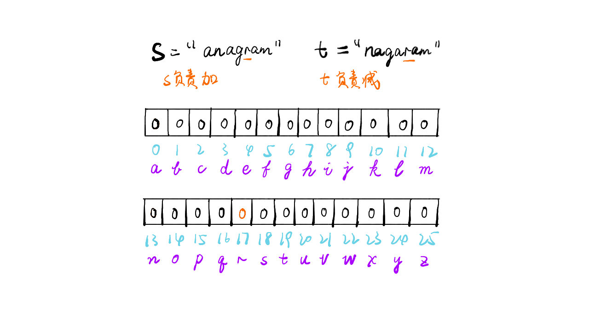
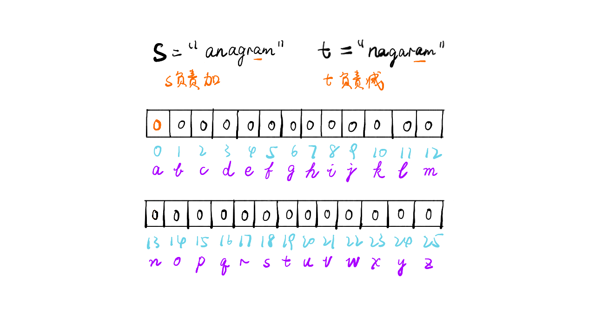
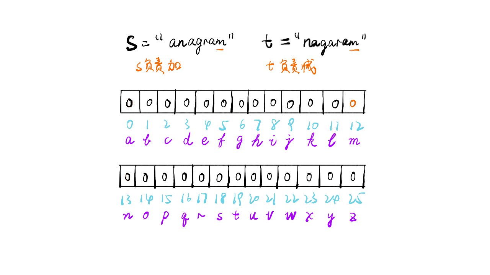
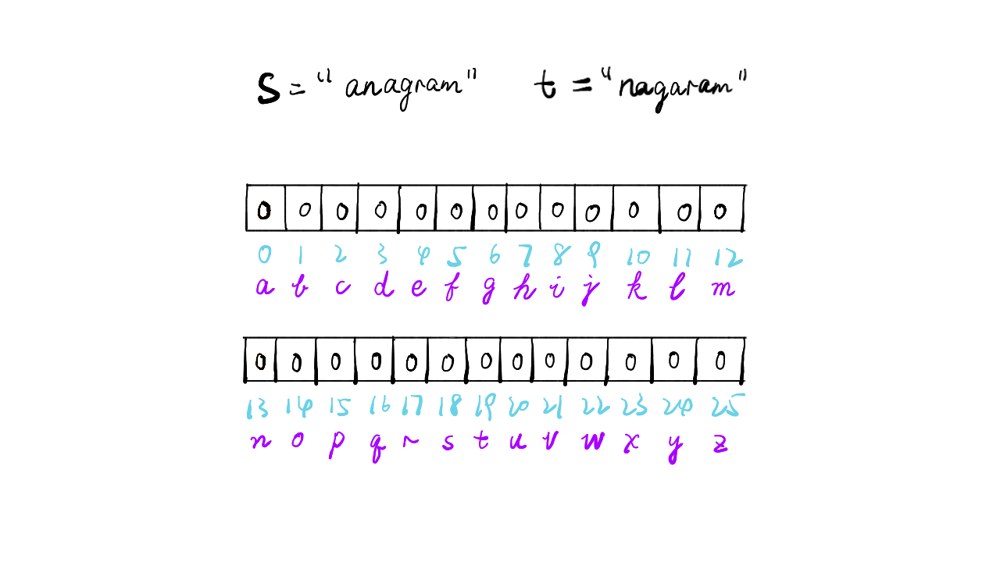

> 原文链接: https://leetcode-cn.com/problems/valid-anagram


## 英文原文
<div><p>Given two strings <code>s</code> and <code>t</code>, return <code>true</code> <em>if</em> <code>t</code> <em>is an anagram of</em> <code>s</code><em>, and</em> <code>false</code> <em>otherwise</em>.</p>

<p>&nbsp;</p>
<p><strong>Example 1:</strong></p>
<pre><strong>Input:</strong> s = "anagram", t = "nagaram"
<strong>Output:</strong> true
</pre><p><strong>Example 2:</strong></p>
<pre><strong>Input:</strong> s = "rat", t = "car"
<strong>Output:</strong> false
</pre>
<p>&nbsp;</p>
<p><strong>Constraints:</strong></p>

<ul>
	<li><code>1 &lt;= s.length, t.length &lt;= 5 * 10<sup>4</sup></code></li>
	<li><code>s</code> and <code>t</code> consist of lowercase English letters.</li>
</ul>

<p>&nbsp;</p>
<p><strong>Follow up:</strong> What if the inputs contain Unicode characters? How would you adapt your solution to such a case?</p>
</div>

## 中文题目
<div><p>给定两个字符串 <code><em>s</em></code> 和 <code><em>t</em></code> ，编写一个函数来判断 <code><em>t</em></code> 是否是 <code><em>s</em></code> 的字母异位词。</p>

<p><strong>注意：</strong>若 <code><em>s</em></code> 和 <code><em>t</em></code><em> </em>中每个字符出现的次数都相同，则称 <code><em>s</em></code> 和 <code><em>t</em></code><em> </em>互为字母异位词。</p>

<p> </p>

<p><strong>示例 1:</strong></p>

<pre>
<strong>输入:</strong> <em>s</em> = "anagram", <em>t</em> = "nagaram"
<strong>输出:</strong> true
</pre>

<p><strong>示例 2:</strong></p>

<pre>
<strong>输入:</strong> <em>s</em> = "rat", <em>t</em> = "car"
<strong>输出: </strong>false</pre>

<p> </p>

<p><strong>提示:</strong></p>

<ul>
	<li><code>1 <= s.length, t.length <= 5 * 10<sup>4</sup></code></li>
	<li><code>s</code> 和 <code>t</code> 仅包含小写字母</li>
</ul>

<p> </p>

<p><strong>进阶: </strong>如果输入字符串包含 unicode 字符怎么办？你能否调整你的解法来应对这种情况？</p>
</div>

## 通过代码
<RecoDemo>
</RecoDemo>


## 高赞题解
### 解题思路

- 标签：哈希映射
- 首先判断两个字符串长度是否相等，不相等则直接返回 false
- 若相等，则初始化 26 个字母哈希表，遍历字符串 s 和 t
- s 负责在对应位置增加，t 负责在对应位置减少
- 如果哈希表的值都为 0，则二者是字母异位词

### 代码

```Java []
class Solution {
    public boolean isAnagram(String s, String t) {
        if(s.length() != t.length())
            return false;
        int[] alpha = new int[26];
        for(int i = 0; i< s.length(); i++) {
            alpha[s.charAt(i) - 'a'] ++;
            alpha[t.charAt(i) - 'a'] --;
        }
        for(int i=0;i<26;i++)
            if(alpha[i] != 0)
                return false;
        return true;
    }
}
```

### 画解


<,,,,,,,,,>

想看大鹏画解更多高频面试题，欢迎阅读大鹏的 LeetBook：[《画解剑指 Offer 》](https://leetcode-cn.com/leetbook/detail/illustrate-lcof/)，O(∩_∩)O

## 统计信息
| 通过次数 | 提交次数 | AC比率 |
| :------: | :------: | :------: |
|    319313    |    493745    |   64.7%   |

## 提交历史
| 提交时间 | 提交结果 | 执行时间 |  内存消耗  | 语言 |
| :------: | :------: | :------: | :--------: | :--------: |


## 相似题目
|                             题目                             | 难度 |
| :----------------------------------------------------------: | :---------: |
| [字母异位词分组](https://leetcode-cn.com/problems/group-anagrams/) | 中等|
| [回文排列](https://leetcode-cn.com/problems/palindrome-permutation/) | 简单|
| [找到字符串中所有字母异位词](https://leetcode-cn.com/problems/find-all-anagrams-in-a-string/) | 中等|
