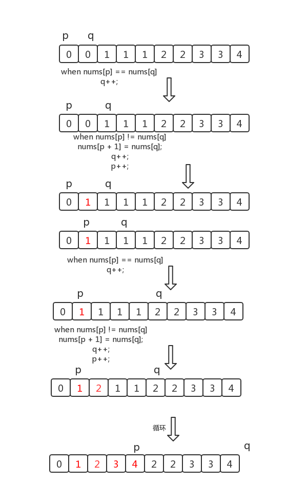

> 原文链接: https://leetcode-cn.com/problems/remove-duplicates-from-sorted-array


## 英文原文
<div><p>Given an integer array <code>nums</code> sorted in <strong>non-decreasing order</strong>, remove the duplicates <a href="https://en.wikipedia.org/wiki/In-place_algorithm" target="_blank"><strong>in-place</strong></a> such that each unique element appears only <strong>once</strong>. The <strong>relative order</strong> of the elements should be kept the <strong>same</strong>.</p>

<p>Since it is impossible to change the length of the array in some languages, you must instead have the result be placed in the <strong>first part</strong> of the array <code>nums</code>. More formally, if there are <code>k</code> elements after removing the duplicates, then the first <code>k</code> elements of <code>nums</code>&nbsp;should hold the final result. It does not matter what you leave beyond the first&nbsp;<code>k</code>&nbsp;elements.</p>

<p>Return <code>k</code><em> after placing the final result in the first </em><code>k</code><em> slots of </em><code>nums</code>.</p>

<p>Do <strong>not</strong> allocate extra space for another array. You must do this by <strong>modifying the input array <a href="https://en.wikipedia.org/wiki/In-place_algorithm" target="_blank">in-place</a></strong> with O(1) extra memory.</p>

<p><strong>Custom Judge:</strong></p>

<p>The judge will test your solution with the following code:</p>

<pre>
int[] nums = [...]; // Input array
int[] expectedNums = [...]; // The expected answer with correct length

int k = removeDuplicates(nums); // Calls your implementation

assert k == expectedNums.length;
for (int i = 0; i &lt; k; i++) {
    assert nums[i] == expectedNums[i];
}
</pre>

<p>If all assertions pass, then your solution will be <strong>accepted</strong>.</p>

<p>&nbsp;</p>
<p><strong>Example 1:</strong></p>

<pre>
<strong>Input:</strong> nums = [1,1,2]
<strong>Output:</strong> 2, nums = [1,2,_]
<strong>Explanation:</strong> Your function should return k = 2, with the first two elements of nums being 1 and 2 respectively.
It does not matter what you leave beyond the returned k (hence they are underscores).
</pre>

<p><strong>Example 2:</strong></p>

<pre>
<strong>Input:</strong> nums = [0,0,1,1,1,2,2,3,3,4]
<strong>Output:</strong> 5, nums = [0,1,2,3,4,_,_,_,_,_]
<strong>Explanation:</strong> Your function should return k = 5, with the first five elements of nums being 0, 1, 2, 3, and 4 respectively.
It does not matter what you leave beyond the returned k (hence they are underscores).
</pre>

<p>&nbsp;</p>
<p><strong>Constraints:</strong></p>

<ul>
	<li><code>0 &lt;= nums.length &lt;= 3 * 10<sup>4</sup></code></li>
	<li><code>-100 &lt;= nums[i] &lt;= 100</code></li>
	<li><code>nums</code> is sorted in <strong>non-decreasing</strong> order.</li>
</ul>
</div>

## 中文题目
<div><p>给你一个有序数组 <code>nums</code> ，请你<strong><a href="http://baike.baidu.com/item/%E5%8E%9F%E5%9C%B0%E7%AE%97%E6%B3%95" target="_blank"> 原地</a></strong> 删除重复出现的元素，使每个元素 <strong>只出现一次</strong> ，返回删除后数组的新长度。</p>

<p>不要使用额外的数组空间，你必须在 <strong><a href="https://baike.baidu.com/item/%E5%8E%9F%E5%9C%B0%E7%AE%97%E6%B3%95" target="_blank">原地 </a>修改输入数组 </strong>并在使用 O(1) 额外空间的条件下完成。</p>

<p> </p>

<p><strong>说明:</strong></p>

<p>为什么返回数值是整数，但输出的答案是数组呢?</p>

<p>请注意，输入数组是以<strong>「引用」</strong>方式传递的，这意味着在函数里修改输入数组对于调用者是可见的。</p>

<p>你可以想象内部操作如下:</p>

<pre>
// <strong>nums</strong> 是以“引用”方式传递的。也就是说，不对实参做任何拷贝
int len = removeDuplicates(nums);

// 在函数里修改输入数组对于调用者是可见的。
// 根据你的函数返回的长度, 它会打印出数组中<strong> 该长度范围内</strong> 的所有元素。
for (int i = 0; i < len; i++) {
    print(nums[i]);
}
</pre>
 

<p><strong>示例 1：</strong></p>

<pre>
<strong>输入：</strong>nums = [1,1,2]
<strong>输出：</strong>2, nums = [1,2]
<strong>解释：</strong>函数应该返回新的长度 <strong><code>2</code></strong> ，并且原数组 <em>nums </em>的前两个元素被修改为 <strong><code>1</code></strong>, <strong><code>2 </code></strong><code>。</code>不需要考虑数组中超出新长度后面的元素。
</pre>

<p><strong>示例 2：</strong></p>

<pre>
<strong>输入：</strong>nums = [0,0,1,1,1,2,2,3,3,4]
<strong>输出：</strong>5, nums = [0,1,2,3,4]
<strong>解释：</strong>函数应该返回新的长度 <strong><code>5</code></strong> ， 并且原数组 <em>nums </em>的前五个元素被修改为 <strong><code>0</code></strong>, <strong><code>1</code></strong>, <strong><code>2</code></strong>, <strong><code>3</code></strong>, <strong><code>4</code></strong> 。不需要考虑数组中超出新长度后面的元素。
</pre>

<p> </p>

<p><strong>提示：</strong></p>

<ul>
	<li><code>0 <= nums.length <= 3 * 10<sup>4</sup></code></li>
	<li><code>-10<sup>4</sup> <= nums[i] <= 10<sup>4</sup></code></li>
	<li><code>nums</code> 已按升序排列</li>
</ul>

<p> </p>
</div>

## 通过代码
<RecoDemo>
</RecoDemo>


## 高赞题解


#### 解题思路：

**解法： 双指针**


首先注意数组是有序的，那么重复的元素一定会相邻。


要求删除重复元素，实际上就是将不重复的元素移到数组的左侧。


考虑用 2 个指针，一个在前记作 `p`，一个在后记作 `q`，算法流程如下：


1.比较 `p` 和 `q` 位置的元素是否相等。


  如果相等，`q` 后移 1 位

  如果不相等，将 `q` 位置的元素复制到 `p+1` 位置上，`p` 后移一位，`q` 后移 1 位

  重复上述过程，直到 `q` 等于数组长度。


返回 `p + 1`，即为新数组长度。


**画个图理解一下**


{:width=400}

{:align=center}


**代码：**

```Java []

 public int removeDuplicates(int[] nums) {

    if(nums == null || nums.length == 0) return 0;

    int p = 0;

    int q = 1;

    while(q < nums.length){

        if(nums[p] != nums[q]){

            nums[p + 1] = nums[q];

            p++;

        }

        q++;

    }

    return p + 1;

}

```


**复杂度分析：**


时间复杂度：$O(n)$。

空间复杂度：$O(1)$。


**优化：**


这是大部分题解都没有提出的，在这里提一下。


考虑如下数组：


{:width=300}

{:align=center}


此时数组中没有重复元素，按照上面的方法，每次比较时 `nums[p]` 都不等于 `nums[q]`，因此就会将 `q` 指向的元素原地复制一遍，这个操作其实是不必要的。


因此我们可以添加一个小判断，当 `q - p > 1` 时，才进行复制。


**代码：**

```Java []

public int removeDuplicates(int[] nums) {

    if(nums == null || nums.length == 0) return 0;

    int p = 0;

    int q = 1;

    while(q < nums.length){

        if(nums[p] != nums[q]){

            if(q - p > 1){

                nums[p + 1] = nums[q];

            }

            p++;

        }

        q++;

    }

    return p + 1;

}

```

**复杂度分析：**


时间复杂度：$O(n)$。

空间复杂度：$O(1)$。

## 统计信息
| 通过次数 | 提交次数 | AC比率 |
| :------: | :------: | :------: |
|    885967    |    1649970    |   53.7%   |

## 提交历史
| 提交时间 | 提交结果 | 执行时间 |  内存消耗  | 语言 |
| :------: | :------: | :------: | :--------: | :--------: |


## 相似题目
|                             题目                             | 难度 |
| :----------------------------------------------------------: | :---------: |
| [移除元素](https://leetcode-cn.com/problems/remove-element/) | 简单|
| [删除有序数组中的重复项 II](https://leetcode-cn.com/problems/remove-duplicates-from-sorted-array-ii/) | 中等|
