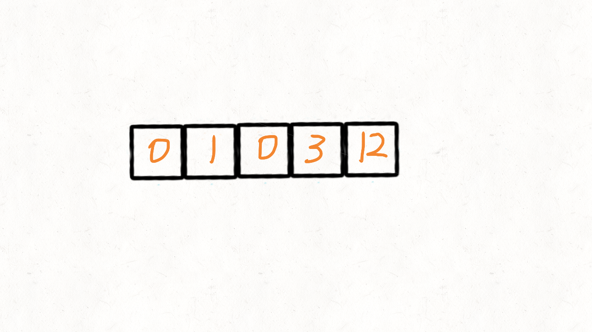

> 原文链接: https://leetcode-cn.com/problems/move-zeroes


## 英文原文
<div><p>Given an integer array <code>nums</code>, move all <code>0</code>&#39;s to the end of it while maintaining the relative order of the non-zero elements.</p>

<p><strong>Note</strong> that you must do this in-place without making a copy of the array.</p>

<p>&nbsp;</p>
<p><strong>Example 1:</strong></p>
<pre><strong>Input:</strong> nums = [0,1,0,3,12]
<strong>Output:</strong> [1,3,12,0,0]
</pre><p><strong>Example 2:</strong></p>
<pre><strong>Input:</strong> nums = [0]
<strong>Output:</strong> [0]
</pre>
<p>&nbsp;</p>
<p><strong>Constraints:</strong></p>

<ul>
	<li><code>1 &lt;= nums.length &lt;= 10<sup>4</sup></code></li>
	<li><code>-2<sup>31</sup> &lt;= nums[i] &lt;= 2<sup>31</sup> - 1</code></li>
</ul>

<p>&nbsp;</p>
<strong>Follow up:</strong> Could you minimize the total number of operations done?</div>

## 中文题目
<div><p>给定一个数组 <code>nums</code>，编写一个函数将所有 <code>0</code> 移动到数组的末尾，同时保持非零元素的相对顺序。</p>

<p><strong>示例:</strong></p>

<pre><strong>输入:</strong> <code>[0,1,0,3,12]</code>
<strong>输出:</strong> <code>[1,3,12,0,0]</code></pre>

<p><strong>说明</strong>:</p>

<ol>
	<li>必须在原数组上操作，不能拷贝额外的数组。</li>
	<li>尽量减少操作次数。</li>
</ol>
</div>

## 通过代码
<RecoDemo>
</RecoDemo>


## 高赞题解
## 两次遍历

我们创建两个指针```i```和```j```，第一次遍历的时候指针```j```用来记录当前有多少```非0```元素。即遍历的时候每遇到一个```非0```元素就将其往数组左边挪，第一次遍历完后，```j```指针的下标就指向了最后一个```非0```元素下标。  

第二次遍历的时候，起始位置就从```j```开始到结束，将剩下的这段区域内的元素全部置为```0```。   

动画演示：


{:width="450px"}{:align="center"} 

时间复杂度: O(n)   

空间复杂度: O(1)   

代码实现:

```Java []

class Solution {

	public void moveZeroes(int[] nums) {

		if(nums==null) {

			return;

		}

		//第一次遍历的时候，j指针记录非0的个数，只要是非0的统统都赋给nums[j]

		int j = 0;

		for(int i=0;i<nums.length;++i) {

			if(nums[i]!=0) {

				nums[j++] = nums[i];

			}

		}

		//非0元素统计完了，剩下的都是0了

		//所以第二次遍历把末尾的元素都赋为0即可

		for(int i=j;i<nums.length;++i) {

			nums[i] = 0;

		}

	}

}	

```

```Python []

class Solution(object):

	def moveZeroes(self, nums):

		"""

		:type nums: List[int]

		:rtype: None Do not return anything, modify nums in-place instead.

		"""

		if not nums:

			return 0

		# 第一次遍历的时候，j指针记录非0的个数，只要是非0的统统都赋给nums[j]	

		j = 0

		for i in xrange(len(nums)):

			if nums[i]:

				nums[j] = nums[i]

				j += 1

		# 非0元素统计完了，剩下的都是0了

		# 所以第二次遍历把末尾的元素都赋为0即可

		for i in xrange(j,len(nums)):

			nums[i] = 0

```

   

   

   

## 一次遍历

这里参考了快速排序的思想，快速排序首先要确定一个待分割的元素做中间点```x```，然后把所有小于等于```x```的元素放到x的左边，大于x的元素放到其右边。   

这里我们可以用```0```当做这个中间点，把不等于0(注意题目没说不能有负数)的放到中间点的左边，等于0的放到其右边。

这的中间点就是```0```本身，所以实现起来比快速排序简单很多，我们使用两个指针```i```和```j```，只要```nums[i]!=0```，我们就交换```nums[i]```和```nums[j]```   

请对照动态图来理解：   

{:width="450px"}{:align="center"} 

时间复杂度: O(n)   

空间复杂度: O(1)   

代码实现:   

```Java []

class Solution {

	public void moveZeroes(int[] nums) {

		if(nums==null) {

			return;

		}

		//两个指针i和j

		int j = 0;

		for(int i=0;i<nums.length;i++) {

			//当前元素!=0，就把其交换到左边，等于0的交换到右边

			if(nums[i]!=0) {

				int tmp = nums[i];

				nums[i] = nums[j];

				nums[j++] = tmp;

			}

		}

	}

}	

```

```Python []

class Solution(object):

	def moveZeroes(self, nums):

		"""

		:type nums: List[int]

		:rtype: None Do not return anything, modify nums in-place instead.

		"""

		if not nums:

			return 0

		# 两个指针i和j

		j = 0

		for i in xrange(len(nums)):

			# 当前元素!=0，就把其交换到左边，等于0的交换到右边

			if nums[i]:

				nums[j],nums[i] = nums[i],nums[j]

				j += 1

```

(全文完)   

   

**欢迎关注 👉👉👉 [我](https://leetcode-cn.com/u/wang_ni_ma/) 👈👈👈**   


**如果能再点个赞 👍👍 就更感激啦 💓💓**


## 统计信息
| 通过次数 | 提交次数 | AC比率 |
| :------: | :------: | :------: |
|    553132    |    863737    |   64.0%   |

## 提交历史
| 提交时间 | 提交结果 | 执行时间 |  内存消耗  | 语言 |
| :------: | :------: | :------: | :--------: | :--------: |


## 相似题目
|                             题目                             | 难度 |
| :----------------------------------------------------------: | :---------: |
| [移除元素](https://leetcode-cn.com/problems/remove-element/) | 简单|
