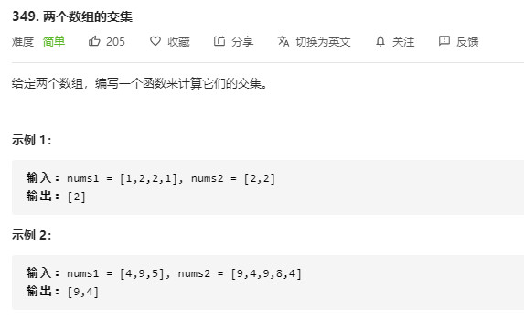
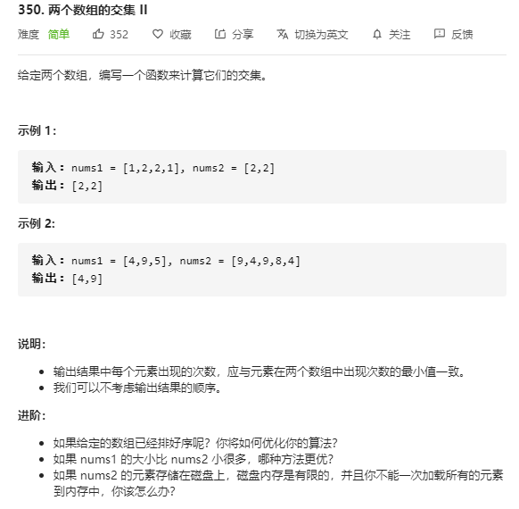

> 原文链接: https://leetcode-cn.com/problems/intersection-of-two-arrays


## 英文原文
<div><p>Given two integer arrays <code>nums1</code> and <code>nums2</code>, return <em>an array of their intersection</em>. Each element in the result must be <strong>unique</strong> and you may return the result in <strong>any order</strong>.</p>

<p>&nbsp;</p>
<p><strong>Example 1:</strong></p>

<pre>
<strong>Input:</strong> nums1 = [1,2,2,1], nums2 = [2,2]
<strong>Output:</strong> [2]
</pre>

<p><strong>Example 2:</strong></p>

<pre>
<strong>Input:</strong> nums1 = [4,9,5], nums2 = [9,4,9,8,4]
<strong>Output:</strong> [9,4]
<strong>Explanation:</strong> [4,9] is also accepted.
</pre>

<p>&nbsp;</p>
<p><strong>Constraints:</strong></p>

<ul>
	<li><code>1 &lt;= nums1.length, nums2.length &lt;= 1000</code></li>
	<li><code>0 &lt;= nums1[i], nums2[i] &lt;= 1000</code></li>
</ul>
</div>

## 中文题目
<div><p>给定两个数组，编写一个函数来计算它们的交集。</p>

<p>&nbsp;</p>

<p><strong>示例 1：</strong></p>

<pre><strong>输入：</strong>nums1 = [1,2,2,1], nums2 = [2,2]
<strong>输出：</strong>[2]
</pre>

<p><strong>示例 2：</strong></p>

<pre><strong>输入：</strong>nums1 = [4,9,5], nums2 = [9,4,9,8,4]
<strong>输出：</strong>[9,4]</pre>

<p>&nbsp;</p>

<p><strong>说明：</strong></p>

<ul>
	<li>输出结果中的每个元素一定是唯一的。</li>
	<li>我们可以不考虑输出结果的顺序。</li>
</ul>
</div>

## 通过代码
<RecoDemo>
</RecoDemo>


## 高赞题解
> **欢迎阅读、点赞、转发、订阅，你的举手之间，我的动力源泉。**


### 1. 两个数组的交集I


{:width="500px"}{:align="center"} 


> *最近在刷二分的题，找到这一题，做个总结，二分的复杂度并不低，不是最优解*


{:width="500px"}{:align="center"} 


**方法 1：Set（题解中出现最多的）**


```Java [Java]

 public int[] intersection(int[] nums1, int[] nums2) {

    if (nums1 == null || nums1.length == 0 || nums2 == null || nums2.length == 0) {

      return new int[0];

    }

    Set<Integer> parentSet = new HashSet<>();

    Set<Integer> childSet = new HashSet<>();

    for (int num : nums1) {

      parentSet.add(num);

    }

    for (int num : nums2) {

      if (parentSet.contains(num)) {

        childSet.add(num);

      }

    }

    int[] resArr = new int[childSet.size()];

    int index = 0;

    for (int value : childSet) {

      resArr[index++] = value;

    }

    return resArr;

  }

```


**方法 2：双指针**


1. 先将 $nums1$ 与 $nums2$ 排序，然后游走两个指针，情况都写出来了，没有用 $else$

2. 时间复杂度：$O(nlogn)$


```Java [Java]

public int[] intersection(int[] nums1, int[] nums2) {

  Set<Integer> set = new HashSet<>();

  Arrays.sort(nums1);

  Arrays.sort(nums2);

  int i = 0, j = 0;

  while (i < nums1.length && j < nums2.length) {

    if (nums1[i] == nums2[j]) {

      set.add(nums1[i]);

      i++;

      j++;

    } else if (nums1[i] < nums2[j]) {

      i++;

    } else if (nums1[i] > nums2[j]) {

      j++;

    }

  }

  int[] res = new int[set.size()];

  int index = 0;

  for (int num : set) {

    res[index++] = num;

  }

  return res;

}

```


**方法 3：二分查找**


1. 将 $nums2$ 排序，然后查找 $nums2$ 的元素，需要准备一个 $binarySearch$ 的辅助方法，注意 $left$ <= $right$


```Java [Java]

public int[] intersection(int[] nums1, int[] nums2) {

  Set<Integer> set = new HashSet<>();

  Arrays.sort(nums2);

  for (int target : nums1) {

    if (binarySearch(nums2, target) && !set.contains(target)) {

      set.add(target);

    }

  }

  int index = 0;

  int[] res = new int[set.size()];

  for (int num : set) {

    res[index++] = num;

  }

  return res;

}

public boolean binarySearch(int[] nums, int target) {

  int left = 0, right = nums.length - 1;

  while (left <= right) {

    int mid = left + (right - left) / 2;

    if (nums[mid] == target) {

      return true;

    } else if (nums[mid] > target) {

      right = mid - 1;

    } else if (nums[mid] < target) {

      left = mid + 1;

    }

  }

  return false;

}

```

----

### 2. 两个数组的交集II


{:width="500px"}{:align="center"} 


**方法 1：Hash**


```Java [Java]

public int[] intersect(int[] nums1, int[] nums2) {

    List<Integer> list = new ArrayList<>();

    Map<Integer, Integer> map = new HashMap<>();

    for (int num : nums1) {

        map.put(num, map.getOrDefault(num, 0) + 1);

    }

    for (int num : nums2) {

        if (map.containsKey(num) && map.get(num) > 0) {

            list.add(num);

            map.put(num, map.get(num) - 1);

        }

    }

    int[] res = new int[list.size()];

    for (int i = 0; i < list.size(); i++) {

        res[i] = list.get(i);

    }

    return res;

}

```


**复杂度分析**:


- 时间复杂度：$O(M+N)$   其中 $M$ 和 $N$ 是两个数组的长度，$HashMap$ 操作的时间复杂度为 $O(1)$

- 空间复杂度：$O(min(M|N))$ 其中 $M$ 和 $N$ 是两个数组的长度,准备了一个 $list$ 来装重复数组，其最大的长度不超过 $min(M|N)$


**方法 2：Sort**


- 一个小函数：


>Arrays.copyOfRange(T[ ] original,int from,int to)

将一个原始的数组 original，从下标 from 开始复制，复制到上标 to，生成一个新的数组。

注意这里包括下标 from，不包括上标 to。


- 对 $nums1$ , $nums2$ 排序，准备两个指针 $i$，游走 $nums1$，$j$ 游走 $nums2$，在准备一个索引 $index$，存放相同的元素

- 新建一个 $tmp$ 数组，其长度是两个源数组的最小值，用于存放相同的元素，用 $index$ 来设置索引

- 比较两个指针 $i$ 与 $j$ 的值:

  - $[i]$>$[j]$, $j$++

  - $[i]$<$[j]$, $i$++

  - $[i]$=$[j]$, $i$++ , $j$++ ,同时收集目标的数

- 返回`Arrays.copyOfRange(tmp,0,index)`


```Java [Java]

public int[] intersect(int[] nums1, int[] nums2) {

    Arrays.sort(nums1);

    Arrays.sort(nums2);

    int i = 0, j = 0, m = nums1.length, n = nums2.length;

    int index = 0;

    int[] tmp = new int[Math.min(m,n)];

    while (i < m && j < n) {

        if (nums1[i] < nums2[j]) i++;

        else if (nums1[i] > nums2[j]) j++;

        else if (nums1[i] == nums2[j]) {

            tmp[index++] = nums1[i];

            i++;

            j++;

        }

    }

    return Arrays.copyOfRange(tmp,0,index);

}

```


**复杂度分析**:


- 时间复杂度：排序的时间复杂度为 $MlogN+NlogM$，其中 $M$ 和 $N$ 是两个数组的长度，遍历数组的时间复杂度最多是 $O(M)+O(N)$,总的时间复杂度取大，应该是 $MlogN+NlogM$

- 空间复杂度：$O(min(M|N))$ 其中$M$和 $N$是两个数组的长度,准备了一个 $list$ 来装重复数组，其最大的长度不超过 $min(M|N)$


---


## 番外：


最近阿飞把链接做成了脑图（下图），整理起来，会做成PDF，感兴趣的同学关注下，不迷路，[个人主页【阿飞算法】](https://blog.csdn.net/wat1r/article/details/117533156) ，关注公众号会弹出资料下载地址，每个分支都可以点击链接跳转，欢迎入群交流学习。


## 统计信息
| 通过次数 | 提交次数 | AC比率 |
| :------: | :------: | :------: |
|    230936    |    312785    |   73.8%   |

## 提交历史
| 提交时间 | 提交结果 | 执行时间 |  内存消耗  | 语言 |
| :------: | :------: | :------: | :--------: | :--------: |


## 相似题目
|                             题目                             | 难度 |
| :----------------------------------------------------------: | :---------: |
| [两个数组的交集 II](https://leetcode-cn.com/problems/intersection-of-two-arrays-ii/) | 简单|
| [三个有序数组的交集](https://leetcode-cn.com/problems/intersection-of-three-sorted-arrays/) | 简单|
