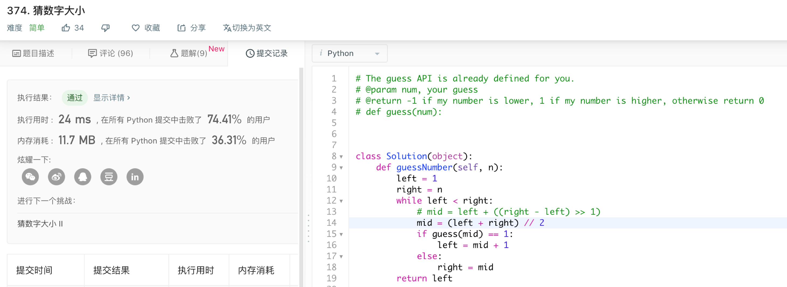

> 原文链接: https://leetcode-cn.com/problems/guess-number-higher-or-lower


## 英文原文
<div><p>We are playing the Guess Game. The game is as follows:</p>

<p>I pick a number from <code>1</code> to <code>n</code>. You have to guess which number I picked.</p>

<p>Every time you guess wrong, I will tell you whether the number I picked is higher or lower than your guess.</p>

<p>You call a pre-defined API <code>int guess(int num)</code>, which returns 3 possible results:</p>

<ul>
	<li><code>-1</code>: The number I picked is lower than your guess (i.e. <code>pick &lt; num</code>).</li>
	<li><code>1</code>: The number I picked is higher than your guess (i.e. <code>pick &gt; num</code>).</li>
	<li><code>0</code>: The number I picked is equal to your guess (i.e. <code>pick == num</code>).</li>
</ul>

<p>Return <em>the number that I picked</em>.</p>

<p>&nbsp;</p>
<p><strong>Example 1:</strong></p>
<pre><strong>Input:</strong> n = 10, pick = 6
<strong>Output:</strong> 6
</pre><p><strong>Example 2:</strong></p>
<pre><strong>Input:</strong> n = 1, pick = 1
<strong>Output:</strong> 1
</pre><p><strong>Example 3:</strong></p>
<pre><strong>Input:</strong> n = 2, pick = 1
<strong>Output:</strong> 1
</pre><p><strong>Example 4:</strong></p>
<pre><strong>Input:</strong> n = 2, pick = 2
<strong>Output:</strong> 2
</pre>
<p>&nbsp;</p>
<p><strong>Constraints:</strong></p>

<ul>
	<li><code>1 &lt;= n &lt;= 2<sup>31</sup> - 1</code></li>
	<li><code>1 &lt;= pick &lt;= n</code></li>
</ul>
</div>

## 中文题目
<div><p>猜数字游戏的规则如下：</p>

<ul>
	<li>每轮游戏，我都会从 <strong>1</strong> 到 <em><strong>n</strong></em> 随机选择一个数字。 请你猜选出的是哪个数字。</li>
	<li>如果你猜错了，我会告诉你，你猜测的数字比我选出的数字是大了还是小了。</li>
</ul>

<p>你可以通过调用一个预先定义好的接口 <code>int guess(int num)</code> 来获取猜测结果，返回值一共有 3 种可能的情况（<code>-1</code>，<code>1</code> 或 <code>0</code>）：</p>

<ul>
	<li>-1：我选出的数字比你猜的数字小 <code>pick < num</code></li>
	<li>1：我选出的数字比你猜的数字大 <code>pick > num</code></li>
	<li>0：我选出的数字和你猜的数字一样。恭喜！你猜对了！<code>pick == num</code></li>
</ul>

<p>返回我选出的数字。</p>

<p> </p>

<p><strong>示例 1：</strong></p>

<pre>
<strong>输入：</strong>n = 10, pick = 6
<strong>输出：</strong>6
</pre>

<p><strong>示例 2：</strong></p>

<pre>
<strong>输入：</strong>n = 1, pick = 1
<strong>输出：</strong>1
</pre>

<p><strong>示例 3：</strong></p>

<pre>
<strong>输入：</strong>n = 2, pick = 1
<strong>输出：</strong>1
</pre>

<p><strong>示例 4：</strong></p>

<pre>
<strong>输入：</strong>n = 2, pick = 2
<strong>输出：</strong>2
</pre>

<p> </p>

<p><strong>提示：</strong></p>

<ul>
	<li><code>1 <= n <= 2<sup>31</sup> - 1</code></li>
	<li><code>1 <= pick <= n</code></li>
</ul>
</div>

## 通过代码
<RecoDemo>
</RecoDemo>


## 高赞题解

以下代码是根据我在刷题过程中总结出来的最好用的二分法模板写成。我专门把这个二分法模板好用的地方、使用它的技巧和注意事项整理在了「力扣」第 35 题：搜索插入位置的题解[《特别好用的二分查找法模板（Python 代码、Java 代码）》](https://leetcode-cn.com/problems/search-insert-position/solution/te-bie-hao-yong-de-er-fen-cha-fa-fa-mo-ban-python-/)，希望能对大家有所帮助。

**参考代码**：

+ 注意：以下虽然我用两种语言作答，但是它们的逻辑上还有一点点区别，那就是在取中位数的时候，答案在上面那篇题解中。

```Python []
def guess(num):
    pass


class Solution(object):
    def guessNumber(self, n):
        left = 1
        right = n
        while left < right:
            # mid = left + (right - left) // 2
            mid = (left + right) >> 1
            if guess(mid) == 1:
                # 中位数比猜的数小，因此比中位数小的数包括中位数都不是目标元素
                left = mid + 1
            else:
                right = mid
        # 最后剩下的数一定是所求，无需后处理
        return left
```
```Java []
class GuessGame {

    private static final int NUM = 6;

    int guess(int num) {
        if (num == NUM) {
            return 0;
        } else if (num < NUM) {
            return -1;
        }
        return 1;
    }
}


public class Solution extends GuessGame {

    public int guessNumber(int n) {
        int left = 1;
        int right = n;
        while (left < right) {
            // int mid = left + (right - left + 1) / 2;
            int mid = (left + right + 1) >>> 1;
            int guessNum = guess(mid);
            if (guessNum == -1) {
                // 中位数比猜的数大，因此比中位数大的数包括中位数都不是目标元素
                right = mid - 1;
            } else {
                left = mid;
            }
        }
        // 最后剩下的数一定是所求，无需后处理
        return left;
    }


    public static void main(String[] args) {
        Solution solution = new Solution();
        int n = 10;
        int guessNumber = solution.guessNumber(n);
        System.out.println(guessNumber);
    }
}
```


---

以上是本题题解，以下才是本文真正想说的，你应该已经注意到了，上面的示例代码中，Python 代码中的 `mid = left + (right - left) // 2` 和 Java 代码中的 `int mid = left + (right - left + 1) / 2;` 都被我注释掉了，不是因为它们不正确，而是因为它们不够好，下面就来具体说说。

1、最早学习二分法的时候，写中位数的索引是这样的：

Python 代码：
```python
mid = (left + right) // 2
```

Java 代码：
```java
int mid = (left + right) / 2;
```

2、后来被告知在 `left` 和  `right` 很大的时候，`left + right` 会发生整型溢出，变成负数，这是一个 bug 得改！

于是我们写成：

Python 代码：
```python
mid = left + (right - left) // 2
```

Java 代码：
```java
int mid = left + (right - left) / 2;
```

然后又被告知 `mid = left + (right - left) // 2` 在 `right` 很大、 `left` 是负数且很小的时候， `right - left` 也有可能超过 int 类型能表示的最大值，只不过一般情况下 `left` 和 `right` 表示的是数组索引值，`left` 是非负数，因此 `right - left` 溢出的可能性很小。

3、最后，在 Java 的 JDK 的 `Collections` 和 `Arrays` 提供的 `binarySearch` 方法里看到了，中位数是这样取的：

```java
int mid = (low + high) >>> 1;
```

怎么又变成 `+` 了，一头雾水啊，会整型溢出吗？后来查了查资料，有可能会整型溢出的，不过结果依然正确。下面是原因：

> `left + right` 在发生整型溢出以后，会变成负数，此时如果除以 $2$ ，`mid` 是一个负数，但是经过**无符号右移**，可以得到在不溢出的情况下正确的结果。

首先解释“无符号右移”，在 Java 中，无符号右移运算符 `>>>` 和右移运算符 `>>` 的区别如下：

+ 右移运算符 `>>` 在右移时，丢弃右边指定位数，左边补上符号位；

+ 无符号右移运算符 `>>>` 在右移时，丢弃右边指定位数，左边补上 $0$，也就是说，对于正数来说，二者一样，而负数通过 `>>>` 后能变成正数。

了解了这一点，就能够理解 Java 中用 `int mid = (low + high) >>> 1;` 的原因了，关键不在 `+` ，而是“无符号右移”，在 Java 的 `Collections` 和 `Arrays` 提供的 `binarySearch` 方法里，`low` 和 `high` 都表示索引值，它们都是非负数，即使相加以后整型溢出，结果还是正确的，“位运算”本身就比其它运算符快，因此使用 `+` 和“无符号右移”可以说是既快又好的做法。

如果你用 Java 写的话，不妨做下面的试验：

用 `+` 和除法，不能通过，提示也很清楚了。


如果你用 Python 的话，就可以过，这是因为：当 `left + right` 很大的时候，Python 就自动帮你转成 long 类型了，因此结果也不会错。 




总结：

1、`int mid = (left + right) / 2;` 是初级写法，是有 bug 的；

2、`int mid = left + (right - left) / 2;` 是正确的写法，说明你考虑到了整型溢出的风险；

3、`int mid = (low + high) >>> 1;` 首先肯定是正确的写法，其实也是一个装 ❌ 的写法，理由上面已经叙述过了。


## 统计信息
| 通过次数 | 提交次数 | AC比率 |
| :------: | :------: | :------: |
|    88559    |    171270    |   51.7%   |

## 提交历史
| 提交时间 | 提交结果 | 执行时间 |  内存消耗  | 语言 |
| :------: | :------: | :------: | :--------: | :--------: |


## 相似题目
|                             题目                             | 难度 |
| :----------------------------------------------------------: | :---------: |
| [第一个错误的版本](https://leetcode-cn.com/problems/first-bad-version/) | 简单|
| [猜数字大小 II](https://leetcode-cn.com/problems/guess-number-higher-or-lower-ii/) | 中等|
| [找到 K 个最接近的元素](https://leetcode-cn.com/problems/find-k-closest-elements/) | 中等|
